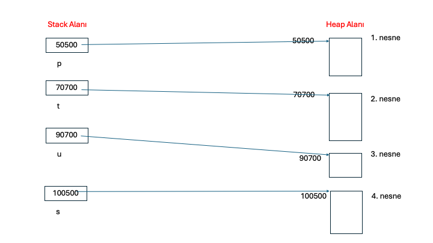
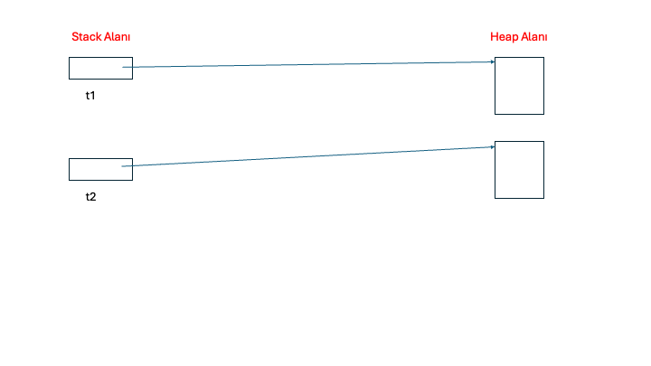
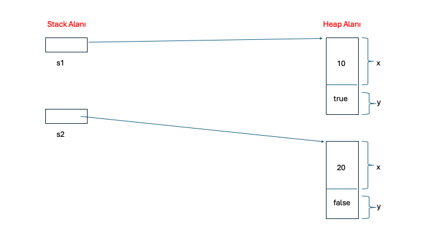
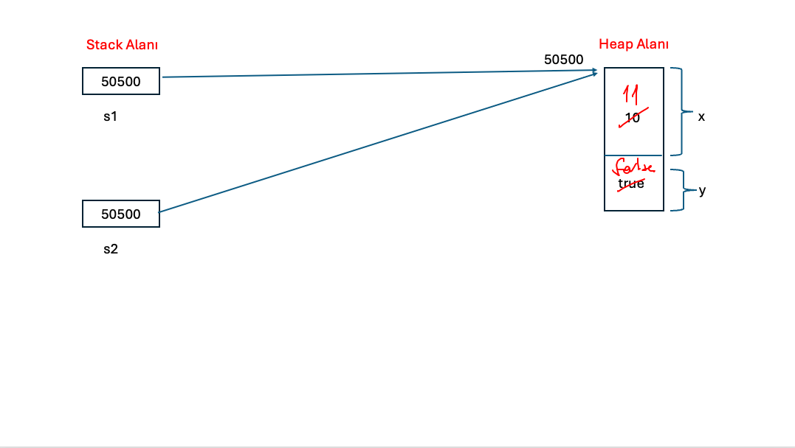
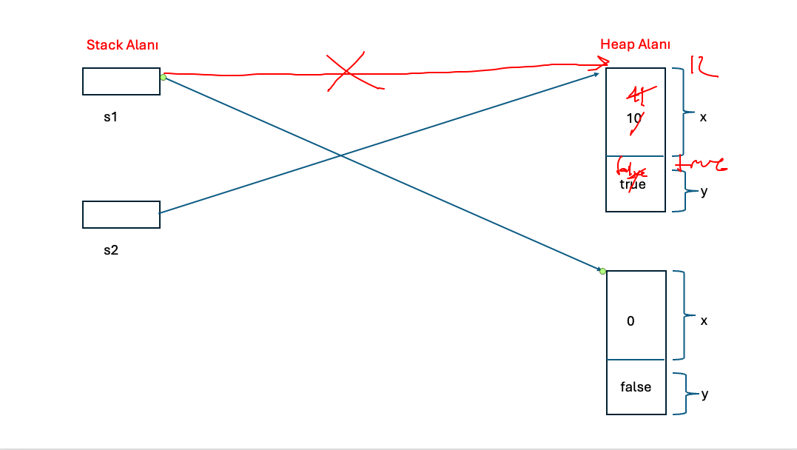
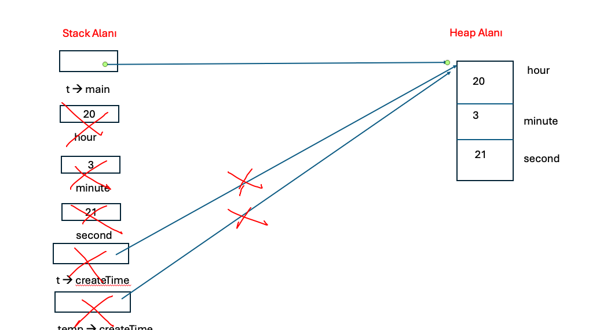
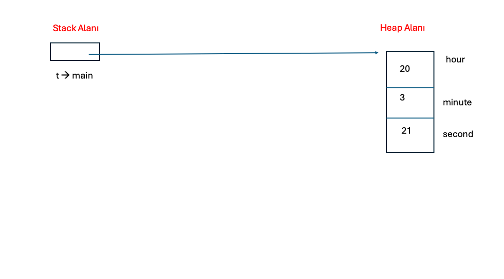
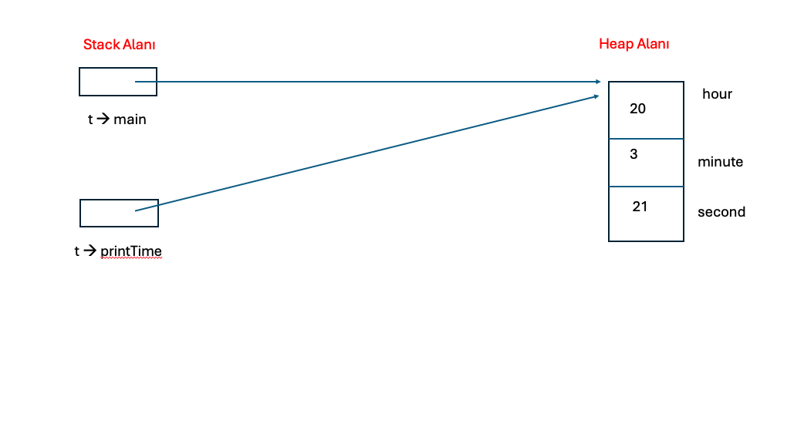
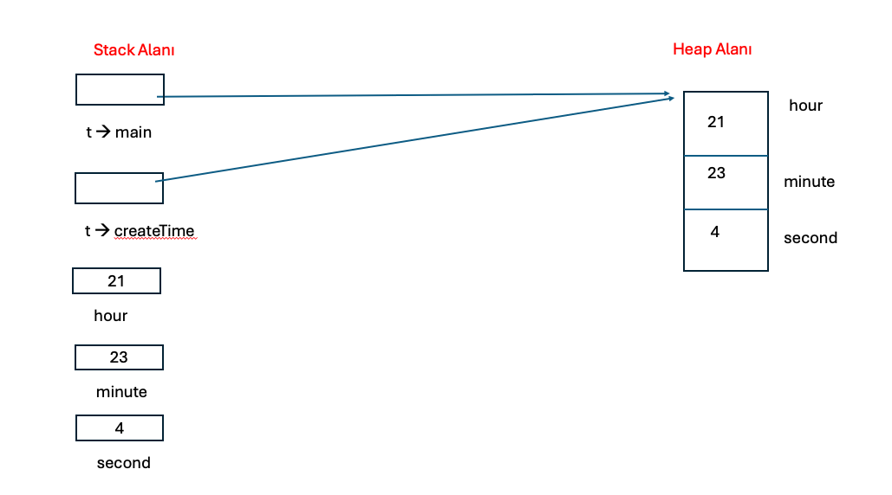
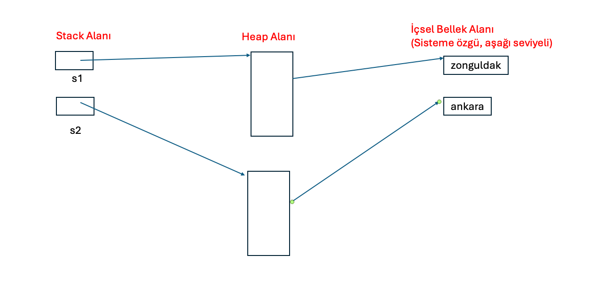

### C ve Sistem Programcıları Derneği
### Java ile Nesne Yönelimli Programlama
### Eğitmen: Oğuz KARAN

###### 28 Temmuz 2025 - 30 Temmuz 2025

> Java 1995 yılında Sun firması'nda çalışan `James Gosling` tarafından tasarlanmıştır. Sun firması daha sonra Oracle tarafından satın alınmıştır ve şu an Java aslında Oracle firmasına aittir. Java 1.0 versiyonu ile çıkmıştır. Şu an, 18 Mart 2025 itibariyle Java 24 son sürüm olarak ilan edilmiştir. Java ismi hem programlama diline hem de ortama verilen genel bir isimdir. Java'da yıllar içerisinde pek çok değişiklikler olmuştur. Bu anlamda bazı sürümler majör bazı eklentilerle ve değişikliklerle yayınlanmıştır. Majör değişiklikler genel olarak programlama yaklaşımının bile değişebilmesine yol açabilen değişiklikleri kapsar. Bu anlamda programlama dilinde ve ortamında da değişiklikler olabilmektedir. Java sürümleri içerisinde majör değişikliklerin en belirgin olduğu iki sürüm Java 5 ve Java 8 sürümleridir. Bu sürümlerde Java'ya hem ortam hem de programlama dili anlamında radikal eklentiler yapılmıştır. Bazı sürümlerde yine önemli eklentiler olabilir ancak bunların sayısı az olabilmektedir. Örneğin Java 7, Java 11, Java 17 ve Java 21 sürümleri bu şekildedir. Yine bazı sürümlerde çok önemli olmayan da değişiklikler olabilmektedir. Bazı sürümlerde eklenen değişiklikler **preview/experimental** denilen biçimdedir. Bu değişiklikler doğrudan kullanılamaz. Derleme işleminde bir takım switch'lerin verilmesi gerekir. 

##### Java Ortamının Temel Özellikleri

> **1. Ara kodlu Çalışma Sistemi:** C, C++ ve Go gibi dillerde yazılan kodlardan elde edilen (hangi aşamalardan geçilerek elde edildiği şu an için önemsizdir) `çalışabilir dosya (executable file)` sisteme (genel olarak işletim sistemi, donanım vb.) özgüdür ve bazı durumlarda yazılan kodlar her sisteme göre ayrı olabilmektedir. Eğer kod sistemden bağımsız olarak yani standart olarak yazılmışsa bile her sistem için ayrı executable file'lar elde edilmelidir. Oysa Java programlama dili ile yazılmış bir program derlendiğinde (compilation) elde edilen dosyanın içerisinde hiç bir sistemin dili olmayan yapay bir kod bulunur. Bu ara koda Java dünyasında **byte code (BC)** denilmektedir. **BC doğrudan çalıştırılamaz.** Çalıştırılabilmesi için ayrı bir uygulama gerekir. Bu uygulama BC'yi yorumlayarak makine koduna yani sisteme özgü koda dönüştürerek programı çalıştırır. Bu dönüştürme işlemine **JIT (Just In Time) compilation** denilmektedir. Geliştirme ve çalıştırma ortamında 3 tane temel kavram söz konusudur:
> - **JVM (Java Virtual Machine):** BC'yi makine koduna dönüştürür. JVM aslında BC'nin nasıl makine koduna dönüştürüleceğini tanımlayan soyut bir kavramdır.
>
> - **JRE (Java Runtime Environment):** Genel olarak Java ile yazılmış bir uygulamayı çalıştırmak (run) için gereken araçları ve uygulamaları içeren bir pakettir. Yani BC elde edildiğinde çalıştırılabilmesi için JRE'ye ihtiyaç vardır. 
> 
> - **JDK (Java Development Kit):** Geliştirme (development) araçlarını ve çalıştırma araçlarının bir çoğunu içeren bir pakettir. Buradaki çalıştırma araçları geliştirme aşamasında kullanılabilmektedir. 
> 
> Java 11 ile birlikte ticari kullanımlarda Oracle tarafından bazı değişikliklere gidilmiştir. Özet (genel) olarak şunlar söylenebilir: Java'da geliştirme ortamı ücretsizdir. Çalıştırma araçları kullanılan araca göre ücretlendirilebilmektedir. Tamamen ücretsiz olarak kullanılabilen çalıştırma araçları da mevcuttur. Bunlardan en tipik olanı `Open JRE`'dir. Burada anlatılanların detayları olduğu unutulmamalıdır. 
> 
> Java 11 ile `Long Term Support (LTS)` kavramı getirilmiştir. LTS sürümleri uzun süre desteklenen ve güncellemesi (hızlandırılması, hataların düzeltilmesi (bugfix) vb) uzun süre yapılan sürümlerdir. Java'da Java 8, 11, 17 ve 21 sürümleri LTS'dir. Ticari uygulamalarda genel olarak (hatta her zaman) LTS sürümleri kullanılır. 
> 
> Ara kodlu çalışma sisteminin en önemli avantajı geliştirilen uygulamaların genel olarak sistemden bağımsız olarak çalıştırılabilmesidir. Bu kavrama `Write Once Run Anywhere (WORA)` denilmektedir. Şüphesiz bunun da ayrıntıları ve istisnaları vardır. 
> 
> Ayrıca unutulmamalıdır ki ara kodlu çalışma sistemi az da olsa bir performans kaybına yol açar. Ancak Java'nın hedeflediği uygulamalar düşünüldüğünde bu kaybın pek de önemi yoktur.


**Anahtar Notlar:*** Aslında Java'da istenirse sisteme özgü çalışabilen bir executable file da son yıllarda elde edilebilmektedir. Bu işlem için genel olarak GraalVM kullanılmaktadır. GraalVM kullanımının belirli kısıtları olabilmektedir. GraalVM ve detayları `Java ile Uygulama 2` kursunda ele alınacaktır.
 
> **2. Hızlı Uygulama Geliştirme Ortamı:** Java `hızlı uygulama geliştirme (rapid application development)` ortamı sunar. Bu anlamda hem öğrenmesi kolaydır hem de ürün çabuk elde edilir.
> 
> **3. Geniş bir sınıf kütüphanesi:** Java'da oldukça geniş sınıf kütüphanesi bulunur. Dosya işlemleri, veritabanı işlemleri vb. işlemler için hazır sınıflar bulunur. Java'nın standart olarak kullanılan kütüphanelerine  `Java Standard Edition (Java SE)` denilmektedir. Ayrıca Java programlamada pratikte başka kişiler, organizasyonlar ve firmalar tarafından geliştirilmiş adeta standart gibi kullanılan pek çok kütüphane de bulunmaktadır.
> 
> **4. Güvenli çalışma ortamı:** Java'da yazılmış olan bir programın sisteme zarar verme olasılığı çok daha azdır. Yazılan bir program yüzünden yanlışlıkla sistemde bir problem olma olasılığı oldukça düşüktür.
##### Dil Kavramı

>İletişimde kullanılan sembollere dil (language) denir. Dilin kurallarına gramer denir. Bir olgu en az aşağıdaki iki özelliğe sahipse bir dildir:
>
>**- Syntax:** Dilin öğelerinin doğru dizilimine denir. Örneğin "I am a programmer" cümlesinde dilin öğeleri doğru dizilmiştir. Cümle "am a programmer I" biçiminde yazılmış olsaydı syntax olarak hatalı olurdu.
>
>**- Semantic:** Doğru dizilmiş öğelerin anlamına denir. Öğeler doğru dizilse bile cümle anlamlı değilse yine hatalıdır.
>
>Doğal dillerde (natural languages) syntax ve semantic dışında da öğeler bulunur. Bilgisayar bilimlerinde kullanılmak üzere tasarlanmış dillere **bilgisayar dilleri (computer languages)** denir. Bir bilgisayar dili **akış (flow)** içeriyorsa, o dile **programlama dili (programming language)** denir. Bu anlamda her programlama dili bir bilgisayar dilidir ancak her bilgisayar dili bir programlama dili olmayabilir. Örneğin, `XML` ve `HTML` programlama dilleri değildir ancak bilgisayar dilleridir. Bu anlamda Java akış içerdiğinden bir programlama dilidir. 
>
>Programlama dilleri zaman içerisinde birbirlerinden esinlenmişlerdir. Hatta bazı programlama kalıpları da bazı dillerden alınarak kullanılmaktadır. 
##### Programlama Dillerinin Sınıflandırılması

>Programlama dilleri çeşitli biçimlerde sınıflandırılabilse de genel olarak 3 şekilde sınıflandırma eğilimi söz konusudur:
>
>**- Seviyelerine göre sınıflandırma:** Programlama dilinin seviyesi (level) onun insan algısına yakınlığının bir ölçüsüdür. Yüksek seseviyeli diller (high level languages) hem dil özellikleri, hem de uygulama geliştirme anlamında insan algısına yakınlıkları dolayısıyla genel olarak daha kolay öğrenilirler. Düşük seviyeli diller (low level languages) makineye daha yakın dillerdir. Olabilecek en düşük seviyeli dil makine dilidir (machine language).
>
>**- Programlama modeline göre sınıflandıma:** Bir programı yazarken kullanılan genel model (paradigm) önemlidir. Bazı dillerde sınıf yoktur. Program çeşitli alt programların (function) bir araya getirilmesiyle yazılır. Bu modele `procedurel model` denir. Bazı dillerde sınıflar vardır ve programlar sınıflar kullanılarak yazılır. Bu modele `nesne yönelimli model (object oriented model)` denir. Bazı dillerde programlar matematiksel formül yazıyormuş gibi yazılır. Bu tarz programlama modeline `fonksiyonel model (functional model)` denir. Bazı diller birden fazla modeli desteklerler. Bu tarz dillere `multi-paradigm languages` denilmektedir. Birden fazla modeli destekleyen diller, modellerin tüm özelliklerini desteklemeyebilirler. 
>
>**- Kullanım alanına göre sınıflandırma:**  Dilin hangi alanlarda kullanılabileceğine göre sınıflandırmadır. Bazı diller birden fazla alanda kullanılabilirler. Bazı diller ise sadece bir alanda kullanılabilirler. Bu anlamda genel amaçlı diller, bilimsel ve mühendislik dilleri, veritabanı dilleri, oyun ve animasyon dilleri, yapay zeka dilleri vb. alanlar için diller söz konusu olabilmektedir.
>
>Buna göre Java, bilimsel ve mühendislik alanlarında, web uygulamalarında, yapay zeka uygulamalarında, mobil programlamada vb. kullanılabilen genel amaçlı, yüksek seviyeli, nesne yönelimli programlama modeli ile uygulama geliştirilebilen ve özellikle Java 8 ile birlikte fonksiyonel programlama modelinin de belirli ölçüde kullanılabildiği multi-paradigm bir dildir.
>

**Anahtar Notlar:** Bir dilin bir çok alanda kullanılması, pratikte de ilgili alanda kullanılacağı anlamına gelmez. Bir alanda daha etkin kullanılabilen bir dil varsa o dil daha fazla tercih edilebilir.

**Anahtar Notlar:** Yukarıda anlatılan kavramların detayları vardır. Zaman içerisinde anlaşılacaktır.

###### 4 Ağustos 2025
##### Temel Kavramlar

>Bu bölümde programlamada da kullanılan bazı kavramlar temel düzeyde olarak ele alınacaktır.

###### Çevirici Programlar, Derleyiciler ve Yorumlayıcılar

> Bir dilde yazılmış olan programı başka bir dile çeviren programlara **çevirici program (translator)** denir. Çevirici programlarda bir **kaynak dil (source language)** ve bir **hedef dil (target/destination language)** vardır. Kaynak dil yüksek seviyeli, hedef dil düşük seviyeli ise bu durumda çevirici programa **derleyici (compiler)** denir. Örneğin Java programlama dilinden Kotlin programlama diline dönüştürme yapan program bir translator, Java programlama dilinden BC'ye dönüştüren program ise bir derleyicidir. JVM'in BC'yi makine koduna dönüştürme faaliyeti de bir derleme işlemidir. Bu sebeple buna `JIT compilation` denir. Bazı dillerde yazılan programlar herhangi bir kod üretilmeden çalıştırılırlar. Bu tarz çalıştırma yapan programlara **yorumlayıcı (interpreter)** denir. Bazı diller hem derleyici ile hem de yorumlayıcı ile kullanılabilirler. Java pratikte derleyici ile kullanılan, Java 11 ile birlikte yorumlayıcı ile de kullanılabilebilen bir programlama dilidir. Yorumlayıcı ile kullanımı bu kursta ele alınmayacaktır. Yorumlayıcı ile kullanılan diller derleyici ile kullanılan dillere göre daha yavaş olma eğilimindedir. 

**Anahtar Notlar:** Bir uygulama tek bir java dosyasından oluşmak zorunda değildir. Hatta bir Java uygulaması yalnızca Java kodlarından da oluşmak zorunda değildir. Bu durumda farklı Java dosyaları ayrı ayrı derlenir. Hattı aynı dosyada bulunan farklı sınıflar bile ayrı ayrı derlenir. Bir ürün aslında tüm birimlerinin uygun şekilde derlenmesi ve ele alınması (handling) ile elde edilir. Bu işlem için genel olarak `build` terimi kullanılır. Build işlemi yalnızca derleme işlemi değildir. Yani bir uygulamanın ürün olarak elde edilme süreci build işlemidir. Burada anlatıların detayları konular içerisinde ele alınacaktır.

###### İşletim Sistemi
 
>İşletim sistemi (operating system) makinenin donanımını yöneten, bilgisayar ile kullanıcı arasında bir köprü oluşturan yazılımdır. Bir işletim sisteminin pek çok görevi vardır. Programları çalıştırmak, çeşitli cihazları ve aygıtları yönetmek, dosyaları ve dizinleri  (directory) organize etmek vb. görevler sayılabilir. İşletim sistemleri `genel olarak` iki gruba ayrılabilir: **masaüstü işletim sistemleri (desktop operating systems), mobil işletim sistemleri (mobile operating systems).** Şüphesiz başka çeşit işletim sistemleri de vardır. Popüler masaüstü işletim sistemleri `Windows, Mac OS X, Unix, Linux dağıtımları` gibi işletim sistemleridir. Popüler mobil işletim sistemleri `Android` ve `IOS`'dur.

###### Açık kaynak kodlu yazılım, özgür yazılım ve mülkiyete sahip yazılım

>`Özgür yazılım (free software)` ve `açık kaynak kodlu (open source) yazılımlar` arasında farklar olsa da genel olarak aşağıdaki ortak özelliklere sahiptirler:
>- Bedavadır. Kullanılabilmesi için herhangi bir lisans gerekmez.
>- Kaynak kodlar sahiplenilemez. Kaynak koda ekleme yapıldığında ya da bir kaynak kod kullanıldığında kodlar kapatılamaz. Onların da açılması gerekir.
>- Çoğaltılabilir, izin almadan kullanılabilir.
>
>Bunun tam tersi mülkiyete sahip (propriatery) yazlımlardır. Bu yazılımlar para verilerek kullanılır ve izin almadan çoğaltılamaz.

###### IDE (Integrated Development Environment)

>Derleyiciler ve yorumlayıcılar komut satırından çalışan ve basit arayüzlere sahip programlardır. Aslında teorik olarak bir uygulamadaki tüm Java dosyaları ve diğer dosyalar basit bir editör programla yazılıp komut satırından derlenebilir. Ancak bu, uygulama büyüdükçe zahmetli olmaya başlar. Bu da programcıya zaman kaybettirir. Bu amaçla pratikte yazılım geliştirmeyi kolaylaştırmak için IDE denilen yazılımlar kullanılır. IDE'lerde örneğin bir takım yardımlar veren editörler, tasarım araçları, test araçları, debug araçları vb. programcının geliştirme sırasında kullandığı araçlar bulunur. Java ile uygulama geliştirmede iki tane IDE yoğun olarak kullanılmaktadır: **Eclipse, IntelliJIDEA**. Biz kursumuzda belirli bir zaman (yaklaşık kursun yarısına kadar) Eclipse, sonrasında IntelliJIDEA kullanacağız.

##### Sembollerin İngilizce karşılıkları

| Sembol | İngilizce Karşılığı                                         |
| ------ | ----------------------------------------------------------- |
| +      | plus                                                        |
| -      | minus, hyphen, dash                                         |
| *      | asterisk                                                    |
| /      | slash                                                       |
| \      | backslash                                                   |
| .      | period, dot                                                 |
| ,      | comma                                                       |
| :      | colon                                                       |
| ;      | semicolon                                                   |
| “      | double quote                                                |
| '      | single quote                                                |
| (...)  | parenthesis left, right, opening, closing                   |
| [...]  | (square/brackets) parenthesis left, right, opening, closing |
| {...}  | curly brace left, right, opening, closing                   |
| =      | equal sign                                                  |
| &      | ampersand                                                   |
| ~      | tilda                                                       |
| @      | at                                                          |
| <...>  | less than, greater than, angular bracket                    |
| ^      | caret                                                       |
| \|     | pipe                                                        |
| _      | underscore                                                  |
| ?      | question mark                                               |
| #      | sharp, number sign                                          |
| %      | percent sign                                                |
| !      | exclamation mark                                            |
| $      | dollar sign                                                 |
| ...    | ellipsis                                                    |

##### JDK Kurulumu ve Bilgisayarın Java ile Geliştirme Yapmaya Hazır Hale Getirilmesi

>JDK'nın kurulumu için işletim sistemine göre aşağıdaki bağlantıdan `installer` program elde edilebilir: [https://www.oracle.com/tr/java/technologies/downloads/#java21](https://www.oracle.com/tr/java/technologies/downloads/#java21)
>
>Burada `LTS` olması açısında minimum `Java 17` kurulması önerilir. Bununla birlikte `Java 21` ile eklenen bazı özellikler de kursumuzda ele alınacağından `Java 21` kurulması daha iyi olabilmektedir. Kurulum aşamasından sonra `java` ve `javac` programları `-version` seçeneği ile çalıştırılarak versiyon kontrolü yapılabilir:

```java
java -version
javac -version
```

>Aşağıdaki `Hello, World` programını `JDK` kurulu bir bilgisayarda çalıştırmak için temel olarak aşağıdaki işlemleri sırasıyla yapınız
>
>1. Herhangi bir dizinde (directory) `csd` isimli bir dizin açılır. Buradaki `csd` isminin tamamı küçük harf olacak şekilde yazılacaktır.
>
>2. `csd` dizini içerisinde `App.java` isimli bir dosya açılır. Windows sisteminde uzantılar gizlenmişse görünür hale getirip uzantının `.java` olarak değiştirilmesi gerekir. Buradaki dosya isminin `App.java` biçiminde yazılması gerekir.
>
>3. Komut `yorumlayıcı program (command prompt/terminal/shell)` ile `csd` directory'sinin bulunduğu dizine geçilir. Dizin geçişi için `cd` komutu kullanılır. Örneğin `cd D:\Repositories\Java-Jul-2025\src\src-console`
>
>4. Herhangi bir editör program ile `App.java` dosyasının içerisine aşağıdaki programı yazınız.

```java
package csd;

class App {
    public static void main(String [] args)
    {
        System.out.println("Hello, World");
    }
}
```

>5. Komut yorumlayıcı programda, `csd` dizininin bulunduğu dizin içerisinde aşağıdaki komutları çalıştırarak derleme işlemi yapılır:

```java
javac csd/App.java -> Windows dışı sistemler için
javac csd\App.java -> Windows işletim sistemi için
```

> Derleme işleminde herhangi bir hata (error) mesajı alınmazsa derleme işlemi başarılıdır ve `App.class` isminde `BC` üretilir.
>
>6. Komut yorumlayıcı programda aşağıdaki biçimde byte code çalıştırılır:

```java
java csd.App
```

**Anahtar Notlar:** Yukarıdaki adımların detayları konular içerisinde ele alınacaktır. Genel duruma odaklanınız.

###### 6 Ağustos 2025

>Bir program için, Java programcısı açısından iki durum söz konusudur: **derleme zamanı (compile time), çalışma zamanı (runtime)**. Derleme zamanı, derleme sürecidir. Çalışma zamanı, programın çalışması sürecidir. Bu iki süreç, birbirileriyle ilişkili olsalar da ayrı zamanlar ve kavramlar oldukları unutulmamalıdır.

##### Derleyicinin Verdiği Mesajlar

>Derleyiciler koda ilişkin bazı **teşhis mesajları (diagnostics or diagnostic messages)** verebilirler. Derleyicilerin teşhis mesajları 3 gruba ayrılır:
>
>**- Gerçek hatalar (errors):** Syntax ya da semantic olarak geçersiz bir durumda derleyicinin verdiği mesajdır. Bu durumda `BC`  üretilmez. Bu durumda programcının hataya yol açan kodları düzeltmesi ve yeniden derleme işlemini yapması gerekir. 
>
>**- Uyarılar (warnings):** Programcının olası programlama hatalarına yönelik mesajlardır. Uyarı mesajları `BC'nin` üretimini engellemez. Bununla birlikte programcı derleyicinin uyarı mesajlarını dikkate almalıdır. Özel bir durum yoksa uyarı mesajlarına yol açan durumlar ortadan kaldırılmalıdır. Bazı durumlarda programcının geliştirme yaparken kullandığı `static kod analizi` araçları da derleyici dışında bazı uyarılar verebilirler. Programcı bunları da dikkate almalıdır ancak duruma göre hepsinin ortadan kaldırılması gerekmeyebilir. Pratikte bir ürünün nihai (release)  versiyonunda derleyicinin tüm uyarı mesajlarının ortadan kaldırılmış olması gerekir.
>
>**- Ölümcül hatalar (fatal error):** Derleme işleminin dahi tamamlanamadığı hatalardır. Örneğin, derlenecek dosyanın bulunamaması, erişim yetkisinin olmaması, diskte yer kalmaması vb durumlardır. Bu durumda programcı ölümcül hataya yol açan durum ya da durumları ortadan kaldırmalı ve derleme işlemini yapmalıdır. Yani ölümcül hata, koda ilişkin değildir. 
>
>Derleme işleminin herhangi bir uyarı mesajı vermeden başarılı olması durumunda derleyiciler genel olarak hiç bir mesaj vermeme eğilimindedir. Bununla birlikte bazı derleyiciler uyarı mesajı vermeden başarılı derleme durumunda, işlemin başarılı olduğuna ilişkin mesaj ya da firmaya ilişkin bilgilendirme mesajı verebilirler. Bu tip mesajlar `teşhis mesajı` kategorisine girmezler. Örneğin, kursumuzda da ağırlıklı olarak kullanacağımız `Oracle` firmasına ait `javac` derleyicisi bu durumda hiç bir mesaj vermemektedir. 

**Anahtar Notlar:** Programın çalışma zamanı sırasında oluşan hatalı durumlara **exception** ya da **runtime error** denilmektedir. `Exception handling` konusuna kadar, bir exception oluşması durumunda program `normal olmayan bir biçimde sonlanır (abnormal termination)` sonlanır olarak düşüneceğiz.

##### Atom Kavramı

>Programlama dilinin bölünemeyen en küçük birimine **atom (token)** denir. Java programlama dilinde bulunan atomlar şunlardır:
>
>**- Anahtar sözcükler (keywords/reserved words):** Derleyicinin, bildiği tanıdığı sözcüklerdir. Örneğin `Hello, world` programında `package, class, public, static, void` vb. Anahtar sözcükler tek başına değişken ismi olamazlar.
>
>**- Değişken atomlar (variables/identifiers):** İsmini programcının belirlediği ve belirli kurallara göre isimlendirilebilen atomlardır. Örneğin `Hello, world` programında `csd, App, main, String, args, System, out, println` değişken atomlardır.
>
>**- Sabitler (literals/constants):** Program içerisinde doğrudan yazılan değerlere denir. Örneğin, `100, 3.4` vb.
>
>**- Operatörler (operators):** Belirli bir işleme yol açan ve işlem sonucunda değer üreten atomlardır. Örneğin, `x + y` ifadesinde `+` bir operatördür. Yine `Hello, world` programında 

```java
System.out.println("Hello, world")
```

>ifadesinde `()` ve `.`  birer operatördür
>
>**- String sabitleri (strings/string literals):** İki tırnak içerisinde yazılan yazılara tırnakları ile birlikte `string literal` denir. Örneğin  `Hello, world` programında `"Hello, world"` bir string literal'dır.
>
>**- Ayraçlar (delimiters/punctuators):** Yukarıdakiler dışında kalan atomlardır. Örneğin  `Hello, world` programında `{}, main metodunun parantezleri vb.`

**Anahtar Notlar:** Derleme işlemi genel olarak **atomlara ayırma (tokenizing)** ile başlar.

**Anahtar Notlar:** Klavyeden basıldığında boşluk algısı yaratan karakterlere **whitespaces** denir. Klavyeden tuşlanabilen tipik `whitespaces` şunlardır: `SPACE, TAB(ULAR), ENTER`.
###### 11 Ağustos 2025

>Java'da kod yazım kuralları şu şekilde özetlenebilir:
>
>- Atomlar arasında istenildiği kadar boşluk (whitespace) bırakılabilir
>- Anahtar sözcükler ve değişken atomlar kendi aralarında bitişik yazılamazlar yani aralarında en az bir tane boşluk (whitespace) olmalıdır. Diğer tüm atomlar bitişik yazılabilirler.

>Atomlar arasında istenildiği kadar boşluk (whitespace) bırakılabilir

```java
package csd;

  

class App {

public

static

void main(String [] args)

{

System .

out.

println("Hello, world");

}

}
```


>Anahtar sözcükler ve değişken atomlar kendi aralarında bitişik yazılamazlar yani aralarında en az bir tane boşluk (whitespace) olmalıdır.

```java
package csd;

classApp { //error
	publicstatic void main(String [] args) //error
	{
	
		System.out.println("Hello, World");
	
	}
}
```

>Diğer tüm atomlar bitişik olarak yazılabilir

```java
package csd;class App{public static void main(String[]args){System.out.println("Hello, World");}}
```

>Yukarıdaki temel yazım kuralları sayesinde programcı daha **okunabilir/algılanabilir (readable)** kodlar yazabilmektedir. 

##### Yorum Satırları

>Programlamada derleyicinin görmezden geldiği kod parçalarına **yorum satıları (comment lines)** denir. Java'da iki çeşit yorum satırı yazılabilir. Yorum satırları okunabilirliği/algılanabilirliği olumsuz etkilemeyecek şekilde koda eklenmelidir.

```java
package csd;

class App {
    public static void main(String [] args) 
    {
        //Burası görmezden gelinecek
        System.out.println("Hello, World"); //Burası da görmezden gelinecek

        /*
        Burası da 
        görmezden gelinecek
        */ 
    }
}
```

##### Eclipse IDE Programı

>Eclipse, Java'nın ilk yıllarından beri `free` olarak kullanılabilen bir IDE programdır. Eclipse tümm masaüstü işletim sistemlerinde çalışabilen bir uygulamadır. Eclipse kurulum programı aşağıdaki bağlantıdan indirilip kurulabilir:

>[https://www.eclipse.org/downloads/](https://www.eclipse.org/downloads/)

>Biz kursumuzda Eclipse ile açılmış tek bir proje üzerinde çalışacağız. Eclipse ile bir `Hello, World` programını çalıştırmak üzere bir proje açmak için işlemler şu şekilde yapılabilir:
>1. Wokspace için bir dizin belirenir
>2. Bir Java projesi açılır. Örneğin File -> New -> Java Project seçilebilir
>3. Açılan pencerede proje ismi yazılmalıdır. Biz burada `Sample` ismini, vereceğiz. Yine bu pencerede JRE altındaki `Use an execution environment JRE` en az JavaSE 17 olarak seçilmelidir. Yine aynı pencerede `Module` altındaki `Create module-info.java file` seçeneği kaldırılmalıdır. 
>4. Bir java dosyası eklemek için src dizininde New -> Class menüsü seçilebilir.
>5. Açılan pencerede package text alanına csd, Name text alanına da App yazılmalıdır. 
>6. Bu işlemden sonra program yazılarak çalıştırılabilir. Çalıştırmak pek çok yöntem vardır. Herhangi bir tanesi tercih edilebilir. Program çalıştırıldığıda Eclipse kendi Console penceresi açarak ilgili çıktıları orada gösterir.
>
**Anahtar Notlar:**  Aslında çalıştırma işlemi derleme işleminden sonra yapılmaktadır. Eclipse'de `build automatically` seçili ise her kod yazımında build işlemi, dolayısıyla derleme işlemi yapılır ve error oluşmazsa arakod üretilir. Eğer `build automatically` seçili değilken çalıştırılırsa önce build işlemi yapılır sonra üretilen arakod çalıştırılır.

**Anahtar Notlar:** Bir IDE programda bir işlemi yapmanın birden fazla yöntemi olabilir ve genelde de birden fazla yönetimi vardır. Yukarıdaki proje açma aşamaları dışında da yöntemler bulunmaktadır.

##### Genel Biçim Açıklama Notasyonu

>Bir dilin kurallarının genel biçimlerini anlatmak için pek çok notasyon kullanılmaktadır. Biz kursumuzda genel olarak `açısal parantez-köşeli parantez tekniğini` kullanacağız. Bu teknikte zorunlu olarak bulunması gerekenler açıklamada açısal parantez içerisinde yazılır. Seçenekli (optional) olması durumunda köşeli parantez içerisinde yazılır. Ayrıca `//...` şeklinde kullanım durumunda `burada bir takım kodlar bulunabilir ancak şu an bizi ilgilendirmiyor` anlamında gelecektir. Genel biçimde doğrudan yazılan herşey orada olması gereken anlamındadır. Yaklaşık 20 yıldır programlamaya ilişkin kaynaklar bir konuyu anlatırken uydurma bazı isimlerkullanmaktadır. Bu isimler genel olarak `foo, bar, tar, zar, car vb.` Biz de bu isimleri zaman zaman kullanacağız. 

##### Bildirim (Declaration)

>Bir ismin derleyiciye tanıtılmasına denir.

##### Hello World Progrmının Genel Açıklaması

>Bir Java programı genel olarak paketlerden (package), paketler sınıflardan (class), sınıflar da metotlardan (method) oluşur. 
>
>Paket bildiriminin genel biçimi şu şekildedir:

```java
package <isim>;
```
>Burada paket ismi ileride ele alacağımız değişken isimlendirme kurallarına uygun olmalıdır. Paketler konusu ileride detaylı bir biçimde ele alınacaktır. Paketler konusunda kadar `csd` isimli paket altında çalışacağız. 

>Sınıf bildiriminin genel biçimi şu şekildedir:

```java
[bildirime ilişkin bazı anahtar sözcükler] class <isim> {
    //...
}
```

>Burada sınıf isminin yine değişken isimlendirme kurallarına uygun olması gerekir. Sınıf bildiriminin detayları konular içerisinde ele alınacaktır. Sınıf kavramı `Nesne Yönelimli Programlama (Object Oriented Programming)` tekniğinin temel taşlarından biridir. 

###### 13 Ağustos 2025

>Java'da alt programlara **metot (method)** denir. **Metot bildirimi (method declaration)** alt programın kodlarının yazılmasıdır. Bir metot bildirildikten sonra, kodlarının çalıştırılabilmesi için **çağrılması (call/invoke)** gerekir. Metot bildiriminin genel biçimi şu şekildedir:

```java
[erişim belirleyici] [static] <geri dönüş bilgisi> <metot ismi>([parametreler])
{
    //...
}
```

>Erişim belirleyici şunlardan biri olabilir: **public, protected, no-modifier, private.** İlgili konuya gelene kadar tüm metotlarımızı `public` olarak bildireceğiz. Bir metot **static** veya **non-static** olabilir. static anahtar sözcüğü ile bildirilen metotlar static, bildirilmeyenler non-static olurlar. İlgili konuya gelene kadar tüm metotları static olarak bildireceğiz. Bir metodun **geri dönüş değeri (return value)** olabilir ya da olmayabilir. Bir metodun geri dönüş değeri yoksa, geri dönüş bilgisi yerine **void** anahtar sözcüğü yazılır. Hiç bir şey yazılmaması geçersizdir. Bir metodun geri dönüş değerine ilişkin detaylar ileride ele alınacaktır. Metot ismi değişken isimlendirme kurallarına uygun herhangi bir isim olmalıdır. Bir metodun parametreleri olabilir ya da olmayabilir. Olmaması durumundan parantez içerisi boş bırakılır. Bir metodun parametre değişkenlerine ilişkin detaylar ileride ele alınacaktır. `{ ve }` arasında kalan kod bölümüne **metot gövdesi (method body)** denir. Metodun ne iş yaptığına ilişkin kodlar buraya yazılır.

>`static` bir metodun çağrılmasının genel biçimi şu şekildedir:

```java
[paket ismi].[sınıf ismi].<metot ismi>([argümanlar]);
```

Argüman kavramı ileride ele alınacaktır. **Bir metot çağrıldığında akış metodun kodlarına dallanır. Çağrılan metodun kodları çalıştırılır Metot çağrısı bittiğinde yani çağrılan metot sonlandığında, akış çağrılan noktaya geri döner.** Akış main metodundan başlar. Akışın başladığı main metoduna **entry point** denir. mainmetodu `java` programı tarafından (yani JVM tarafından) çağrılır. Özel bazı durumlar dışında main metodu bittiğinde program sonlanır. 
```java
package csd;

class App {
	public static void main(String [] args)
	{	
		System.out.println("Hello, world");
		csd.Sample.foo();
		csd.Sample.bar();		
		System.out.println("Good bye, world");
	}
}


class Sample {
	public static void foo()
	{
		System.out.println("I am foo");
	}
	
	public static void bar()
	{
	
		System.out.println("I am bar");
		csd.Mample.tar();
	}
}


class Mample {
	public static void tar()
	{
		System.out.println("I am tar");
	}
}

```

`print`ve `println` metotları aldıkları değerleri ekrana basmak için kullanılan standart metotlardır. Bu metotlar bir `imleç (cursor)` ile çalışırlar. İmlecin bulunduğu yere yazma yaparlar ve yazdıkları karakter sayısı kadar imleci ilerletirler. `print` metodu imleci son yazdığı karakterden sonrasında bırakır, `println` metodu ile imleci son yazdığı karakterden sonraki satırın (line) başında bırakır. 

```java
package csd;

class App {
	public static void main(String [] args)
	{	
		System.out.print("Merhaba ");
		System.out.println("Nasılsın?");
		System.out.println("İyi misin?");
	}
}
```

**Anahtar Notlar:** `print` ve `println` metotları aslında non-static metotlardır. Aynı zamanda `System` sınıf, `out` `PrintStream` türünden bir `referanstır`. Buradaki detalar konular içerisinde ele alınacaktır.

**Anahtar Notlar:** Aslında teknik olarak `print` ve `println` metotları ekrana yazdıklarını bilmezler. Bu metotlar **standard output (stdout)** denilen bir dosyaya yazma yaparlar. `stdout` dosyası nereye yönlendirilmişse (redirection) yazma oraya yapılır. Bu durumda `stdout` ekrana yönlendirilmişse bu metotlar ekrana yazarlar. Kursumuzda basitleştirmek için `ekrana basma` ya da `ekrana yazma` biçiminde kullanılacaktır. Benzer şekilde klavyeden okuma yapan metotlar **standard input (stdin)** dosyasından okuma yaparlar. `stdin` dosyası klavyeye yönlendirilmişse okuma klavyeden yapılır. Kursumuzda basitleştirmek için `klavyeden okuma` biçiminde kullanılacaktır. Masaüstü işletim sistemlerinin hemen hepsinde default olarak stdout ekrana, stdin klavyeye yönlendirilmiştir. Ayrıca IDE programlar `stdout` dosyasını kendi console pencelerelerine gönderebilirler.


>Çağıran metodun (caller) ait olduğu sınıf ile çağrılan metodun ait olduğu sınıf aynı paket içerisindeyse, çağrı sırasında paket ismi kullanılmayabilir. Çağıran metot ile çağrılan metot aynı sınıf içerisindeyse çağrı sırasında paket ismi de kullanılmamışsa, sınıf ismi de kullanılmayabilir. 

```java
package csd;

class App {
	public static void main(String [] args)
	{	
		System.out.println("Hello, world");
		Sample.foo();
		Sample.bar();		
		System.out.println("Good bye, world");
	}
}


class Sample {
	public static void foo()
	{
		System.out.println("I am foo");
		bar();
	}
	
	public static void bar()
	{	
		System.out.println("I am bar");
		Mample.tar();
	}
}


class Mample {
	public static void tar()
	{
		System.out.println("I am tar");
	}
}
```


###### 18 Ağustos 2025

##### Sayı Sistemleri

>Bu bölümde Bilgisayar Bilimlerinde kullanılan **sayı sistemleri (number systems)** temel düzeyde ele alınmıştır.
>Biz günlük hayatta 10'luk sistemi **(decimal system)** kullanmaktayız. 10'luk sistemde sayıları ifade etmek için 10 tane sembol vardır:
>
>		0
>		1
>		2
>		3
>		4
>		5
>		6
>		7
>		8
>		9
>10'luk sistemde sayının her bir basamağı 10'nun kuvvetleriyle çarpılıp toplanmaktadır. Örneğin:
>
>		123.25 = 3 * 10^0 + 2 * 10^1 + 1 * 10^2 + 2 * 10^-1 + 5 * 10^-2
>Halbuki bilgisayarlar 2'lik sistemi **(binary system)** kullanmaktadır. 2'lik sistemde sayıları ifade etmek için 2 sembol kullanılmaktadır:
>
>		0 
>		1
>2'lik sistemde sayının her bir basamağına **bit (binary digit)** denilmektedir. 2'lik sistemde sayının her basamağı 2'nin kuvvetiyle çarpılarak sayı elde edilir. **Bit (binary digit)** en küçük bellek birimidir. 8 bite 1 byte denilmektedir. Genellikle bitler 4'erli gruplanarak yazılırlar. Örneğin:
>
>		1010 0010
>		
>Burada 1 byte'lık bir bilgi vardır. `Byte` temel bellek birimidir.
>
>Byte da küçük bir birimdir. Kilo diğer bilimlerde "1000 katı" anlamına gelmektedir. Ancak bilgisayarlar 2'lik sistemi kullandığı için 1000 katı iyi bir kat değildir. Bu nedenle genel olarak Kilo byte için 2'nin 10'uncu kuvveti olan 1024 katı kullanılır. Yani 1KB (kısaca 1K) 1024 byte'tır. Mega diğer bilimlerde kilonun 1000 katıdır. Dolayısıyla milyon kat anlamına gelmektedir. Ancak bilgisayar bilimlerinde genel olarak mega kilonun 1024 katı olarak alınır. Bu durumda 1 MB = 1024 x 1024 (2^20) byte'dır. Giga ise meganın 1024 katıdır. Bu durumda 1 GB = 1024 x1024 x 1024 byte'tır ( 2^30). Giga'dan sonra tera, tera'dan sonra peta, ondan sonra da exa gelmektedir.
>
>1 byte içerisinde yazılabilecek en küçük ve en büyük sayılar şöyledir:
>
>		0000 0000 ---> 0
>		1111 1111 ---> 255
>1 byte içerisinde 1 ve 0'ların bütün permütasyonları 256 tanedir. 2 byte içerisinde en büyük sayıyı yazacak olsak şöyle olurdu:
>
>		1111 1111 1111 1111 ---> 65535
>Biz burada ikilik sistemde tamsayıları ifade ettik. Ama bütün sayıları pozitif kabul ettik. Pekiyi negatif tamsayılar nasıl ifade edilmektedir?
>
>Bugün negatif tam sayıların ifade edilmesi için **ikiye tümleyen (two's complement)** sistemi denilen bir sistem kullanılmaktadır. Bu sistemde pozitif ve negatif sayılar birbirlerinin ikiye tümleyenidirler. İkiye tümleyen **bire tümleyene (one's complement)** bir eklenerek bulunmaktadır. Bir sayının bire tümleyeni sayıdaki 0'ların 1, 1'lerin 0 yapılmasıyla bulunur. Bu durumda ikiye tümleyen şöyle hesaplanır. örneğin aşağıdaki sayının ikiye tümleyenini bulmaya çalışalım:
>
>		0101 0110
>Sayının bire tümleyenine bir ekleyeceğiz:
>
>		1010 1001 + 0000 0001 = 1010 1010
>
>Aslında ikiye tümleyeni bulmanın kolay bir yolu da vardır: Sayıda sağdan sola ilk 1 görene kadar ilk 1 dahil olmak üzere aynısı yazılarak ilerlenir. Sonra 0'lar 1, 1'ler 0 yapılarak devam edilir. Örneğin:
>
>		0101 0110
>		
>sayının ikiye tümleyenini tek hamlede bulalım:
>
>		1010 1010
>		
>Negatif tam sayıları ifade edebilmek için kullanılan ikiye tümleme sisteminde **en soldaki bit (the most significant bit)** işaret bitidir (sign bit). Bu bit 0 ise sayı pozitif, 1 ise negatiftir. **Negatif ve pozitif tam sayılar birbirlerinin ikiye tümleyenidir.** Örneğin bu sistemde +10 yazmak isteyelim. Bunu işaret 0 yaparak yazabiliriz:
>
>		0000 1010	--->	+10
>
>Şimdi -10 yazmak isteyelim. Bunun için +10'un ikiye tümleyenini alalım:
>
>		1111 0110	--->	-10
>		
>Bu sistemde +n ile -n toplandığında 0 elde edilir:
>
>		  0000 1010	+ 1111 0110 = 0000 0000
>		  
>Bu sistemde tek bir sıfır vardır. O da tüm bitleri 0 olan sıfırdır. Bu sistemde 1 byte içerisinde yazılabilecek en büyük pozitif sayı şöyledir:
>
>		0111 1111	--->	+127
>		
>Şimdi bunun ikiye tümleyenini alalım:
>
>		1000 0001	--->	-127
>Pekiyi en küçük (negatif) sayı nedir? Bu sistemde bir tane sıfır olduğuna göre 256 tane permütasyon eşit bölünemez. Demek ki ya pozitif sayılar ya negatif sayılar bir tane daha fazla olmak zorundadır. Bu sistemde ikiye tümleyeni olmayan iki sayı vardır:
>
>		0000 0000 
>		1000 0000
>Birincisi 0'dır. İkinci sayı -127'den bir eksik olan sayıdır. O halde bu sayının -128 kabul edilmesi daha uygundur.
>
>Demek ki bu sistemde n byte içerisinde yazılabilecek en büyük pozitif sayı ilk biti 0 olan diğer tüm birleri 1 olan sayıdır. En küçük (negatif) sayı ise ilk biti 1 olan diğer tüm bitleri 0 olan sayıdır. Örneğin bu sistemde iki byte ile yazabileceğimiz en büyük pozitif sayı şöyledir:
>
>		0111 1111 1111 1111	--->	+32767
>		
>En küçük negatif sayı ise şöyledir:
>
>		1000 0000 0000 000	--->	-32768
>Bu sisteme ilişkin tipik sorular ve yanıtları şöyledir:
>
>**SORU**: Bu sistemde +n sayısını nasıl yazarsınız?\
>**CEVAP:** En soldaki bit 0 yapılıp n sayısı 2'lik sistemde yazılır.
>
>**SORU:** Bu sistemde -n nasıl yazarsınız?\
>**CEVAP:** Yazabiliyorsanız doğrudan yazın. Ancak doğrudan yazamıyorsanız önce +n değerini yazın ve ikiye tümleyenini alın. Örneğin bu sistemde -1 yazalım. Önce +1 yazalım:
>
>		0000 0001	--->	+1
>Şimdi bunun ikiye tümleyenini alalım:
>
>		1111 1111	---->	-1
>		
>**SORU:** Bu sistemde bir sayının kaç olduğu bize sorulsa bunu nasıl yanıtlarız?\
>**CEVAP:** Eğer en soldaki bit 0 ise sayının değeri doğrudan hesaplanır. Eğer en soldaki bit 1 ise bu sayının negatif olduğunu gösterir. Bu durumda sayının ikiye tümleyeni alınır. Pozitifinden hareketle negatifi bulunur.
>Örneğin 1110 1110 sayısı kaçtır? Burada işaret biti 1 olduğuna göre sayı negatiftir. Negatif ve pozitif sayılar birbirlerinin ikiye tümleyenidirler. O zaman bu sayının ikiye tümleyenini alıp pozitifinden faydalanarak sayıyı bulalım:
>
>		0001 0010	--->	+18
>		
>o zaman bize sorulan sayı -18'dir.
>
>Bu sistemde örneğin 1 byte içerisinde yazılabilecek en büyük pozitif sayıya 1 ekleyelim:
>
>		0111 1111	--->	+127
>		1000 0000	--->	-128
>		
>Demek ki bu sistemde bir sayıyı üst limitten taşırırsak yüksek bir negatif sayıyla karşılaırız. Benzer şekilde alt limitten taşırırsak yüksek bir	pozitif sayı ile karşılaşırız
>
>Tamsayılar ikilik sistemde, **işaretsiz (unsigned)** ya da **işaretli (signed)** olarak yorumlanabilirler. İşaretsiz sistemde sayının en soldaki biti işaret biti olarak yorumlanmaz. Sayı herzaman sıfır ya da pozitiftir. İşaretli sistemde ise sayının en solundaki biti işaret bitidir. Sayı ikiye tümleyen aritmetiğine göre yorumlanır.
>
>**İşlemciler aslında genellikle işaretli ve işaretsiz ayırımını yapmazlar. Çünkü ikisi de aslında aynı biçimde işleme sokulmaktadır. Sonucun yorumu değişmektedir.**
>
>Pekiyi noktalı sayılar ikilik sistemde nasıl ifade edilmektedir? İşte insanlar noktalı sayıları ifade etmek için iki format geliştirmişlerdir. Bunlardan birine **sabit noktalı formatlar (fixed point formats)** diğerine **kayan noktalı formatlar (floating point formats)** denilmektedir. Sabit noktalı formatlar eski devirlerde basit bir mantıkla tasarlanmıştır. Bu formatlar bugün hala kullanılıyor olsa da büyük ölçüde artık bunların çağı kapanmıştır. Bugün kayan noktalı format denilen formatlar kullanılmaktadır.
>
>Sabit noktalı formatlarda noktalı sayı için n byte yer ayrılır. Noktanın yeri önceden bellidir. Örneğin sayı 4 byte ile ifade edilsin. Noktanın yeri de tam ortada olsun. Bu durumda sayının tam kısmı 2 byte ile noktalı kısmı 2 byte ile ifade edilir. Ancak sayının noktalı kısmı 2'nin negatif kuvvetleriyle kodlanmaktadır. Böylece iki sabit noktalı sayıyı paralel toplayıcılarla kolay bir biçimde toplayabiliriz: Örneğin bu sistemde 5.25 ile 6.25 sayılarını ifade edip toplayalım:
>
>		0000 0000 0000 0101 . 0100 0000 0000 0000	--->	5.25
>		0000 0000 0000 0110 . 0100 0000 0000 0000	--->	6.25
>		-----------------------------------------
>		0000 0000 0000 1011 . 1000 0000 0000 0000	--->	11.5
>Pekiyi bu yöntemin ne dezavantajı vardır? Yöntemin en önemli dezavantajı dinamik olmamasıdır.
>
>Sabit noktalı formatların dinamik olmaması nedeniyle kayan noktalı formatlar geliştirilmiştir. Bu formatlarda noktanın yeri sabit değildir. Noktanın yeri format içerisinde ayrıca tutulmaktadır. Noktalı sayının noktası yokmuş gibi ifade edilmesi durumunda sayının bu haline **mantis (mantissa)** denilmektedir. İşte kayan formatlarda sayı için ayrılan alanın bir bölümünde mantis bir bölümünde de "noktanın yeri" tutulmaktadır. Noktanın yerini belirleyen kısma **üstel kısım (exponential part)** denilmektedir. Tabii bir de sayının başında işaret biti bulunur. Bu durumda kayan noktalı bir sayının format aşağıdakine benzerdir:
>
>		`[işaret biti] [mantis] [noktanın yeri (exponential)]`
>		
>Bugün ağırlıklı kullanılan kayan noktalı format `IEEE 754` denilen formattır. Bu formatın üç farklı genişlikte biçimi vardır:
>
>		IEEE 754 - Short Real Format 	(4 byte)
>		IEEE 754 - Long Real Format 	(8 byte)
>		IEEE 754 - Extended Real Format (10 byte)
>		
>Bugün Intel, ARM, MIPS, Alpha, Power PC gibi yaygın işlemciler donanımsal olarak bu formatı desteklemektedir. Aynı zamanda bu format yaygın olarak Reel Sayı Ünitesi olmayan mikro denetleyicilerdeki derleyiciler tarafından da kullanılmaktadır.
>
>Kayan noktalı formatların (örneğin IEEE 754 formatının) en ilginç tarafı **yuvarlama hatası (rounding error)** denilen durumdur. Yuvarlama hatası	noktalı sayının tam olarak ifade edilemeyip onun yerine ona yakın bir sayının ifade edilmesiyle oluşan hatadır. Yuvarlama hatası sayıyı ilk kez depolarken de oluşabilir, aritmetik işlemlerin sonucunda da oluşabilir. Tabii noktalı sayıların bir bölümü bu formatta hiçbir yuvarlama hatasına maruz kalmadan ifade edilebilmektedir. Ancak bazı sayılarda bu hata oluşabilmektedir. Bu hatayı ortadan kaldırmanın yolu yoktur. Tabii sayı için daha fazla bir ayrılırsa yuvarlama hatasının etkisi de azalacaktır.
>	
>Yuvarlama hatalarından dolayı programlama dillerinde iki noktalı sayının tam eşitliğinin karşılaştırılması anlamlı değildir. Örneğin aşağıdaki işlemde	yuvarlama hatasından dolayı sayılar sanki eşit değişmiş gibi ele alınacaktır.
>
>		0.2 + 0.1 == 0.3 (false)
>		
>Pekiyi yuvarlama hatasının önemli olduğu ve bunun istenmediği tarzda uygulamalarda (örneğin finansal uygulamalarda, bilimsel birtakım uygulamalarda) ne yapmak gerekir? İşte bunun tek yolu noktalı sayıları kayan noktalı formatta tutmamak olabilir. Bazı programlama dillerinde noktalı sayıyı kayan noktalı formatta tutmayan böylece yuvarlama hatalarına maruz bırakmayan özel türler (örneğin C#'taki decimal) vardır. Ancak bu türler işlemciler tarafından desteklenmediği için yapay türlerdir. 
>
>Bilgisayar dünyasında çok kullanılan diğer bir sayı sistemi de 16'lık sistemdir. 16'lık sisteme İngilizce **hexadecimal system** denilmektedir. 16'lık sistemde sayıları ifade etmek için 16 sembol bulunmaktadır. İlk 10 sembol 10'luk sistemdeki sembollerden alınmıştır. Sonraki 6 sembol alfabetik karakterlerden alınmıştır:
>
>		0
>		1
>		2
>		3
>		4
>		5
>		6
>		7
>		8
>		9
>		A
>		B
>		C
>		D
>		E
>		F
>16'lık sistemdeki her bir basamağa **hex digit** denilmektedir. Örneğin:
>
>		1FC8
>		
>Burada 4 hex digit'lik bir sayı vardır. 16'lık sistemdeki bir sayıyı 10'luk sisteme dönüştürmek için her hex digit 16'nın kuvvetleriyle çarpılıp toplanır. Ancak 16'lık sistemdeki sayı kullanım gereği bakımından aslında 10'lu sisteme pek dönüştürülmez. 16'lık sistemdeki her bir hex digit 4 bit ile ifade edilebilmektedir:
>
>		0	0000
>		1	0001
>		2	0010
>		3	0011
>		4	0100
>		5	0101
>		6	0110
>		7	0111
>		8	1000
>		9	1001
>		A	1010
>		B	1011
>		C	1100
>		D	1101
>		E	1110
>		F	1111
>16'lık sistemden 2'lik sisteme dönüştürme yapmak çok kolaydır. Tek yapılacak şey bir hex digit'e karşılık üstteki tablodaki 4 biti getirmektir. Örneğin:
>
>		1FC9  =  0001 1111 1100 1001
>		FA3D  =  1111 1010 0011 1101
>		
>2'lik sistemdeki bir sayı da 16'lık sisteme çok kolay dönüştürülür. Tek yapılacak şey sayıyı dörderli gruplayıp ona karşı gelen hex digit'i yazmaktır. Örneğin:
>
>		1010 0001 1110 1000 0011 0101 = A1E835
>Bilgisayar dünyasında 16'lık sistem aslında 2'lik sistemin yoğun bir gösterimi olarak kullanılmaktadır. Yani 2'lik sistem çok yer kapladığı için kişiler 2'lik sistem yerine 16'lık sistemi kullanırlar. Bu nedenle belleği, dosyayı gösteren programlar bunları 2'lik sistem yerine 16'lık sistemde gösterirler.
>
>1 byte 2 hex digit ile ifade edilmektedir. Örneğin:
>
>		1A 23 5C 78
>		
>Burada 4 byte'lık bir bilgi vardır. Örneğin 2 byte içerisinde yazılabilecek en küçük negatif işaretli sayının hex karşılığı 8000 biçimindedir. Örneğin bir byte'lık işaretli sistemde yazılabilecek en büyük pozitif sayı 7F biçimindedir. İşareti tamsayı sisteminde 4 byte içerisinde -1 sayısı FFFFFFFF biçimindedir.

>Eskiden daha fazla kullanılıyor olsa da toplamda oldukça seyrek kullanılan diğer bir sayı sistemi de 8'lik sayı sistemidir. Bu sisteme İngilizce **octal system** denilmektedir. 8'lik sayı sistemindeki her bir basamağa **octal digit** denir. Octal digit sembolleri olarak 10'luk sistemin ilk 8 sembolü kullanılmaktadır:
>
>		0
>		1
>		2
>		3
>		4
>		5
>		6
>		7
>Her octal digit 3 bit ile ifade edilebilir:
>
>		0		000
>		1		001
>		2		010
>		3		011
>		4		100
>		5		101
>		6		110
>		7		111
>Bu durumda bir octal sayı 2'lik sisteme kolay bir biçimde dönüştürülebilir:
>
>		476		100 111 110
>		741		111	100	001
>Benzer biçimde 2'lik sistemdeki bir sayı da sağdan sola üçer bir gruplandırılarak 8'lik sisteme dönüştürülebilmektedir. Örneğin:
>
>		1011 1011	=  273
>		0111 1110	=  176
>		
>8'lik sistemde 2'lik sistemin yoğun bir gösterimi olarak kullanılmaktadır. Ancak 8'i tam ortalayamadığı için kullanımı seyrektir.

##### Tür Kavramı

>Bir değişkenin içerisindeki değerin ne kadar uzunlukta (length) tutulduğunu (yani değişken için bellekte ne kadar yer ayrılacağını) ve değerin hangi formatta tutulacağını belirten kavrama **tür (type)** denir. Java'nın **temel türleri (primitive/built-in/predefined types)** şunlardır:

| Tür ismi | Uzunluk (byte) | Sınır Değerler                                 |
| -------- | -------------- | ---------------------------------------------- |
| short    | 2              | `[-32768, 32767]`                              |
| int      | 4              | `[-2147483648, +2147483647]`                   |
| long     | 8              | `[-9223372036854775808, +9223372036854775807]` |
| byte     | 1              | `[-128, +127]`                                 |
| float    | 4              | `[±3.6 * 10-38, ±3.6 * 10+38]`                 |
| double   | 8              | `[±1.6 * 10-308, ±1.6 * 10+308]`               |
| char     | 2              | `[0, 65535]`                                   |
| boolean  | -              | `true, false`                                  |

>**Açıklamalar:**
>- Java'da temel türler birer anahtar sözcüktür.
>
>- short, int, long ve byte türlerine **tamsayı türleri (integer/integral types)** denir. 
>
>- Tamsayı türleri için işaretli sistemde ikiye aritmetiği kullanılır. 
>
>- Java'da işaretsiz tamsayı türü yoktur.
>
>- double ve float türlerine **gerçek sayı türleri (real types)** denir. 
>
>- Gerçek sayı türleri için `IEEE 754` standardı kullanılır. Bu sebeple bu türlere `floating point types` da denilmektedir. Bu türlerle yapılan işlemlerde daha önce anlatıldığı gibi yuvarlama hataları oluşabilir. Aşağıdaki demo örnekte işlemin sonucunun yuvarlanması dolayısıyla, toplam tam olarak 0.3 elde edilmez. Örneğe ilişkin kodların detayları şu an için önemsizdir.

>Aşağıdaki demo örneği çalıştırıp yuvarlama hatalarını gözlemleyiniz. Kodun detaylarını şu aşamada önemsemeyiniz

```java
package csd;

class App {
	public static void main(String [] args)
	{	
		double a = 0.1, b = 0.2;
		double c;
		
		c = a + b;
		
		System.out.printf("%.20f%n", c);
		
		if (c == 0.3)
			System.out.println("Eşit");
		else
			System.out.println("Eşit değil");
	}
}
```
>Aşağıdaki demo örneği çalıştırıp yuvarlama hatalarını gözlemleyiniz. Kodun detaylarını şu aşamada önemsemeyiniz

```java
package csd;

class App {
	public static void main(String [] args)
	{	
		float a = 0.1F, b = 0.2F;
		float c;
		
		c = a + b;
		
		System.out.printf("%.20f%n", c);
		
		if (c == 0.3)
			System.out.println("Eşit");
		else
			System.out.println("Eşit değil");
	}
}
```
>- Programlamada kullanılan karakterler bir tabloda tutulurlar. Bu tabloya karakter tablosu denir. Programlamada pek çok karakter tablosu kullanılmaktadır. Daha önceleri `ASCII` denilen ve 7 bit olarak tutulan ancak daha 8 bit olarak ele alınan bir karakter tablosu kullanılmaktaydı. Daha sonradan, dünyada kullanılan pek çok karakterin de tutulabilmesi için `UNICODE` isimli bir tablo kullanılmaya başlanmıştır. `UNICODE` tablosunun ilk 128 karakteri `ASCII` tablosu ile aynıdır. `UNICODE` tablosunun da çeşitleri vardır. char türü içerisinde tutulan sayı ilgili tabloda sıra numarası (code point) olarak yorumlanır. Yani char türü içerisinde tutulan sayı aslında ilgi karakterin sıra numarasına karlşılık gelir. Bu anlamda değerler işaretsiz 2 byte sınırları içerisindedir ancak bu tür işaretsiz tam sayı türü değildir. Bu durumda char türü `UNICODE` tablonun 2 byte ile tutulan karakterlerine uyumludur. Yazılar da aslında bilgisayar belleğinde 2'lik sistemde sayılar biçiminde tutulmaktadır. Bir yazıyı oluşturan elemanlara **karakter (character)** denilmektedir. İşte bir yazıda her bir karakter 2'lik sistemde bir sayı ile ifade edilir. Böylece yazı  aslında ikilik sistemde bir sayı dizisi gibi tutulmaktadır. İşte bir karakter için hangi sayının karşı geldiğini belirten tablolara **karakter tabloları (character table)** denilmektedir. Karakter tablosundaki karakter şekillerine **glyph** denilmektedir. Her karaktere tabloda bir sıra numarası verilmiştir. Buna da **code point (code point)** denilmektedir. Dünyanın ilk standart karakter tablosu `ASCII` (American Standard Code Information Interchange) denilen tablodur. `ASCII` tablosu aslında 7 bit bir tablodur. Dolayısıyla tabloda 128 tane glyph için code point bulundurulmuştur. `ASCII` dışında `IBM EBCDIC` tablosunu geliştirmiştir. Wang firması `WISCII` tablosunu kullanmıştır. `ASCII` tablosu Amerikalılar tarafından yalnızca İngilizce karakterleri ifade etmek için oluşturulmuştur. Bilgisayarlar yaygınlaşmaya başladığında farklı karakterlere sahip olan Türkiye gibi, Yunanistan gibi, Almanya gibi ülkeler bu `ASCII` tablosunu 8 bite çıkartıp elde edilen 128'lik yeni alanı kendi karakterlerini ifade etmek için kullanmışlardır. `ASCII` tablosunun ilk yarısı (yani [0, 128] numaraları karakterleri) standarttır. Ancak ikinci yarısı **code page (code page)** adı altında farklı ülkeler tarafından farklı yerleşimler yapılarak kullanılmaktadır. DOS zamanlarında Türkçe karakterler için `OEM 857` denilen code page kullanılıyordu. Daha sonra Microsoft Windows sistemlerinde Türkçe karakterler için `1254 code page`'i düzenledi. ISO, bu code page'leri standart hale getirmiştir. Bugün Türkçe karakterler `ISO` tarafından `ASCII 8859-9` code page'i ile düzenlenmiştir. `ASCII` tablosu ve onların code page'leri uzun süre kullanılmış ve hala kullanılmakta olsa da maalesef karışıklıklara yol açmaktadır. İşte ortalama 20 yıldır artık karakterleri 2 byte içerisinde ifade ederek dünyanın bütün dillerinin ve ortak sembollerinin tek bir tabloya yerleştirilmesi ile ismine [UNICODE](https://home.unicode.org) denilen bir tablo oluşturulmuştur. `UNICODE` tablo ISO tarafından `10646` ismiyle de bazı farklılıklarla standardize edilmiştir. `UNICODE` tablonun ilk 128 karakteri standart ASCII karakterleri, ikinci 128 karakteri `ISO 8859-9` code page'indeki karakterlerdir. Bir karakter tablosundaki code point'lerin ikilik sistemde ifade edilme biçimine **encoding** denilmektedir. ASCII code page'lerinde encoding doğrudan code point'in 1 byte'lık sayı karşılığıdır. Ancak `UNICODE` tablonun değişik encoding'leri kullanılmaktadır. `UNICODE` tablonun klasik encoding'i `UTF-16`'dır. Burada code point doğrudan 16 bit bir sayı biçiminde ifade edilir. `UTF-32` encoding'inde ise code point 32 bitlik bir sayı biçiminde ifade edilmektedir. Ancak `UNICODE` tablonun en yaygın kullanılan encoding'i `UTF-8` encoding'idir. `UTF-8` kodlamasında standart ASCII karakterler 1 byte ile, diğer karakterler 2 byte, 3 byte, 4 byte ve 5 byte ile kodlanabilmekedir. Türkçe karakterler `UTF-8` encoding'inde 2 byte yer kaplamaktadr. `UTF-8` encoding'i `UNICODE` bir yazının adeta sıkıştırılmış bir hali gibi düşünülebilir. Bugün pek çok programlama editörü default durumda dosyayı `UNICODE UTF-8` encoding'ine göre saklamaktadır.
>
>- boolean türü mantıksal olarak `doğru` ve `yanlış` kavramlarını temsil eden bir türdür. boolean türden bir değişken iki tane değer alabilir: **true, false**. Bu tür, örneğin flag değişkenlerde kullanılabilmektedir. Bu türün uzunluğu `Java Language Specification` dökumanında belirtilmemiştir. Yani derleyiciyi yazanlara bırakılmıştır (implementation defined/dependent). Zaten iki tane değer alabildiği için de ne kadar uzunlukta olduğunun Java programcısı açısından önemi yoktur.
>
>- Her ne kadar 8 tane temel tür olsa da programcı tamsayı türü kullanacağı zaman önce int türünü düşünmelidir, int türünün uygun olmadığı tamsayının gerektiği bir senaryoda (örneğin int türü sınırları dışındaki değerlerin de tutulması gerektiğinde) diğer türlerden uygun olanı seçilmelidir. Benzer şekilde gerçek sayılar için de öncelikle double türü tercih edilmeli, duruma göre float türü kullanılmalıdır. Bu anlamda int double türlerine **default types** da denilmektedir.
>
>- Java'da boolean türü dışında kalan diğer tüm temel türlerin uzunlukları standarttır yani sistemden sisteme farklılık göstermez. 
>
>- `int türüne `integer` denilmesi terminolojik olarak doğru değildir. `integer` kavramı Java'da tamsayılara verilen genel isimdir. `int` ise 4 byte'lık bir tamsayı (integer) türüdür. 

###### 20 Ağustos 2025

##### Değişkenler

>Bellekte ayrılan bir bölge ile işlem yapılmasını sağlayan isimlerdir. Bir değişken için bellekte yer ayrılması detayları ayrıca ele alınacaktır.

**Anahtar Notlar:** Her değişken atom bir değişken değildir. Burada anlatılan değişken aynı zamanda bir değişken atomdur. 

>Java'da bir isim bildirilmeden kullanılamaz. Değişken bildiriminin genel biçimi şu şekildedir:

```java
<tür> <isim>[= <ifade>];
```
>Her değişkenin bir türü vardır. Değişken ismi, `değişken isimlendirme kurallarına` uygun olmalıdır. Bir değişkene bildirim noktasında değer verilmesine **ilk değerleme (initialization)** denir. Bir değişkenin derleyici tarafından görülebildiği kod aralığına **faaliyet alanı (scope)** denir. Bir değişkenin bellekte kalma süresine yani yaratılması ile yok edilmesi arasındaki süreye **ömür (storage duration)**. Dikkat edilirse `scope derleme zamanına` ilişkin, `storage duration` ise `çalışma zamanına` ilişkindir. Storage duration kavramı adresler konusunda ele alınacaktır.
>
>Java'da 3 çeşit değişken vardır:
>- Yerel değişkenler (local variables)
>
>- Parametre değişkenleri (parameter variables)
>
>- Sınıf veri elemanları (class member variables)
>
>Bir metot içerisinde `{` ile `}` arasında kalan bölüme **blok (block)** denir. Bu anlamda metodun gövdesi de bir bloktur. Bir metot içerisinde istenildiği kadar `iç içe (nested)` ya da istenildiği kadar `ayrık (discrete/distinct)` blok olabilir. 

>Aşağıdaki demo örneği inceleyiniz

```java
package csd;

class App {
	public static void main(String [] args)
	{	
		{
			//...
			{
				//...				
				{
					//...
				}
			}
			
			{
				//...				
			}
			//...
		}		
	}
}
```

##### Yerel Değişkenler

>Bir blok içerisinde içerisinde bildirilen değişkenlere **yerel değişkenler (local variables)** denir. Aynı yerde bildirilen yerel değişkenler aynı türdende bildirim, virgül ile ayrılacak şekilde yapılabilir. Yerel bir değişkenin faaliyet alanı bildirildiği yerden bildirildiği bloğun sonuna kadardır.

>Aşağıdaki demo örneği inceleyiniz

```java
package csd;

class App {
	public static void main(String [] args)
	{	
		int x, y, z;
		double t, u;
		
		//...
	}
}

class Sample {
	public static void foo()
	{
		int a, b = 20;
		double c = 4.5, d;
		
		//...
		
		{			
			int e, f;
			
			
			f = 45;
		}
		
		a = 10;
		
		e = 30; //error
	}
}
```
>Aynı faaliyet içerisinde aynı isimde yerel değişken bildirimi geçersizdir. Farklı faaliyet alanları içerisinde aynı isimde yerel değişkenlerin bildirimi geçerlidir

```java
class Sample {
	public static void foo()
	{
		int a;
		double a; //error
		
		{
			double a; //error
			
			int x;
			
			//...
		}
		
		{
			int x;
			
			//...
		}
		
		int x;
		
		//...
	}
}
```

>Farklı faaliyet alanları içerisinde aynı isimde yerel değişkenlerin bildirimi yapılabilmesi dolayısıyla aşağıdaki foo ve bar metotları içerisinde a ve b değişkenleri bildirilebilir ve farklı değişkenlerdir

```java
class Sample {
	public static void foo()
	{
		int a;
		double b;
		
		//...
	}
	
	public static void bar()
	{
		int a;
		double b;
		
		//...
	}
}
```
>`print` ve `println` metotları aldıkları bir değişkenin değerini ekrana basarlar

```java
package csd;

class App {
	public static void main(String [] args)
	{	
		int a = 10;
		double b = 3.4;
		
		System.out.println(a);
		System.out.println(b);
	}
}
```

>**Java'da değer verilmememiş bir değişkenin kullanımı error oluşturur.** Yerel değişkenlere otomatik olarak değer verilmez. Yerel bir değişkenin kullanılabilmesi için, kullanılmadan önce en az bir kez programcı tarafından değer verilmiş olması gerekir. Özetle belirtmek gerekirse yerel bir değişkene değer verilmesi programcının sorumluluğundadır

>Aşağıdaki demo örneği inceleyiniz

```java
package csd;

class App {
	public static void main(String [] args)
	{	
		int a;
		double b;
		
		b = 23.4;
		
		double c;
		
		c = a + b; //error
		
		System.out.println(a); //error
		System.out.println(b);
	}
}
```

###### 25 Ağustos 2025

##### Değişken İsimlendirme Kuralları

>Değişken isimlendirme kuralları tüm değişken atomlar için geçerlidir. Kurallar şunlardır:
>
>- Değişken isimleri bir rakam karakteri ile başlatılamaz. Uygun bir karakter ile başlatılıp istenildiği kadar rakam karakteri kullanılabilir.
>
>- Değişken isimlerinde alfabetik karakterler kullanılabilir.
>
>- Anahtar sözcükler tek başına değişken ismi olamazlar
**Anahtar Notlar:** Java'da daha sonra eklenen bazı sözcükler kullanım yerine göre anahtar sözcük ya da değişken ismi olarak derleyici tarafından ele alınabilmektedir. Aslında bu sözcükler `Java Language Specification (JLS)` dökumanında anahtar sözcükler listesine eklenmezler. Bu tip sözcüklere programlamada genel olarak `contextual keyword` terimi kullanılmaktadır.
>
>- Değişken isimlerinde `_ (underscore)` karakteri kullanılabilir. Değişken isimleri alttire ile başlatılabilir. Java 9 ile birlikte alttire karakterinin tek başına değişken ismi olarak kullanımı geçersiz hale gelmiştir. Bu anlamda Java 9 ile birlikte alttire karakteri tek başına bir anahtar sözcük (keyword/reserved word) durumuna gelmiştir. Aslında Java 1.8'den itibaren alttire karakterinin tek başına değişken ismi olarak kullanılmasının kalkacağı uyarı (warning) olarak verilmeye başlanmıştır.

**Anahtar Notlar:** Programlamada artık kullanılması önerilmeyen bir `şey` için **deprecated** ya da **obselete** terimi kullanılır. Deprecated olmanın çeşitli gerekçeleri olabilir. Programcı deprecated olan bir `şeyi` özel bir durum yoksa kullanmamalıdır. Deprecated olmanın gerekçeleri ve yerine kullanılacaklar çoğu dökumante edilir. Deprecated olan bir `şey` kullanıldığında hemen her durumda derleyici uyarı mesajı verir. Bu anlamda alttire karakterinin tek başına değişken ismi olarak kullanılması Java 1.8'den itibaren `deprecated` olmuştur. 
>
>- Değişken isimleri bir boşluk karakteri (whitespaces) içermez. 
>
>- Değişken isimleri büyük küçük harf duyarlıdır (case-sensitive). Aslında Java case-sensitive bir programlama dilidir. 
>
>- Değişken isimlerinde UNICODE karakterler kullanılabilir. Örneğin, değişken isimlerinde Türkçe karakterlerin kullanımı geçerlidir. 

**Anahtar Notlar:** Her ne kadar değişken isimlendirmede UNICODE karakterler kullanılabilse de programcı yalnızca İngilizce alfabedeki karakterleri tercih etmelidir. Hatta programcı İnglizce dışındaki her hangi bir dile özgü kelimeyi de isimlendirmede kullanmamalıdır. Yani kısacı değişken isimlerinde İngilizce tercih edilmesi önerilir.

>- Değişken isimlerinde `$` karakteri kullanılabilir. Değişken isimleri `$` karakteri ile başlatılabilir, `$` karakteri tek başına değişken ismi olarak kullanılabilir. Ancak `$` karakteri programcı tarafından değişken isimlendirmede kullanılmamalıdır. Derleyiciler bazı durumlarda byte code'a ilişkin dosyaya ve/veya byte code içerisinde isimler üretirler. Derleyciler ürettikleri isimlerde `$` karakterini de kullanırlar. Bu durumda programcının belirlediği isimlerde `$` karakteri kullanılmadığından isim çakışması oluşmaz. JLS dökumanında `$` karakterinin değişken isimlendirmede kullanılması ancak programcının kullanmaması gerekçesi (rationale) bu şekilde açıklanmıştır.
>
>- JLS'de değişken isimlerinin maksimum karakteri sayısı ile ilgili her hangi bir şey söylenmemiştir. Şüphesiz bir sınırı vardır ancak bu sınır oldukça fazla olma eğilimindedir. Dolayısıyla isimlendirme açısından bir sorun oluşturmaz

**Anahtar Notlar:** Değişken isimlerinin okunabilirlik/algılanabilirlik açısından **kolay telaffuz edilebilir, anlamlı ve yeterince uzunlukta** olması önerilir. Bu öneri bir `programming convention` olarak düşünülmelidir. Değişken isimlendirmede bazı teknikler de kullanılabilmektedir. Genel olarak programlama diline göre bir ya da birden fazla teknik kullanılabilmektedir.

##### Klavyeden Okuma İşlemleri

> Java'da klavyeden okuma yapmak (aslında `stdin` dosyasından okuma yapmak) için pek çok sınıf ve metot bulunmaktadır. Biz kursumuzda `Scanner` sınıfının `nextXXX` metotlarını kullanacağız. Belirli konulara gelene kadar bu kullanımları birer kalıp olarak düşüneceğiz. Dolayısıyla kullanılan kalıpların detayları konular içerisinde daha belirgin hale gelecektir. Kullanılan kalıplarda IDE'lerin static kod analizi araçları kullanıma göre uyarı verebilecektir. Bu uyarıları aksi belirtilmediği sürece dikkate almayacağız. Buradaki kalıplarda istenen tür dışında bir değer girilmesi durumunda exception oluşacaktır.
>
> Aşağıdaki kalıpta int türden değerler okunmaktadır. Bu kalıpta değerler aralarında en az bir tane whitespace karakter olcak şekilde okunabilir

```java
package csd;

class App {
	public static void main(String [] args)
	{	
		java.util.Scanner kb = new java.util.Scanner(System.in);
		
		System.out.print("İki sayı giriniz:");
		int a = kb.nextInt();
		int b = kb.nextInt();
		int total;
		
		total = a + b;
		
		System.out.println(total);	
	}
}
```

> Aşağıdaki kalıpta int türden değerler okunmaktadır. Bu kalıpta değerler aralarında ENTER karakteri ile ayrılacak şekilde girilmelidir. Diğer whitespace karakterlerin kullanımı durumunda bu kalıpta exception oluşur


```java
package csd;

class App {
	public static void main(String [] args)
	{	
		java.util.Scanner kb = new java.util.Scanner(System.in);
		
		System.out.print("Birinci sayıyı giriniz:");
		int a = Integer.parseInt(kb.nextLine());
		
		System.out.print("İkinci sayıyı giriniz:");
		int b = Integer.parseInt(kb.nextLine());
		int total;
		
		total = a + b;
		
		System.out.println(total);	
	}
}

```


> Aşağıdaki kalıpta double türden değerler okunmaktadır. Bu kalıpta değerler aralarında en az bir tane whitespace karakter olcak şekilde okunabilir

```java
package csd;

class App {
	public static void main(String [] args)
	{	
		java.util.Scanner kb = new java.util.Scanner(System.in);
		
		System.out.print("İki sayı giriniz:");
		double a = kb.nextDouble();
		double b = kb.nextDouble();
		double total;
		
		total = a + b;
		
		System.out.println(total);	
	}
}
```

> Aşağıdaki kalıpta double türden değerler okunmaktadır. Bu kalıpta değerler aralarında ENTER karakteri ile ayrılacak şekilde girilmelidir. Diğer whitespace karakterlerin kullanımı durumunda bu kalıpta exception oluşur


```java
package csd;

class App {
	public static void main(String [] args)
	{	
		java.util.Scanner kb = new java.util.Scanner(System.in);
		
		System.out.print("Birinci sayıyı giriniz:");
		double a = Double.parseDouble(kb.nextLine());
		
		System.out.print("İkinci sayıyı giriniz:");
		double b = Double.parseDouble(kb.nextLine());
		double total;
		
		total = a + b;
		
		System.out.println(total);	
	}
}
```


> Aşağıdaki kalıpta long türden değerler okunmaktadır. Bu kalıpta değerler aralarında en az bir tane whitespace karakter olcak şekilde okunabilir

```java
package csd;

class App {
	public static void main(String [] args)
	{	
		java.util.Scanner kb = new java.util.Scanner(System.in);
		
		System.out.print("İki sayı giriniz:");
		long a = kb.nextLong();
		long b = kb.nextLong();
		long total;
		
		total = a + b;
		
		System.out.println(total);	
	}
}
```

> Aşağıdaki kalıpta long türden değerler okunmaktadır. Bu kalıpta değerler aralarında ENTER karakteri ile ayrılacak şekilde girilmelidir. Diğer whitespace karakterlerin kullanımı durumunda bu kalıpta exception oluşur


```java
package csd;

class App {
	public static void main(String [] args)
	{	
		java.util.Scanner kb = new java.util.Scanner(System.in);
		
		System.out.print("Birinci sayıyı giriniz:");
		long a = Long.parseLong(kb.nextLine());
		
		System.out.print("İkinci sayıyı giriniz:");
		long b = Long.parseLong(kb.nextLine());
		long total;
		
		total = a + b;
		
		System.out.println(total);	
	}
}
```

##### İfade Kavramı

>Sabitlerden, operatörlerden ve değişkenlerden oluşan bir kombinasyona **ifade (expression)** denir. Bir ifade yalnızca sabitlerden ve operatörlerden oluşuyorsa **sabit ifadesi (constant expression)** denir. Bir sabit ya da bir değişken tek başına bir ifade belirtir ancak bir operatör tak başına bir ifade belirtmez. Her ifadenin bir türü vardır. Bunun bir tane istisnası vardır, ileride ele alınacaktır.

##### 27 Ağustos 2025

##### Metotların Geri Dönüş Değerleri

> Bir metodun geri dönüş değeri bilgisi yerine bir tür yazılırsa, bu metodun **geri dönüş değeri (return valueI)** vardır denir. Tersine bir metodun geri dönüş değeri varsa, geri dönüş değeri bilgisi yerine tür yazılır. Bir metodun geri dönüş değeri varsa, o metodun çağrısı bittiğinde çağrılan noktaya bir değer ile geri döner. Metodun geri dönüş değeri yoksa, metot sonlandığında çağrılan noktaya yalnızca geri döner, yani bir değer ile geri dönmez. Bir metodun geri dönüş değeri varsa, geri dönüş değeri metot içerisinde **return deyimi (return statment)** ile oluşturulur. return deyiminin genel biçimi şu şekildedir:

```java
return [ifade];
```

>Genel biçimden de anlaşıldığı gibi, return deyimi ya tek başına ya da bir ifade ile kullanılabilmektedir. return deyimi kurallar dahilinde nasıl kullanılırsa kullanılsın, akış return deyimine geldiğinde metot sonlanır. Yani return deyiminin birinci görevi metodu sonlandırmaktır. return deyimi kurallar dahilinde bir ifade ile kullanılmışsa ifadenin değeri çağrılan noktaya aktarılır. Buna geri dönüş değeri denmesinin nedeni budur.

>Aşağıdaki demo örnekte `sum` metodunda kullanıcıdan int türden iki tane değer istmemiş ve toplam değerine geri dönülmüştür. `main` metodu içerisinde `sum` metodu çağrısı bir ifade içerisinde kullanılmış dolayısıyla geri dönüş değeri o ifadede işleme sokulmuştur

```java
package csd;

class App {
	public static void main(String [] args)
	{	
		int result;
		
		result = NumberUtil.sum() * 3;
		
		//...
		
		System.out.println(result);
	}
}

class NumberUtil {
	public static int sum()
	{
		java.util.Scanner kb = new java.util.Scanner(System.in);
		
		System.out.print("Input two numbers:");
		int a = kb.nextInt();
		int b = kb.nextInt();
		int total;
		
		total = a + b;
		
		return total;		
	}
}
```

>Akış return deyimine geldiğinde, return deyimine ilişkin ifade hesaplanır ve elde edilen değere geri dönülür.

>Aşağıdaki demo örneği inceleyiniz

```java
package csd;

class App {
	public static void main(String [] args)
	{	
		int result;
		
		result = NumberUtil.sum() * 3;
		
		//...
		
		System.out.println(result);
	}
}

class NumberUtil {
	public static int sum()
	{
		java.util.Scanner kb = new java.util.Scanner(System.in);
		
		System.out.print("Input two numbers:");
		int a = kb.nextInt();
		int b = kb.nextInt();		

		return a + b;		
	}
}
```
>Bir metodun geri dönüş değeri varsa return tek başına (yani bir ifade olmadan) kullanılamaz.

```java
class NumberUtil {
	public static int sum()
	{
		java.util.Scanner kb = new java.util.Scanner(System.in);
		
		System.out.print("Input two numbers:");
		int a = kb.nextInt();
		int b = kb.nextInt();		

		return; //error
	}
}
```
>Bir metodun geri dönüş değeri varsa, akışın her noktasında değere geri dönebilmesi gerekir. Aksi durumda error oluşur. Yani derleyici açısından geri dönüş değeri olan bir metodun sonlandığı her noktada bir değere geri dönüyor olması gerekir

>Aşağıdaki demo örneği inceleyiniz

```java
class NumberUtil {
	public static int sum() //error
	{
		java.util.Scanner kb = new java.util.Scanner(System.in);
		
		System.out.print("Input two numbers:");
		int a = kb.nextInt();
		int b = kb.nextInt();		
		
	}
}
```

>Aşağıdaki demo örneği inceleyiniz

```java
class NumberUtil {
	public static int sum() //error
	{
		java.util.Scanner kb = new java.util.Scanner(System.in);
		
		System.out.print("Input two numbers:");
		int a = kb.nextInt();
		int b = kb.nextInt();		

	
		if (a > b)
			return a;
	}
}
```

>Bir metodun geri dönüş değeri başka bir metodun geri dönüş değeri olarak doğrudan yazılabilir.

>Aşağıdaki demo örneği inceleyiniz

```java
package csd;

class App {
	public static void main(String [] args)
	{	
		int result;
		
		result = Util.total();
		
		//...
		
		System.out.println(result);
	}
}


class Util {
	public static int total()
	{
		//...
		System.out.println("total");
		
		
		return NumberUtil.sum();
	}
}

class NumberUtil {
	public static int sum()
	{
		java.util.Scanner kb = new java.util.Scanner(System.in);
		
		System.out.print("Input two numbers:");
		int a = kb.nextInt();
		int b = kb.nextInt();		

		return a + b;
	}
}
```

>Aşağıdaki demo örneği inceleyiniz

```java
package csd;

class App {
	public static void main(String [] args)
	{	
		int result;
		
		result = Util.total();
		
		//...
		
		System.out.println(result);
	}
}


class Util {
	public static int total()
	{
		//...
		System.out.println("total");
		
		
		return NumberUtil.sum() * 2;
	}
}

class NumberUtil {
	public static int sum()
	{
		java.util.Scanner kb = new java.util.Scanner(System.in);
		
		System.out.print("Input two numbers:");
		int a = kb.nextInt();
		int b = kb.nextInt();		

		return a + b;
	}
}
```
>Bir metodun geri dönüş değeri varsa, çağrıda geri dönüş değerinin sentaks ve semantik açıdan işleme sokulması zorunlu değildir. Şüphesiz metodun yaptığı işin de buna yönelik olması gerekir.


>Aşağıdaki demo örnekte metodu çağıran programcı senaryo gereği yalnızca değerin ekrana basılması ile ilgilenmektedir. Bu durumda geri dönüş değerini işleme sokmamıştr. Örnekteki `sum` metodu toplam değerini ekrana basmamış olsaydı, geri dönüş değerini kullanmamak yani işleme sokmamak bu metot için anlamlı olur muydu?

```java
package csd;

class App {
	public static void main(String [] args)
	{	
		NumberUtil.sum();
	}
}

class NumberUtil {
	public static int sum()
	{
		java.util.Scanner kb = new java.util.Scanner(System.in);
		
		System.out.print("Input two numbers:");
		int a = kb.nextInt();
		int b = kb.nextInt();		
		int total = a + b;
		
		System.out.println(total);

		return total;
	}
}
```
>Geri dönüş değeri olan metot çağrısında derleyici **geçici değişken (temporary variable)** yaratan ve duruma göre işleme sokan kodu üretir. Aşağıdaki demo örnekte 

```java
result = NumberUtil.sum() * 3;
```

>deyimi için derleyici yaklaşık olarak aşağıdaki gibi bir kodu üretir (yani byte code'a yazar). 

```java
int temp = NumberUtil.sum();

result = temp * 3;
```
```java
package csd;

class App {
	public static void main(String [] args)
	{	
		int result;
		
		result = NumberUtil.sum() * 3;
		
		//...
		
		System.out.println(result);
	}
}

class NumberUtil {
	public static int sum()
	{
		java.util.Scanner kb = new java.util.Scanner(System.in);
		
		System.out.print("Input two numbers:");
		int a = kb.nextInt();
		int b = kb.nextInt();		
		
		return a + b;		
	}
}
```

>Dikkat edilirse geri dönüş değeri olan bir metot çağrısı geçici değişkene yapılan bir aktarım ya da başka bir deyişle atama (assignment) işlemidir.

>Bir metodun geri dönüş değeri olmaması durumunda geri dönüş değeri bilgisi yerine **void** anahtar sözcüğü yazılır. Geri dönüş değeri olmayan metotlara **void metotlar (void methods)** denir. void bir metod sonlandığında çağrılan noktaya bir değer ile geri dönmez. Bu durumda void bir metot içerisinde return deyiminin ifade ile kullanılması error oluşturur.

```java
class NumberUtil {
	public static void printSum()
	{
		java.util.Scanner kb = new java.util.Scanner(System.in);
		
		System.out.print("Input two numbers:");
		int a = kb.nextInt();
		int b = kb.nextInt();
		int total = a + b;
		
		System.out.println(total);
		return total; //error		
	}
}
```

>void bir metot içerisinde return deyimi ifade olmadan yani tek başına istenirse sonlandırmak için kullanılabilir. Bu durumda void bir metot içerisinde return deyimi kullanımı zorunlu değildir. 

>Aşağıdaki demo örneği inceleyiniz

```java
package csd;

class App {
	public static void main(String [] args)
	{	
		NumberUtil.printSum();
	}
}

class NumberUtil {
	public static void printSum()
	{
		java.util.Scanner kb = new java.util.Scanner(System.in);
		
		System.out.print("Input two numbers:");
		int a = kb.nextInt();
		int b = kb.nextInt();
		int total = a + b;
		
		if (total < 0)
			return;
		
		System.out.println(total);				
	}
}
```

>void bir metot çağrısı sanki geri dönüş değeri varmış gibi işleme sokulamaz

```java
package csd;

class App {
	public static void main(String [] args)
	{	
		int result = NumberUtil.printSum() * 2; //error
	} 
}

class NumberUtil {
	public static void printSum()
	{
		java.util.Scanner kb = new java.util.Scanner(System.in);
		
		System.out.print("Input two numbers:");
		int a = kb.nextInt();
		int b = kb.nextInt();
		int total = a + b;
		
		if (total < 0)
			return;
		
		System.out.println(total);				
	}
}
```

**Anahtar Notlar:** Bir metodun geri dönüş değeri o metodun çıktısıdır (output).

**Anahtar Notlar:** Java'da bir metot tek bir değere geri dönebilir. Birden fazla değer geri dönemez.

**Anahtar Notlar:** void bir metot çağrısı da bir ifadedir ancak bu ifadenin türü yoktur. void bir metot çağrısına **void expression** denir.

##### Metotların Parametre Değişkenleri

>Metodun isminden sonra parantez içerisinde bildirilen değişkenlere **metot parametre değişkenleri (method parameter variables)** denir. Metot parametre değişkenleri aralarında virgül atomu ile ayrılacak şekilde yazılırlar

```java
class NumberUtil {
	public static int sum(int a, int b)
	{
		return a + b;
	}
	
	public static int square(int a)
	{
		return a * a;
	}
	
	public static void printSum(int a, int b)
	{
		int result = a + b;
		
		System.out.println(result);
	}
}
```

>Metodun son parametresinden sonra virgül konması error oluşuturur

```java
class NumberUtil {
	public static int sum(int a, int b,) //error
	{
		return a + b;
	}
	
	public static int square(int a,) //error
	{
		return a * a;
	}
}
```

>Bir metodun parametre değişkenleri aynı türden olsa bile her biri için tür bilgisi yazılmalıdır. Aksı durumda error oluşur

```java
class NumberUtil {
	public static int sum(int a, b) //error
	{
		return a + b;
	}
}
```
>Metot parametre değişkenleri faaliyet alanı (scope) bakımından metot başında bildirilen yerel değişkenler gibidir. Yani tüm metot boyunca görülebilirdir. Metot gövdesi dışından görülebilir değildir. 

>Metot çağrılırken parametrelere geçilen ifadelere **argüman (arguments)** denir. Bu anlamda metodun parametreleri, metodun girdileri (input). Bir metodun kaç tane parametresi varsa o kadar sayıda argüman ile çağrılmalıdır. Parametre değişkenleri değerlerini metot çağrısında, ilgili parametreye geçilen argümana ilişkin ifadenin değeri olarak alırlar. Yani metot çağrısında önce argümanlara geçilen ifadeler hesaplar elde edilen değerler ilgili parametreler aktarılır. Bu durumda argümandan parametreye aktarım da bir değer verme yani atama işlemidir. 

>Aşağıdaki demo örneği inceleyiniz

```java
package csd;

class App {
	public static void main(String [] args)
	{	
		java.util.Scanner kb = new java.util.Scanner(System.in);
		
		System.out.print("İki sayı giriniz:");
		int a = kb.nextInt();
		int b = kb.nextInt();
		
		int total = NumberUtil.sum(a, b);
		
		System.out.println(total);
		
		NumberUtil.printSum(a, b);
		
		int result = NumberUtil.square(a);
		
		System.out.println(result);
	} 
}

class NumberUtil {
	public static int sum(int a, int b) 
	{
		return a + b;
	}
	
	public static int square(int a) 
	{
		return a * a;
	}
	
	public static void printSum(int a, int b)
	{
		int result = a + b;
		
		System.out.println(result);	
	}
}
```

>Aşağıdaki demo örneği inceleyiniz

```java
package csd;

class App {
	public static void main(String [] args)
	{	
		java.util.Scanner kb = new java.util.Scanner(System.in);
		
		System.out.print("İki sayı giriniz:");
		int a = kb.nextInt();
		int b = kb.nextInt();
		
		int total = NumberUtil.sum(a, b, 10); //error
		
		
	} 
}

class NumberUtil {
	public static int sum(int a, int b) 
	{
		return a + b;
	}
	
	public static int square(int a) 
	{
		return a * a;
	}
	
	public static void printSum(int a, int b)
	{
		int result = a + b;
		
		System.out.println(result);	
	}
}
```

>Aşağıdaki demo örnekte önce argümanlara ilişkin ifadelerin değerleri hesaplanır, sonra elde edilen değerler parametrelere aktarılır

```java
package csd;

class App {
	public static void main(String [] args)
	{	
		java.util.Scanner kb = new java.util.Scanner(System.in);
		
		System.out.print("İki sayı giriniz:");
		int a = kb.nextInt();
		int b = kb.nextInt();
		
		int total = NumberUtil.sum(a + 2, b * 3);
		
		System.out.println(total);
	} 
}

class NumberUtil {
	public static int sum(int a, int b) 
	{
		return a + b;
	}
}
```

>Aşağıdaki demo örneği inceleyiniz. Bu örnekte 

```java
System.out.println(NumberUtil.sum(a + 2, b * 3));
```

>deyimi kompact olarak yazılmıştır. Bu tarz kompakt ifadelerin yazımında okunabilirliğin/algılanabilirliğin olumsuz etkilenmemesine özen gösterilmelidir.
```java
package csd;

class App {
	public static void main(String [] args)
	{	
		java.util.Scanner kb = new java.util.Scanner(System.in);
		
		System.out.print("İki sayı giriniz:");
		int a = kb.nextInt();
		int b = kb.nextInt();
			
		System.out.println(NumberUtil.sum(a + 2, b * 3));
	} 
}

class NumberUtil {
	public static int sum(int a, int b) 
	{
		return a + b;
	}
}
```

**Anahtar Notlar:** Java'da 3 yerde değer verme ya da başka bir deyişle atama işlemi söz konnusudur:
1. Atama operatörleri ile yapılan değer verme
2. Bir metodun geri dönüş değerinin geçici değişkene aktarımı
3. Argümanlardan parametrelere aktarım


###### Metotlar ne işe yarar? Problem çözümünde neden metotlar yazalım? 

>Bu sorunun cevabı aşağıdaki maddelerle özetlenebillir:
>
>- Bir işin çok fazla yerde yapılması durumu kod tekrarına yol açar. Yazılım geliştirmede temel prensiplerden biri **zorunlu olmadıkça kod tekrarı yapmamaktır.** Bu kavrama İngilizce olarak **Do not repeat yourself (DRY)** denilmektedir.Bu durumda programcı bir metot yazarak ilgili algoritmaya ilişkin kod tekrarını o metodu çağrırarak engellemiş olur
>
>- Bir problemin çözümü gerektiği her noktada metot çağırma yerine kod tekrarlayarak yapılmışsa, bu durumda programcı problemin çözümüne ilişkin kodda bir değişiklik yapmak istediğinde veya bir hata olduğunu farkediği düzeltmek istedğinde tekrarladığı her yerde bu değişikliği yapmak zorunda kalır. Halbuki bu metot yazılmış ve gereken yerlerde çağrılmış olursa sadece metot içerisinde değişiklik yazpılması yeterli olacaktır.
>
>- Bir problemin çözümünün bir metot olarak yazılması onun bağımsız olarak test edilip doğrulanması, varsa hataların farkedilip düzeltilmesini kolaylaştırabilmektedir.
>
>- Bir problemin çözümü gerektiği her noktada metot çağırma yerine kod tekrarlayarak yapılmışsa, kodun okunabilirliği/algılanabilirliği de azalabilir. Metot çağrısı okunabilirliği/algılanabilirliği artırır
>
>- Metotlar yazıldığında başka projelere de çeşitli yöntemlerle taşınarak kullanılabilir. Bu anlamda **code reusablity** açısından da önemlidir.
>
>- Metodu yazan programcı metodun nasıl yazıldığına ilişkin detayları bilmek zorunda değildir. Çünkü metodun çağrıldığı noktada nasıl yazıldığının önemi yoktur, ne iş yaptığının önemi vardır.

**Anahtar Notlar:** Yukarıda anlatılan gerekçelerin en temel çözümü metotlar yazmak ve çağırmak biçimindedir. İleride ele alacağımız başka tekniklerle birlikte daha yüksek seviyeli çözümler de göreceğiz.

###### 1 Eylül 2025

##### Formatlı Yazdırma İşlemleri

>Java'da formatlı yazdırma yazdırma yapmak için temel olarak **System.out.printf** metodu kullanılır. Bununla birlikte tamamen aynı işi yapan **System.out.format** isimli metot da kullanılabilmektedir. `printf` metodunun birinci parametresine argüman olarak bir yazı (string, string literal vb.) geçilmelidir. Metodun diğer paramtreleri istenilen sayıda ve türde olabilmektedir. Bu anlamda `printf` metodu `değişken sayıda argüman alan metottur(variable arguments/varargs method).` Bu tarz metotların nasıl yazılacağı bu bölümde ele alınmayacaktır. Metodun birinci parametresine geçilen yazı içerisinde özel bazı karakterler `%` karakteri ile birlikte kullanılabilmektedir. Bu özel karakterlere **format karakterleri (format specifiers)** denir. Bu format karakterleri `%` karakteri ile birlikte kullanıldıklarında **yer tutucu (place holder)** görevi görürler. Bir format karakteri özel bazıları dışında bir türe karşılık gelir ve o yer tutucu yerine metoda geçilen argümanın değeri yerleştirilerek formatlama işlemi yapılır. Format karakterlerinin bazıları şunlardır:

>**d:** Tamsayı türleri için kullanılır. Sayının decimal olarak formatlanmasını sağlar

```java
package csd;

class App {
	public static void main(String [] args)
	{	
		java.util.Scanner kb = new java.util.Scanner(System.in);
		
		System.out.print("İki sayı giriniz:");
		int a = kb.nextInt();
		int b = kb.nextInt();	
		
		System.out.printf("%d + %d = %d%n", a, b, a + b);
		System.out.println("Tekrar yapıyor musunuz?");
	} 
}
```

>**x veya X:** Tamsayı türleri için kullanılır. Sayının değerinin hxadecimal olarak formatlanmasını sağlar. Format karakterinin küçük veya büyük olmasına göre semboller sırasıyla küçük harf veya büyük harf olarak yazılırlar.

```java
package csd;

class App {
	public static void main(String [] args)
	{	
		java.util.Scanner kb = new java.util.Scanner(System.in);
		
		System.out.print("İki sayı giriniz:");
		int a = kb.nextInt();
		int b = kb.nextInt();	
		
		System.out.printf("%x + %x = %x%n", a, b, a + b);
		System.out.printf("%X + %X = %X%n", a, b, a + b);
		System.out.println("Tekrar yapıyor musunuz?");
	} 
}
```

>**o:** Tamsayı türleri için kullanılır. Sayının değerinin octal olarak formatlanmasını sağlar.

```java
package csd;

class App {
	public static void main(String [] args)
	{	
		java.util.Scanner kb = new java.util.Scanner(System.in);
		
		System.out.print("İki sayı giriniz:");
		int a = kb.nextInt();
		int b = kb.nextInt();	
		
		System.out.printf("%o + %o = %o%n", a, b, a + b);
		System.out.println("Tekrar yapıyor musunuz?");
	} 
}

```

>Tamsayılar formatlanırken **hizalama (alignment)** yapılabilmektedir. `%` ile format karakteri arasında pozitif bir tamsayı yazıldığında, yer tutucuya ilişkin değerin karakter sayısı o tanmsayı değerinden küçükse tamamlamak için `SPACE` karakteri yerleştirilir. Eğer hizalama için yazılan pozitif tamsayıdan önce sıfır yazılırsa tamamlamak için sıfır kullanılır.

```java
package csd;

class App {
	public static void main(String [] args)
	{	
		java.util.Scanner kb = new java.util.Scanner(System.in);
		
		System.out.print("Tarih bilgisini giriniz (gün ay yıl):");
		int day = kb.nextInt();
		int month = kb.nextInt();
		int year = kb.nextInt();
		
		System.out.printf("%2d/%2d/%4d%n", day, month, year);
		System.out.printf("%02d/%02d/%04d%n", day, month, year);
		System.out.println("Tekrar yapıyor musunuz?");
	} 
}

```

```java
package csd;

class App {
	public static void main(String [] args)
	{	
		java.util.Scanner kb = new java.util.Scanner(System.in);
		
		System.out.print("Bir sayı giriniz:");
		int a = kb.nextInt();
		
		System.out.printf("a = %08X%n", a);
		System.out.println("Tekrar yapıyor musunuz?");
	} 
}
```

```java
package csd;

class App {
	public static void main(String [] args)
	{	
		java.util.Scanner kb = new java.util.Scanner(System.in);
		
		System.out.print("Bir sayı giriniz:");
		long a = kb.nextLong();
		
		System.out.printf("a = %016X%n", a);
		System.out.println("Tekrar yapıyor musunuz?");
	} 
}
```

>**f:** Gerçek sayı türleri için kullanılır.

```java
package csd;

class App {
	public static void main(String [] args)
	{	
		java.util.Scanner kb = new java.util.Scanner(System.in);
		
		System.out.print("İki sayı giriniz:");
		double a = kb.nextDouble();
		double b = kb.nextDouble();	
		
		System.out.printf("%f + %f = %f%n", a, b, a + b);
		System.out.println("Tekrar yapıyor musunuz?");
	} 
}
```

>Gerçek sayıların formatlanmasında `%` ile `f` arasında `.` ile birlikte bir negatif olmayan tamsayı yazıldığında, noktadan sonra kaç basamağın formatlanacağı bilgisidir. Geri kalan basamaklar bilimsel olarak yuvarlanır (round).

```java
package csd;

class App {
	public static void main(String [] args)
	{	
		java.util.Scanner kb = new java.util.Scanner(System.in);
		
		System.out.print("İki sayı giriniz:");
		double a = kb.nextDouble();
		double b = kb.nextDouble();	
		
		System.out.printf("%.2f + %.2f = %.20f%n", a, b, a + b);
		System.out.println("Tekrar yapıyor musunuz?");
	} 
}
```
**c:** char türü için kullanılır.

```java
package csd;

class App {
	public static void main(String [] args)
	{	
		char c = 45000;
		
		System.out.printf("c = %c%n", c);
		System.out.println("Tekrar yapıyor musunuz?");	
	} 
}
```

**b:** boolean türü için kullanılır.

```java
package csd;

class App {
	public static void main(String [] args)
	{	
		boolean flag = true;
		
		System.out.printf("flag = %b%n", flag);
		System.out.println("Tekrar yapıyor musunuz?");	
	} 
}
```

**n:** İmleci bir sonraki satırın başına çekmek için kullanılır.

```java
package csd;

class App {
	public static void main(String [] args)
	{	
		java.util.Scanner kb = new java.util.Scanner(System.in);
		
		System.out.print("İki sayı giriniz:");
		double a = kb.nextDouble();
		double b = kb.nextDouble();	
		
		System.out.printf("a = %.4f%nb = %.4f%n", a, b);
		System.out.println("Tekrar yapıyor musunuz?");
	} 
}
```
**`%`** `%` karakterinin formatlanması için kullanılır.


```java
package csd;

class App {
	public static void main(String [] args)
	{	
		java.util.Scanner kb = new java.util.Scanner(System.in);
		
		System.out.print("Oranı giriniz:");
		double ratio = kb.nextDouble();
		
		System.out.printf("Oran = %% %f%n", ratio);
		System.out.printf("Oran = %%%f%n", ratio);
		System.out.println("Tekrar yapıyor musunuz?");
	} 
}
```

>Format karakterlerine ilişkin argümanların türlerinin uyuşmaması durumunda exception oluşur.

```java
package csd;

class App {
	public static void main(String [] args)
	{	
		java.util.Scanner kb = new java.util.Scanner(System.in);
		
		System.out.print("Oranı giriniz:");
		double ratio = kb.nextDouble();
		
		
		System.out.printf("Oran = %% %d%n", ratio);
		System.out.println("Tekrar yapıyor musunuz?");
	} 
}
```

**Anahtar Notlar:** Burada anlatılan format karakterlerinin diğer ayrıntıları konular içerisinde ele alınacaktır.

**Anahtar Notlar:** Burada anlatılan format karakterleri dışında da format karakteri vardır. Konular içerisinde ele alınacaktır.

**Anahtar Notlar:** `printf` metodu gibi kullanılan yani formatlamayı aynı şekilde yapabilen ancak ekrana basmayan çok önemli bazı metotlar vardır. Bu sebeple `printf` kullanımının bilinmesi Java programcısı açısından önemlidir. Bu çok önemli metotlar ileride ele alınacaktır.

>**Sınıf Çalışması:** Klavyeden girilen iki double türden sayının toplamını, farkını, çarpımını ve bölümünü aşağıdaki açıklamalara göre ekrana bastıran programı yazınız.
>
>**Açıklamalar:**
>- Sayılar noktadan sonra 4 basamağa kadar, sonuçlar ise noktadan sonra 7 basamağa kadar gösterilecektir
>
>- Ekran çıktıları girilen sayılar örneğin `0.1` ve `0.2` ise aşağıdaki biçimde olacaktır

```
0.1000 + 0.2000 = 0.3000000
0.1000 - 0.2000 = -0.1000000
...
```
>Diğer işlemler içinde benzer çıktılar olacaktır.

>**Çözüm:**

```java
package csd;

class App {
	public static void main(String [] args)
	{	
		java.util.Scanner kb = new java.util.Scanner(System.in);
		
		System.out.print("İki sayı giriniz:");
		double a = kb.nextDouble();
		double b = kb.nextDouble();
		
		System.out.printf("%.4f + %.4f = %.7f%n", a, b, a + b);
		System.out.printf("%.4f - %.4f = %.7f%n", a, b, a - b);
		System.out.printf("%.4f * %.4f = %.7f%n", a, b, a * b);
		System.out.printf("%.4f / %.4f = %.7f%n", a, b, a / b);		
		System.out.println("Tekrar yapıyor musunuz?");
	} 
}
```

##### Bölme İşlemi

>Tamsayılarla bölme işleminde sonuç tamsayı olarak elde edilir. Yapılan işlemin sonucunda değerin noktadan sonraki kısmı atılır. Tamsayılarla bölme işleminde payda sıfır ise exception oluşur.

>Aşağıdaki demo örneği çeşitli değerler ile çalıştırıp sonuçları gözlemleyiniz

```java
package csd;

class App {
	public static void main(String [] args)
	{	
		java.util.Scanner kb = new java.util.Scanner(System.in);
		
		System.out.print("İki sayı giriniz:");
		int a = kb.nextInt();
		int b = kb.nextInt();
		
		System.out.printf("%d / %d = %d%n", a, b, a / b);
		System.out.println("Tekrar yapıyor musunuz?");
	} 
}
```

>`IEEE 754` formatında gerçek sayılar dışında özel bazı değerler de bulunur. Örneğin, `NaN, Infinity, -Infinity` değerleri sırasıyla `Not a Number, Positive Infinity, Negative Infinity` değerlerini temsil eder. Bu durumda gerçek sayılarla bölme işleminde payda sıfır, pay sıfır dışı bir değerse elde edilen sonuç, pay pozitif ise `Infinity`, nagatif ise `-Infinity` biçimindedir. Pay ve paydanın her ikisi birden sıfır ise sonuç `NaN` biçimindedir.

>Aşağıdaki demo örneği çeşitli değerler ile çalıştırıp sonuçları gözlemleyiniz

```java
package csd;

class App {
	public static void main(String [] args)
	{	
		java.util.Scanner kb = new java.util.Scanner(System.in);
		
		System.out.print("İki sayı giriniz:");
		double a = kb.nextDouble();
		double b = kb.nextDouble();
		
		System.out.printf("%f / %f = %f%n", a, b, a / b);
		System.out.println("Tekrar yapıyor musunuz?");
	} 
}
```

>`IEEE 754` formatında başka özel değerler de bulunur. Bunlar konular içerisinde ele alınacaktır. Genel olarak `NaN` Matematikteki belirsiziliği (indeterminate), `Infinity ve -Infinity` ise Matematikteki tanımsızlığı temsil eder. 

##### Standart Metotlar

>JavaSE'de standart olarak bildirilen pek çok metot bulunmaktadır. Programcı bir problemin çözümüne ilişkin işlem yapan standart metotlar varsa önce onları kullanmayı tercih etmelidir. Eğer yoksa bazı çok kullanılan kütüphanelerde varsa onları tercih etmelidir. Hala yoksa bu durumda programcı ilgili işlemleri yapan metotları yazmalıdır. Ancak bu durum, programcının kullandığı bir metodun, standart olsun ya da olmasın nasıl yazıldığını gözardı etmesi anlamına gelmemelidir. Programcının, programlama yaşamı boyunca hepsini olmasa da hazır olarak kullandığı metotların nasıl yazıldığını öğrenmesi gerekir. Bunun hemen yapılması gerekmez.  
>
>Standart metotların, metot kullanmaya da ek olarak avantajları şu şekilde özetlenebilir:
>- Testleri yapılmıştır ve yeterince etkin olarak yazılmıştır. Hatta duruma göre zamanla metodun etkinliği de artırılmış olabilir.
>
>- Taşınabilirdir. Yani, standart metotların çağrıldığı kodlar herhangi bir üçüncü parti koda ya da kütüphaneye ihtiyaç duymadan derlenebilir. 
>
>Bu durumda bir metodun **ne iş yaptığını** anlamak için tipik olarak bir dökumantasyon oluşturulur. JavaSE içerisinde bulunan standart metotların (ait olduğu sınıfların da) dökumantasyonu [https://docs.oracle.com/](https://docs.oracle.com/) bağlantısındaki çeşitli sayfalarda bulunmaktadır. Ancak yine de ilgili dökumantasyon tüm detayıyla açıklama yapmayabilir. Genel olarak Java dökumantasyonu konu hakkında fikir vermek için yazılır. Duruma göre programcı başka kaynaklardan öğrenmek zorunda kalabilir.

##### Matematiksel İşlemler Yapan Önemli Metotlar

>JavaSE'de Matematiksel işlemler yapan metotların büyük bölümü `Math` isimli bir sınıf içerisinde bildirilmiştir. Bu sınıf `java.lang` paketi içerisindedir.

**Anahtar Notlar:** `java.lang` paketi içerisinde bulunan sınıflara herhangi bir bildirim yapmadan ve paket ismi ile kombine etmeden doğrudan erişilebilir. Konunun ayrıntıları `paketler ve isim arama` konularında ele alınacaktır.

>`Math` sınıfı içerisinde bazı metotlar Matematiksel problemleri içeren algoritmalar dışında da pek çok yerde kullanılabilmektedir. Bazıları ise genelde Matematiksel problemleri içeren algoritmalarda kullanılmaktadır. Java'da Matematiksel işlemler gerektiğinde programcı önce bu sınıfa bakmalıdır, varsa bu sınıftakini kullanmalıdır. Yoksa duruma göre başka alternatifler aramalı ya da kendisi yine standart metotları kullanarak yazmalıdır. Burada pratikte Matematiksel olmayan problemlerde karşımıza çıkan önemli bazı elemanlar ele alınacaktır. Ele alınan elemanların detayları ve ele alınmayan metotlar ilgili dökumantasyondan incelenebilir.

>Math sınıfının `sqrt` metodu parametresi ile aldığı double türden değerin kareköküne geri döner: $$\sqrt{a}$$. Metot negatif değerler için `NaN` değerine geri döner.

>Aşağıdaki demo örneği inceleyiniz

```java
package csd;

class App {
	public static void main(String [] args)
	{	
		java.util.Scanner kb = new java.util.Scanner(System.in);
		
		System.out.print("Input a value:");
		double a = kb.nextDouble();
		
		System.out.printf("sqrt(%f) = %f%n", a, Math.sqrt(a));
	} 
}
```

>Math sınıfının `pow` metodu parametresi ile aldığı a ve b değeri için $$a^b$$ değerine geri döner.

>Aşağıdaki demo örneği inceleyiniz

```java
package csd;

class App {
	public static void main(String [] args)
	{	
		java.util.Scanner kb = new java.util.Scanner(System.in);
		
		System.out.print("Input two values:");
		double a = kb.nextDouble();
		double b = kb.nextDouble();
		
		System.out.printf("pow(%f, %f) = %f%n", a, b, Math.pow(a, b));
	} 
}
```

>**Sınıf Çalışması:** Parametresi ile aldığı, kartezyen düzlemde iki noktaya ilişkin koordinat bilgilerine göre Euclid uzaklığına geri dönen `distance` isimli metodu `PointUtil` isimli bir sınıf içerisinde aşağıdaki açıklamalara göre yazınız ve aşağıdaki kod ile test ediniz

>**Açıklamalar:**
>- Koordinat bilgileri double olarak tutulacaktır
>- Euclid uzuklığı formülü $$distance = \sqrt{(x_1 - x_2)^2 + (y_1 - y_2)^2}$$ biçimindedir.


>**Çözüm-1:**

```java
package csd;

class App {
	public static void main(String [] args)
	{	
		PointUtilDistanceTest.run();
	} 
}

class PointUtilDistanceTest {
	public static void run()
	{
		java.util.Scanner kb = new java.util.Scanner(System.in);
		
		System.out.print("Input ccordinates:");
		double x1 = kb.nextDouble();
		double y1 = kb.nextDouble();
		double x2 = kb.nextDouble();
		double y2 = kb.nextDouble();
		
		System.out.printf("Distance = %f%n", PointUtil.distance(x1, y1, x2, y2));
	}
}


class PointUtil {
	public static double distance(double x1, double y1, double x2, double y2) 
	{
		return Math.sqrt((x1 - x2) * (x1 - x2) + (y1 - y2) * (y1 - y2));
	}
}
```

>**Çözüm-2:**

```java
package csd;

class App {
	public static void main(String [] args)
	{	
		PointUtilDistanceTest.run();
	} 
}

class PointUtilDistanceTest {
	public static void run()
	{
		java.util.Scanner kb = new java.util.Scanner(System.in);
		
		System.out.print("Input ccordinates:");
		double x1 = kb.nextDouble();
		double y1 = kb.nextDouble();
		double x2 = kb.nextDouble();
		double y2 = kb.nextDouble();
		
		System.out.printf("Distance = %f%n", PointUtil.distance(x1, y1, x2, y2));
	}
}


class PointUtil {
	public static double distance(double x1, double y1, double x2, double y2) 
	{
		return Math.sqrt(Math.pow(x1 - x2, 2) + Math.pow(y1 - y2, 2));
	}
}
```

>Math sınıfının `PI` ve `E` isimli veri elemanları ile sırasıyla $$\pi$$ ve $$e$$ sayıları elde edilebilir. 

```java
package csd;

class App {
	public static void main(String [] args)
	{	
		System.out.println(Math.PI);
		System.out.println(Math.E);
	} 
}
```

>Math sınıfının `abs` metotları aldıkları değerin mutlak değerine geri dönerler

```java
package csd;

class App {
	public static void main(String [] args)
	{	
		java.util.Scanner kb = new java.util.Scanner(System.in);
		
		System.out.print("Input a value:");
		double a = kb.nextDouble();
		
		System.out.printf("abs(%f) = %f%n", a, Math.abs(a));
	} 
}
```

>Math sınıfının `log` ve `log10` metotları. Bu metotlar, argümanlarına sıfır geçilmesi durumuna `-Infinity`, negatif geçilmesi durumunda `NaN` değerine geri dönerler.

>Aşağıdaki demo örneği inceleyiniz

```java
package csd;

class App {
	public static void main(String [] args)
	{	
		java.util.Scanner kb = new java.util.Scanner(System.in);
		
		System.out.print("Input a value:");
		double a = kb.nextDouble();
		
		System.out.printf("log(%f) = %f%n", a, Math.log(a));
		System.out.printf("log10(%f) = %f%n", a, Math.log10(a));
	} 
}
```

>Math sınıfında herhangi bir tabana göre logaritma hesaplayan bir metot olmadığından Java programcısı aşağıdaki gibi bir metot yazarak kullanabilir

>Aşağıdaki demo örneği inceleyiniz
```java
package csd;

class App {
	public static void main(String [] args)
	{	
		java.util.Scanner kb = new java.util.Scanner(System.in);
		
		System.out.print("Input a value:");
		double a = kb.nextDouble();
		
		System.out.printf("log(2, %f) = %f%n", a, MathUtil.log(2, a));	
	} 
}

class MathUtil {
	public static double log(double a, double b)
	{
		return Math.log(b) / Math.log(a);
	}
}
```

>Math sınıfının trigometrik işlemler yapan metotları (`sin, cos, tan, asin, acos, atan vb.`) radyan ölçü birimiyle çalışır. Bununla birlikte Math sınıfında derece-radyan arasındaki dönüşümler için kullanılabilen `toDegrees` ve `toRadians` metotları da bulunmaktadır.

>Aşağıdaki demo örneği inceleyiniz

```java
package csd;

class App {
	public static void main(String [] args)
	{	
		java.util.Scanner kb = new java.util.Scanner(System.in);
		
		System.out.print("Input degree:");
		double a = kb.nextDouble();
		
		System.out.printf("sin(%f) = %f%n", a, Math.sin(Math.toRadians(a)));	
	} 
}
```

>Math sınıfının `min` ve `max` metotları parametreleri ile aldığı değerlerin sırasıyla en küçüğüne ve en büyüğüne geri döner. 

>Aşağıdaki demo örneği inceleyiniz

```java
package csd;

class App {
	public static void main(String [] args)
	{	
		java.util.Scanner kb = new java.util.Scanner(System.in);
		
		System.out.print("Input two numbers:");
		double a = kb.nextDouble();
		double b = kb.nextDouble();
		
		System.out.printf("min(%f, %f) = %f%n", a, b, Math.min(a, b));
		System.out.printf("max(%f, %f) = %f%n", a, b, Math.max(a, b));
	} 
}
```

>Aşağıdaki demo örneği inceleyiniz

```java
package csd;

class App {
	public static void main(String [] args)
	{	
		java.util.Scanner kb = new java.util.Scanner(System.in);
		
		System.out.print("Input three numbers:");
		int a = kb.nextInt();
		int b = kb.nextInt();
		int c = kb.nextInt();
		
		System.out.printf("min(%d, %d, %d) = %d%n", a, b, c, MathUtil.min(a, b, c));
		System.out.printf("max(%d, %d, %d) = %d%n", a, b, c, MathUtil.max(a, b, c));
	} 
}

class MathUtil {
	public static int max(int a, int b, int c)
	{
		return Math.max(Math.max(a, b), c);
	}
	
	public static int min(int a, int b, int c)
	{
		return Math.min(Math.min(a, b), c);
	}
}
```
>Math sınıfının `round`, `rint`, `ceil` ve `floor` metotları tamsayıya yuvarlama işlemi yapan önemli metotlardır. `round` ve `rint` metotları bilimsel yuvarlama yaparlar. `round` metodunun double parametreli olanı long türden değere geri döner, `rint` metodu ise tamsayıya yuvarlanmış değerin double karşılığına geri döner. Bu iki metodun arasındaki diğer farklar dökumanlardan öğrenilebilir. `ceil` metodu sayıdan büyük veya eşit olan en küçük sayıya, `floor` metodu ise sayıdan küçük veya eşit olan en büyük sayıya geri döner.

>Aşağıdaki demo örneği inceleyiniz

```java
package csd;

class App {
	public static void main(String [] args)
	{	
		java.util.Scanner kb = new java.util.Scanner(System.in);
		
		System.out.print("Input a number:");
		double a = kb.nextDouble();
		
		
		System.out.printf("round(%f) = %d%n", a, Math.round(a));
		System.out.printf("rint(%f) = %f%n", a, Math.rint(a));
		System.out.printf("ceil(%f) = %f%n", a, Math.ceil(a));
		System.out.printf("floor(%f) = %f%n", a, Math.floor(a));
	} 
}
```

###### 8 Eylül 2025 - 10 Eylül 2025

##### Sabitler

>Program içerisinde doğrudan yazılan bir değere **sabit (literal/constant)** denir. Anımsanacağı gibi iki tırnak içerisindeki yazılara tırnaklarıyla birlikte `string literals` denir. **Sabitlerin de türleri vardır yani derleme aşamasında bir sabitin türü tespit edilir.**

**Anahtar Notlar:** Derleyicinin bir ifadenin türünü tespit etmesine İngilizce terim olarak **type inference/deduction** denir.

>Sabitlerin türleri aşağıdaki kurallara göre belirlenir:
>
>- Sayı nokta içermiyorsa, sonuna her hangi bir ek almamışsa ve int türü sınırları içerisinde kalıyorsa int türden bir sabittir. Sayı int türü sınırları dışındaysa error oluşur. Örneğin, 100, 234.
>
>- Sayı nokta içermiyorsa ve sonuna L (küçük veya büyük) ekini almışsa long türdendir. L son ekini alan bir sabit long türü sınırları dışındaysa error oluşur. Örneğin, 200L, 4000000000L. Küçük harf L sonekinin bazı yazı türlerinde 1(bir) rakamına benzerliğinden dolayı okunabilirlik/algılanabilirlik açısından kullanımı önerilmez.
>
>- Java'da byte ve short türden sabit yoktur.
>
>- Sayı nokta içeriyorsa ve sonuna her hangi bir ek almamışsa double türdendir. Örneğin, 0.1, 3.566, 7.899.
>
>- Sayı nokta içersin ya da içermesin sonuna D (küçük veya büyük) ekini almışsa double türdendir. Örneğin, 3.4D, 3D, 4d.
>
>- Sayı nokta içersin ya da içermesin sonuna F (küçük veya büyük) ekini almışsa float türdendir. Örneğin, 3.4F, 4f, 5F. Nokta içeren ve noktadan sonraki kısmının tamamı sıfır olmayan bir double türden sabitin sonuna F (küçük ya da büyük) eki getrildiğinde, değeri float türü ile temsil edilemiyorsa, temsil edilebilen en yakın değere yuvarlanır (rounding error).
>
>-  boolean türden iki tane sabit vardır: true, false.
>
>- Tek tırnak içerisinde yazılan karakterlere ilişkin sembollere tırnakları ile beraber **karakter sabitleri (character literals)** denir. Karakter sabitleri char türdendir. Tek tırnak içerisinde özel bazı durumlar dışında tek bir karakter yazılabilir. Aksi durumda error oluşur. Bir karakter sabiti, ilgili karakterin code point'ine karşılık gelir. Bu durumda char türden değişken içerisinde bir karakterin code point'i tutulabilir. Böylelikle **mantıksal olarak** char türü ile bir karakter tutulmuş olur. Bazı karakterler klavyedeki tuş kombinasyonları ile doğrudan yazılamazlar, bazı karakterler ise doğrudan ekrana basılamazlar (non-printable). Bu tarz karakterlere ilişkin sabitler, `\` karakteri ile birlikte özel bir karakter ile tek tırnak içerisinde yani bir karakter sabiti olarak yazılırlar. Sabitleri, ters bölü ile yazılabilen karakterlere **escape sequence characters** denir. Java'da desteklenen escape sequence karakter şunlardır:

| Karakter Sabiti | Karakter Sabiti Adı                          |
| --------------- | -------------------------------------------- |
| `'\n'`          | Line Feed (LF)                               |
| `'\r'`          | Carriage Return (CR)                         |
| `'\t'`          | Tabular (horizontal tab)                     |
| `'\f'`          | Form feed                                    |
| `'\b'`          | Backspace                                    |
| `'\''`          | Single quote                                 |
| `'\"'`          | Double quote (optional)                      |
| `'\\'`          | Back slash                                   |
| `'\0'`          | `null` character                             |
| `'\s'`          | special whitespace character (Since Java 12) |

**Anahtar Notlar:** Bazı escape sequence karakterlerin ekran çıktısına yansıması, kullanılan IDE'nin console penceresinde doğru gösterilmeyebilir. Bu sebeple aşağıdaki demo örnekleri ilgili işletim sisteminizin komut yorumlayıcı programı üzerinde çalıştırmanız ve gözlemlemeniz tavsiye edilir. 


>LF Karakter Sabiti Örneği

```java
package csd;

class App {
	public static void main(String [] args)
	{	
		char c = '\n';
		
		System.out.print("Hi");
		System.out.print(c);
		System.out.println("How are you?");
	} 
}
```

>CR Karakter Sabiti Örneği

```java
package csd;

class App {
	public static void main(String [] args)
	{	
		char c = '\r';
		
		System.out.print("Istanbul");
		System.out.print(c);
		System.out.print("bolu");
	} 
}
```

>Tek tırnak karakter sabiti `\` ile yazılmalıdır. Aksi durumda error oluşur. İki tırnak karakter sabiti doğrudan ya da `\` ile yazılabilmektedir.

```java
package csd;

class App {
	public static void main(String [] args)
	{	
		char c1 = '\'', c2 = '"', c3 = '\"';
		
		System.out.printf("c1 = %c, c2 = %c, c3 = %c%n", c1, c2, c3);	
	} 
}
```

>Ters bölü karakterinin karakter sabiti de yine `\` ile yazılmalıdır. Aksi durumda error oluşur

```java
package csd;

class App {
	public static void main(String [] args)
	{	
		char c = '\\';
		
		System.out.printf("c = %c%n", c);	
	} 
}
```

>Tab karakter sabiti

```java
package csd;

class App {
	public static void main(String [] args)
	{	
		char c = '\t';
		
		System.out.printf("c = (%c)%n", c);	
	} 
}
```

>Backspace karakter sabiti

```java
package csd;

class App {
	public static void main(String [] args)
	{	
		char c = '\b';
		
		System.out.print("Merhaba");
		System.out.print(c);
	} 
}
```

>Escape sequence karakterler genel olarak `string literal` içerisinde kendi anlamındadır

>Aşağıdaki demo örneği inceleyiniz

```java
package csd;

class App {
	public static void main(String [] args)
	{	
		System.out.print("Merhaba\nNasılsın?");		
	} 
}
```

>string literal içerisinde ters bölü ile birlikte uygun olmayan bir escape sequence karakteri yazıldığında error oluşur

```java
package csd;

class App {
	public static void main(String [] args)
	{	
		System.out.print("Merhaba\gNasılsın");	//error	
	} 
}
```

>Aşağıdaki demo örnekte string literal içerisindeki karakterler kendi anlamında olduğundan `C:\test\names.txt` yazısı elde edilemez

```java
package csd;

class App {
	public static void main(String [] args)
	{	
		System.out.println("C:\test\names.txt");		
	} 
}
```

>Aşağıdaki demo örnekte string literal içerisindeki karakterler kendi anlamında olduğundan `C:\test\names.txt` yazısı elde edilir

```java
package csd;

class App {
	public static void main(String [] args)
	{	
		System.out.println("C:\\test\\names.txt");		
	} 
}
```

>Aşağıdaki demo örnekte `\\192.168.1.197\test\names.txt` yazısı elde edilmiştir

```java
package csd;

class App {
	public static void main(String [] args)
	{	
		System.out.println("\\\\192.168.1.107\\test\\names.txt");		
	} 
}
```

>Tek tırnak karakteri string literal içerisinde doğrudan ya da `\` ile kullanılabilir. Bu iki kullanım da tamamen aynı anlamdadır. İki tırnak karakeri string literal içerisinde yalnızca `\` ile kullanılabilmektedir

```java
package csd;

class App {
	public static void main(String [] args)
	{	
		System.out.println("'C ve Sistem Programcıları Derneği'");
		System.out.println("\'C ve Sistem Programcıları Derneği\'");
		System.out.println("\"C ve Sistem Programcıları Derneği\"");
	} 
}
```
>Bir karakter sabiti `\u` ile birlikte sıra numarası yazılarak kullanılabilir. Burada sıra numarasının hexadecimal olarak ve 2 byte (4 hex digit) olarak yazılması gerekir. Aksi durumda error oluşur.


>Aşağıdaki demo örneği inceleyiniz

```java
package csd;

class App {
	public static void main(String [] args)
	{	
		char c = '\u0041';
		
		System.out.println(c);
	} 
}
```

>Aşağıdaki demo örneği inceleyiniz

```java
package csd;

class App {
	public static void main(String [] args)
	{	
		char c = '\u12CE';
		
		System.out.println(c);
	} 
}
```

>Aslında `\u` yazımı değişken isimlendirmede de kullanılabilir. Ancak pratikte tercih edilmez.

>Aşağıdaki demo örneği inceleyiniz

```java
package csd;

class App {
	public static void main(String [] args)
	{	
		int \u03A3OfStudents = 10;
		
		System.out.println(\u03A3OfStudents);
	} 
}
```

>`\0` karakter sabiti, karakter tablosunun ilk karakterine (sıfır numaralı karakter) karşılık gelir. Bu karakter önemli bazı durumlarda karşımıza çıkmaktadır. Kullanımı ileride ele alınacaktır. `\s` karakter sabiti, Java 12 ile birlikte eklenen ve ismine **text block** denilen yeni bir string literal içerisinde kullanılabilmektedir. Text block ve dolayısıyla bu karakter sabiti ileride ele alınacaktır.

>Sayının noktadan sonraki kısmının tamamı sıfırsa, noktadan sonraki sıfır yazılmayabilir. Benzer şekilde sayının tam kısmı da sıfırsa noktadan önce sıfır yazılmayabilir. 


>Aşağıdaki demo örneği inceleyiniz

```java
package csd;

class App {
	public static void main(String [] args)
	{	
		System.out.println(67.);
		System.out.println(67.0);
		System.out.println(.67);
		System.out.println(0.67);
	} 
}
```

>Bir sabit üstel olarak gösterilebilir. Bu gösterime **bilimsel gösterim (scientific notation)** ya da **üstel gösterim (exponential notation)** denir. Üstel olarak gösterilen sabitler değerleri ne olursa olsun double türden dir.

>Aşağıdaki demo örneği inceleyiniz

```java
package csd;

class App {
	public static void main(String [] args)
	{	
		System.out.printf("%.0f%n", 6.02E22);
		System.out.printf("%.0f%n", 6.02E+22);
		System.out.printf("%.0f%n", 6.02e22);
		System.out.printf("%.0f%n", 6.02e+22);
		System.out.printf("%.24f%n", 6.02E-22);
		System.out.printf("%.24f%n", 6.02E-22);
		System.out.printf("%.24f%n", 6.02e-22);
		System.out.printf("%.24f%n", 6.02e-22);
	} 
}
```

>Tamsayı sabitleri `decimal`, `hexadecimal`, `octal` ve Java 7 ile birlikte `binary` olarak yazılabilmektedir. Bir sabit doğrudan yazıldığında decimal olarak ele alınır. Sabitin başında `0x (sıfır ve küçük veya büyük X)` yazılırsa hexadecimal, sıfır yazılırsa octal ve `0b (sıfır ve küçük veya büyük B)` yazılırsa binary olarak ele alınır. Yazılan sabitte, sayı sisteminde geçerli olmayan bir sembol kullanımı durumunda error oluşur

```java
package csd;

class App {
	public static void main(String [] args)
	{	
		int a = 10;
		int b = 0xA;
		int c = 0XA;
		int d = 0xa;
		int e = 012;
		int f = 0b1010; //Since Java 7
		int g = 0B1010; //Since Java 7
		
		System.out.println(a);
		System.out.println(b);
		System.out.println(c);
		System.out.println(d);
		System.out.println(e);
		System.out.println(f);
		System.out.println(g);
	} 
}
```

>Java 7 ile birlikte sabitlerin basamakları arasında alttire karakteri kullanılabilmektedir. Alttire karakteri yalnizca iki basamak arasında istenildiği kadar sayıda yazılabilmektedir. Örneğin, bir sabitin başında, sonunda ya da önek almışsa önekten sonra yazılması error oluşturur. Bu durumun tek bir istisnası vardır: Octal bir sabitin öneki ile (sıfır ile) sabit arasında alttire yazılabilir.

>Aşağıdaki demo örneği inceleyiniz

```java
package csd;

class App {
	public static void main(String [] args)
	{	
		int a = 1______________0;
		int b = 0b0000_1100_0011_1010;
		int c = 0_12;
		double d = 345_789.789_678;
		
		System.out.println(a);
		System.out.println(b);
		System.out.println(c);
		System.out.println(d);
	} 
}
```
##### Derleyicilerin Kod Optimizasyonu

>Derleyiciler **yazılan kodun algoritmasını değiştirmeden** kodun daha iyi çalışmasını sağlamaya çalışırlar. Yani buna yönelik kod üretir. Buna **derleyicilerin kod optimizasyonu (compiler code optimization)** denir. Derleyicilerin kod optimizasyonu genel olarak ikiye ayrılır: **speed optimization, size optimization**. Speed optimization hızlandırmak, size optimization ise üretilen kodun daha az yer kaplamasını sağlamak için yapılır. Hız optimizasyonunda derleyici yazılan algoritmanın daha hızlısını yazmaz. Yani derleyicilerin yazılan bir algoritmayı iyileştirmek gibi bir hedefi yoktur. Hızlandırma var olan algoritmayı değiştirmeden yapılır. Derleyicilerin pek çok optimizasyonu vardır. Konular içerisinde ele alınacaktır.

###### Constant Folding Optimization

>Derleyiciler sabit ifadelerinin (constant expressions) değerlerini hesaplayıp BC'ye yazarlar. Buna **constant folding optimization** denir. 

>Aşağıdaki demo örnekte `1` ile belirtilen ifadede bulunan sabit ifadesi hesaplanıp BC'ye yazılır.

```java
package csd;

class App {
	public static void main(String [] args)
	{		
		for (int i = 0; i < 100; ++i) {			
			double val = 6.02E23 * 2.4567; //1
			
			//...
		}
	}
}
```

###### 15 Eylül 2025

##### Temel Operatörler

>Belirli bir işleme yol açan ve bu işlem sonucunda bir değer üreten atomlara **operatör (operator)** denir. Bu bölümde temel operatörler ele alınacaktır. Bazı operatörler konular içerisinde, bazı operatörler `Java ile Uygulama Geliştirme 1` kursunda ele alınacaktır. 

>Bir operatör ile işleme giren ifadelere **operand** denir. 

>Bir operatörün öğrenilmesi, o operatör içim aşağıdaki özelliklerin öğrenilmesi anlamına gelir.

>**Operatörlerin Sınıflandırılması:** Bir operatörün aşağıdaki sınıflarmada nerede olduğu bilgisidir:
>
>1. İşlevlerine göre sınıflandırma: İşlevlerine göre operatörler şu şekilde sınıflandırılabilir:
>
>>- Artimetik Operatörler (Arithmetic Operators)
>>- Karşılaştırma Operatörleri (Comparison Operators)
>>- Mantıksal Operatörler (Logical Operators)
>>- Bitsel Operatörler (Bitwise Operators)
>>- Özel Amaçlı Operatörler (Special Purpose Operators)
>
>2. Operand sayısına göre sınıflandırma: Operand sayısına göre operatörler şu şekilde sınıflandırılabilir:
>
>>- Tek operandlı (unary)
>>- İki operandlı (binary)
>>- Üç operandlı (ternary)
>
>3. Operatörün konumuna göre sınıflandırma: Operatörün, operand ya da operandlarına göre nerede olduğu bilgisidir. Konumuna göre operatörler şu şekilde sınıflandırılabilir:
>
>>- Önek (prefix)
>>- Araek (infix)
>>- Sonek (postfix)
>
>**Operatörün Ürettiği Değer (Product Value):** Operatörün yaptığı işlem sonucunda elde edilen değerdir.
>
>**Operatörün Yan Etkisi (Side Effect):** Operatörün, operandının değerini değiştirip değiştirmemesi durumudur. Değiştiriyorsa yan etkisi vardır, değiştirmiyorsa yoktur.
>
>**Operatörün Kısıtı (Contraint):** Operatörün kullanımına ilişkin zorunluluklardır.
>
>**Operatörün Önceliği (Operator Precedence):** Bir ifadede önceliği olan operatörün genel olarak (ama her operatör için değil) önce işleme girmesidir. Bu durumun önemli bazı istisnaları vardır. 
Aslında terminolojik olarak **operatörün önceliği (operator precedence)** ve **işleme giriş sırası (order of evaluation)** her operatör için aynı şeyler değildir. Bazı operatörler öncelikli olmasına karşın işlem sıraları farklı olabilmektedir. Önceliğe ilişkin basit bir örnek şu şekilde verilebilir: 

```
a = b + c * d ifadesinin yapılış sırası şöyledir:
i1: c * d
i2: b + i1
i3: a = i2
```
>Bir işlemi önceliklendirmek için Matematikteki gibi ifade parantez içerisine alınır. Önceliklendirme parantezi de aslında bir operatördür:

```
a = (b + c) * d ifadesinin yapılış sırası şöyledir:
i1: b + c
i2: i1 * d
i3: a = i2
```

>Bazı operatörler aynı öncelik seviyesinde olabilirler. Bu durumda, aynı öncelik seviyesindeki operatörlerin nasıl ele alınacağı **associativity** denilen bir kavram ile belirlidir. Bu anlamda **left associative** ve **right associative** terimleri kullanılır. Örneğin

```
a = b + c - d ifadesinin yapılış sırası şöyledir:
i1: b + c
i2: i1 - d
i3: a = i2
```

###### Aritmetik Operatörler

>Aritmetik operatörler şunlardır: `+, -, *, /, %, -, +, --, ++`. Bu operatörlerin operandları boolean türden olamazlar. 

>`+, -, *, /, %` operatörleri iki operandlı (binary) ve araek (infix) durumundadır. Bu operatörler işlemin sonucuna ilişkin değeri üretirler. Bu operatörlerin yan etkileri yoktur. `/ ve *` operatörleri aynı öncelik grubundadır ve, aynı öncelik grubunda buluna `+ ve -` operatörlerinden önceliklidir. Bu iki grup da soldan sağa önceliklidir (left associative). 

```java
package csd;

class App {
	public static void main(String [] args)
	{		
		java.util.Scanner kb = new java.util.Scanner(System.in);
		
		System.out.print("Input two numbers:");
		int a = kb.nextInt();
		int b = kb.nextInt();
		
		System.out.printf("%d + %d = %d%n", a, b, a + b);
		System.out.printf("%d - %d = %d%n", a, b, a - b);
		System.out.printf("%d * %d = %d%n", a, b, a * b);
		System.out.printf("%d / %d = %d%n", a, b, a / b);
	}
}
```

>Mod alma işlemi `%` atomu ile belirtilen operatör ile yapılır. Mod alma işlemi de aslında bölme yapılarak hesaplandığından bu operatör `* ve /` operatörleri ile aynı öncelik seviyesindedir. Bu operatör pratikte daha çok tamsayılarla kullanılsa da Java'da gerçek sayılarla da kullanılabilmektedir. Bu operatörün ikinci operandının negatif olmasının bir önemli yoktur. `n` pozitif bir tamsayı olmak üzere, bir sayının `n` sayısına göre modunu almakla `-n` sayısına göre modunu almak aynı sonucu verir. Operatörün birinci operandının pozitif olması durumunda ürettiği değer Matematikteki mod işlemi ile aynıdır ancak birinci operandının negatif olması durumunda, operandın pozitif değerine göre mod işlemi hesaplanır ve negatifi değer olarak üretilir. Yani bu operatörün birinci operandının negatif olması durumunda ürettiği değer Matematikteki ile aynı şekilde hesaplanmaz.

>Aşağıdaki demo örneği çeşitli değerler ile çalıştırıp sonuçları gözlemleyiniz

```java
package csd;

class App {
	public static void main(String [] args)
	{		
		java.util.Scanner kb = new java.util.Scanner(System.in);
		
		System.out.print("Input two numbers:");
		int a = kb.nextInt();
		int b = kb.nextInt();
		
		System.out.printf("%d %% %d = %d%n", a, b, a % b);
	}
}
```

>**Sınıf Çalışması:** Parametresi ile aldığı 3 basamaklı bir sayının basamakları toplamına geri dönen `sumOf3Digits`metodunu `NumberUtil` sınıfı içerisinde yazınız ve aşağıdaki kod ile test ediniz.
>**Açıklamalar:**
>- Metot sayının 3 basamaklı olup olmadığını kontrol etmeyecektir
>- Metot negatif bir sayı için basamakları toplamını pozitif olarak döndürecektir.
>- Metot içerisinde döngü kullanılmayacaktır. Zaten gerek de yoktur.

>**Çözüm-1:** 

```java
package csd;

class App {
	public static void main(String [] args)
	{		
		NumberUtilSumOf3Digits.run();
	}
}

class NumberUtilSumOf3Digits {
	public static void run()
	{
		java.util.Scanner kb = new java.util.Scanner(System.in);
		
		System.out.print("Input a value:");
		int a = kb.nextInt();
		
		System.out.printf("Sum of digits of '%d' is %d%n", a, NumberUtil.sumOf3Digits(a));		
	}
}

class NumberUtil {
	public static int sumOf3Digits(int val)
	{
		int a = val / 100;
		int b = val / 10 % 10;
		int c = val % 10;
		
		return Math.abs(a + b + c);
		
	}
}
```

>**Çözüm-2:**

```java
package csd;

class App {
	public static void main(String [] args)
	{		
		NumberUtilSumOf3Digits.run();
	}
}

class NumberUtilSumOf3Digits {
	public static void run()
	{
		java.util.Scanner kb = new java.util.Scanner(System.in);
		
		System.out.print("Input a value:");
		int a = kb.nextInt();
		
		System.out.printf("Sum of digits of '%d' is %d%n", a, NumberUtil.sumOf3Digits(a));		
	}
}

class NumberUtil {
	public static int sumOf3Digits(int val)
	{
		int a = val / 100;
		int b = val % 100 / 10;
		int c = val % 10;
		
		return Math.abs(a + b + c);
		
	}
}
```
>**Çözüm-3:**

```java
package csd;

class App {
	public static void main(String [] args)
	{		
		NumberUtilSumOf3Digits.run();
	}
}

class NumberUtilSumOf3Digits {
	public static void run()
	{
		java.util.Scanner kb = new java.util.Scanner(System.in);
		
		System.out.print("Input a value:");
		int a = kb.nextInt();
		
		System.out.printf("Sum of digits of '%d' is %d%n", a, NumberUtil.sumOf3Digits(a));		
	}
}

class NumberUtil {
	public static int sumOf3Digits(int val)
	{
		return Math.abs(val / 100 + val % 100 / 10 + val % 10);	
	}
}
```

>Aşağıdaki demo örneği inceleyiniz

```java
package csd;

class App {
	public static void main(String [] args)
	{		
		java.util.Scanner kb = new java.util.Scanner(System.in);
		
		System.out.print("Input two numbers:");
		double a = kb.nextDouble();
		double b = kb.nextDouble();
		
		System.out.printf("%f %% %f = %f%n", a, b, a % b);
	}
}
```

>İşaret `-` operatörü tek operandlı (unary) ve önek (prefix) durumundadır. Bu operatör operandına ilişkin ifadenin değerinin ters işaretlisini üretir. Operatörün yan etkisi yoktur. Operatör ikinci öcelik seviyesindedir. Bu öncelik seviyesindeki operatörler `sağdan sola (right associative)` olarak ele alınırlar. İşaret `+` operatörü, operandı olan ifadenin değerinin aynısını üretir.

>Aşağıdaki demo örneği inceleyiniz

```java
package csd;

class App {
	public static void main(String [] args)
	{		
		java.util.Scanner kb = new java.util.Scanner(System.in);
		
		System.out.print("Input a value:");
		int a = kb.nextInt();
		int b;
		int c;
		
		b = -a;
		c = +a;
		
		System.out.printf("a = %d%nb = %d%nc = %d%n", a, b, c);		
	}
}
```

>Aslında teknik olarak doğrudan negatif sabit yoktur. Negatif bir sabit aslında bir sabite işaret `-` operatörünün uygulanmış biçimidir. 


**Anahtar Notlar:** Okunabilirlik/algılanabilirlik açısından genel olarak binary bir operatör ile operandları arasında bir yalnız bir tane `SPACE` karakteri yazılır. Unary bir operatör ile operandı genel olarak bitişik yazılır.

>Aşağıdaki demo örneği inceleyiniz

```java
package csd;

class App {
	public static void main(String [] args)
	{		
		int a;
		
		a = - - - - - - - - - - - 3;
		
		System.out.printf("a = %d%n", a);
	}
}
```

>Aşağıdaki demo örneği inceleyiniz

```java
package csd;

class App {
	public static void main(String [] args)
	{		
		int a = 2, b = 3, c;
		
		c = a - - - - - - - - - - b; 
		
		System.out.printf("a = %d, b = %d, c = %d%n", a, b, c);
	}
}
```

>`++ (increment)` ve `-- (decrement)` operatörleri tek operandlı operatörleri. Bu operatörler hem önek hem de sonek durumunda kullanılabilirler. Bu operatörlerin operandları değişken olmalıdır. Bu operatörlerin yan etkisi vardır. Bu operatörlerin operandlarına ilişkin değişkenler, boolean türü dışında kalan temel türlerden biri olabilir. `++` operatörü operandına ilişkin ifadenin değerini bir artırır, `--` operatörü operandına ilişkin ifadenin değerini bir azaltır. Bu operatörler ister önek olarak ister sonek olarak kullanılsın yan etkilerini operandına yansıtırlar. 

>Aşağıdaki demo örneği inceleyiniz

```java
package csd;

class App {
	public static void main(String [] args)
	{		
		int a = 10;
		
		++a; //a = a + 1
		
		System.out.printf("a = %d%n", a);
	}
}
```

>Aşağıdaki demo örneği inceleyiniz

```java
package csd;

class App {
	public static void main(String [] args)
	{		
		int a = 10;
		
		a++; //a = a + 1
		
		System.out.printf("a = %d%n", a);
	}
}
```

```java
package csd;

class App {
	public static void main(String [] args)
	{		
		int a = 10;
		
		--a; //a = a - 1
		
		System.out.printf("a = %d%n", a);
	}
}
```

>Aşağıdaki demo örneği inceleyiniz

```java
package csd;

class App {
	public static void main(String [] args)
	{		
		int a = 10;
		
		a--; //a = a - 1
		
		System.out.printf("a = %d%n", a);
	}
}
```
>`++` operatörünün prefix kullanımında ürettiği değer (işleme giren değer) artırılmış değerdir, postfix kullanımında ürettiği değer artırılMAmış değerdir. Benzer şekilde, `--` operatörünün prefix kullanımında ürettiği değer (işleme giren değer) azaltılmış değerdir, postfix kullanımında ürettiği değer azaltılmaMAmış değerdir.

>Aşağıdaki demo örneği inceleyiniz

```java
package csd;

class App {
	public static void main(String [] args)
	{		
		int a = 10;
		int b;
		
		b = ++a;
		
		System.out.printf("a = %d, b = %d%n", a, b); //a = 11, b = 11
	}
}
```

>Aşağıdaki demo örneği inceleyiniz

```java
package csd;

class App {
	public static void main(String [] args)
	{		
		int a = 10;
		int b;
		
		b = a++;
		
		System.out.printf("a = %d, b = %d%n", a, b); //a = 11, b = 10
	}
}
```

>Aşağıdaki demo örneği inceleyiniz

```java
package csd;

class App {
	public static void main(String [] args)
	{		
		int a = 10;
		int b;
		
		b = --a;
		
		System.out.printf("a = %d, b = %d%n", a, b); //a = 9, b = 9
	}
}
```
>Aşağıdaki demo örneği inceleyiniz
```java
package csd;

class App {
	public static void main(String [] args)
	{		
		int a = 10;
		int b;
		
		b = a--;
		
		System.out.printf("a = %d, b = %d%n", a, b); //a = 9, b = 10
	}
}
```

###### 22 Eylül 2025

>Java derleyicisi, soldan sağa ve yukarıdan aşağıya doğru, anlamlı en uzun ifadeyi atomlarına ayıracak (tokenizing) şekilde işlem yapar. Bu kurala **maximal/maximum munch** denir.

>Aşağıdaki demo örneği inceleyiniz

```java
package csd;

class App {
	public static void main(String [] args)
	{		
		int x = 2, y = 3;
		int z;
		
		z = x+++y; //x++ + y
		
		System.out.printf("x = %d, y = %d, z = %d%n", x, y, z);
	}
}
```

>Aşağıdaki demo örnekte error oluşur

```java
package csd;

class App {
	public static void main(String [] args)
	{		
		int x = 2, y = 3;
		int z;
		
		z = x++y; //error
	}
}
```

>Aşağıdaki demo örnekte error oluşur

```java
package csd;

class App {
	public static void main(String [] args)
	{		
		int x = 2, y = 3;
		int z;
		
		z = x++++y; //error
		
		System.out.printf("x = %d, y = %d, z = %d%n", x, y, z);
	}
}
```

>Aşağıdaki demo örneği inceleyiniz

```java
package csd;

class App {
	public static void main(String [] args)
	{		
		int x = 2; 
		int y;
		
		y = x++ - --x;
		
		System.out.printf("x = %d, y = %d%n", x, y);
	}
}
```

>Aşağıdaki demo örneği inceleyiniz

```java
package csd;

class App {
	public static void main(String [] args)
	{		
		int x = 10, y = 3; 
		int z;
		
		z = x++ + --x / y++; 
		
		System.out.printf("x = %d, y = %d, z = %d%n", x, y, z); //x = 10, y = 4, z = 13
	}
}
```

>Aşağıdaki demo örneği inceleyiniz

```java
package csd;

class App {
	public static void main(String [] args) 
	{		
		int a = 2;
		
		a = a++;
		
		System.out.printf("a = %d%n", a);
	}
}
```

>Aşağıdaki demo örneği inceleyiniz

```java
package csd;

class App {
	public static void main(String [] args) 
	{		
		int a = 2;
		
		a = ++a;
		
		System.out.printf("a = %d%n", a);
	}
}
```

###### Karşılaştırma Operatörleri

>Temel karşılaştırma operatörleri 6 tanedir: `< > <= >= == !=`. Bu operatörler iki operandlı ve araek durumundadır. Bu operatörlerin ürettiği değer boolean türdendir. Karşılaştırma işlemi doğru ise `true`, yanlış ise `false` değerini üretir. Bu operatörlerin yan etkisi yoktur. `< > <= >=` operatörleri klasik büyüklük-küçüklük karşılaştırması yapan operatörler. `==` operatörü operandlarına ilişkin ifadelerin değerleri eşit ise `true`, değilse `false` değerini üretir. `!=` operatörü operandlarına ilişkin ifadelerin değerleri eşit değilse `true`, eşitse `false` değerini üretir. Bu operatörler, ilgili işleme göre karşılaştırılabilen türler ile kullanılabilmektedir. Örneğin, int türden iki değer `<` operatörü ile işleme sokulabilir ancak boolean türden iki değer `<` operatörü ile işleme sokulamaz. Yine örneğin, boolean türden iki değer `==` ve `!=` operatörleri ile işleme sokulabilir. 

>Aşağıdaki demo örneği inceleyiniz

```java
package csd;

class App {
	public static void main(String [] args) 
	{		
		java.util.Scanner kb = new java.util.Scanner(System.in);
		
		System.out.print("Input two numbers:");
		int a = kb.nextInt();
		int b = kb.nextInt();
		
		System.out.printf("%d < %d -> %b%n", a, b, a < b);
		System.out.printf("%d > %d -> %b%n", a, b, a > b);
		System.out.printf("%d <= %d -> %b%n", a, b, a <= b);
		System.out.printf("%d >= %d -> %b%n", a, b, a >= b);
		System.out.printf("%d == %d -> %b%n", a, b, a == b);
		System.out.printf("%d != %d -> %b%n", a, b, a != b);
	}
}
```

###### Metot Çağırma Operatörü 

>Java'da metot çağrısı, **metot çağırma operatörü (method call/invoke operator)** ile yapılır. Bu operatör, operatör öncelik tablosunun birinci seviyesindedir. Bu operatör, özel amaçlı, iki operandlı ve araek durumundadır. Bu operatör ile ilgili metot çağrılır ve metodun geri dönüş değeri varsa o değer üretilir. void bir metot çağrısı için bu operatöre ilişkin ifade `void ifadedir (void expression)`. void ifadelerin değeri olmaz. 

###### Mantıksal Operatörler

>Mantıksal operatörler şunlardır: `&& || !`. `&&` operatörü `mantıksal VE (logical AND)`, `||` operatörü `mantıksal VEYA (logical OR)`, `!` operatörü `mantıksal DEĞİL (logical NOT)` işlemlerini yaparlar. Bu operatörlerin operandları boolean türden olmalıdır. Aksi durumda error oluşur. Operatörlerin ürettiği değer boolean türdendir. Bu operatörlerin yan etkileri yoktur.


>`&& ve ||` operatörleri iki operandlı ve araek durumundadır. Bu operatörler `Mantık'taki` ilgili işlemleri yaparlar. Bu operatörlerin doğruluk tablosu (truth table) şu şekildedir:


|  a  |  b  | a `&&` b | a `\|\|`b |
| :-: | :-: | :------: | :-------: |
|  T  |  T  |    T     |     T     |
|  T  |  F  |    F     |     T     |
|  F  |  T  |    F     |     T     |
|  F  |  F  |    F     |     F     |


>Bu doğruluk tablosundan özetle şu sonuçlar çıkartılabilir:
>
>- `&&` işleminde operandlardan en az biri yanlışsa sonuç yanlıştır.
>
>- `||` işleminde operandlardan en az biri doğruysa sonuç doğrudur.

>`&&` işlemi `||` işlemine göre önceliktir. 

>Aşağıdaki demo örneği inceleyiniz

```java
package csd;

class App {
	public static void main(String [] args) 
	{		
		boolean result;
		
		result = Sample.foo() && Sample.bar();
		
		System.out.printf("result = %b%n", result);
	}
}

class Sample {
	public static boolean foo()
	{
		System.out.println("foo");
		
		return true;
	}
	
	public static boolean bar()
	{
		System.out.println("bar");
		
		return false;
	}
}
```

>Aşağıdaki demo örneği inceleyiniz

```java
package csd;

class App {
	public static void main(String [] args) 
	{		
		boolean result;
		
		result = Sample.bar() || Sample.foo();
		
		System.out.printf("result = %b%n", result);
	}
}

class Sample {
	public static boolean foo()
	{
		System.out.println("foo");
		
		return true;
	}
	
	public static boolean bar()
	{
		System.out.println("bar");
		
		return false;
	}
}
```

>**Bu operatörler doğru sonuca (yani Matematiksel olarak elde edilmesi gereken sonuca) en kısa yoldan ulaşmaya çalışırlar. Yani derleyici bu operatörlere ilişkin ifadeler için doğru sonuca en kısa yoldan ulaşacak kodları üretir. Bu sebeple bu operatörlerin bulunduğu ifadeler hesaplanmaya her zaman soldan başlanır.** Bu operatörlerin birinci operandları hesaplandığında elde edilen sonuç, ikinci operand hesaplansa bile değişmeyecekse, ikinci operand hesaplanmaz. Örneğin `&&` operatörünün birinci operandından elde edilen değer false ise ikinci operand hesaplanmaz. Benzer şekilde `||` operatörünün birinci operandından elde edilen değer true ise ikinci operand hesaplanmaz. Çünkü hesaplansa bile sonuç değişmez. Buna **kısa devre davranışı (short circuit behavior)** denir. 

>Aşağıdeki demo örneği inceleyiniz

```java
package csd;

class App {
	public static void main(String [] args) 
	{		
		boolean result;
		
		result = Sample.bar() && Sample.foo();
		
		System.out.printf("result = %b%n", result);
	}
}

class Sample {
	public static boolean foo()
	{
		System.out.println("foo");
		
		return true;
	}
	
	public static boolean bar()
	{
		System.out.println("bar");
		
		return false;
	}
}
```

>Aşağıdaki demo örneği inceleyiniz

```java
package csd;

class App {
	public static void main(String [] args) 
	{		
		boolean result;
		
		result = Sample.foo() || Sample.bar();
		
		System.out.printf("result = %b%n", result);
	}
}

class Sample {
	public static boolean foo()
	{
		System.out.println("foo");
		
		return true;
	}
	
	public static boolean bar()
	{
		System.out.println("bar");
		
		return false;
	}
}
```

>Bu operatörler için doğru sonuca en kısa yoldan ulaşmak söz konusu olduğundan operatör önceliği (operator precedence) ile işleme giriş sırası (order of evaluation) ifadeye göre farklı olabilmektedir. Yani bu operatörlerin bulunduğu bir ifadede operatör önceliği ne olursa olsun, işleme giriş sırası hep soldan başlayacak şekilde yapılır ancak elde edilen sonuç operatör önceliğine uyularak elde edilen sonuç ile aynıdır. Yani bu operatörler kısa devre davranışını da kullanarak doğru sonuca en kısa yoldan ulaşırlar.

>Aşağıdaki demo örneği inceleyiniz

```java
package csd;

class App {
	public static void main(String [] args) 
	{		
		boolean result;
		
		result = Sample.foo() || Sample.bar() && Sample.tar();
		
		System.out.printf("result = %b%n", result);
	}
}

class Sample {
	public static boolean foo()
	{
		System.out.println("foo");
		
		return true;
	}
	
	public static boolean bar()
	{
		System.out.println("bar");
		
		return false;
	}
	
	public static boolean tar()
	{
		System.out.println("tar");
		
		return false;
	}
}
```

>Aşağıdaki demo örneği inceleyiniz

```java
package csd;

class App {
	public static void main(String [] args) 
	{		
		boolean result;
		
		result = Sample.bar() && Sample.foo() || Sample.tar();
		
		System.out.printf("result = %b%n", result);
	}
}

class Sample {
	public static boolean foo()
	{
		System.out.println("foo");
		
		return true;
	}
	
	public static boolean bar()
	{
		System.out.println("bar");
		
		return false;
	}
	
	public static boolean tar()
	{
		System.out.println("tar");
		
		return false;
	}
}
```
>Aşağıdaki demo örneği inceleyiniz

```java
package csd;

class App {
	public static void main(String [] args) 
	{		
		boolean result;
		
		result = (Sample.foo() || Sample.bar()) && Sample.tar();
		
		System.out.printf("result = %b%n", result);
	}
}

class Sample {
	public static boolean foo()
	{
		System.out.println("foo");
		
		return true;
	}
	
	public static boolean bar()
	{
		System.out.println("bar");
		
		return false;
	}
	
	public static boolean tar()
	{
		System.out.println("tar");
		
		return false;
	}
}
```

###### 24 Eylül 2025

>`&` (bitwise AND) ve `|` (bitwise OR) operatörleri tamsayılarla ve boolean türü ile kullanılabilen operatörlerdir. Bu operatörler tamsayılar ile kullanıldığında operandlara ilişkin değerlerin karşılıklı bitlerini ilgili işlemlere sokarlar ve ilgili sonucu üretirler. 

>Aşağıdaki demo örneği inceleyiniz

```java
package csd;

class App {
	public static void main(String [] args) 
	{		
		int a = 10; //0x0000000A <-> 00000000000000000000000000001010
		int b = 11; //0x0000000B <-> 00000000000000000000000000001011
		int c;
		
		c = a & b; //0x0000000A <-> 00000000000000000000000000001010
		
		System.out.printf("c = %d, c = %08X%n", c, c); 
		
		c = a | b; //0x0000000B <-> 00000000000000000000000000001011
		
		System.out.printf("c = %d, c = %08X%n", c, c);
	}
}

```

>`&` ve `|` operatörleri boolean türden ifadeler ile kullanıldıklarında mantıksal operatör karşılıkları olan operatörler (yani `&&` ve `||`) ile tek farkları kısa devre davranışının olmamasıdır. Diğer tüm özellkler aynıdır.

>Aşağıdaki demo örneği inceleyiniz

```java
package csd;

class App {
	public static void main(String [] args) 
	{		
		boolean result;
		
		result = Sample.foo() | Sample.bar() & Sample.tar();
		
		System.out.printf("result = %b%n", result);
	}
}

class Sample {
	public static boolean foo()
	{
		System.out.println("foo");
		
		return true;
	}
	
	public static boolean bar()
	{
		System.out.println("bar");
		
		return false;
	}
	
	public static boolean tar()
	{
		System.out.println("tar");
		
		return false;
	}
}
```

>Aşağıdaki demo örneği inceleyiniz

```java
package csd;

class App {
	public static void main(String [] args) 
	{		
		boolean result;
		
		result = Sample.bar() & Sample.foo() | Sample.tar();
		
		System.out.printf("result = %b%n", result);
	}
}

class Sample {
	public static boolean foo()
	{
		System.out.println("foo");
		
		return true;
	}
	
	public static boolean bar()
	{
		System.out.println("bar");
		
		return false;
	}
	
	public static boolean tar()
	{
		System.out.println("tar");
		
		return false;
	}
}
```

**Anahtar Notlar:** Bu operatörler ve diğer bitsel operatörlere ilişkin detaylar `Java ile Uygulama Geliştirme 1` kursunda ele alınacaktır.

>`!` (logical NOT) operatörü tek operandlı ve önek durumundadır. Operatörün yan etkisi yoktur. Bu operatör operandına ilişkin ifadenin değilini (yani true ise false, false ise true değerini) üretir. Bu operatörün doğruluk tablosu şu şekildedir:


|  a  |  !a |
| :-: | :-: |
|  T  |  F  |
|  F  |  T  |

>Aşağıdaki demo örnekte flag değerine göre işlemler yapılmış ve içerisindeki değer değiştirilmiştir

```java
package csd;

class App {
	public static void main(String [] args) 
	{		
		boolean flag = true;
		
		if (flag) {
			//...
		}
		else {
			//...
		}
		
		flag = !flag;
	}
}
```
>Atama operatörü (assignment operator) özel amaçlı, iki operandlı ve araek durumundadır. Operatörün birinci operandı bir değişken olmalıdır. Operatörün yan etkisi vardır, birinci operandına ilişkin değişkenin içerisine ikinci operandına ilişkin ifadenin değeri kopyalanır. Operatör sağdan sola önceliklidir. Operatörün ürettiği değer atanan değerdir. 

>Aşağıdaki demo örneği inceleyiniz

```java
package csd;

class App {
	public static void main(String [] args) 
	{		
		int a, b, c;
		
		a = b = c = 6;
		
		System.out.printf("a = %d, b = %d, c = %d%n", a, b, c);
	}
}
```
>Aşağıdaki demo örnekte soldan sağa ikinci atama operatörünün operandı değişken olmadığından dolayı error oluşur

```java
package csd;

class App {
	public static void main(String [] args) 
	{		
		int a = 10, b = 20, c = 45;
		
		(a = b) = c = 6; //error
		
		System.out.printf("a = %d, b = %d, c = %d%n", a, b, c);
	}
}
```

>Aşağıdaki demo örnek geçerlidir değil mi?

```java
package csd;

class App {
	public static void main(String [] args) 
	{		
		int a = 10, b = 20, c = 45;
		
		a = b = (c = 6);
		
		System.out.printf("a = %d, b = %d, c = %d%n", a, b, c);
	}
}
```

>Aşağıdaki demo örnek geçerlidir değil mi?

```java
package csd;

class App {
	public static void main(String [] args) 
	{		
		int a = 10, b = 20, c = 45;
		
		a = (b = c = 6);
		
		System.out.printf("a = %d, b = %d, c = %d%n", a, b, c);
	}
}
```
>Java'da bir grup `işlemli atama operatörü (compound/augmented assignment operator)` vardır. Bu operatörlerin genel biçimi şu şekildedir:

```java
<ifade1> <op>= <ifade2>
```

>Bu genel biçimin yaklaşık karşılığı şu şekildedir:

```java
<ifade1> = <ifade1> <op> <ifade2>
```
>Bu operatörler atama operatörleri olduğundan `ifade1`'in değişken olması zorunludur. Örneğin programcı

```java
a = a + b
```

ifadesinin

```java
a += b
```

>biçiminde yazabilir (hatta yazmalıdır). Aslında bu operatör okunabilirliği/algılanabilirliği artırması yanında bazı ifadelerin daha basit (yalın) olarak yazılmasını sağlar. 

**Anahtar Notlar:** Aslında işlemli atama operatörünün karşılığı olan yukarıdaki ifade biraz daha detaylıdır. Bu detaylar ileride ele alınacaktır.

>Aşağodaki demo örneği inceleyiniz

```java
package csd;

class App {
	public static void main(String [] args) 
	{		
		int a = 10, b = 20;
		
		a += b; //a = a + b;
		
		System.out.printf("a = %d, b = %d%n", a, b);
	}
}
```

>Aşağıdaki demo örneği inceleyiniz

```java
package csd;

class App {
	public static void main(String [] args) 
	{		
		int a = 3, b = 4, c = 6;
		
		a *= b + c; //a = a * (b + c);	
		
		
		System.out.printf("a = %d, b = %d, c = %d%n", a, b, c);
	}
}
```

###### Operatör Öncelik Tablosu

| Operatör                                | İlişkisi    |
| --------------------------------------- | ----------- |
| ( ) . [ ] new                           | Soldan sağa |
| + - ++ -- ! ~ ( )                       | Sağdan sola |
| * / %                                   | Soldan sağa |
| + -                                     | Soldan sağa |
| << >> >>>                               | Soldan sağa |
| > < >= <= instanceof                    | Soldan sağa |
| == !=                                   | Soldan sağa |
| &                                       | Soldan sağa |
| ^                                       | Soldan sağa |
| \|                                      | Soldan sağa |
| &&                                      | Soldan sağa |
| \|\|                                    | Soldan sağa |
| ?:                                      | Sağdan sola |
| = *= /= %= += -= <<= >>= &= ^= \|= >>>= | Sağdan sola |


##### Noktalı Virgül'ün İşlevi

>Noktalı virgül Java'da **sonlandırıcı karakter (terminator)** olarak klullanılır. Java'da başka sonlandırıcı karakter yoktur. Noktalı virgül genel olarak ifadeleri ve bazı deyimleri sonlandırmak için kullanılır.

##### Etkisiz İfadeler ve Erişilemeyen Kodlar

>Java'da **etkisiz ifadeler (code has no effect)** geçersizdir

```java
package csd;

class App {
	public static void main(String [] args) 
	{		
		int a = 3, b = 4;
		
		a + b; //error	
		
	}
}
```

>Derleyici akışın hiç bir zaman bir noktaya gelemeyeceğini anladığı kodlar için `genel olarak` error oluşturur. Bu tarz kodlara **unreachable codes** denir.

```java
class Util {
	public static int add(int a, int b)
	{
		return a + b;
		System.out.println("Unreachable code"); //error
	}
}
```

##### Deyimler

>Programın çalıştırılan parçalarına **deyim (statement)** denir. Bir program deyimlerin çalıştırılmasıyla çalışır. Java'da deyimler şunlardır:
>**Basit Deyimler (Simple Statements):** Bir ifadenin sonuna noktalı virgül konduğunda oluşan deyimdir. Örneğin
```java
a = b + c;
```
ya da 
```java
System.out.println("Hello world");
```
>Basit deyim çalıştırıldığında, o deyime ilişkin ifade hesaplanır
>
>>**Bileşik Deyimler (Compound Statements):** `{` ile `}` arasında kalan yani bir blok bileşik deyimdir. Bileşik deyim çalıştırıldığında blok içerisindeki deyimler sırasıyla çalıştırılır. Bir metodun gövdesi de aslında bileşik deyimdir. 
>
>**Bildirim Deyimleri (Declaration Statements):** Bir değişkenin bildirildiği deyimdir. Bileşik deyim çalıştırıldığında bellekte yer ayrılır.
>
>**Kontrol Deyimleri (Control Statements):** Akışa yön veren deyimlerdir. Her kontrol deyiminin kendine özgü çalıştırılma biçimi vardır. Dolayısıyla o deyim için ayrıca öğrenilmelidir. Java'da bazı kontrol deyimleri şunlardır: **return deyimi (return statement), if deyimi (if statement), döngü deyimleri (loop statments), break deyimi (break statement), continue deyimi (continue statment), switch deyimi (switch statement).**
>
>**Boş Deyim (Empty/null Statement):** Noktalı virgülün tek başına kullanılması ile oluşan deyimdir. Boş deyim çalıştırıldığında her hangi bir şey yapılmaz. 

##### Temel Kontrol Deyimleri

>Bu bölümde şu temel kontrol deyimleri ele alınacaktır: `if deyimi, döngü deyimleri (while, do-while, for), break deyimi, continue deyimi, switch deyimi (ve switch expression).`

###### if Deyimi

>Neredeyse tüm programlama dillerinde bulunan deyimdir. Bu deyim koşula bağlı olarak akışı yönlendirmeyi sağlar. if deyiminin genel biçimi şu şekildedir:

```java
if (<koşul ifadesi>)
	<deyim>
[
else
	<deyim>
]
```

>if deyiminde koşul ifadesi (condition expression/predicate) boolean türden olmalıdır. Aksi durumda error oluşur. if deyiminde koşul ifadesinin değeri true ise, doğru kısmına ilişkin deyim çalıştırılır, false ise varsa else kısmına ilişkin deyim (yani yanlış kısmına ilişkin deyim) çalıştırılır. if deyiminin else kısmı olmak zorunda değildir. if deyiminin else kısmı yoksa VE koşul ifadesinin değeri false ise akış if deyiminden sonraki deyimden devam eder. if deyimi (varsa) else kısmı ile beraber tek bir deyimdir. if deyimin doğru ve yanlış kısmına ilişkin deyimler, bildirim deyimi dışında her hangi bir deyim olabilir.

>Aşağıdaki demo örneği inceleyiniz

```java
package csd;

class App {
	public static void main(String [] args) 
	{		
		java.util.Scanner kb = new java.util.Scanner(System.in);
		
		System.out.print("Input a value:");
		int a = kb.nextInt();
		
		if (a % 2 == 0)
			a /= 2;
		else
			a *= 2;
		
		System.out.printf("a = %d%n", a);
		
	}
}
```

>Aşağıdaki demo örneği inceleyiniz. Örnekte if deyiminin doğru ve yanlış kısımlarında bileşik deyim kullanılmıştır

```java
package csd;

class App {
	public static void main(String [] args) 
	{		
		java.util.Scanner kb = new java.util.Scanner(System.in);
		
		System.out.print("Input a value:");
		int a = kb.nextInt();
		
		if (a % 2 == 0) {
			System.out.printf("%d is even%n", a);
			a /= 2;		
		}
		else {
			System.out.printf("%d is odd%n", a);
			a *= 2;
		}
		
		System.out.printf("a = %d%n", a);
	}
}
```

**Anahtar Notlar:** if deyiminde (ve döngü deyimlerinde) basit deyimin kullanılabildiği durumlarda bazı programcılar yine bileşik deyim kullanmayı tercih ederler. Diğer bir deyişle bu tip durumlarda hiç bir zaman basit deyim kullanmazlar. Bazı programcılar ise basit deyimin kullanılabildiği yerlerde bileşik deyim kullanmamayı tercih ederler. Bu yaklaşımların her ikisi de normal ve doğru yaklaşımlardır. Bir programcı ya da bir bir geliştirme takımı bu yaklaşımların her hangi birisini tercih edebilir. Burada kötü yaklaşım karışık olarak kullanmaktır.

>Aşağıdaki demo örnekte else kısmı olmayan if deyimi kullanılmıştır

```java
package csd;

class App {
	public static void main(String [] args) 
	{		
		java.util.Scanner kb = new java.util.Scanner(System.in);
		
		System.out.print("Input a value:");
		int a = kb.nextInt();
		
		if (a % 2 == 0)			
			a /= 2;
		
		System.out.printf("a = %d%n", a);
	}
}
```

###### 29 Eylül 2025

>Aşağıdaki demo örnekte, if deyiminin doğru kımında yanlışlıkla noktalı virgül konmasından dolayı boş deyim kullanılmış olur. Bu durumda error oluşmaz.

```java
package csd;

class App {
	public static void main(String [] args) 
	{		
		java.util.Scanner kb = new java.util.Scanner(System.in);
		
		System.out.print("Input a value:");
		int a = kb.nextInt();
		
		if (a % 2 == 0);			
			a /= 2;
		
		System.out.printf("a = %d%n", a);
	}
}
```

>Aşağıdaki demo örnekte else'in ait olduğu bir if deyimi olmadığından error oluşur

```java
package csd;

class App {
	public static void main(String [] args) 
	{		
		java.util.Scanner kb = new java.util.Scanner(System.in);
		
		System.out.print("Input a value:");
		int a = kb.nextInt();
		
		if (a % 2 == 0);			
			a /= 2;
		else //error
			a *= 2;
		
		System.out.printf("a = %d%n", a);
	}
}
```
>Aşağıdaki demo örnekte else, içteki if deyime aittir. Bu duruma **dangling else** denir. Bu durumda programın doğru yazılmadığına dikkat ediniz

```java
package csd;

class App {
	public static void main(String [] args) 
	{		
		java.util.Scanner kb = new java.util.Scanner(System.in);
		
		System.out.print("Input a value:");
		int a = kb.nextInt();
		
		if (a > 0)
			if (a % 2 == 0)
				System.out.printf("%d is positive even number%n", a);
		else
			System.out.printf("%d should be positive%n", a);
	
	}
}
```

>Yukarıdaki demo örnek için dangling else durumundan dolayı oluşan hata bileşik deyim kullanılarak aşağıdaki gibi çözülebilir

```java
package csd;

class App {
	public static void main(String [] args) 
	{		
		java.util.Scanner kb = new java.util.Scanner(System.in);
		
		System.out.print("Input a value:");
		int a = kb.nextInt();
		
		if (a > 0) {
			if (a % 2 == 0)
				System.out.printf("%d is positive even number%n", a);
		}
		else
			System.out.printf("%d should be positive%n", a);
	
	}
}

```

>Aşağıdaki demo örnekte dangling else durumu yoktur

```java
package csd;

class App {
	public static void main(String [] args) 
	{		
		java.util.Scanner kb = new java.util.Scanner(System.in);
		
		System.out.print("Input a value:");
		int a = kb.nextInt();
		
		if (a > 0) 
			if (a % 2 == 0)
				System.out.printf("%d is positive even number%n", a);
			else 
				System.out.printf("%d is positive odd number%n", a);
		else
			System.out.printf("%d should be positive%n", a);
	
	}
}
```

>Aşağıdaki if deyiminin else kısmında başka bir if deyimi vardır

```java
package csd;

class App {
	public static void main(String [] args) 
	{		
		java.util.Scanner kb = new java.util.Scanner(System.in);
		
		System.out.print("Input a value:");
		int a = kb.nextInt();
		
		if (a > 0)
			System.out.printf("%d is a positive number%n", a);
		else
			if (a == 0)
				System.out.println("Zero");
			else
				System.out.printf("%d is a negative number%n", a);
	}
}
```

>Yukarıdaki demo örnek aşağıdaki gibi daha okunabilir/algılanabilir yazılabilir

```java
package csd;

class App {
	public static void main(String [] args) 
	{		
		java.util.Scanner kb = new java.util.Scanner(System.in);
		
		System.out.print("Input a value:");
		int a = kb.nextInt();
		
		if (a > 0)
			System.out.printf("%d is a positive number%n", a);		
		else if (a == 0)
			System.out.println("Zero");
		else
			System.out.printf("%d is a negative number%n", a);
	}
}
```
>Yukarıdaki örnek aşağıdaki gibi yazılsaydı, problemin senaryosu açısından bir problem olmayacaktı yani doğru çalışacaktı. Ancak koşullar ayrık (discrete/independent) olduğundan `else if` biçiminde yazılması, hem gereksiz kontrolleri engelleyecekti hem de daha okunabilir/algılanabilir olacaktı. Bu durumda ayrık koşulların `else if` biçiminde yazılması, ayrı olmayan koşullara ilişkin if deyimlerinin okunabilirliğini/algılanabilirliğini artırır.

```java
package csd;

class App {
	public static void main(String [] args) 
	{		
		java.util.Scanner kb = new java.util.Scanner(System.in);
		
		System.out.print("Input a value:");
		int a = kb.nextInt();
		
		if (a > 0)
			System.out.printf("%d is a positive number%n", a);		
		if (a == 0)
			System.out.println("Zero");
		if (a < 0)
			System.out.printf("%d is a negative number%n", a);
	}
}
```

>Aşağıdaki demo örnekte koşulların ayrık olmadığını gözlemleyiniz

```java
package csd;

class App {
	public static void main(String [] args) 
	{		
		java.util.Scanner kb = new java.util.Scanner(System.in);
		
		System.out.print("Input a value:");
		int a = kb.nextInt();
		
		if (a > 10)
			System.out.printf("%d > 10%n", a);
		if (a > 13)
			System.out.printf("%d > 13%n", a);
		if (a > 21)
			System.out.printf("%d > 21%n", a);
	}
}
```
>boolean ifadelerin koşul ifadesinde `==` ve `!=` operatörleri ile kullanılması tavsiye edilmez. Bu durumda, `==` operatörü kullanmak yerine ifadenin doğrudan yazılması, `!=` operatörü kullanmak yerine ise ifadenin mantıksal değilinin (örneğin mantıksal değil operatörü ile) yazılması tavsiye edilir.

>Aşağıdaki demo örneği inceleyiniz

```java
package csd;

class App {
	public static void main(String [] args) 
	{		
		java.util.Scanner kb = new java.util.Scanner(System.in);
		
		System.out.print("Input a value:");
		int a = kb.nextInt();
		
		Util.writeEvenStatusByFlag(a % 2 == 0);
	}
}

class Util {
	public static void writeEvenStatusByFlag(boolean even)
	{
		if (even) //if (even == true)
			System.out.println("Even");
		else
			System.out.println("Odd");			
	}
}
```

>Aşağıdaki demo örneği inceleyiniz

```java
package csd;

class App {
	public static void main(String [] args) 
	{		
		java.util.Scanner kb = new java.util.Scanner(System.in);
		
		System.out.print("Input a value:");
		int a = kb.nextInt();
		
		Util.writeEvenStatusByFlag(a % 2 == 0);
	}
}

class Util {
	public static void writeEvenStatusByFlag(boolean even)
	{
		if (!even) //if (even == false)
			System.out.println("Odd");
		else
			System.out.println("Even");			
	}
}
```

**Anahtar Notlar:** Geri dönüş değeri boolean türden olan metotların isimlendirilmesinde `is, are, can` vb gibi önekler kullanılır. Örneğin, bir sayının asal olup olmadığını test eden bir metodun ismi `isPrime` olabilir. Eğer metot ismi bir fiil belirtiyorsa isimlendirme o fiilin çekimine göre yapılır. Örneğin bir cihazın bağlı olmadığını test eden bir metot `exists` ya da `deviceExists` biçiminde isimlendirilebilir.

>Aşağıdaki demo örnekte bulunan `isEven` metodunda if deyiminin doğru kısmında return deyimi olduğundan, koşulun doğru olması durumunda metot sonlanır. Bu durumda else gereksizdir.

```java
package csd;

class App {
	public static void main(String [] args) 
	{		
		java.util.Scanner kb = new java.util.Scanner(System.in);
		
		System.out.print("Input a value:");
		int a = kb.nextInt();
		
		if (NumberUtil.isEven(a))
			System.out.printf("%d is even%n", a);
		else
			System.out.printf("%d is odd%n", a);
	}
}


class NumberUtil {
	public static boolean isEven(int a)
	{
		if (a % 2 == 0)
			return true;
		else
			return false;
	}
}
```
>Yukarıdaki demo örnek aşağıdaki gibi yapılabilir

```java
package csd;

class App {
	public static void main(String [] args) 
	{		
		java.util.Scanner kb = new java.util.Scanner(System.in);
		
		System.out.print("Input a value:");
		int a = kb.nextInt();
		
		if (NumberUtil.isEven(a))
			System.out.printf("%d is even%n", a);
		else
			System.out.printf("%d is odd%n", a);
	}
}


class NumberUtil {
	public static boolean isEven(int a)
	{
		if (a % 2 == 0)
			return true;
		
		return false;
	}
}
```

>Yukarıdaki demo örnekte bulunan `isEven`metodu aşağıdaki gibi daha okunabilir/algılanabilir biçimde yazılabilir

```java
package csd;

class App {
	public static void main(String [] args) 
	{		
		java.util.Scanner kb = new java.util.Scanner(System.in);
		
		System.out.print("Input a value:");
		int a = kb.nextInt();
		
		if (NumberUtil.isEven(a))
			System.out.printf("%d is even%n", a);
		else
			System.out.printf("%d is odd%n", a);
	}
}


class NumberUtil {
	public static boolean isEven(int a)
	{
		return a % 2 == 0;
	}
}
```
>Demo örnekte `isEven` metodunun yazılmış olması durumunda `isOdd` metodu aşağıdaki gibi daha okunabilir/algılanabilir yazılabilir

```java
package csd;

class App {
	public static void main(String [] args) 
	{		
		java.util.Scanner kb = new java.util.Scanner(System.in);
		
		System.out.print("Input a value:");
		int a = kb.nextInt();
		
		if (NumberUtil.isOdd(a))
			System.out.printf("%d is odd%n", a);
		else
			System.out.printf("%d is even%n", a);
	}
}

class NumberUtil {
	public static boolean isEven(int a)
	{
		return a % 2 == 0;
	}
	
	public static boolean isOdd(int a)
	{
		return !isEven(a);
	}
}
```

>**Sınıf Çalışması:** Katsayıları klavyeden alınan ikinci dereceden bir denklemin köklerini bulup ekrana basan programı aşağıdaki açıklamalara göre yazınız
**Açıklamalar:**
- Program şu ana gördüklerimiz kullanılarak yazılacaktır.

- İkinci dereceden (quadratic) bir denklem

$$ax^2 + bx + c = 0$$

olsun. Buna göre delta $\Delta$ (discriminant)
$$\Delta = b^2 - 4ac$$
olarak belirlenir. Buna göre kökler şu şekilde hesaplanır:

1. Eğer $\Delta$ > 0 ise kökler
	$$x_1 = \frac{-b + \sqrt{\Delta}}{2a}$$
	$$x_2 = \frac{-b - \sqrt{\Delta}}{2a}$$

2. Eğer $\Delta$ = 0 ise kökler
	$$x_1 = x_2 = \frac{-b}{2a}$$

3. if $\Delta$ < 0 ise gerçek kök yok

- Yuvarlama hatalarını göz ardı ediniz.
  
- Program çıktısı, eğer iki kök varsa ayrı ayrı, çakışık kök varsa örneğin `x1 = x2 = 4` biçiminde yazılacaktır. Gerçek kök yok ise ekran çıktısı olarak `No real root` biçiminde olacaktır. 

>**Not:** İleride daha iyisi yazılacaktır.

>**Çözüm:**
```java
package csd;

class App {
	public static void main(String [] args) 
	{		
		QuadraticEquationSolverApp.run();
	}
}

class QuadraticEquationSolverApp {
	public static void run()
	{
		java.util.Scanner kb = new java.util.Scanner(System.in);
		
		System.out.print("Input coefficients:");
		double a = kb.nextDouble();
		double b = kb.nextDouble();
		double c = kb.nextDouble();
		
		EquationUtil.findQuadraticEquationRoots(a, b, c);
	}
}

class EquationUtil {
	public static void printQuadraticEquationRoots(double a, double b, double delta)
	{
		double sqrtDelta = Math.sqrt(delta);
		double x1 = (-b + sqrtDelta) / (2 * a);
		double x2 = (-b - sqrtDelta) / (2 * a);
		
		System.out.printf("x1 = %f%nx2 = %f%n", x1, x2);
	}
	
	public static void printQuadraticEquationRoot(double a, double b)
	{
		System.out.printf("x1 = x2 = %f%n", -b / (2 * a));
	}
	
	public static double calculateDelta(double a, double b, double c)
	{
		return b * b - 4 * a * c;
	}
	
	public static void findQuadraticEquationRoots(double a, double b, double c)
	{
		double delta = calculateDelta(a, b, c);
		
		if (delta > 0)
			printQuadraticEquationRoots(a, b, delta);
		else if (delta == 0)
			printQuadraticEquationRoot(a, b);
		else 
			System.out.println("No real root");
	}
}
```
>Yukarıdaki açıklamalarda program çıktısı ile ilgili bir zorunluluk belirtmeseydi aşağıdaki gibi de yapılabilirdi

```java
package csd;

class App {
	public static void main(String [] args) 
	{		
		QuadraticEquationSolverApp.run();
	}
}

class QuadraticEquationSolverApp {
	public static void run()
	{
		java.util.Scanner kb = new java.util.Scanner(System.in);
		
		System.out.print("Input coefficients:");
		double a = kb.nextDouble();
		double b = kb.nextDouble();
		double c = kb.nextDouble();
		
		EquationUtil.findQuadraticEquationRoots(a, b, c);
	}
}

class EquationUtil {
	public static void printQuadraticEquationRoots(double a, double b, double delta)
	{
		double sqrtDelta = Math.sqrt(delta);
		double x1 = (-b + sqrtDelta) / (2 * a);
		double x2 = (-b - sqrtDelta) / (2 * a);
		
		System.out.printf("x1 = %f%nx2 = %f%n", x1, x2);
	}
	
	public static double calculateDelta(double a, double b, double c)
	{
		return b * b - 4 * a * c;
	}
	
	public static void findQuadraticEquationRoots(double a, double b, double c)
	{
		double delta = calculateDelta(a, b, c);
		
		if (delta >= 0)
			printQuadraticEquationRoots(a, b, delta);
		
		else 
			System.out.println("No real root");
	}
}
```

###### 1 Ekim 2025

##### Döngü Deyimleri

>Bir işin yinelemeli olarak yapılmasını sağlayan kontrol deyimlerine **döngü deyimleri (loop statements)** ya da kısaca **döngüler (loops)** denir. Java'da döngü deyimleri şunlardır:
>1. while döngü deyimi:
	- Kontrolün başta yapıldığı while döngü deyimi (while döngüsü)
	- Kontrolün sonda yapıldığı while döngü deyimi (do-while döngüsü)
>  
>2. for döngü deyimi
>
>3. for-each (enhanced for loop) döngü deyimi 

>while döngüsü dendiğinde ilk akla gelen `kontrolün başta yapıldığı while döngü deyimidir.` Kontrolün sonda yapıldığı whle döngü deyimi `do-while döngüsü` olarak da adlandırılır. Buna göre, kursumuzda `while döngüsü` dendiğinde `kontrolün başta yapıldığı while döngü deyimi`, `do-while döngüsü` dendiğinde ise `kontrolün sonda yapıldığı while döngü deyimi` anlaşılacaktır. `for-each` döngü deyimi bu bölümde ele alınmayacaktır.

###### Kontrolün Başta Yapıldığı while Döngü Deyimi

>Bu deyimin genel biçimi şu şekildedir:

```java
while (<koşul fadesi>)
	<deyim>
```

>Burada koşul ifadesi boolean türden olmalıdır. Aksi durumda error oluşur. Burada koşul ifadesi true olduğu sürece döngü içerisindeki deyim yinelenir. Akış deöngüye geldiğinde koşulun gerçeklenip gerçeklenmediğine bakılır, duruma göre akış döngüye hiç girmeyebilir.

>Aşağıdaki demo örneği çeşitli değerler girerek çalıştırıp sonuçları gözlemleyiniz

```java
package csd;

class App {
    public static void main(String[] args)
    {
        java.util.Scanner kb = new java.util.Scanner(System.in);
        
        System.out.print("Input a value:");
        int n = kb.nextInt();
        
        int i = 0;
        
        while (i < n) {
        	System.out.printf("%d ", i);
        	++i;
        }
        
        System.out.println("\nC and System Programmers Association");
    }
}
```

>Koşul ifadesi her zaman true olan bir döngüye **sonsuz dmngü (infinite loop)** denir. Sonsuz döngü program boyunca yinelenen bir döngü olmayabilir. Örneğin sonsuz döngü içerisinde return deyimi kullanıldığında döngünün içinde bulunduğu metot sonlanacağından sonsuz döngüden de çıkılmış olur. while döngüsü ile sonsuz döngü tipik olarak şu şekilde oluşturulabilir:

```java
while (true)
	<deyim>
```

>while döngüsünde yanlışlıkla noktalı virgül konması durumu

```java
package csd;

class App {
    public static void main(String[] args)
    {   
        java.util.Scanner kb = new java.util.Scanner(System.in);
        
        System.out.print("Input a value:");
        int n = kb.nextInt();
        
        int i = 0;
        
        while (i < n); {
        	System.out.printf("%d ", i);
        	++i;
        }
        
        System.out.println("\nC and System Programmers Association");
    }
}
```

>while döngüsü ile `n-kez` yinelenen döngü aşağıdaki biçimde yazılabilir

```java
package csd;

class App {
    public static void main(String[] args)
    {   
        java.util.Scanner kb = new java.util.Scanner(System.in);
        
        System.out.print("Input a value:");
        int n = kb.nextInt();
        
        int i = 0;
        
        while (i < n) {
        	System.out.printf("%d ", i);
        	++i;
        }
        
        System.out.println("\nC and System Programmers Association");
    }
}
```

>while döngüsü ile `n-kez` yinelenen döngü aşağıdaki biçimde yazılabilir

```java
package csd;

class App {
    public static void main(String[] args)
    {   
        java.util.Scanner kb = new java.util.Scanner(System.in);
        
        System.out.print("Input a value:");
        int n = kb.nextInt();
        
        int i = n - 1;
        
        while (i >= 0) {
        	System.out.printf("%d ", i);
        	--i;
        }
        
        System.out.println("\nC and System Programmers Association");
    }
}
```

>Aşağıdaki `n-kez yinelenen` döngü kalıbı bazı programcılar tarafından sevilir ve kullanılır. Bu döngü kalıbı Java programcısı tarafından hiç kullanılmasa dahi görünce tanınmalıdır. Bu kalıpta, `n` değişkeninin değeri her adımda değiştiğinden, döngüden sonra, döngüden önceki değerinin kullanılması durumunda dikkatli olunmalıdır. 

>Aşağıdaki demo örneği çeşitli değerler ile çalıştrıp sonuçları gözlemleyiniz

```java
package csd;

class App {
    public static void main(String[] args)
    {   
        java.util.Scanner kb = new java.util.Scanner(System.in);
        
        System.out.print("Input a value:");
        int n = kb.nextInt();      
      
        while (n-- > 0)
        	System.out.printf("%d ", n);
       
        System.out.printf("%nAfter loop -> n = %d%n", n);
        System.out.println("\nC and System Programmers Association");
    }
}
```

>while döngüsünün koşul ifadesinde, bir metodun geri dönüş değerinin bir değişkene atanması ve atanan değerin kontrol edilmesi (yani atanan değere göre koşul belirlenmesi) idiomu bazı uygulamalarda kullanılabilmektedir. Bu idiom kullanılırken okunabilirliğin/algılanabilirliğin olumsuz etkilenmemesine dikkat edilmelidir

>Aşağıdaki demo örnekte klavyeden sıfır girilene kadar alınan sayıların toplamı bulunmaktadır. `(a = Integer.parseInt(kb.nextLine())) != 0` ifadesindeatama işleminin önceliklendirildiğine, aksi durumda error oluşacağına dikkat ediniz

```java
package csd;

class App {
    public static void main(String[] args)
    {   
        java.util.Scanner kb = new java.util.Scanner(System.in);
        
        System.out.println("Begin to input values until zero:");
        int total = 0;
        
        int a;
        
        while ((a = Integer.parseInt(kb.nextLine())) != 0) 
        	total += a;
        
        System.out.printf("Total:%d%n", total);
    }
}
```

>Aşağıdaki demo örneği inceleyiniz

```java
package csd;

class App {
    public static void main(String[] args)
    {   
        java.util.Scanner kb = new java.util.Scanner(System.in);
        
        System.out.print("Begin to input values until zero:");
        int total = 0;
        
        int a;
        
        while ((a = kb.nextInt()) != 0) 
        	total += a;
        
        System.out.printf("Total:%d%n", total);
    }
}
```

>**Sınıf Çalışması:** Klavyeden sıfır girilene kadar alınan sayılardan pozitif ve negatif olanlarının toplamlarını ve kaçar tane olduklarını bulan programı aşağıdaki açıklamalara göre yazınız:
>**Açıklamalar:**
>- Sayılar girilmeden önce ekrana `Begin to input values until zero:` mesajı basılacak ve sayılar aralarında boşluk (whitespace) karakter ile girilebilecektir.
>
>- Örneğin 11 tane pozitif ve 6 tane negatif girilmiş olması durumunda çıktı şu şekilde olacaktır
```
Sum of positive 11 number is 124
Sum of negative 6 number is -34
```
>
>- Hiç pozitif ya da negatif sayı girilmediğinde çıktılar aşağıdaki örnek biçimlerde olacaktır

```
You did not input any positive number!...
Sum of negative 6 number is -34
```

ya da 

```
Sum of positive 6 number is 34
You did not input any negative number!...
```

ya da 

```
You did not input any positive number!...
You did not input any negative number!...
```
>**Çözüm:**

```java
package csd;

class App {
    public static void main(String[] args)
    {
    	PositiveNegativeSumCountApp.run();
    }
}

class PositiveNegativeSumCountApp {
	public static void writePositiveReport(int posSum, int posCount)
	{
		if (posCount > 0) 
			System.out.printf("Sum of positive %d number is %d%n", posCount, posSum);
		else
			System.out.println("You did not input any positive number!...");
	}
	
	public static void writeNegativeReport(int negSum, int negCount)
	{
		if (negCount > 0) 
			System.out.printf("Sum of negative %d number is %d%n", negCount, negSum);
		else
			System.out.println("You did not input any negative number!...");
	}
	
	public static void writeReport(int posSum, int posCount, int negSum, int negCount)
	{
		writePositiveReport(posSum, posCount);
		writeNegativeReport(negSum, negCount);
	}
	
	public static void run()
	{
		java.util.Scanner kb = new java.util.Scanner(System.in);
		
		int posSum, negSum, posCount, negCount;
		
		posSum = negSum = posCount = negCount = 0;
		
		int val;
		
		System.out.print("Begin to input values until zero:");
		
		while ((val = kb.nextInt()) != 0)
			if (val > 0) {
				posSum += val;
				++posCount;
			}
			else {
				negSum += val;
				++negCount;
			}
		
		writeReport(posSum, posCount, negSum, negCount);
	}
}
```

>**Sınıf Çalışması:** Parametresi ile aldığı int türden bir sayının basamak sayısını döndüren `countDigits` isimli metodu `NumberUtil` sınıfı içerisinde yazınız ve aşağıdaki kod ile test ediniz

>**Çözüm:**

```java
package csd;

class App {
	public static void main(String[] args) 
	{
		NumberUtilCountDigitsTest.run();
	}
}


class NumberUtilCountDigitsTest {
	public static void run()
	{
		java.util.Scanner kb = new java.util.Scanner(System.in);
		
		while (true) {
			System.out.print("Input a number:");
			int a = Integer.parseInt(kb.nextLine());
			
			System.out.printf("Value:%d -> Number of Digits:%d%n", a, NumberUtil.countDigits(a));
			
			if (a == 0)
				return;
		}
	}
}


class NumberUtil {
	public static int countDigits(int a)
	{
		if (a == 0)
			return 1;
		
		int count = 0;
		
		while (a != 0) {
			++count;
			a /= 10;
		}
		
		return count;
	}
}
```


>**Sınıf Çalışması:** Parametresi ile aldığı int türden bir sayının tersine geri dmnen `reverse` isimli metodu `NumberUtil` sınıfı içerisinde yazınız ve aşağıdaki kod ile test ediniz. 
>**İpucu:** 

```
123 -> 3 -> 3 * 10 + 2 = 32 -> 32 * 10 + 1 = 321 
```

>**Çözüm:**

```java
package csd;

class App {
	public static void main(String[] args) 
	{
		NumberUtilReverseTest.run();
	}
}


class NumberUtilReverseTest {
	public static void run()
	{
		java.util.Scanner kb = new java.util.Scanner(System.in);
		
		while (true) {
			System.out.print("Input a number:");
			int a = Integer.parseInt(kb.nextLine());
			
			System.out.printf("Value:%d -> Reverse:%d%n", a, NumberUtil.reverse(a));
			
			if (a == 0)
				return;
		}
	}
}

class NumberUtil {
	public static int reverse(int a)
	{
		int result = 0;
		
		while (a != 0) {
			result = result * 10 + a % 10;
			a /= 10;
		}
		
		return result;
	}
}
```

>**Sınıf Çalışması:** Parametresi ile aldığı int türden bir sayının palindrom olup olmağını test eden `isPalindrome` isimli metodu `NumberUtil` sınıfı içerisinde yazınız ve test ediniz
>
>**Açıklama:** Bir sayının tersi kendisine eşitse o sayı bir palindromik sayıdır.

>**Çözüm:**

```java
package csd;

class App {
	public static void main(String[] args) 
	{
		NumberUtilIsPalindromeTest.run();
	}
}

class NumberUtilIsPalindromeTest {
	public static void run()
	{
		int n = 0;
		
		while (n <= 1_000_000) {
			if (NumberUtil.isPalindrome(n))
				System.out.println(n);
			++n;
		}
	}
}

class NumberUtil {
	public static boolean isPalindrome(int a)
	{
		return a == reverse(a);
	}
	
	public static int reverse(int a)
	{
		int result = 0;
		
		while (a != 0) {
			result = result * 10 + a % 10;
			a /= 10;
		}
		
		return result;
	}
}
```

###### 6 Ekim 2025

>**Sınıf Çalışması:** Parametresi ile alıdığı int türden bir sayının basamakları toplamını döndüren `sumDigits` isimli metodu `NumberUtil` sınıfı içerisinde yazınız ve test ediniz.
>
>**Açıklamalar:**
>Metot negatif sayılar çin basamakların toplamını pozitif olarak döndürecektir
>**Çözüm:**

```java
package csd;

class App {
	public static void main(String[] args) 
	{
		NumberUtilSumDigitsTest.run();
	}
}

class NumberUtilSumDigitsTest {
	public static void run()
	{
		java.util.Scanner kb = new java.util.Scanner(System.in);
		
		while (true) {
			System.out.print("Input a value:");
			int val = Integer.parseInt(kb.nextLine());
			
			System.out.printf("Digits sum of %d is %d%n", val, NumberUtil.sumDigits(val));
			
			if (val == 0)
				return;
		}
	}
}

class NumberUtil {
	public static int sumDigits(int a)
	{
		int total = 0;
		
		while (a != 0) {
			total += a % 10;
			a /= 10;
		}
		
		return Math.abs(total);
	}
}

```

>**Sınıf Çalışması:** Parametresi ile aldığı bir sayının Armstrong sayısı olup olmadığını test eden `isArmstrong` isimli metodu aşağıdaki açıklamalara göre `NumberUtil` sınıfı içerisinde yazınız.
>
>**Açıklamalar:**
>- Basamaklarının basamak sayıncı kuvvetleri toplamı kendisine eşit olan sayılara Armstrong sayıları denir. Örneğin 153 bir Armstrong sayısıdır.
>- Metot negatif sayılar için false değerine geri dönecektir.
>- Metodunuzu 1 basamaklı, 2 basamaklı, 3 basamaklı, 4 basamaklı ve 5 basamaklı Armstrong sayılarını ekrana yazdıran bir kod ile test edebilirsiniz.
>- Math sınıfının pow metodu yerine parametreleri int türden olan bir pow metodu yazıp kullanınız.

>**Çözüm:**

```java
package csd;

class App {
	public static void main(String[] args) 
	{
		NumberUtilIsArmstronTest.run();
	}
}

class NumberUtilIsArmstronTest {
	public static void run()
	{
		int a = -10;
		
		while (a <= 999_999) {
			if (NumberUtil.isArmstrong(a))
				System.out.println(a);
			
			++a;
		}
	}
}

class NumberUtil {
	public static boolean isArmstrong(int a)
	{
		return a >= 0 && getDigitsPowSum(a) == a;
	}
	
	public static int getDigitsPowSum(int a)
	{
		int n = countDigits(a);
		
		int total = 0;
		
		while (a != 0) {
			total += pow(a % 10, n);
			a /= 10;
		}
		
		return total;
	}
	
	public static int countDigits(int a)
	{
		if (a == 0)
			return 1;
		
		int count = 0;
		
		while (a != 0) {
			++count;
			a /= 10;
		}
		
		return count;
	}
	
	public static int pow(int a, int b)
	{
		int result = 1;
		
		while (b-- > 0)
			result *= a;
		
		return result;
	}
}
```

###### Kontrolün Sonda Yapıldığı while Döngü Deyimi

>`do-while` döngüsünün genel biçimi şu şekildedir:

```java
do
	<deyim>
while (<koşul ifadesi>);
```
>Akış `do-while` döngüsüne koşul ifadesine bakılma yani ilk adım her zaman yapılır. İlk adımdan sonra koşul ifadesine göre bir sonraki adıma geçilir ya da döngü sonlanır. Bu döngü, while döngüsü kadar kullanılmasa da okunabilirliği/algılanabilirliği artırması durumunda tercih edilebilir. Bununla birlikte, `do-while` döngüsü kodu okuyana ilk adımın kesinlikle yapılması gereken bir algoritma olduğu algısını oluşturur. Böyle bir durum olmamasına rağmen `do-while` döngüsünün kullanımı okunabilirliği/algılanabilirliği olumsuz etkiler. 

>Aşağıdaki demo örneği inceleyiniz

```java
package csd;

class App {
	public static void main(String [] args) 
	{	
		java.util.Scanner kb = new java.util.Scanner(System.in);
		
		System.out.print("Input a value:");
		int n = kb.nextInt();
		
		int i = 0;
		
		do {
			System.out.printf("i = %d%n", i);
			++i;
		} while (i < n);
		
		System.out.printf("After loop:i = %d%n", i);
	}
}
```

>**Sınıf Çalışması:** Parametresi ile aldığı bir sayının Armstrong sayısı olup olmadığını test eden `isArmstrong` isimli metodu aşağıdaki açıklamalara göre `NumberUtil` sınıfı içerisinde yazınız.
>
>**Açıklamalar:**
>- Basamaklarının basamak sayıncı kuvvetleri toplamı kendisine eşit olan sayılara Armstrong sayıları denir. Örneğin 153 bir Armstrong sayısıdır.
>- Metot negatif sayılar için false değerine geri dönecektir.
>- Metodunuzu 1 basamaklı, 2 basamaklı, 3 basamaklı, 4 basamaklı ve 5 basamaklı Armstrong sayılarını ekrana yazdıran bir kod ile test edebilirsiniz.
>- Math sınıfının pow metodu yerine parametreleri int türden olan bir pow metodu yazıp kullanınız.

>**Çözüm:**

```java
package csd;

class App {
	public static void main(String[] args) 
	{
		NumberUtilIsArmstronTest.run();
	}
}

class NumberUtilIsArmstronTest {
	public static void run()
	{
		int a = -10;
		
		while (a <= 999_999) {
			if (NumberUtil.isArmstrong(a))
				System.out.println(a);
			
			++a;
		}
	}
}

class NumberUtil {
	public static boolean isArmstrong(int a)
	{
		return a >= 0 && getDigitsPowSum(a) == a;
	}
	
	public static int getDigitsPowSum(int a)
	{
		int n = countDigits(a);
		
		int total = 0;
		
		while (a != 0) {
			total += pow(a % 10, n);
			a /= 10;
		}
		
		return total;
	}
	
	public static int countDigits(int a)
	{
		int count = 0;
		
		do {
			++count;
			a /= 10;
		} while (a != 0);
		
		return count;
	}
	
	public static int pow(int a, int b)
	{
		int result = 1;
		
		while (b-- > 0)
			result *= a;
		
		return result;
	}
}
```

>Yerel değişkenlerin faaliyet alanı (scope) kuralları gereği `do-while` döngüsünün içerisindeki deyimde bildirilen bir değişke koşul ifadesinde kullanılamaz

>Aşağıdaki demo örneği inceleyiniz

```java
package csd;

class App {
	public static void main(String[] args) 
	{
		java.util.Scanner kb = new java.util.Scanner(System.in);
		
		do {
			System.out.print("Input a value:");
			int a = Integer.parseInt(kb.nextLine());
			
			System.out.printf("%d * %d = %d%n", a, a, a * a);
		} while (a != 0); //error
	}
}
```

>Yukarıdaki demo örnek aşağıdaki gibi yapılabilir
```java
package csd;

class App {
	public static void main(String[] args) 
	{
		java.util.Scanner kb = new java.util.Scanner(System.in);
		
		int a;
		
		do {
			System.out.print("Input a value:");
			a = Integer.parseInt(kb.nextLine());
			
			System.out.printf("%d * %d = %d%n", a, a, a * a);
		} while (a != 0);
	}
}
```

###### for Döngü Deyimi

>for döngü deyimi, Java'nın en kapsamlı ve dolayısıyla en yetenekli döngü deyimidir. for döngüsünün genel biçimi şu şekildedir:

```java
for ([birinci kısım]; [ikinci kısım]; [üçüncü kısım])
	<deyim>
```

>Bu döngünün kısımlarına ilişkin ifadelerin hesaplanması şu şekildedir:
>
>- Birinci kısım: Akış for düngüsüne geldiği yapan yapılır. Bu durumda bir kez yapılmış olur.
>
>- İkinci kısım: Koşul ifadesine ilişkin kısımdır, boolean türden olmalıdır. Akış döngü deyimine geldiğinde koşul kontrolü yapılır, duruma göre döngüye hiç girmeyebilir.
>
>- Üçüncü kısım: Döngünün bir adımı tamamlandığında bir sonraki adım için koşul kontrol edilmeden yapılır.

>Bu döngünün kısımlarının boş bırakılması durumu ayrıca ele alınacaktır.

>Aşağıdaki demo örneği inceleyiniz

```java
package csd;

class App {
	public static void main(String[] args) 
	{
		java.util.Scanner kb = new java.util.Scanner(System.in);
		
		System.out.print("Input a value:");
		int n = kb.nextInt();
		int i;
		
		for (i = 0; i < n; ++i)
			System.out.printf("%d ", i);
		
		System.out.println();
	}
}
```

>Aşağıdaki demo örneği inceleyiniz

```java
package csd;

class App {
	public static void main(String[] args) 
	{
		java.util.Scanner kb = new java.util.Scanner(System.in);	
		
		System.out.print("Input a value:");
		int n = kb.nextInt();
		int i;
	
		for (i = n - 1; i >= 0; --i)
			System.out.printf("%d ", i);
		
		System.out.println();
	}
}
```

>Aşağıdaki demo örneği inceleyiniz

```java
package csd;

class App {
	public static void main(String[] args) 
	{
		java.util.Scanner kb = new java.util.Scanner(System.in);	
		
		System.out.print("Input a value:");
		int n = kb.nextInt();
		int i;
	
		for (i = n - 1; i >= 0; i -= 2)
			System.out.printf("%d ", i);
		
		System.out.println();
	}
}
```

>for döngüsünde iteratif olarak kullanılan bir değişkene genel olarak **döngü değişkeni (loop variable)** denir.
>
>for döngüsünün birinci kısmında değişken bildirimi yapılabilir. Bu durumda değişkene ilk değer verilmesi (initialization) gerekir. Birinci kısımda bildirilen değişkenin faaliyet alanı döngü boyuncadır, döngüden sonra kullanılamaz. Bu durumda döngü değişkenin döngüden çıktıktan sonraki değeri algoritmik açıdan kullanılmayacaksa for döngüsünün birinci kısmında bildirilmnesi tavsiye edilir. Aslında bu kullanım faaliyet alanı daraltma açısından iyi bir tekniktir. Ayrıca, döngü değişkeninin döngüden önce bildirildiği for döngülerinin okunabilirliğini/algılanabilirliğini artırır. Çünkü, döngü değişkenin döngüden önce bildirildiği for döngüsünde kodu okuyan kişide, döngü değişkenin döngüden sonraki değerinin de kullanıldığı algısı oluşur. 

>Aşağıdaki demo örneği inceleyiniz

```java
package csd;

class App {
	public static void main(String[] args) 
	{
		java.util.Scanner kb = new java.util.Scanner(System.in);	
		
		System.out.print("Input a value:");
		int n = kb.nextInt();	
	
		for (int i = 0; i < n; ++i)
			System.out.printf("%d ", i);
		
		System.out.println();
	}
}
```

>Aşağıdaki demo örneği inceleyiniz

```java
package csd;

class App {
	public static void main(String[] args) 
	{
		java.util.Scanner kb = new java.util.Scanner(System.in);	
		
		System.out.print("Input a value:");
		int n = kb.nextInt();	
	
		for (int i = 0; i < n; ++i)
			System.out.printf("%d ", i);
		
		++i; //error
		
		System.out.println();
	}
}

```

>Aşağıdaki demo örneği inceleyiniz

```java
package csd;

class App {
	public static void main(String[] args) 
	{
		java.util.Scanner kb = new java.util.Scanner(System.in);	
		
		System.out.print("Input a value:");
		int n = kb.nextInt();	
	
		for (int i = 0; i < n; ++i)
			System.out.printf("First loop -> %d%n", i);
		
		System.out.println("----------------------------------");
		
		for (int i = 0; i < n; ++i)
			System.out.printf("Second loop -> %d%n", i);
	}
}
```

>Aşağıdaki demo örnekte, i değişkeninin döngüden sonraki değeri kullanılmadığından, her ne kadar istenen işi yapsa da okunabilirlik/algılanabilirlik açısından iyi yazılmamıştır. Örnek yukarıdaki gibi yapılmalıdır

```java
package csd;

class App {
	public static void main(String[] args) 
	{
		java.util.Scanner kb = new java.util.Scanner(System.in);	
		
		System.out.print("Input a value:");
		int n = kb.nextInt();	
		int i;
		
		for (i = 0; i < n; ++i)
			System.out.printf("First loop -> %d%n", i);
		
		System.out.println("----------------------------------");
		
		for (i = 0; i < n; ++i)
			System.out.printf("Second loop -> %d%n", i);
	}
}


```

>Aşağıdaki demo örnekte for döngüsünde yanlışlıkla noktalı vigül konması durumu gösterilmiştir

```java
package csd;

class App {
	public static void main(String[] args) 
	{
		java.util.Scanner kb = new java.util.Scanner(System.in);	
		
		System.out.print("Input a value:");
		int n = kb.nextInt();
		int i;
	
		for (i = 0; i < n; ++i);
			System.out.printf("%d ", i);
		
		System.out.println();
	}
}
```

>Aşağıdaki örnekte scope kuralları gereği error oluşur

```java
package csd;

class App {
	public static void main(String[] args) 
	{
		java.util.Scanner kb = new java.util.Scanner(System.in);	
		
		System.out.print("Input a value:");
		int n = kb.nextInt();	
	
		for (int i = 0; i < n; ++i);
			System.out.printf("%d ", i); //error
		
		System.out.println();
	}
}
```

###### 8 Ekim 2025

>for döngü deyiminin birinci ve üçüncü kısmında virgül atomu belirli koşullar altında ifadeleri ayırmak için kullanılabilir. Anımsanacağı gibi Java'da virgül operatörü yoktur. Virgülün bu şekildeki kullanımı tamamen for döngüsüne özgüdür.

>Aşağıdaki demo örneği inceleyiniz

```java
package csd;

class App {
	public static void main(String[] args) 
	{
		java.util.Scanner kb = new java.util.Scanner(System.in);	
		
		System.out.print("Input a value:");
		int n = kb.nextInt();	
	
		for (int i = 0, k = 5; i < n && k >= 0; ++i, --k)
			System.out.printf("(%d, %d)%n", i, k);
	}
}
```
>for döngüsünün birinci kısmında değişken bildirimi yapıldığında virgül ile ayrılacak diğer ifadenin aynı türden değişken bildirimi olması ve türünün yazılmaması gerekir. Aksi durumda error oluşur


>Aşağıdaki demo örneği inceleyiniz

```java
package csd;

class App {
	public static void main(String[] args) 
	{
		java.util.Scanner kb = new java.util.Scanner(System.in);	
		
		System.out.print("Input a value:");
		int n = kb.nextInt();	
	
		for (int i = 0, long k = 5; i < n && k >= 0; ++i, --k) //error
			System.out.printf("(%d, %d)%n", i, k);
	}
}
```

>Aşağıdaki demo örneği inceleyiniz

```java
package csd;

class App {
	public static void main(String[] args) 
	{
		java.util.Scanner kb = new java.util.Scanner(System.in);	
		
		System.out.print("Input a value:");
		int n = kb.nextInt();	
	
		for (int i = 0, k = 5, --i; i < n && k >= 0; ++i, --k) //error
			System.out.printf("(%d, %d)%n", i, k);
	}
}
```

>Aşağıdaki demo örnek klavyeden sıfır girilene kadar alınan sayıların adedi ve toplamı bulunmuştur. Şüphesiz örnek özelinde bu yazım biçimi çok okunabilir/algılanabilir değildir. for döngü deyiminin yeteneklerini göstermek için puzzle niteliğinde yazılmıştır

```java
package csd;

class App {
	public static void main(String[] args) 
	{
		java.util.Scanner kb = new java.util.Scanner(System.in);	
		
		int sum = 0;		
		int count = 0;
		int a;
		
		
		for (System.out.println("Begin to input values:"); (a = kb.nextInt()) != 0; sum += a, ++count)
			;
		
		System.out.printf("Sum of %d number is %d%n", count, sum);
	}
}
```

>Aşağıdaki demo örneği inceleyiniz

```java
package csd;

class App {
	public static void main(String[] args) 
	{
		java.util.Scanner kb = new java.util.Scanner(System.in);	
		
		int sum = 0;		
		int count = 0;
		int a;
		
		
		for (System.out.println("Begin to input values:"), System.out.print("Input a value:"); 
				(a = Integer.parseInt(kb.nextLine())) != 0; sum += a, ++count, System.out.print("Input a value:"))
			;
		
		System.out.printf("Sum of %d number is %d%n", count, sum);
	}
}
```

>for döngüsünde birinci kısmın boş bırakılması durumunda akış for döngüsüne geldiğinde koşul kontrolünden önce her hangi bir şey yapılmaz yani doğrudan koşul kontrolü yapılır


>Aşağıdaki demo örneği inceleyiniz

```java
package csd;

class App {
	public static void main(String[] args) 
	{
		java.util.Scanner kb = new java.util.Scanner(System.in);	
		
		System.out.print("Input a value:");
		int n = kb.nextInt();
		
		int i = 0;
		
		for (; i < n; ++i)
			System.out.printf("i = %d%n", i);
	}
}
```

>for döngüsünde üçüncü kısmın boş bırakılması durumunda bir adım tamamlandığında bir sonraki adım için kontrol işleminden önce bir şey yapılmaz. Yani, bir adım tamamlandığında doğrudan kontrol yapılır.

>Aşağıdaki demo örneği inceleyiniz

```java
package csd;

class App {
	public static void main(String[] args) 
	{
		java.util.Scanner kb = new java.util.Scanner(System.in);	
		
		System.out.print("Input a value:");
		int n = kb.nextInt();
	
		
		for (int i = 0; i < n;) {
			System.out.printf("i = %d%n", i);
			++i;
		}
	}
}
```

>for döngüsünün birinci ve üçüncü kısmının boş bırakılması durumunda oluşan döngü, while döngüsüne benzer.


>Aşağıdaki demo örneği inceleyiniz

```java
package csd;

class App {
	public static void main(String[] args) 
	{
		java.util.Scanner kb = new java.util.Scanner(System.in);	
		
		System.out.print("Input a value:");
		int n = kb.nextInt();
	
		
		int i = 0;
		
		for (; i < n;) { //while (i < n)
			System.out.printf("i = %d%n", i);
			++i;
		}
	}
}
```

>for döngüsünün ikinci kısmının boş bırakılması durumu sonsuz döngü anlamına gelir. Yani ikinci kısmın boş bırakılması ile ikinci kısma `true` ifadesinin yazılması aynı anlamdadır. Pek çok programcı for döngüsü ile sonsuz döngü oluştururken 3 kısmı da boş bırakmayı bir kalıp olarak tercih ederler:


```java
for (;;)
	<deyim>
```

>**Sınıf Çalışması:** Parametresi ile aldığı int türden bir sayının tersine geri dmnen `reverse` isimli metodu `NumberUtil` sınıfı içerisinde yazınız ve aşağıdaki kod ile test ediniz. 
>**İpucu:** 

```
123 -> 3 -> 3 * 10 + 2 = 32 -> 32 * 10 + 1 = 321 
```

>**Çözüm:**


```java
package csd;

class App {
	public static void main(String[] args) 
	{
		NumberUtilReverseTest.run();
	}
}


class NumberUtilReverseTest {
	public static void run()
	{
		java.util.Scanner kb = new java.util.Scanner(System.in);
		
		for (;;) {
			System.out.print("Input a number:");
			int a = Integer.parseInt(kb.nextLine());
			
			System.out.printf("Value:%d -> Reverse:%d%n", a, NumberUtil.reverse(a));
			
			if (a == 0)
				return;
		}
	}
}

class NumberUtil {
	public static int reverse(int a)
	{
		int result = 0;
		
		while (a != 0) {
			result = result * 10 + a % 10;
			a /= 10;
		}
		
		return result;
	}
}
```

>**Sınıf Çalışması:** Parametresi ile aldığı int türden bir sayının faktoriyel değerine geri dönen `factorial` isimli metodu `NumberUtil` sınıfı içerisinde aşağıdaki açıklamalar göre yazınız ve test ediniz
>
>**Açıklamalar:**
>
>- Faktoriyel işlemi şu şekildedir:
```
0! = 1
1! = 1
2! = 1 * 2
...
n! = 1 * 2 * ... * (n - 1) * n
```
>
>Metot int türünde geri dönecektir.
>
>Metot negatif sayılar için 1 değerine geri dönecektir
>
>Faktoriyel çok hızlı büyüyen bir işlem olduğundan test kodunuzu `12!` değerine kadar ekrana basacak şekilde yazınız. 

>**Çözüm:**

```java
package csd;

class App {
	public static void main(String[] args) 
	{
		NumberUtilFactorialTest.run();
	}
}

class NumberUtilFactorialTest {
	public static void run()
	{
		for (int n = -1; n < 12; ++n)
			System.out.printf("%d! = %d%n", n, NumberUtil.factorial(n));
	}
}

class NumberUtil {
	public static int factorial(int n)
	{
		int result = 1;
		
		for (int i = 2; i <= n; ++i)
			result *= i;		
		
		return result;
	}
}
```

>**Çözüm:**

```java
package csd;

class App {
	public static void main(String[] args) 
	{
		NumberUtilFactorialTest.run();
	}
}

class NumberUtilFactorialTest {
	public static void run()
	{
		for (int n = -1; n < 12; ++n)
			System.out.printf("%d! = %d%n", n, NumberUtil.factorial(n));
	}
}

class NumberUtil {
	public static int factorial(int n)
	{
		int result = 1;
		
		for (; n >= 1; --n)
			result *= n;
		
		return result;
	}
}
```

>**Sınıf Çalışması:** Parametresi ile aldığı long türden bir sayının asal olup olmadığını test eden `isPrime` isimli metodu yazınız ve test ediniz.
>**Tanım:** Yalnızca 1'e ve kendisine bölüneebilen 1'den büyük sayılara **asal sayılar** denir.

>**Çözüm:** Yavaş versiyon

```java
package csd;

class App {
	public static void main(String[] args) 
	{
		NumberUtilIsPrimeTest.run();
	}
}

class NumberUtilIsPrimeTest {
	public static void run()
	{
		for (long a = -10; a <= 100; ++a)
			if (NumberUtil.isPrime(a))
				System.out.printf("%d ", a);
		
		System.out.println();
		
		System.out.println(NumberUtil.isPrime(1_000_003));		
	}
}

class NumberUtil {
	public static boolean isPrime(long a) 
	{
		if (a <= 1)
			return false;
		
		for (long i = 2; i <= a / 2; ++i)
			if (a % i == 0)
				return false;
		
		return true;			 
	}
}
```

>**Çözüm:** Daha hızlı bir versiyon
>**Kural:** Bir sayının asal olabilmesi için karekökünden küçük veya eşit olan asal sayıların hiç birisine tam olarak bölünememesi gerekir. (Sieve of Eratosthenes)

```java
package csd;

class App {
	public static void main(String[] args) 
	{
		NumberUtilIsPrimeTest.run();
	}
}

class NumberUtilIsPrimeTest {
	public static void run()
	{
		for (long a = -10; a <= 100; ++a)
			if (NumberUtil.isPrime(a))
				System.out.printf("%d ", a);
		
		System.out.println();
		
		System.out.println(NumberUtil.isPrime(1_000_003));	
	}
}

class NumberUtil {
	public static boolean isPrime(long a) 
	{
		if (a <= 1)
			return false;
		
		if (a % 2 == 0) 
			return a == 2;
		
		if (a % 3 == 0)
			return a == 3;
		
		if (a % 5 == 0)
			return a == 5;
		
		if (a % 7 == 0)
			return a == 7;
		
		for (long i = 11; i * i <= a; i += 2)
			if (a % i == 0)
				return false;
		
		return true;
	}
}
```
>Aşağıdaki basit ve manuel olarak yapılmış test ile metotlar karşılaştırılmıştır. Kodlar durumu göstermek için yazılmıştır

```java
package csd;

class App {
	public static void main(String[] args) 
	{
		NumberUtilIsPrimeTest.run();
	}
}

class NumberUtilIsPrimeTest {
	public static void run()
	{			
		System.out.println(NumberUtil.isPrimeSlow(1_000_003));
		System.out.println(NumberUtil.isPrime(1_000_003));
	}
}

class NumberUtil {
	public static boolean isPrimeSlow(long a) 
	{
		if (a <= 1)
			return false;
		
		int count = 0;
		
		for (long i = 2; i <= a / 2; ++i) {		
			++count;
			if (a % i == 0)
				return false;
		}
		
		System.out.printf("isPrimeSlow -> count:%d%n", count);
		
		return true;			 
	}
	
	
	public static boolean isPrime(long a) 
	{
		if (a <= 1)
			return false;
		
		if (a % 2 == 0) 
			return a == 2;
		
		if (a % 3 == 0)
			return a == 3;
		
		if (a % 5 == 0)
			return a == 5;
		
		if (a % 7 == 0)
			return a == 7;
		
		int count = 0;
		
		for (long i = 11; i * i <= a; i += 2) {
			++count;
			if (a % i == 0)
				return false;
		}
		
		System.out.printf("isPrime -> count:%d%n", count);
		
		return true;
	}
}
```

>Aşağıdaki büyük asal sayıları test için kullanabilirsiniz:

```
6750161072220585911
1603318868174368979
6584583408148485263
6245098347044246839
6285871677077738093
5697859706174583067
710584055392819667
4935060337471977161
3728803592870153407
4331452335614730577
1386437196678024971
1677990107453991593
4765603950744460867
4498306523077899307
4434895834573449257
```

**Anahtar Notlar:** Bir sayının asal olup olmadığını test etmek için yukarıdaki algoritmadan hızlı yöntemler de vardır. Bunlar, daha Matematiksel işlemler gerektirdiğinden burada ele alınmayacaktır. Yukarıda algoritma ve implementasyonun programcı tarafından bilinmesi tavsiye edilir.

###### 13 Ekim 2025

>**Sınıf Çalışması:** Parametresi ile aldığı int türden pozitif `n`sayısı için n-inci asal sayıyı döndüren `nthPrime` isimli metodu NumberUtil sınıfı içerisinde yazınız ve test ediniz.

>**Açıklamalar:** 
>- isPrime metodunun hızlı versiyonu kullanılacaktır.
>- n değerinin negatif olması durumu metot içerisinde kontrol edilmeyecektir.

>**Çözüm:**

```java
package csd;

class App {
	public static void main(String[] args) 
	{
		NumberUtilNthPrimeTest.run();
	}
}

class NumberUtilNthPrimeTest {
	public static void run()
	{			
		for (int n = 1; n <= 50; ++n)
			System.out.printf("%d -> %d%n", n, NumberUtil.nthPrime(n));
	}
}

class NumberUtil {
	public static long nthPrime(int n)
	{
		long result = 2;
		int count = 0;
		
		for (long i = 2; count < n; ++i)
			if (isPrime(i)) {
				++count;
				result = i;
			}
		
		
		return result;
	}
	
	public static boolean isPrime(long a) 
	{
		if (a <= 1)
			return false;
		
		if (a % 2 == 0) 
			return a == 2;
		
		if (a % 3 == 0)
			return a == 3;
		
		if (a % 5 == 0)
			return a == 5;
		
		if (a % 7 == 0)
			return a == 7;
		
		for (long i = 11; i * i <= a; i += 2)
			if (a % i == 0)
				return false;
		
		
		return true;
	}
}
```

>**Sınıf Çalışması:** Parametresi ile aldığı long türden bir sayıdan büyük olan ilk asal sayıya geri dönen `nextPrime` metodunu yazınız ve test ediniz.

>**Açıklamalar:** 
>- isPrime metodunun hızlı versiyonu kullanılacaktır.
>- Metot taşma durumlarını kontrol etmeyecektir.

>**Çözüm-1:**

```java
package csd;

class App {
	public static void main(String[] args) 
	{
		NumberUtilNextPrimeTest.run();
	}
}

class NumberUtilNextPrimeTest {
	public static void run()
	{			
		java.util.Scanner kb = new java.util.Scanner(System.in);
		
		while (true) {
			System.out.print("Input a number:");
			int a = Integer.parseInt(kb.nextLine());
			
			System.out.printf("Next Prime number:%d%n", NumberUtil.nextPrime(a));
			
			if (a == 0)
				return;
		}
	}
}

class NumberUtil {
	public static long nextPrime(int a)
	{
		long val = a;
		
		while (!isPrime(++val))
			;
		
		return val;
	}
	
	public static boolean isPrime(long a) 
	{
		if (a <= 1)
			return false;
		
		if (a % 2 == 0) 
			return a == 2;
		
		if (a % 3 == 0)
			return a == 3;
		
		if (a % 5 == 0)
			return a == 5;
		
		if (a % 7 == 0)
			return a == 7;
		
		for (long i = 11; i * i <= a; i += 2)
			if (a % i == 0)
				return false;
		
		
		return true;
	}
}
```

>**Çözüm-2:**

```java
package csd;

class App {
	public static void main(String[] args) 
	{
		NumberUtilNextPrimeTest.run();
	}
}

class NumberUtilNextPrimeTest {
	public static void run()
	{			
		java.util.Scanner kb = new java.util.Scanner(System.in);
		
		while (true) {
			System.out.print("Input a number:");
			int a = Integer.parseInt(kb.nextLine());
			
			System.out.printf("Next Prime number:%d%n", NumberUtil.nextPrime(a));
			
			if (a == 0)
				return;
		}
	}
}

class NumberUtil {
	public static long nextPrime(int a)
	{
		long i;
		
		for (i = a + 1; !isPrime(i); ++i)
			;
		
		return i;
	}
	
	public static boolean isPrime(long a) 
	{
		if (a <= 1)
			return false;
		
		if (a % 2 == 0) 
			return a == 2;
		
		if (a % 3 == 0)
			return a == 3;
		
		if (a % 5 == 0)
			return a == 5;
		
		if (a % 7 == 0)
			return a == 7;
		
		for (long i = 11; i * i <= a; i += 2)
			if (a % i == 0)
				return false;
		
		
		return true;
	}
}
```

###### İç İçe Döngüler

>Bir döngünün deyimi yine bir döngü deyimi ise bu durumda **iç içe döngü (nested loop)** yazılmış olur. İç içe döngüler genelde iç içe iki tane veya iç içe üç tane olarak karşımıza çıkar. İç içe üçten fazla döngü çok özel durumlarda yani özel algoritmalarda karşımıza çıkabilir.

>Aşağıdaki demo örneği inceleyiniz

```java
package csd;

class App {
	public static void main(String[] args) 
	{
		java.util.Scanner kb = new java.util.Scanner(System.in);
		
		System.out.print("Input two numbers:");
		int m = kb.nextInt();
		int n = kb.nextInt();
		
		for (int i = 0; i < m; ++i)
			for (int k = n - 1; k >= 0; --k)
				System.out.printf("(%d, %d)%n", i, k);
			
	}
}
```

>Bazı durumlarda döngü içerisinde çağrılan bir metot dolayısıyla iç içe döngü oluşabilir


>Aşağıdaki demo örneği inceleyiniz

```java
package csd;

class App {
	public static void main(String[] args) 
	{
		java.util.Scanner kb = new java.util.Scanner(System.in);
		
		System.out.print("Input two numbers:");
		int m = kb.nextInt();
		int n = kb.nextInt();
		
		for (int i = 0; i < m; ++i)
			Util.doSomething(i, n);
			
	}
}

class Util {
	public static void doSomething(int i, int n)
	{
		for (int k = n - 1; k >= 0; --k)
			System.out.printf("(%d, %d)%n", i, k);
	}
}
```

>Aşağıdaki demo örnekte üç basamaklı Armstrong sayıları iç içe üç döngü kullanılarak bulunmuştur

```java
package csd;

class App {
	public static void main(String[] args) 
	{
		for (int a = 1; a <= 9; ++a)
			for (int b = 0; b <= 9; ++b)
				for (int c = 0; c <= 9; ++c)
					if (100 * a + 10 * b + c == a * a * a + b * b * b + c * c *c)
						System.out.printf("%d%d%d ", a, b, c);
		
		System.out.println();
	}
}
```

>**Sınıf Çalışması:** Parametresi ile aldığı n pozitif sayısı için n-inci Fibonacci sayısına geri dönen `fibonacciNumber` isimli metodu yazınız ve test ediniz.

>**Açıklamalar:**
>
>- İlk iki terimi `0` ve `1` olmak üzere bir sonraki terimin önceki iki terimin toplamıyla elde edildiği seriye `Fibınacci serisi`, serinin terimleri olan sayılara ise `Fibonacci sayıları` denir:

```
0, 1, 1, 2, 3, 5, 8, 13, ...
```
>
>- Metot n sayısının pozitif olup olmadığını kontrol etmeyecektir.
>
>- Metot taşma durumlarını kontrol etmeyecektir.

>**Çözüm:**

```java
package csd;

class App {
	public static void main(String[] args) 
	{
		NumbeUtilFibonacciNumberTest.run();
	}
}


class NumbeUtilFibonacciNumberTest {
	public static void run()
	{	
		for (int n = 1; n <= 30; ++n)
			System.out.printf("%d ", NumberUtil.fibonacciNumber(n));
		
		System.out.println();
	}
}

class NumberUtil {
	public static int fibonacciNumber(int n)
	{
		if (n <= 2)
			return n - 1;
		
		int prev1 = 1, prev2 = 0, result = 1;
		
		for (int i = 3; i < n; ++i) {
			prev2 = prev1;
			prev1 = result;
			result = prev1 + prev2;
		}
		
		return result;
	}
	
}
```

###### 15 Ekim 2025

>**Sınıf Çalışması:** Parametresi ile aldığı int türden bir sayıdan büyük ilk Fibonacci sayısına geri dönen `nextFibonacciNumber` isimli metodu yazınız ve test ediniz.

>**Açıklama:** Metot taşma durumlarını kontrol etmeyecektir.

>**Çözüm-1:** 

```java
package csd;

class App {
	public static void main(String[] args) 
	{
		NumbeUtilNextFibonacciNumberTest.run();
	}
}


class NumbeUtilNextFibonacciNumberTest {
	public static void run()
	{	
		
		java.util.Scanner kb = new java.util.Scanner(System.in);
		
		while (true) {
			System.out.print("Input a value:");
			int a = Integer.parseInt(kb.nextLine());
		
			System.out.printf("%d -> %d%n", a, NumberUtil.nextFibonacciNumber(a));
			if (a == 0)
				return;
		}
	}
}

class NumberUtil {
	public static int nextFibonacciNumber(int a)
	{
		if (a < 0)
			return 0;
		
		int prev1 = 1, prev2 = 0, next = prev1 + prev2;
		
		while (next <= a) {
			prev2 = prev1;
			prev1 = next;
			next = prev1 + prev2;
		}
		
		return next;
	}
}
```

>**Çözüm-2:**

```java
package csd;

class App {
	public static void main(String[] args) 
	{
		NumbeUtilNextFibonacciNumberTest.run();
	}
}


class NumbeUtilNextFibonacciNumberTest {
	public static void run()
	{	
		
		java.util.Scanner kb = new java.util.Scanner(System.in);
		
		while (true) {
			System.out.print("Input a value:");
			int a = Integer.parseInt(kb.nextLine());
		
			System.out.printf("%d -> %d%n", a, NumberUtil.nextFibonacciNumber(a));
			if (a == 0)
				return;
		}
	}
}

class NumberUtil {
	public static int nextFibonacciNumber(int a)
	{
		if (a < 0)
			return 0;
		
		int next = 1;
		
		for (int prev1 = 1, prev2 = 0; next <= a; prev2 = prev1, prev1 = next, next = prev1 + prev2)
			;	
		
		return next;
	}	
}
```

>**Çözüm-3:**

```java
package csd;

class App {
	public static void main(String[] args) 
	{
		NumbeUtilNextFibonacciNumberTest.run();
	}
}


class NumbeUtilNextFibonacciNumberTest {
	public static void run()
	{	
		
		java.util.Scanner kb = new java.util.Scanner(System.in);
		
		while (true) {
			System.out.print("Input a value:");
			int a = Integer.parseInt(kb.nextLine());
		
			System.out.printf("%d -> %d%n", a, NumberUtil.nextFibonacciNumber(a));
			if (a == 0)
				return;
		}
	}
}

class NumberUtil {
	public static int nextFibonacciNumber(int a)
	{
		if (a < 0)
			return 0;
		
		int prev1 = 1, prev2 = 0, next;
		
		while (true) {
			next = prev1 + prev2;
			
			if (next > a)
				return next;
			
			prev2 = prev1;
			prev1 = next;
		}
	}	
}
```

##### break Deyimi

>break deyimi döngü deyimlerinde ve switch deyiminde kullanılabilen bir kontrol deyimidir. Bir döngüde akış break deyimine geldiğinde dögü sonlanır. break deyiminin genel biçimi şu şekildedir:

```java
break [etiket (label) ismi];
```
Görüldüğü break deyimi ya tek başına (etiketsiz) ya da etiketli (labelled break) olarak kullanılabilmektedir. Aksi durumda error oluşur. break deyiminin tek başına kullanımında akış break deyimine geldiğinde ilgi döngünün sonrasına dallanır ve oradan devam eder. break deyimi hangi dngü içerisinde kullanılmışsa o döngü deyimi sonlanır. break deyimi yazılan algoritmaya bağlı olarak herhangi bir döngü içerisinde kullanılabileceği gibi tipik olarak sonsuz döngüden çıkış için de kullanılabilir. 

>**Sınıf Çalışması:** Parametresi ile aldığı int türden bir sayıdan büyük ilk Fibonacci sayısına geri dönen `nextFibonacciNumber` isimli metodu yazınız ve test ediniz.

>**Açıklama:** Metot taşma durumlarını kontrol etmeyecektir.

>**Çözüm-1:** 

```java
package csd;

class App {
	public static void main(String[] args) 
	{
		NumbeUtilNextFibonacciNumberTest.run();
	}
}


class NumbeUtilNextFibonacciNumberTest {
	public static void run()
	{	
		
		java.util.Scanner kb = new java.util.Scanner(System.in);
		
		while (true) {
			System.out.print("Input a value:");
			int a = Integer.parseInt(kb.nextLine());
		
			System.out.printf("%d -> %d%n", a, NumberUtil.nextFibonacciNumber(a));
			if (a == 0)
				break;
		}
		
		System.out.println("Do you review Java?");
	}
}

class NumberUtil {
	public static int nextFibonacciNumber(int a)
	{
		if (a < 0)
			return 0;
		
		int prev1 = 1, prev2 = 0, next = prev1 + prev2;
		
		while (next <= a) {
			prev2 = prev1;
			prev1 = next;
			next = prev1 + prev2;
		}
		
		return next;
	}
}
```

>Aşağıdaki demöo örnekte içteki döngüde bir koşul gerçekleştiğinde dıştaki döngü de dolaylı olarak sonlandırılmıştır


```java
package csd;

class App {
	public static void main(String[] args) 
	{
		boolean exitLoopFlag = false;
		
		for (int i = 0; i < 20; ++i) {
			for (int k = 4; k >= 1; --k) {
				System.out.printf("(%d, %d)%n", i, k);
				
				if ((i + k) % 6 == 0) {
					exitLoopFlag = true;
					break;
				}
			}
			
			if (exitLoopFlag)
				break;			
		}
		
		System.out.println("Do you review Java?");
	}
}
```

>break deyiminin etiketli kullanımında, yazılan etiket isminin bildirilmiş olduğu döngü sonlanır. Etiket bildiriminin genel biçimi şu şekildedir:

```java
<etiket ismi>:
```

>Etiket ismi değişken isimlendirme kurallarına uygun her hangi bir isim olabilir ancak bir convention olarak bir etitket isminin tamamı büyük harf ile yazılır, birden fazla kelimeden oluşuyorsa kelimeler arasında alttire karakteri kullanılır. Etiket isimleri döngü deyimlerinde ve switch deyiminde bildirilebilr. Etiketli break deyimi tipik olarak, iç içe döngülerde içteki bir döngü içerisinde dıştaki döngüden çıkş için kullanılır. Etiket ismi bildirildiği deyim boyunca görülebilirdir (scope). 

>Yukarıdaki demo örnek aşağıdaki gibi etiketli break kullanılarak yapılabilir

```java
package csd;

class App {
	public static void main(String[] args) 
	{
		EXIT_LOOP:
		for (int i = 0; i < 20; ++i)
			for (int k = 4; k >= 1; --k) {
				System.out.printf("(%d, %d)%n", i, k);
				
				if ((i + k) % 6 == 0)					
					break EXIT_LOOP;				
			}						
	
		System.out.println("Do you review Java?");
	}
}
```

>Aşağıdaki demo örneği inceleyiniz

```java
package csd;

class App {
	public static void main(String[] args) 
	{
		EXIT_OUTER_LOOP:
		for (int i = 0; i < 20; ++i)
			EXIT_INNER_LOOP:
			for (int j = 0; j < 10; ++j)
				for (int k = 4; k >= 1; --k) {
					System.out.printf("(%d, %d, %d)%n", i, j, k);
					
					if ((i + j + k) % 6 == 0)					
						break EXIT_INNER_LOOP;		
					
					if ((i + j + k) % 11 == 0)					
						break EXIT_OUTER_LOOP;		
				}
	
		
		System.out.println("Do you review Java?");
	}
}
```

##### continue Deyimi

>Bu deyim döngünün kendisini değil o anki adımını sonlandırır. continue deyimi yalnızca döngü deyimlerinde kullanılabilir. Akış continue deyimine geldiğinde döngünün adımı sonlanır yani bir sonraki adıma geçmek için gereken işlemler yapılır. break deyimi kadar çok kullanılmasa da bazı durumlarda ounabilirliği/algılanabilirliği artırmak için kullanılır

>Aşağıdaki demo örnekte continue deyiminin kullanımına odaklanınız. Şüphesiz continue deyimi kullanılmadan da yapılabilir

```java
package csd;

class App {
	public static void main(String[] args) 
	{
		java.util.Scanner kb = new java.util.Scanner(System.in);
		
		System.out.print("Input two value:");
		int a = kb.nextInt();
		int b = kb.nextInt();
		
		for (int i = a; i <= b; ++i) {
			if (i % 2 != 0)
				continue;
			
			System.out.printf("%d ", i);
		}
			
		System.out.println();
	}
}
```

>Aslında continue deyimi etkiketli olarak da kullanılabilmektedir. Ancak contimue deyiminin etiketli kullanımı yapısal programlama tekniği açısından iyi olmadığından pratikte kullanılmaz (hatta kullanılmamalıdır). 

>Aşağıdaki demo örneği inceleyiniz

```java
package csd;

class App {
	public static void main(String[] args) 
	{
		java.util.Scanner kb = new java.util.Scanner(System.in);
		
		System.out.print("Input two value:");
		int a = kb.nextInt();
		int b = kb.nextInt();
		
		CONTINUE_LOOP:
		for (int i = a; i <= b; ++i)
			for (int k = 2 * a; k <= 3 * b; ++k) {
				System.out.printf("(%d, %d)%n", i, k);
				
				if ((i + k) % 7 == 0)
					continue CONTINUE_LOOP;
			}
			
		System.out.println();
	}
}
```

###### 20 Ekim 2025

>Aşağıdaki demo menü uygulamasını inceleyiniz
>**Not:** İleride daha iyisi yazılacaktır


```java
package csd;

class App {
	public static void main(String[] args) 
	{
		DemoMenuApp.run();
		
	}
}

class DemoMenuApp {
	public static void run()
	{
		DemoMenu.run();
	}
}

class DemoMenu {
	public static void printMenu()
	{
		System.out.println("1.Ekle");
		System.out.println("2.Sil");
		System.out.println("3.Güncelle");
		System.out.println("4.Ara");
		System.out.println("5.Çıkış");
		System.out.print("Seçenek:");
	}
	
	public static void doInvalidOption()
	{
		System.out.println("----------------------------------------------");
		System.out.println("Geçersiz Seçenek!...");
		System.out.println("----------------------------------------------");
	}
	
	public static void doAdd()
	{
		System.out.println("----------------------------------------------");
		System.out.println("Ekle Seçildi");
		System.out.println("----------------------------------------------");
	}
	
	
	public static void doDelete()
	{
		System.out.println("----------------------------------------------");
		System.out.println("Sil Seçildi");
		System.out.println("----------------------------------------------");
	}
	
	public static void doUpdate()
	{
		System.out.println("----------------------------------------------");
		System.out.println("Güncelle Seçildi");
		System.out.println("----------------------------------------------");
	}
	
	
	public static void doSearch()
	{
		System.out.println("----------------------------------------------");
		System.out.println("Ara Seçildi");
		System.out.println("----------------------------------------------");
	}
	
	public static void doExit()
	{
		System.out.println("----------------------------------------------");
		System.out.println("Teşekkürler!...");
		System.out.println("C ve Sistem Programcıları Derneği");
		System.out.println("----------------------------------------------");
	}
	
	public static void doOption(int option)
	{
		if (option == 1)
			doAdd();
		else if (option == 2)
			doDelete();
		else if (option == 3)
			doUpdate();
		else 
			doSearch();
	}
	
	public static void run()
	{
		java.util.Scanner kb = new java.util.Scanner(System.in);
		
		while (true) {
			printMenu();
			int option = Integer.parseInt(kb.nextLine());
			
			if (option < 1 || option > 5) {
				doInvalidOption();
				continue;
			}
			
			if (option == 5)
				break;
			
			doOption(option);
		}
		
		doExit();
	}
}
```

**Anahtar Notlar:** Bir programı herhangi bir metot içerisinde yani akışın herhangi bir noktasında sonlandırmak için `System` sınıfının `exit` metodu çağrılabilir. Bu metodun int türden çıkış kodu (exit code) denilen bir parametresi vardır. Çıkış kodunun şu aşamada önemi yoktur.

>Aşağıdaki demo menü uygulamasını inceleyiniz
>**Not:** İleride daha iyisi yazılacaktır


```java
package csd;

class App {
	public static void main(String[] args) 
	{
		DemoMenuApp.run();
		
	}
}

class DemoMenuApp {
	public static void run()
	{
		DemoMenu.run();
	}
}

class DemoMenu {
	public static void printMenu()
	{
		System.out.println("1.Ekle");
		System.out.println("2.Sil");
		System.out.println("3.Güncelle");
		System.out.println("4.Ara");
		System.out.println("5.Çıkış");
		System.out.print("Seçenek:");
	}
	
	public static void doInvalidOption()
	{
		System.out.println("----------------------------------------------");
		System.out.println("Geçersiz Seçenek!...");
		System.out.println("----------------------------------------------");
	}
	
	public static void doAdd()
	{
		System.out.println("----------------------------------------------");
		System.out.println("Ekle Seçildi");
		System.out.println("----------------------------------------------");
	}
	
	
	public static void doDelete()
	{
		System.out.println("----------------------------------------------");
		System.out.println("Sil Seçildi");
		System.out.println("----------------------------------------------");
	}
	
	public static void doUpdate()
	{
		System.out.println("----------------------------------------------");
		System.out.println("Güncelle Seçildi");
		System.out.println("----------------------------------------------");
	}
	
	
	public static void doSearch()
	{
		System.out.println("----------------------------------------------");
		System.out.println("Ara Seçildi");
		System.out.println("----------------------------------------------");
	}
	
	public static void doExit()
	{
		System.out.println("----------------------------------------------");
		System.out.println("Teşekkürler!...");
		System.out.println("C ve Sistem Programcıları Derneği");
		System.out.println("----------------------------------------------");
		System.exit(0);
	}
	
	public static void doOption(int option)
	{
		if (option == 1)
			doAdd();
		else if (option == 2)
			doDelete();
		else if (option == 3)
			doUpdate();
		else if (option == 4)
			doSearch();
		else if (option == 5)
			doExit();
		else
			doInvalidOption();
	}
	
	public static void run()
	{
		java.util.Scanner kb = new java.util.Scanner(System.in);
		
		while (true) {
			printMenu();		
			doOption(Integer.parseInt(kb.nextLine()));
		}		
	}
}
```

##### switch Deyimi

>switch deyimi (switch statement), sonlu sayıda ve sabitlerden oluşan seçeneklerin eşitlik karşılaştırmasında kullanılan bir kontrol deyimidir. switch deyimi belirli koşullar altında if deyimi yerine kullanılabilir. Aslında bu deyim if deyimine göre okunabilirliği/algılanabilirliği artırdığı durumda tercih edilir. if deyimi ile yapılan her şey switch deyimiyle yapılamaz ancak switch deyimiyle yapılan her şey (bazı yeni eklenen istisnalar dışında) if deyimi ile yapılabilir. switch deyimine Java 12 ile birlikte eklentiler yapılmıştır. Bu eklentiler ilerleyen sürümlerde de genişletilmiştir. Bu anlamda Java 12 ile birlikte `switch expression` da dile eklenmiştir. switch expression ayrı bir başlık olarak ele alınacaktır.

>switch deyiminin genel biçimişu şekildedir

```java
switch (<ifade>) {	
	[case <sabit ifadesi>:
		<deyim>]
	[case <sabit ifadesi>:
		<deyim>]

	...
	[default:
		<deyim>]
	]
}
```

>switch parantezi içerisindeki ifadenin tam sayı türlerinden int, short ve byte VEYA char türden VEYA String türünden VEYA enum class türünden olmak zorundadır. String ve enum class'lar ileride ele alınacaktır. Bir case bölümüne ilişkin ifadenin switch parantezi içerisindeki ifdenin türünden bir sabit ifadesi olması zorunludur. 

**Anahtar Notlar:** Yukarıdaki zorunluluklar dışında kalan bazı ekelntiler de yapılmıştır. Bunlar ileride ele alınacaktır

>Akış switch deyimine geldiğinde parantez içerisindeki ifade hesaplanır, elde edilen değer ilk case bölümünden başlamak üzere ilgili sabit ifadesi ile `==` kaşılaştırması yapılır. `==` karşılaştırmasının true olduğu ilk case bölümüne ilişkin deyim çalıştırılır. Eğer hiç bir case bölümüne ilişkin sabit ifadesi ile karşılaştırma sonucında true değeri elde edilmezse, varsa default bölümü (default case) çalıştırılır. switch deyimi tamamlandığında akış switch deyiminden sonraki deyimden devam eder. 

>Aşağıdaki demo örneğe ilişkin switch deyiminin if deyimi karşılığı şu şekildedir:

```java
if (plate == 34)
	System.out.println("İstanbul");
else if (plate == 6)
	System.out.println("Ankara");
else if (plate == 35)
	System.out.println("İzmir");
else if (plate == 67)
	System.out.println("Zonguldak");
else
	System.out.println("Invalid plate value!...");
```

```java
package csd;

class App {
	public static void main(String[] args) 
	{
		java.util.Scanner kb = new java.util.Scanner(System.in);
		
		System.out.print("Input plate:");
		int plate = kb.nextInt();
				
		switch (plate) {
		case 34:
			System.out.println("İstanbul");
			break;
		case 6:
			System.out.println("Ankara");
			break;
		case 35:
			System.out.println("İzmir");
			break;
		case 67:
			System.out.println("Zonguldak");
			break;
		default:
			System.out.println("Invalid plate value!...");
		}
		
		System.out.println("C and System Programmers Association");	
	}
}
```

>Aşağıdaki demo örneği inceleyiniz

```java
package csd;

class App {
	public static void main(String[] args) 
	{
		java.util.Scanner kb = new java.util.Scanner(System.in);
		
		System.out.print("Input plate:");
		int plate = kb.nextInt();
				
		switch (plate) {
		case 34:
			System.out.println("İstanbul");
			break;
		case 6:
			System.out.println("Ankara");
			break;
		case 35:
			System.out.println("İzmir");
			break;
		case 67:
			System.out.println("Zonguldak");
			break;		
		}
		
		System.out.println("C and System Programmers Association");
		
	}
}
```

>switch deyiminde **aşağı düşme (fall through)** özelliği vardır. Buna göre switch deyiminin her hangi bir bölüöü çalıştırıldığında sonraki bir bölüme geçişi engelleyen herhangi bir kod görülene kadar girilen tüm bölümler de çalıştırılır. break deyimi, switch deyimini sonlandıran, dolayısıyla tipik olarak aşağı düşmeyi engelleyen bir deyimdir. 

>Aşağıdaki demo örneği inceleyiniz

```java
package csd;

class App {
	public static void main(String[] args) 
	{
		java.util.Scanner kb = new java.util.Scanner(System.in);
		
		System.out.print("Input plate:");
		int plate = kb.nextInt();
				
		switch (plate) {
		case 34:
			System.out.println("İstanbul");
		case 6:
			System.out.println("Ankara");
			break;
		case 35:
			System.out.println("İzmir");
		case 67:
			System.out.println("Zonguldak");
		default:
			System.out.println("Invalid plate value!...");
		}
		
		System.out.println("C and System Programmers Association");
	}
}
```

>Aşağı düşme, break deyimi dışında kodlar ile de engellenebilir. Örneğin return deyimi, bir sonsuz döngü, continue deyimi deyimler de dolaylı da olsa aşağı düşmeyi engeller. 

>Aşağıdaki demo örneği inceleyiniz

```java
package csd;

class App {
	public static void main(String[] args) 
	{
		DemoPlateApp.run();		
	}
}


class DemoPlateApp {
	public static void run()
	{
		java.util.Scanner kb = new java.util.Scanner(System.in);
		
		while (true) {
			System.out.print("Input plate:");
			int plate = Integer.parseInt(kb.nextLine());
					
			switch (plate) {
			case 34:
				System.out.println("İstanbul");
				break;
			case 6:
				System.out.println("Ankara");
				break;
			case 35:
				System.out.println("İzmir");
				break;
			case 67:
				System.out.println("Zonguldak");
				break;
			case 0:				
				return;
			default:
				System.out.println("Invalid plate value!...");
			}
		}
	
	}
}
```

>Aşağıdaki demo örneği inceleyiniz

```java
package csd;

class App {
	public static void main(String[] args) 
	{
		DemoPlateApp.run();		
	}
}

class DemoPlateApp {
	public static void run()
	{
		java.util.Scanner kb = new java.util.Scanner(System.in);
		
		EXIT_LOOP:
		while (true) {
			System.out.print("Input plate:");
			int plate = Integer.parseInt(kb.nextLine());
					
			switch (plate) {
			case 34:
				System.out.println("İstanbul");
				break;
			case 6:
				System.out.println("Ankara");
				break;
			case 35:
				System.out.println("İzmir");
				break;
			case 67:
				System.out.println("Zonguldak");
				break;
			case 0:				
				break EXIT_LOOP;
			default:
				System.out.println("Invalid plate value!...");
			}
		}
	
	}
}
```

>Aşağı düşme özelliği bazı kodları basitleştirebilir

>Aşağıdaki demo örneği inceleyiniz

```java
package csd;

class App {
	public static void main(String[] args) 
	{
		DemoCodeApp.run();		
	}
}

class DemoCodeApp {
	public static void run()
	{
		java.util.Scanner kb = new java.util.Scanner(System.in);
		
		EXIT_LOOP:
		while (true) {
			System.out.print("Input code:");
			int code = Integer.parseInt(kb.nextLine());
			
			switch (code) {
			case 212:
			case 216:
				System.out.println("İstanbul");
				break;
			case 372:
				System.out.println("Zonguldak");
				break;
			case 312:
				System.out.println("Ankara");
				break;
			case 0:
				break EXIT_LOOP;
			default:
				System.out.println("Invalid code value!!!");
			}
		}
	
	}
}
```

>Aşağıdaki demo örneği inceleyiniz

```java
package csd;

class App {
	public static void main(String[] args) 
	{
		DemoCodeApp.run();		
	}
}


class DemoCodeApp {
	public static void run()
	{
		java.util.Scanner kb = new java.util.Scanner(System.in);
		
		EXIT_LOOP:
		while (true) {
			System.out.print("Input code:");
			int code = Integer.parseInt(kb.nextLine());
			
			switch (code) {
			case 212:
				System.out.print("Avrupa ");				
			case 216:
				System.out.println("İstanbul");
				break;
			case 372:
				System.out.println("Zonguldak");
				break;
			case 312:
				System.out.println("Ankara");
				break;
			case 0:
				break EXIT_LOOP;
			default:
				System.out.println("Invalid code value!!!");
			}
		}
	}
}
```
>switch deyiminde case ve default bölümlerinin çok uzun tutulması okunabilirlik/algılanabilirlik açısından tavsiye edilir. Böylesi durumlarda programcının şlgili bölümlere ilişkin işlemler için metot yazması ve çağırması iyi bir tekniktir.

>switch deyiminde default bölümün deyimin neresinde olduğunun önemi yoktur. Yine default bölümün ne zaman çalıştırılacağı bulunduğu yere göre değişik göstermek. Şüphesiz default bölümün son bölüm olarak yazılması daha uygundur. 

>Aşağıdaki demo örneği inceleyiniz. Örnekte default bölümde break deyimi olmasaydı aşağı düşme olacaktı değil mi?

```java
package csd;

class App {
	public static void main(String[] args) 
	{
		DemoCodeApp.run();		
	}
}


class DemoCodeApp {
	public static void run()
	{
		java.util.Scanner kb = new java.util.Scanner(System.in);
		
		EXIT_LOOP:
		while (true) {
			System.out.print("Input code:");
			int code = Integer.parseInt(kb.nextLine());
			
			switch (code) {
			case 212:
				System.out.print("Avrupa ");				
			case 216:
				System.out.println("İstanbul");
				break;
			default:
				System.out.println("Invalid code value!!!");
				break;
			case 372:
				System.out.println("Zonguldak");
				break;
			case 312:
				System.out.println("Ankara");
				break;
			case 0:
				break EXIT_LOOP;
			}
		}
	}
}
```
>Aşağıdeki demo örnekte case bölümüne ilişkin ifadenin sabit ifadesi olmamasından dolayı hata oluşur

```java
class DemoCodeApp {
	public static void run()
	{
		java.util.Scanner kb = new java.util.Scanner(System.in);
		
		EXIT_LOOP:
		while (true) {
			System.out.print("Input code:");
			int code = Integer.parseInt(kb.nextLine());
			
			int c = 212;
			
			switch (code) {
			case c: //error
				System.out.print("Avrupa ");				
			case 216:
				System.out.println("İstanbul");
				break;
			case 372:
				System.out.println("Zonguldak");
				break;
			case 312:
				System.out.println("Ankara");
				break;
			case 0:
				break EXIT_LOOP;
			default:
				System.out.println("Invalid code value!!!");			
			}
		}
	}
}
```

>switch deyiminde aynı değere sahip birden fazla case bölümü geçersizdir:

```java
class DemoCodeApp {
	public static void run()
	{
		java.util.Scanner kb = new java.util.Scanner(System.in);
		
		EXIT_LOOP:
		while (true) {
			System.out.print("Input code:");
			int code = Integer.parseInt(kb.nextLine());
	
			
			switch (code) {
			case 212:
				System.out.print("Avrupa ");				
			case 216:
				System.out.println("İstanbul");
				break;
			case 212: //error
				System.out.println("Zonguldak");
				break;
			case 312:
				System.out.println("Ankara");
				break;
			case 0:
				break EXIT_LOOP;
			default:
				System.out.println("Invalid code value!!!");			
			}
		}
	}
}
```

>Aşğıdaki demo örnekte derleyici constant folding optimization yapmaya çalıştığı için error oluşur

```java
class DemoCodeApp {
	public static void run()
	{
		java.util.Scanner kb = new java.util.Scanner(System.in);
		
		EXIT_LOOP:
		while (true) {
			System.out.print("Input code:");
			int code = Integer.parseInt(kb.nextLine());
			
			switch (code) {
			case 212:
				System.out.print("Avrupa ");				
			case 216:
				System.out.println("İstanbul");
				break;
			case 214 - 2: //error
				System.out.println("Zonguldak");
				break;
			case 312:
				System.out.println("Ankara");
				break;
			case 0:
				break EXIT_LOOP;
			default:
				System.out.println("Invalid code value!!!");			
			}
		}
	}
}
```

>Aşağıdaki örnekte switch deyimin parantezi içerisindeki ifadenin double türden olması dolayısıyla error oluşur

```java
package csd;

class App {
	public static void main(String[] args) 
	{
		java.util.Scanner kb = new java.util.Scanner(System.in);
		
		double a = kb.nextDouble();
		
		switch (a) {
		case 3.4:
			break;
		}
	}
}
```

> switch deyiminin genel biçiminden de anlaşılacağı gibi switch deyiminde ne case bölümü ne de default bölüm zorunlu değildir. Hatta bu durumda switch deyiminde hiç bir bölüm de olmayabilir. Ancak pratikte case bölümü olmayan switch deyiminin bir kullanım amacı yoktur. Ancak bazı puzzle tarzı sorularda (hiç iyi sorular olmasa da) karşımıza çıkabilir. 

> Aşağıdaki demo örnekte switch deyimi kullanılarak switch deyimine ilişkin ifadenin değeri ekrana yazdırılmaktadır. (Ne kadar anlamsız olsa da puzzle olarak anlayınız)

```java
package csd;

class App {
	public static void main(String[] args)
	{		
		java.util.Scanner kb = new java.util.Scanner(System.in);
		
		System.out.print("Plaka numarasını giriniz:");
		int plate = kb.nextInt();
		
		switch (plate) {		
		default:			
			System.out.printf("plate = %d%n", plate);
		}
		
		System.out.println("Tekrar yapıyor musunuz?");		
	}
}
```


>Aşağıdaki demo menü uygulamasını inceleyiniz
>**Not:** İleride daha iyisi yazılacaktır


```java
package csd;

class App {
	public static void main(String[] args) 
	{
		DemoMenuApp.run();
		
	}
}

class DemoMenuApp {
	public static void run()
	{
		DemoMenu.run();
	}
}

class DemoMenu {
	public static void printMenu()
	{
		System.out.println("1.Ekle");
		System.out.println("2.Sil");
		System.out.println("3.Güncelle");
		System.out.println("4.Ara");
		System.out.println("5.Çıkış");
		System.out.print("Seçenek:");
	}
	
	public static void doInvalidOption()
	{
		System.out.println("----------------------------------------------");
		System.out.println("Geçersiz Seçenek!...");
		System.out.println("----------------------------------------------");
	}
	
	public static void doAdd()
	{
		System.out.println("----------------------------------------------");
		System.out.println("Ekle Seçildi");
		System.out.println("----------------------------------------------");
	}
	
	
	public static void doDelete()
	{
		System.out.println("----------------------------------------------");
		System.out.println("Sil Seçildi");
		System.out.println("----------------------------------------------");
	}
	
	public static void doUpdate()
	{
		System.out.println("----------------------------------------------");
		System.out.println("Güncelle Seçildi");
		System.out.println("----------------------------------------------");
	}
	
	
	public static void doSearch()
	{
		System.out.println("----------------------------------------------");
		System.out.println("Ara Seçildi");
		System.out.println("----------------------------------------------");
	}
	
	public static void doExit()
	{
		System.out.println("----------------------------------------------");
		System.out.println("Teşekkürler!...");
		System.out.println("C ve Sistem Programcıları Derneği");
		System.out.println("----------------------------------------------");
		System.exit(0);
	}
	
	public static void doOption(int option)
	{
		
		switch (option) {
		case 1:
			doAdd();
			break;
		case 2:
			doDelete();
			break;
		case 3:
			doUpdate();
			break;
		case 4:
			doSearch();
			break;
		case 5:
			doExit();
		default:
			doInvalidOption();
		}
	}
	
	public static void run()
	{
		java.util.Scanner kb = new java.util.Scanner(System.in);
		
		while (true) {s
			printMenu();		
			doOption(Integer.parseInt(kb.nextLine()));
		}		
	}
}
```

###### 27 Ekim 2025

>**Sınıf Çalışması:** Parametresi ile aldığı bir yılın artık yıl olup olmadığını test eden `isLeapYear` isimli metodu yazınız ve test ediniz.

>**Artık yıl algoritması:** Bir yıl değeri 4 bölünüyor VE 100'e bölünmüyorsa VEYA 400'e bölünüyorsa artık yıldır.

>**Çözüm:**

```java
package csd;

class App {
	public static void main(String[] args) 
	{
		DateUtilIsLeapYearTest.run();
	}
}

class DateUtilIsLeapYearTest {
	public static void run()
	{
		for (int y = 1999; y <= 2104; ++y)
			if (DateUtil.isLeapYear(y))
				System.out.println(y);
	}
}


class DateUtil {
	public static boolean isLeapYear(int year)
	{
		return year % 4 == 0 && year % 100 != 0 || year % 400 == 0;
	}
}
```

>**Sınıf Çalışması:** Parametresi ile aldığı gün ay ve yıl bilgisine ilişkin tarihin geçerli bir tarih olup olmadığını döndüren `isValidDate` isimli metodu DateUtil sınıfı içerisinde yazınız ve aşağıdaki kod ile test ediniz.

>**Not:** İleride daha iyisi yazılacaktır.

>**Çözüm:**

```java
package csd;

class App {
	public static void main(String[] args) 
	{
		DateUtilIsValidDateTest.run();
	}
}

class DateUtilIsValidDateTest {
	public static void run()
	{
		java.util.Scanner kb = new java.util.Scanner(System.in);
		
		System.out.print("Input day, month and year:");
		int day = kb.nextInt();
		int month = kb.nextInt();
		int year = kb.nextInt();
		
		if (DateUtil.isValidDate(day, month, year))
			System.out.printf("%02d/%02d/%04d is a valid date%n", day, month, year);
		else
			System.out.println("Invalid date values!...");
	}
}


class DateUtil {
	public static boolean isValidDate(int day, int month, int year)
	{
		return 1 <= day && day <= 31 && 1 <= month && month <= 12 && day <= getMonthDays(month, year);
	}
	
	public static int getMonthDays(int month, int year)
	{
		int days = 31;
		
		switch (month) {
		case 4:
		case 6:
		case 9:
		case 11:
			days = 30;
			break;
		case 2:
			days = 28;
			if (isLeapYear(year))
				++days;
		}
		
		return days;
	}
	
	public static boolean isLeapYear(int year)
	{
		return year % 4 == 0 && year % 100 != 0 || year % 400 == 0;
	}
}
```


>**Sınıf Çalışması:** Parametresi ile aldığı gün, ay ve yıl bilgilerine ilişkin tarihin yılın kaçıncı günü olduğunu döndüren `getDayOfYear` metodunu DateUtil sınıfı içerisinde aşağıdaki açıklamalara göre yazınız
>
>**Açıklamalar:** 
>- Metot geçersiz bir tarih için `-1` değerine geri dönecektir.
>- Metot yukarıdaki metotlar kullanılarak yazılabilir.
>- Metot döngü kullanarak yazılmayacaktır.

>**Not:** İleride daha iyisi yazılacaktır.

>**Çözüm:**


```java
package csd;

class App {
	public static void main(String[] args) 
	{
		DateUtilGetDayOfYearTest.run();
	}
}

class DateUtilGetDayOfYearTest {
	public static void run()
	{
		java.util.Scanner kb = new java.util.Scanner(System.in);
		
		System.out.print("Input day, month and year:");
		int day = kb.nextInt();
		int month = kb.nextInt();
		int year = kb.nextInt();
		int dayOfYear;
		
		if ((dayOfYear = DateUtil.getDayOfYear(day, month, year)) != -1)
			System.out.printf("Day of year of %02d/%02d/%04d is %d%n", day, month, year, dayOfYear);
		else
			System.out.println("Invalid date values!...");
	}
}


class DateUtil {
	public static int getDayOfYear(int day, int month, int year)
	{
		if (isValidDate(day, month, year))
			return getDayOfYearValue(day, month, year);
		
		return -1;
	}
	
	public static int getDayOfYearValue(int day, int month, int year)
	{
		int dayOfYear = day;
		
		switch (month - 1) {
		case 11:
			dayOfYear += 30;
		case 10:
			dayOfYear += 31;
		case 9:
			dayOfYear += 30;
		case 8:
			dayOfYear += 31;
		case 7:
			dayOfYear += 31;
		case 6:
			dayOfYear += 30;
		case 5:
			dayOfYear += 31;
		case 4:
			dayOfYear += 30;
		case 3:
			dayOfYear += 31;
		case 2:
			dayOfYear += 28;
			if (isLeapYear(year))
				++dayOfYear;
		case 1:
			dayOfYear += 31;		
		}
		
		
		return dayOfYear;
	}
	
	public static boolean isValidDate(int day, int month, int year)
	{
		return 1 <= day && day <= 31 && 1 <= month && month <= 12 && day <= getMonthDays(month, year);
	}
	
	public static int getMonthDays(int month, int year)
	{
		int days = 31;
		
		switch (month) {
		case 4:
		case 6:
		case 9:
		case 11:
			days = 30;
			break;
		case 2:
			days = 28;
			if (isLeapYear(year))
				++days;
		}
		
		return days;
	}
	
	public static boolean isLeapYear(int year)
	{
		return year % 4 == 0 && year % 100 != 0 || year % 400 == 0;
	}
}
```

>**Sınıf Çalışması:** Parametresi ile aldığı gün, ay ve yıl bilgilerine ilişkin tarihin yılın hangi günü olduğu bilgisine geri dönen `getDayOfWeek` isimli metodu aşağıdaki açıklamalara göre DateUtil sınıfı içerisinde yazınız ve test ediniz
>
>**Açıklamalar:** 
>- Metot geçersiz bir tarih için `-1` değerine geri dönecektir.
>- Tarihin haftanın hangi gününe geldiği aşağıdaki yöntemle belirlenecektir:
> 01.01.1900 ile ilgili tarih arasındaki toplam gün sayısı hesaplanır ve 7 değerine göre modu alınır. Bu durumda elde edilen değer 0 ise Pazar, 1 ise Pazartesi, ..., 6 ise Cumartesi gününe ilişkindir.
>- Metot yukarıdaki metotlar kullanılarak yazılabilir.
>- 01.01.1900 öncesindeki tarihler geçersiz kabul edilecektir.

>**Not:** İleride daha iyisi yazılacaktır.

>**Çözüm:**

```java
package csd;

class App {
	public static void main(String[] args) 
	{
		DateUtilGetDayOfWeekTest.run();
	}
}

class DateUtilGetDayOfWeekTest {
	public static void run()
	{
		java.util.Scanner kb = new java.util.Scanner(System.in);
		
		System.out.print("Input day, month and year:");
		int day = kb.nextInt();
		int month = kb.nextInt();
		int year = kb.nextInt();
		
		DateUtil.printDateEN(day, month, year);
	}
}


class DateUtil {
	public static void printDateEN(int day, int month, int year)
	{
		int dayOfWeek = getDayOfWeek(day, month, year);
		
		switch (dayOfWeek) {
		case 0:
			System.out.printf("%02d/%02d/%04d Sunday%n", day, month, year);
			break;
		case 1:
			System.out.printf("%02d/%02d/%04d Monday%n", day, month, year);
			break;
		case 2:
			System.out.printf("%02d/%02d/%04d Tuesday%n", day, month, year);
			break;
		case 3:
			System.out.printf("%02d/%02d/%04d Wednesday%n", day, month, year);
			break;
		case 4:
			System.out.printf("%02d/%02d/%04d Thursday%n", day, month, year);
			break;
		case 5:
			System.out.printf("%02d/%02d/%04d Friday%n", day, month, year);
			break;
		case 6:
			System.out.printf("%02d/%02d/%04d Satuday%n", day, month, year);
			break;
		default:
			System.out.println("Invalid date values!...");
		}
	}
	
	public static int getDayOfWeek(int day, int month, int year)
	{
		int totalDays;
		
		if (year < 1900 || (totalDays = getDayOfYear(day, month, year)) == -1)
			return -1;
		
		for (int y = 1900; y < year; ++y) {
			totalDays += 365;
			if (isLeapYear(y))
				++totalDays;
		}
		
		return totalDays % 7;				
	}
	
	public static int getDayOfYear(int day, int month, int year)
	{
		if (isValidDate(day, month, year))
			return getDayOfYearValue(day, month, year);
		
		return -1;
	}
	
	public static int getDayOfYearValue(int day, int month, int year)
	{
		int dayOfYear = day;
		
		switch (month - 1) {
		case 11:
			dayOfYear += 30;
		case 10:
			dayOfYear += 31;
		case 9:
			dayOfYear += 30;
		case 8:
			dayOfYear += 31;
		case 7:
			dayOfYear += 31;
		case 6:
			dayOfYear += 30;
		case 5:
			dayOfYear += 31;
		case 4:
			dayOfYear += 30;
		case 3:
			dayOfYear += 31;
		case 2:
			dayOfYear += 28;
			if (isLeapYear(year))
				++dayOfYear;
		case 1:
			dayOfYear += 31;		
		}
		
		
		return dayOfYear;
	}
	
	public static boolean isValidDate(int day, int month, int year)
	{
		return 1 <= day && day <= 31 && 1 <= month && month <= 12 && day <= getMonthDays(month, year);
	}
	
	public static int getMonthDays(int month, int year)
	{
		int days = 31;
		
		switch (month) {
		case 4:
		case 6:
		case 9:
		case 11:
			days = 30;
			break;
		case 2:
			days = 28;
			if (isLeapYear(year))
				++days;
		}
		
		return days;
	}
	
	public static boolean isLeapYear(int year)
	{
		return year % 4 == 0 && year % 100 != 0 || year % 400 == 0;
	}
}
```

##### switch Expression

>switch expression Java 12 ile birlikte preview olarak dile eklenmiştir. Java 14 ile birlikte `release` duruma gelmiştir. Java programcısı açısından switch expression Java 17'den itibaren kullanılabilirdir. switch expression, hem ifade hem de deyim gibi kullanılabilmektedir. İfade olarak kullanıldığında bir değer üretebilmektedir. switch expression ile birlikte klasik switch deyimi de, yeni eklenen **yield** anahtar sözcüğü ile birlikte ifade olarak kullanılabilmektedir. yield anahtar sözcüğü bölüm içerisinde ele alınacaktır. 

**Anahtar Notlar:** Programlamada hem deyim (statement) hem de ifade (expression) olarak kullanılan sentaktik elemanlara **ifadesel deyim (expression statement)** de denilmektedir.

>switch expression'ın genel biçimi şu şekildedir:

```java
switch (<ifade>) {
	case <si>[, <si>, ...] -> <deyim veya ifade> 
	case <si>[, <si>, ...] -> <deyim veya ifade> 
	...
	[default -> <deyim veya ifade>]
}
```

>switch expression'ın parantezi içerisinde ifadeye ilişkin kurallar switch deyimi ile aynıdır. case bölümüne ilişkin ifadelerin yine sabit ifadesi olması zorunludur. switch expression'da aşağı düşme (fall through) özelliği yoktur. Bununla birlikte switch expression'da break deyimi switch expression'ı yine sonlandırır. Bu durumda örneğin döngü içerisinde switch expression kullanılmışsa break deyimi ilgili döngü sonlandırılamaz, yine etiketli break kullanılması gerekir. switch expression'da bir case bölümüne istenildiği kadar sabit ifadesi virgül atomu ile ayrılacak şekilde yazılabilir. Bu durumda sabit ifadesine ilişkin değerler `OR` işlemi ile karşılaştırılmış olur. switch expression'da bir case bölümüne ilişlki ifadeden sonra `:` yerine `->` atomu kullanılır. Bu anlamda bu iki atom bir switch expression içerisinde karışık olarak kullanılamaz.

>Aşağıdaki demo örneği inceleyiniz

```java
package csd;

class App {
	public static void main(String[] args) 
	{
		java.util.Scanner kb = new java.util.Scanner(System.in);
		
		System.out.print("Input plate:");
		int plate = kb.nextInt();
				
		switch (plate) {
		case 34 -> System.out.println("İstanbul");
		case 6 -> System.out.println("Ankara");
		case 35 -> System.out.println("İzmir");
		case 67 -> System.out.println("Zonguldak");
		default -> System.out.println("Invalid plate value!...");
		}
		
		System.out.println("C and System Programmers Association");	
	}
}
```

>Aşağıdaki demo örneği inceleyiniz

```java
package csd;

class App {
	public static void main(String[] args) 
	{
		java.util.Scanner kb = new java.util.Scanner(System.in);
		
		System.out.print("Input code:");
		int code = kb.nextInt();
				
		switch (code) {
		case 212, 216 -> System.out.println("İstanbul");
		case 312 -> System.out.println("Ankara");
		case 232 -> System.out.println("İzmir");
		case 372 -> System.out.println("Zonguldak");
		default -> System.out.println("Invalid code value!...");
		}
		
		System.out.println("C and System Programmers Association");	
	}
}
```
###### 3 Kasım 2025

>switch expression'a ait bir case bölümünde birden fazla deyim kullılacaksa veya break, return, yield vb . deyimler kullanılacasa bileşik deyim olarak yazılır.

>Aşağıdaki demo örneği inceleyiniz. Örnekte etiketli break kullanılarak döngünün sonlandırıldığına dikkat ediniz

```java
package csd;

class App {
	public static void main(String[] args) 
	{
		java.util.Scanner kb = new java.util.Scanner(System.in);
		
		EXIT_LOOP:
		while (true) {
			System.out.print("Input code:");
			int code = kb.nextInt();
			
			switch (code) {
			case 212, 216 -> System.out.println("İstanbul");
			case 312 -> System.out.println("Ankara");
			case 232 -> System.out.println("İzmir");
			case 372 -> System.out.println("Zonguldak");
			case 0 -> {break EXIT_LOOP;}
			default -> System.out.println("Invalid code value!...");
			}
		}
		
		System.out.println("C and System Programmers Association");	
	}
}
```

>Aşağıda deyim olarak kullanılan swicth expression'ın ifade olarak kullanımı demo örnekte gösterilmiştir


```java
int plate = -1;
			
switch (code) {
case 212, 216 -> plate = 34;
case 312 -> plate = 6;
case 232 -> plate = 35;
case 372 -> plate = 67;
default -> plate = -1;
}
```

```java
package csd;

class App {
	public static void main(String[] args) 
	{
		java.util.Scanner kb = new java.util.Scanner(System.in);
		
		while (true) {
			System.out.print("Input code:");
			int code = kb.nextInt();
				
			if (code == 0)
				break;
			
			
			int plate = switch (code) {
			case 212, 216 -> 34;
			case 312 -> 6;
			case 232 -> 35;
			case 372 -> 67;
			default -> -1;
			}; 
		

			if (plate != -1)
				System.out.printf("Code:%d -> Plate:%d%n", code, plate);
			else
				System.out.println("Invalid code value!...");
		}
		
		
		System.out.println("C and System Programmers Association");	
	}
}
```

>Aşağıdaki demo örneği inceleyiniz

```java
package csd;

class App {
	public static void main(String[] args) 
	{
		java.util.Scanner kb = new java.util.Scanner(System.in);
		
		while (true) {
			System.out.print("Input code:");
			int code = kb.nextInt();
				
			if (code == 0)
				break;
			
			
			Util.printCodeAndPlate(code, switch (code) {
				case 212, 216 -> 34;
				case 312 -> 6;
				case 232 -> 35;
				case 372 -> 67;
				default -> -1;
			});
			
			
		}
		
		
		System.out.println("C and System Programmers Association");	
	}
}

class Util {
	public static void printCodeAndPlate(int code, int plate)
	{
		if (plate != -1)
			System.out.printf("Code:%d -> Plate:%d%n", code, plate);
		else
			System.out.println("Invalid code value!...");
	}
}
```

>Aşağıdaki demo örneği inceleyiniz


```java
package csd;

class App {
	public static void main(String[] args) 
	{
		java.util.Scanner kb = new java.util.Scanner(System.in);
		
		while (true) {
			System.out.print("Input code:");
			int code = kb.nextInt();
				
			if (code == 0)
				break;
			
			Util.printCodeAndPlate(code, Util.getPlateBycode(code));
		}
		
		
		System.out.println("C and System Programmers Association");	
	}
}

class Util {
	public static void printCodeAndPlate(int code, int plate)
	{
		if (plate != -1)
			System.out.printf("Code:%d -> Plate:%d%n", code, plate);
		else
			System.out.println("Invalid code value!...");
	}
	
	public static int getPlateBycode(int code)
	{
		return switch (code) {
			case 212, 216 -> 34;
			case 312 -> 6;
			case 232 -> 35;
			case 372 -> 67;
			default -> -1;
		};		
	}
}
```

>switch expression'ın bir case bölümünde ya da default case'de bileşik deyim kullanılacaksa ürettiği değer **yield deyimi (yield statement)** ile elde edilebilir. yield deyiminin genel biçimi şu şekildedir:

```java
yield <ifade>
```
>yield deyimine ilişkin ifadenin değeri üretilir ve şüphesiz switch sonlanmış olur.

>Aşağıdaki demo örneği inceleyiniz

```java
package csd;

class App {
	public static void main(String[] args) 
	{
		java.util.Scanner kb = new java.util.Scanner(System.in);
		
		while (true) {
			System.out.print("Input code:");
			int code = kb.nextInt();
				
			if (code == 0)
				break;
			
			Util.printCodeAndPlate(code, Util.getPlateBycode(code));
		}
		
		
		System.out.println("C and System Programmers Association");	
	}
}

class Util {
	public static void printCodeAndPlate(int code, int plate)
	{
		if (plate != -1)
			System.out.printf("Code:%d -> Plate:%d%n", code, plate);
		else
			System.out.println("Invalid code value!...");
	}
	
	public static int getPlateBycode(int code)
	{
		return switch (code) {
			case 212, 216 -> {System.out.println("İstanbul"); yield 34;}
			case 312 -> {System.out.println("Ankara"); yield 6;}
			case 232 -> {System.out.println("İzmir"); yield 35;}
			case 372 -> {System.out.println("Zonguldak"); yield 67;}
			default -> -1;
		};		
	}
}
```

>yield deyimi ile klasik switch deyimi de ifade biçiminde kullanılabilir

```java
package csd;

class App {
	public static void main(String[] args) 
	{
		java.util.Scanner kb = new java.util.Scanner(System.in);
		
		while (true) {
			System.out.print("Input code:");
			int code = kb.nextInt();
				
			if (code == 0)
				break;
			
			Util.printCodeAndPlate(code, Util.getPlateBycode(code));
		}
		
		
		System.out.println("C and System Programmers Association");	
	}
}

class Util {
	public static void printCodeAndPlate(int code, int plate)
	{
		if (plate != -1)
			System.out.printf("Code:%d -> Plate:%d%n", code, plate);
		else
			System.out.println("Invalid code value!...");
	}
	
	public static int getPlateBycode(int code)
	{
		return switch (code) {
		case 212:
		case 216:
			yield 34;
		case 372:
			yield 67;
		case 312:
			yield 6;
		case 232:
			yield 35;
		default:
			yield -1;
		};		
	}
}
```

>Ne zaman switch expression ne zaman klasik switch statement kullanılmalıdır? Programcı buna nasıl karar verecektir? Bu sorulara genel olarak şu cevap verilebilir: **Gerekmedikçe klasik swicth deyiminin kullanılması önerilmez.**. switch statement tipik olarak şu iki durumda gerekir:
>
>- Aşağı düşme özelliğinin kullanımı algoritmik kolaylık sağlayacaksa switch statment tercih edilir
>
>- Java  11 veya öncesi sürümler kullanılarak (profesyonel olarak Java 17 öncesi) geliştirilen projelerde zaten switch expression kullanılamaz. Bu durumda switch statement kullanılır.

>Aşağıdaki demo menü uygulamasını inceleyiniz

>**Not:** İleride daha iyisi yazılacaktır

```java
package csd;

class App {
	public static void main(String[] args) 
	{
		DemoMenuApp.run();
		
	}
}

class DemoMenuApp {
	public static void run()
	{
		DemoMenu.run();
	}
}

class DemoMenu {
	public static void printMenu()
	{
		System.out.println("1.Ekle");
		System.out.println("2.Sil");
		System.out.println("3.Güncelle");
		System.out.println("4.Ara");
		System.out.println("5.Çıkış");
		System.out.print("Seçenek:");
	}
	
	public static void doInvalidOption()
	{
		System.out.println("----------------------------------------------");
		System.out.println("Geçersiz Seçenek!...");
		System.out.println("----------------------------------------------");
	}
	
	public static void doAdd()
	{
		System.out.println("----------------------------------------------");
		System.out.println("Ekle Seçildi");
		System.out.println("----------------------------------------------");
	}
	
	
	public static void doDelete()
	{
		System.out.println("----------------------------------------------");
		System.out.println("Sil Seçildi");
		System.out.println("----------------------------------------------");
	}
	
	public static void doUpdate()
	{
		System.out.println("----------------------------------------------");
		System.out.println("Güncelle Seçildi");
		System.out.println("----------------------------------------------");
	}
	
	
	public static void doSearch()
	{
		System.out.println("----------------------------------------------");
		System.out.println("Ara Seçildi");
		System.out.println("----------------------------------------------");
	}
	
	public static void doExit()
	{
		System.out.println("----------------------------------------------");
		System.out.println("Teşekkürler!...");
		System.out.println("C ve Sistem Programcıları Derneği");
		System.out.println("----------------------------------------------");
		System.exit(0);
	}
	
	public static void doOption(int option)
	{
		
		switch (option) {
		case 1 -> doAdd();
		case 2 -> doDelete();
		case 3 -> doUpdate();
		case 4 -> doSearch();
		case 5 -> doExit();
		default -> doInvalidOption();
		}
	}
	
	public static void run()
	{
		java.util.Scanner kb = new java.util.Scanner(System.in);
		
		while (true) {
			printMenu();		
			doOption(Integer.parseInt(kb.nextLine()));
		}		
	}
}
```

>**Sınıf Çalışması:** Parametresi ile aldığı gün, ay ve yıl bilgilerine ilişkin tarihin yılın hangi günü olduğu bilgisine geri dönen `getDayOfWeek` isimli metodu aşağıdaki açıklamalara göre DateUtil sınıfı içerisinde yazınız ve test ediniz
>
>**Açıklamalar:** 
>- Metot geçersiz bir tarih için `-1` değerine geri dönecektir.
>- Tarihin haftanın hangi gününe geldiği aşağıdaki yöntemle belirlenecektir:
> 01.01.1900 ile ilgili tarih arasındaki toplam gün sayısı hesaplanır ve 7 değerine göre modu alınır. Bu durumda elde edilen değer 0 ise Pazar, 1 ise Pazartesi, ..., 6 ise Cumartesi gününe ilişkindir.
>- Metot yukarıdaki metotlar kullanılarak yazılabilir.
>- 01.01.1900 öncesindeki tarihler geçersiz kabul edilecektir.

>**Not:** İleride daha iyisi yazılacaktır.

>**Çözüm:**

```java
package csd;

class App {
	public static void main(String[] args) 
	{
		DateUtilGetDayOfWeekTest.run();
	}
}

class DateUtilGetDayOfWeekTest {
	public static void run()
	{
		java.util.Scanner kb = new java.util.Scanner(System.in);
		
		while (true) {
			System.out.print("Input day, month and year:");
			int day = kb.nextInt();
			int month = kb.nextInt();
			int year = kb.nextInt();
			
			if (day == 0 && month == 0 && year == 0)
				break;
			
			DateUtil.printDateEN(day, month, year);
		}
	}
}


class DateUtil {
	public static void printDateEN(int day, int month, int year)
	{
		int dayOfWeek = getDayOfWeek(day, month, year);
		
		switch (dayOfWeek) {
		case 0 -> System.out.printf("%02d/%02d/%04d Sunday%n", day, month, year);
		case 1 -> System.out.printf("%02d/%02d/%04d Monday%n", day, month, year);
		case 2 -> System.out.printf("%02d/%02d/%04d Tuesday%n", day, month, year);
		case 3 -> System.out.printf("%02d/%02d/%04d Wednesday%n", day, month, year);
		case 4 -> System.out.printf("%02d/%02d/%04d Thursday%n", day, month, year);
		case 5 -> System.out.printf("%02d/%02d/%04d Friday%n", day, month, year);
		case 6 -> System.out.printf("%02d/%02d/%04d Satuday%n", day, month, year);
		default -> System.out.println("Invalid date values!...");
		}
	}
	
	public static int getDayOfWeek(int day, int month, int year)
	{
		int totalDays;
		
		if (year < 1900 || (totalDays = getDayOfYear(day, month, year)) == -1)
			return -1;
		
		for (int y = 1900; y < year; ++y) {
			totalDays += 365;
			if (isLeapYear(y))
				++totalDays;
		}
		
		return totalDays % 7;				
	}
	
	public static int getDayOfYear(int day, int month, int year)
	{
		if (isValidDate(day, month, year))
			return getDayOfYearValue(day, month, year);
		
		return -1;
	}
	
	public static int getDayOfYearValue(int day, int month, int year)
	{
		int dayOfYear = day;
		
		switch (month - 1) {
		case 11:
			dayOfYear += 30;
		case 10:
			dayOfYear += 31;
		case 9:
			dayOfYear += 30;
		case 8:
			dayOfYear += 31;
		case 7:
			dayOfYear += 31;
		case 6:
			dayOfYear += 30;
		case 5:
			dayOfYear += 31;
		case 4:
			dayOfYear += 30;
		case 3:
			dayOfYear += 31;
		case 2:
			dayOfYear += 28;
			if (isLeapYear(year))
				++dayOfYear;
		case 1:
			dayOfYear += 31;		
		}
		
		
		return dayOfYear;
	}
	
	public static boolean isValidDate(int day, int month, int year)
	{
		return 1 <= day && day <= 31 && 1 <= month && month <= 12 && day <= getMonthDays(month, year);
	}
	
	public static int getMonthDays(int month, int year)
	{
		return switch (month) {
			case 4, 6, 9, 11 -> 30;			
			case 2 -> {
				if (isLeapYear(year))
					yield 29;
				
				yield 28;
			}
			default -> 31;
		};
		

	}
	
	public static boolean isLeapYear(int year)
	{
		return year % 4 == 0 && year % 100 != 0 || year % 400 == 0;
	}
}
```

##### Farklı Türlerin Birbirine Atanması (Tür Dönüşümleri)

>Bir türden ifadenin, başka bir türe atanmasına/dönüşmesine **tür dönüşümü (type conversion)** denir. Java'da farklı türlerin birbirine atanmasına yönelik kurallar belirlidir. 

>`T1` ve `T2` birer tür ismi olmak üzere

```java
T1 a;
T2 b;

//...

a = b;
```
>kodunda `a = b` ifadesine, T2 türünden T1 türüne **doğrudan dönüşüm/atama (implicit conversion)** denir. Java'da hangi türün hangi türe doğrudan atanabileceği/dönüşebileceği bellidir. Doğrudan atanamayan türler,  bazı özel (ama önemli) durumlar dışında **tür dönüştürme operatörü (type cast operator)** ile dönüşebilmektedir. Tür dönüştürme operatörü ile yapılan dönüşüme **explicit conversion** ya da **type casting** denilmektedir. 

>`a = b` ifadesinde T2 türüne **kaynak tür (source type)**, T1 türüne ise **hedef tür (target/destination type)** denir. 

>Bu bölümde temel türler arasındaki dönüşüm (primitive type conversions) kuralları ele alıncaktır.

>Temel türler arasındaki doğrudan dönüşüme ilişkin genel kural şu şekildedir: **Genel olarak bilgi/veri kaybına yol açmayacak dönüşümler doğrudan (implicit) yapılabilir.** 

>Derleyici kaynak türe ilişkin değerin hedef türün sınırları içerisinde olup olmasığına çoğu zaman bakamaz ve dolayısyla bakmaya çalışmaz. Örneğin, kaynak türe ilişkin değer klavyeden okunuyorsa, zaten derleme zamanında değeri hiç bir şekilde bilinemez. Bu durumda derleyici kaynak türden hedef türe doğrudan yapılan atamanın geçerli olup olmadığına göre kodu derlemeye çalışır. Doğrudan atamam geçersizse error oluşur. Doğrudan dönüşüme ilişkin detaylar bu bölümde ele alınacaktır.

>Java Language Specification (JLS) dokümanında uzunluk (size/length) olarak küçük olan türden, uzunluk olarak büyük olan türe yapılan dönüşümlere **widening primitive conversions**, uzunluk olarak büyük olan türden, uzunluk olarak küçük olan türe yapılan dönüşümlere **narrowing primitive conversions**, önce genişletip sonra daraltılan dönüşümlere ise **widening and narrowing primitive conversions** denilmektedir. Buradaki terimler dönüşümün geçerli ya da geçersiz olup olmadığından bağpımsızdır. Sadece uzunluğa bağlı olarak isimlendirilmişlerdir. Aynı uzunluktaki türler arasındaki dmnüşüme genel olarak **identity conversions** denilmektedir. 

>implicit conversion kuralları özel bazı durumlar dışında tüm atama durumları için geçerlidir. Özel durumlar bölüm içerisinde ayrıca ele alınacaktır.

>Aşağıdaki demo örnekte a değişkeni içerisindeki değer derleme zamanında anlaşılabilir olsa da derleyici bu değere göre dönüşümün geçerliliğini belirlemez. Derleyici açısından, long türünden int türüne dönüşümde bilgi kaybı olabileceği için dönüşüm geçersizdir.

```java
package csd;

class App {
	public static void main(String[] args) 
	{
		long a = 10;
		int b;
		
		b = a; //error		
	}
}
```

>Aşağıdaki demo örnekte derleyici a değişkenin değerini kesinlikle bilemez. Zaten bilebilseydi de bir şey değişmezdi değil mi?

```java
package csd;

class App {
	public static void main(String[] args) 
	{
		java.util.Scanner kb = new java.util.Scanner(System.in);
		
		System.out.print("Input a value:");
		long a = kb.nextLong();
		int b;
		
		b = a; //error		
	}
}
```

>Aşağıdaki demo örnekte int türü sınırları içerisindeki bütün değerler zaten long türü sınırları içerisinde de vardır, bilgi kaybı oluşmaz, dolayısıyla dönüşümm geçerlidir

```java
package csd;

class App {
	public static void main(String[] args) 
	{
		java.util.Scanner kb = new java.util.Scanner(System.in);
		
		System.out.print("Input a value:");
		int a = kb.nextInt();
		long b;
		
		b = a;
		
		System.out.printf("a = %d, b = %d%n", a, b);
	}
}
```

###### 5 Kasım 2025

###### Temel Türler Arasındaki Doğrudan Dönşüme İlişkin Ayrıntılar

>Küçük tamsayı türünden büyük tamsayı türüne doğrudan dönüşüm geçerlidir. Bu dönüşümde kaynak türe ilişkin değer pozttif ise sayının yüksek anlamlı byte'larına ilişkin bit değerleri sıfır ile beslenir, değer negatif ise işaretin kaybedilmemesi için yüksek anlamı byte'lara ilişkin bit değerleri 1(bir) ile beslenir.

>Aşağıdaki demo örneği çeşitli değerler ile çalıştırıp sonuçları gözlemleyiniz

```java
package csd;

class App {
	public static void main(String[] args)
	{
		java.util.Scanner kb = new java.util.Scanner(System.in);
		
		while (true) {
			System.out.print("Input a number:");
			int a = Integer.parseInt(kb.nextLine());
			long b;
			
			b = a;
			
			System.out.printf("a = %d%n", a);
			System.out.printf("a = %08X%n", a);
			System.out.printf("b = %d%n", b);
			System.out.printf("b = %016X%n", b);
			
			if (a == 0)
				break;
		}
	}	
}
```

>Büyük tamsayı türünden küçük tamsayı türüne doğrudan dönüşüm geçersizdir

```java
package csd;

class App {
	public static void main(String[] args)
	{
		int a = 10;
		short b;
		
		b = a; //error
	}	
}
```
>Anımsanacağı gibi gibi Java'da byte ve short türden sabit yoktur ancak istisna bir kural olarak **int türden bir sabit hedef türün (byte ya da short) sınırları içerisinde kalıyorsa doğrudan atanabilir.** Aksi durumda error oluşur.

```java
package csd;

class App {
	public static void main(String[] args)
	{
		short a = 10;
		byte b = 34;
		short c = 40000; //error
		short d = 20L; //error
	}	
}

```

>Hiç bir türden char türüne doğrudan dönüşüm yapılamaz

```java
package csd;

class App {
	public static void main(String[] args)
	{
		byte a = 10;
		char c = a; //error
		
	}	
}
```

```java
package csd;

class App {
	public static void main(String[] args)
	{
		short a = 10;
		char c = a; //error
		
	}	
}
```

>İstisna bir kural olarak **int türden bir sabit char türü sınırları içerisinde kalıyorsa doğrundan dönüşüm geçerlidir.** Aksi durumda error oluşur

```java
package csd;

class App {
	public static void main(String[] args)
	{
		char c = 67;
		
		System.out.println(c);		
	}	
}
```
>short byte ve char türlerine ilişkin yukarıda belirtilen istisna kurallar metot çağrısında argümandan parametre değişkenlerine aktarımda yapılan atana işleminde geçersizdir, return ifadesinin geçici değişkene atanması işleminde geçerlidir.

```java
package csd;

class App {
	public static void main(String[] args)
	{
		Sample.foo(20); //error
		Sample.bar(30); //error
		Sample.tar(123); //error
	}	
}

class Sample {
	public static short foo(short a)
	{
		//...
		
		return 10;
	}
	
	public static byte bar(byte a)
	{
		//...
		
		return 110;
	}
	
	public static char tar(char a)
	{
		//...
		
		return 68;
	}
}

```

**Anahtar Notlar:** Yukarıdaki istisna kurallar için argümandan parametrelere yapılan aktarım sırasında derleyicinin verdiği mesajlara ilişkin ayrıntılar şu aşamada anlaşılamayabilir. `Method overloading` konusunda daha detaylı bir biçimde bu mesajlar ele alınacaktır.

##### 10 Kasım 2025

>char türünden short türüne doğrudan dönüşüm geçersizdir. Çünkü char türü sınırları içerisinde short türü sınırları içerisinde tutulabilecek değerlerden daha büyük değerler de vardır

```java
package csd;

class App {
    public static void main(String[] args)
    {
    	char c = 67;
    	short a;
    	
    	a = c; //error
    }
}
```

>char türünden, size olarak kendisinden büyük olan tüm türlere doğrudan dönüşüm geçerlidir

```java
package csd;

class App {
    public static void main(String[] args)
    {
    	char c = 67;
    	int a;
    	double b;
    	
    	a = c;
    	b = c;
    	
    	//...
    }
}
```

>Bir gerçek sayı türünden nbir tamsayı türüne ndoğrudan dönüşüm geçersizdir

```java
package csd;

class App {
    public static void main(String[] args)
    {
    	float a = 2;
    	long b;
    	
    	b = a; //error
    }
}
```

>Bir tamsayı türünden bir gerçek sayı türüne doğrudan atama geçerlidir. Aşağıdaki demo örnekte logn türünün uzunluğu float türünün uzunluğundan büyük olmasına karşın atama işlemi yapılabilir. Gerçek sayıların tutuluş formatı tamsayıların tutuluş formatından farklı olduğunu anımsayınız

```java
package csd;

class App {
    public static void main(String[] args)
    {
    	long a = 2;
    	float b;
    	
    	b = a;
    }
}

```

>double türünden float türüne doğrudan atama geçersizdir

```java
package csd;

class App {
    public static void main(String[] args)
    {
    	double a = 3.4;
    	float b;
    	
    	b = a; //error
    }
}

```

>Aşağıdaki demo örneği inceleyiniz

```java
package csd;

class App {
    public static void main(String[] args)
    {
    	float a;
    	
    	a = 3.4; //error
    }
}

```
>float türünden double türüne doğrudan atama geçerlidir

```java
package csd;

class App {
    public static void main(String[] args)
    {
    	java.util.Scanner kb = new java.util.Scanner(System.in);
    	
    	System.out.print("Input a number:");
    	float a = kb.nextFloat();
    	double b;
    	
    	b = a;
    	
    	System.out.printf("a = %.20f%nb = %.20f%n", a, b);    	
    }
}
```

>Aşağıdaki demo örneği inceleyiniz

```java
package csd;

class App {
    public static void main(String[] args)
    {
    	float a;
    	
    	a = 3.4F;
    	
    	System.out.printf("a = %.20f%n", a);
    }
}
```
>boolean türünden herhangi bir türe, herhangi bir türden boolean türüne doğrudan dönüşüm geçersizdir

```java
package csd;

class App {
    public static void main(String[] args)
    {
    	boolean b = true;
    	int a;
    	
    	a = b; //error
    }
}
```
```java
package csd;

class App {
    public static void main(String[] args)
    {
    	int a = 1;
    	boolean b;
    	
    	b = a; //error
    }
}
```

>Geçerli olan doğrudan dönüşümler (implicit conversions) şu şekilde özetlenebilir:

```java
byte -> short, int, long, float, double
short -> int, long, float, double
int -> long, float, double
long -> float, double
float -> double
char -> int, long, float, double
```

**Anahtar Notlar:** Bir değişkenin türü yaşamı boyunca değişmez. Bir değişkene ilişkin ifadenin değerinin başka bir türe dönüşmesi o değerin hedef tür ile temsil edilmesi anlamına gelir.

###### 17 Kasım 2025

##### İşlem Öncesi Otomatik Tür Dönüşümleri

>İki operandlı bir operatör için aşağı seviyede farklı türden operandlarla işlem yapılamaz. Örneğin aşağı seviyede int türden bir değer ile long türden bir değer toplama işlemine sokulamaz. İşte derleyiciler iki operandlı bir operatörün farklı türler ile işlem yaptığını gördüğünde ilgili işlemi ortak bir tür ile yapmak için gereken kodları üretir. Derleyicinin yaptığı bu işleme **işlem öncesi otomatik tür dönüşümü** denir. Derleyici bu dönüştürme işlemini 3 farklı şekilde ele alabilir:

>T1 ve T2 birer tür olmak üzere :

```java
T1 t1;
T2 t2;

//...

t1 <operand> t2
```
>işlemi için:
>1. T1'i T2'ye dönüştürür. İşlem T2 türünden yapılır ve sonuç T2 türünden elde edilir
>2. T1 ve T2 ortak bir türe (T3) dönüştürülür. İşlem T3 türünden yapılır. Sonuç T3 türünden elde edilir.
>3. Her hangi bir ortak türe dönüşüm yapılamaz. Error oluşur.

>Java'da işlem öncesi otomatik tür dönüşümü kuralları belirlidir ve implicit conversion kurallarına uygun olarak yapılır. 

>İşlem öncesi otomatik tür dönüşümü kurallarına ilişkin detaylar şunlardır: (maddeleri else-if biçiminde değerlendiriniz)
>
>- short, byte ve char türleri kendi aralarında işleme sokulduklarında (türlerin her ikisi aynı da olabilir) önce operandlara ilişkin değerler int türüne dönüştürülür. Sonuç int türden elde edilir. Bu işleme **integral/integer promotion** denir.
>
>Aşağıdaki demo örneği inceleyiniz

```java
package csd;

class App {
    public static void main(String[] args)
    {
    	short a = 10;
    	short b = 20;
    	short c;
    	
    	c = a + b; //error
    	
    }
}

```

>Aşağıdaki demo örneği inceleyiniz

```java
package csd;

class App {
    public static void main(String[] args)
    {
    	char a = 10;
    	byte b = 20;
    	short c;
    	
    	c = a + b; //error
    	
    }
}
```

**Anahtar Notlar:** Modern sistemlerde iki operandlı tamsayı işlemleri ilgili sistemdeki int ve üstü tamsayı türleri ile yapılabilmektedir. Yani int türünden uzunluk olarak küçük olan tamsayı türleri ile işlem yapılamaz. Bu anlamda 32 bit sistemlerde tamsayılar için iki operandlı işlemler genel olarak minimum 32 bir ve üstü uzunlukta yapılabilmektedir. Benzer şekilde yine 64 bit sistemlerde de genel olarak 32 bit ve üstü uzunluktaki tamsayılar ile işlem yapılabilmektedir. Burada anlatılanların oldukça fazla detayları vardır, yalnızca fikir vermek açısından belirli ölçüde anlatılmıştır.

>- Bölme işleminde operandlardan her ikisi de tamsayı türlerindense, işlemin sonucu tamsayı olarak elde edilir. Bölme işleminde elde edilen sonucun noktadan sonraki kısmı atılır.

>Aşağıdaki demo örneği inceleyiniz

```java
package csd;

class App {
    public static void main(String[] args)
    {
    	java.util.Scanner kb = new java.util.Scanner(System.in);
    	
    	System.out.print("Input two values:");
    	int a = kb.nextInt();
    	int b = kb.nextInt();
    	int c;
    	
    	c = a / b;
    	
    	System.out.printf("c = %d%n", c);
    }
}

```

>Aşağıdaki demo örneği inceleyiniz

```java
package csd;

class App {
    public static void main(String[] args)
    {
    	java.util.Scanner kb = new java.util.Scanner(System.in);
    	
    	System.out.print("Input two values:");
    	int a = kb.nextInt();
    	int b = kb.nextInt();
    	double c;
    	
    	c = a / b;
    	
    	System.out.printf("c = %f%n", c);
    }
}
```
>- Uzunluk olaral büyük tamsayı türü ile uzunluk olarak küçük tamsayı türü işleme sokulduğunda, küçük tamsayı türüne ilişkin değer büyük tamsayı türüne dönüştürülür, işlem büyük tamsayı türünden çıkar

>Aşağıdaki demo örneği inceleyiniz

```java
package csd;

class App {
    public static void main(String[] args)
    {
    	short a = 10;
    	long b = 20;
    	long c;
    	
    	c = a + b;
    	
    	System.out.printf("c = %d%n", c);
    }
}
```

>- char türü ile kendisinden uzunluk olarak büyük olan bir tür işleme girdiğinde char türüne ilişkin değer ilgili türe dönüştürülür ve sonuç diğer türden (yani büyük tür türünden) çıkar

>Aşağıdaki demo örneği inceleyiniz

```java
package csd;

class App {
    public static void main(String[] args)
    {
    	char ch = 'D';
    	int a = 32;
    	int b;
    	
    	b = a + ch;
    	
    	System.out.printf("b = %d%n", b);
    }
}
```

>- Bir tamsayı türü ile gerçek sayı türü işleme sokulduğunda tamsayı türüne ilişkin değer gerçek sayı türüne dönüştürülür ve sonuç o gerçek sayı türünden çıkar

>Aşağıdaki demo örneği inceleyiniz

```java
package csd;

class App {
    public static void main(String[] args)
    {
    	long a = 10;
    	float b = 34;
    	float c;    	
    	
    	c = a + b;
    	
    	System.out.printf("c = %f%n", c);
    }
}
```

>- float ve double işleme sokulduğunda float türüne ilişkin değer double türüne dönüştürülür ve sonuç double türünden çıkar

>Aşağıdaki demo örneği inceleyiniz

```java
package csd;

class App {
    public static void main(String[] args)
    {
    	double a = 10.3;
    	float b = 34;
    	double c;    	
    	
    	c = a + b;
    	
    	System.out.printf("c = %.20f%n", c);
    }
}

```

>- boolean türü ile hiç bir tür işleme sokulamaz

>Aşağıdaki demo örneği inceleyiniz

```java
package csd;

class App {
    public static void main(String[] args)
    {
    	boolean a = true;
    	int b = 0;
    	int c;
    	
    	c = a + b;  //error
    	
    }
}
```
>
>Derleyici, işlem öncesi otomatik tür dönüşümüne ilişkin kodları nasıl üretir? Derleyici bu işlemi geçici değişken (temporary variable) yaratarak yapar. Başka bir deyişle derleyici geçici değişken yaratan kodları üretir.

>Aşağıdaki demo örnekte `**` ile belirtilen deyime ilişkin ürettiği yaklaşık kod şu şekildedir:

```java
{
	long temp = b;

	c = temp + a;
}
```

```java
package csd;

class App {
    public static void main(String[] args)
    {
    	int a = 10;
    	long b = 20;
    	long c;
    	
    	c = a + b; //**
    	
    	//...
    	
    }
}
```

>Aşağıdaki demo örnekte `**` ile belirtilen deyime ilişkin ürettiği yaklaşık kod şu şekildedir:

```java
{
	int temp1 = a;
	int temp2 = b;

	c = temp1 + temp2;
}
```

```java
package csd;

class App {
    public static void main(String[] args)
    {
    	short a = 10;
    	short b = 20;
    	int c;
    	
    	c = a + b; //**
    	
    	//...
    	
    }
}
```

##### Tür Dönüştürme Operatörü

>Tür dönüştürme operatörü (type casting operator) özel amaçlı, tek operandlı ve önek durumundadır. Bu operatörün kullanımına ilişkin genel biçimi şu şekildedir:

```java
(<tür ismi>)<ifade>
```

>Operatör, operandına ilişkin ifadenin değerini belirtilen türe dönüştürür. Operatörün yan etkisi yoktur. Bu operatör operatör öncelik tablosunda ikinic seviyededir. Yani, çarpma, bölme ve mod operatörlerinden önceki, metot çağırma operatöründen sonraki seviyededir. Operatörün ürettiği değer operandına ilişkin ifadenin değerinin, belirtilen türe dönüştürüldüğünde elde edilen değeridir. Bu operatör sağdan sola önceliklidir (right associative). Bu operatör ile tür dönüştürme işlemi geçici değişken yaratılarak yapılır. Bu operatör ile yapılan dönüşüme **explicit conversion** ya da **type casting** denilmektedir. Bu operatör ile genel olarak, implicit olarak geçersiz olan dönüşümler yapılabilmektedir. implicit olarak yapılabilen bir dönüşüm bu operatör ile de yapılabilir. Java'da implicit olarak yapılamayan ancak explicit olarak yapılabilen dönüşümlerde değerin nasıl elde edileceği (yani veri/bilgi kaybıu varsa nasıl olacağı) belirlidir. bu bölüme temel türler arasındaki explicit dönüşümlerin olası veri/kaybı detaylaroı ele alınacaktır.

**Anahtar Notlar:** Bir dönüşüm, implicit olarak yapılamıyor, explicit olarak yapılabiliyorsa şu anlam çıkartılmalıdır: **Çalışma zamanında bir problem oluşabilir, dolayısıyla derleyici programcının yanlışlıkla yapmasını engellemek için buna izin vermiyor ancak programcı isterse tür dönüştürme operatörü (explicit olarak) buunu yapabilir.** Yani programcı tür dönüştürme operatörü kullanarak derleyiciye mantıksal olarak şunu şöylemiş olur: **Durumun farkındayım bana izin ver, sonuçlarını göze alıyorum.** Explicit olarak yapılamayan dönüşümler zaten anlamsız olduklarından geçersizdir. 

>Aşağıdaki demo örrnekte bölme işlemi double türü ile yapılacağından sonuç double türden elde edilir

```java
package csd;

class App {
    public static void main(String[] args)
    {
    	java.util.Scanner kb = new java.util.Scanner(System.in);
    	
    	System.out.print("Input two values:");
    	int a = kb.nextInt();
    	int b = kb.nextInt();
    	double c;
    	
    	c = (double)a / b;
    	
    	System.out.printf("c = %.20f%n", c);
    }
}

```

>Bu bölümde implicit olarak yapılamayan dönüşümlerin explicit olarak yapılıp yapılamadığını, yapılabiliyorsa veri/bilgi kaybının nasıl olduğu ele alınacaktır. Detaylar şu şekildedir:

>- Büyük tamsayı türünden küçük tamsayı türüne yapılan explicit dönüşümde değerin yüksek anlamlı byte'ları atılır. Bu durumda sayı hedef türün sınırları içerisinde kalıyorsa bilgi kaybı oluşmaz, kalmıyorsa oluşur


>Aşağıdaki demo örnekte çeşitli değerler girerek sonuçları gözlemleyiniz

```java
package csd;

class App {
    public static void main(String[] args)
    {
    	java.util.Scanner kb = new java.util.Scanner(System.in);
    	
    	while (true) {    	
	    	System.out.print("Input a value:");
	    	long a = kb.nextLong();  	
	    	int b;
	    	
	    	b = (int)a;
	    	
	    	System.out.printf("a = %d, a = %016X%n", a, a);
	    	System.out.printf("b = %d, b = %08X%n", b, b);
	    	
	    	if (a == 0)
	    		break;	    	
    	}
    }
}
```

>Büyük tamsayıt türünden char türüne yapılan explicit dönüşümde sayının yüksek anlamlı byte değerleri atılır. Elde edilen değer char türüne atanır.

>Aşağıdaki demo örnekte çeşitli değerler girerek sonuçları gözlemleyiniz

```java
package csd;

class App {
    public static void main(String[] args)
    {
    	java.util.Scanner kb = new java.util.Scanner(System.in);
    	
    	while (true) {    	
	    	System.out.print("Input a value:");
	    	long a = kb.nextLong();  	
	    	char b;
	    	
	    	b = (char)a;
	    	
	    	System.out.printf("a = %d, a = %016X%n", a, a);
	    	System.out.printf("b = %c, b = %d, = %04X%n", b, (int)b, (int)b);
	    	
	    	if (a == 0)
	    		break;	    	
    	}
    }
}
```

>short türünden char türüne yapılan explicit dönüşümde sayının bit kalıbı değişmez, yorumlanışı değişir.

>Aşağıdaki demo örnekte çeşitli değerler girerek sonuçları gözlemleyiniz

```java
package csd;

class App {
    public static void main(String[] args)
    {
    	java.util.Scanner kb = new java.util.Scanner(System.in);
    	
    	while (true) {    	
	    	System.out.print("Input a value:");
	    	short a = kb.nextShort();  	
	    	char b;
	    	
	    	b = (char)a;
	    	
	    	System.out.printf("a = %d, a = %04X%n", a, a);
	    	System.out.printf("b = %c, b = %d, = %04X%n", b, (int)b, (int)b);
	    	
	    	if (a == 0)
	    		break;	    	
    	}
    }
}
```

>char türünden short türüne yapılan explicit dönüşümde sayının bit kalıbı değişmez, yorumlanışı değişir.

>Aşağıdaki demo örmeği inceleyiniz

```java
package csd;

class App {
    public static void main(String[] args)
    {
    	char c = '\uFFE3';
    	short a;
    	
    	a = (short)c;
    	
    	System.out.printf("c = %c, c = %d, c = %04X%n", c, (int)c, (int)c);
    	System.out.printf("a = %d, a = %04X%n", a, a);
    }
}
```

>byte türünden char türüne explicit dönüşüm iki aşamada gerçekleşir. Birinci aşamada byte türüne ilişkin değer int türüne yükseltilir. İkinci adımda, elde edilen değerin yüksek anlamlı iki byte'ı atılır.

>Aşağıdaki demo örnekte çeşitli değerler girerek sonuçları gözlemleyiniz

```java
package csd;

class App {
    public static void main(String[] args)
    {
    	java.util.Scanner kb = new java.util.Scanner(System.in);
    	
    	while (true) {    	
	    	System.out.print("Input a value:");
	    	byte a = kb.nextByte();  	
	    	char b;
	    	
	    	b = (char)a;
	    	
	    	System.out.printf("a = %d, a = %02X, a = %08X%n", a, a, (int)a);
	    	System.out.printf("b = %c, b = %d, = %04X%n", b, (int)b, (int)b);
	    	
	    	if (a == 0)
	    		break;	    	
    	}
    }
}
```

>char türünden byte türüne yapılan explicit dönüşümde değerin yüksek anlamlı byte'ı atılır.

>Aşağıdaki demo örneği inceleyiniz

```java
package csd;

class App {
    public static void main(String[] args)
    {
    	char c = '\uFFE3';
    	byte a;
    	
    	a = (byte)c;
    	
    	System.out.printf("c = %c, c = %d, c = %04X%n", c, (int)c, (int)c);
    	System.out.printf("a = %d, a = %02X%n", a, a);
    }
}
```

###### 19 Kasım 2025

>double türünden float türüne türüne yapılan explicit dönüşümde sayı, float türü ile temsil edilebilen en yakın sayıya yuvarlanır. Bu durumda gerçek sayıların tutuluş formatına göre yuvarlama hataları (rounding error) oluşabilir.

>Aşağıdaki demo örnekte çeşitli değerler girerek sonuçları gözlemleyiniz

```java
package csd;

class App {
    public static void main(String[] args)
    {
    	java.util.Scanner kb = new java.util.Scanner(System.in);
    	
    	while (true) {
    		System.out.print("Input a value:");
    		double a = kb.nextDouble();
    		float b;
    		
    		b = (float)a;
    		
    		System.out.printf("a = %.20f%nb = %.20f%n", a, b);
    		
    		if (Math.abs(a) < 0.000001)
    			break;
    	}
    }
}
```
>boolean türünden herhangi bir türe, herhangi bir türden boolean türüne explicit dönüşüm geçersizdir

>Aşağıdaki demo örneği inceleyiniz

```java
package csd;

class App {
    public static void main(String[] args)
    {
    	boolean a = true;
    	int b;
    	
    	b = (int)a; //error
    	
    	int c = 1;
    	boolean d;
    	
    	d = (boolean)c; //error
    }
}
```

>int türünün en büyük değerine `Integer.MAX_VALUE`, en küçük değerine `Integer.MIN_VALUE` ifadeleri ile erişilebilir. Benzer şekilde long türünün en büyük değerine `Long.MAX_VALUE`, en küçük değerine `Long.MIN_VALUE` ifadeleri ile erişilebilir. İfadelere ilişkin detaylar ileride ele alınacaktır.

```java
package csd;

class App {
    public static void main(String[] args)
    {
    	System.out.printf("int -> [%d, %d]%n", Integer.MIN_VALUE, Integer.MAX_VALUE);
    	System.out.printf("long -> [%d, %d]%n", Long.MIN_VALUE, Long.MAX_VALUE);
    }
}
```

>Gerçek sayı türünden tamsayı türüne ya da char explicit dönüşün şu şekilde gerçekleşir:
- Sayının noktadan sonraki kısmı atılır
  - Elde edilen değer hedef türün sınırları içerisinde kalıyorsa doğrudan sönüştürülür.
  - Elde edilen değer hedef türün sınırları içerisinde kalmıyorsa
    - Hedef tür `int, short, byte, char` türlerinden biriyse
      - Değer int türü sınırları içerisinde kalıyorsa tamsayılar (ve char türü) arasındaki dönüşüm kuralları uygulanır.
      - Değer int türü sınırları içerisinde kalmıyorsa sayının pozitif ya da negatif olmasına göre sırasıyla int türünün en büyük ve en küçük değeri alınır ve tamsayılar (ve char türü) arasındaki dönüşüm kuralları uygulanır.
    - Hedef tür `long` türüyse
      - Değer long türü içerisinde kalıyorsa elde edilen değer doğrudan atanır
      - Değer long türü sınırları içerisinde kalmıyorsa sayının pozitif ya da negatif olmasına göre sırasıyla long türünün en büyük ve en küçük değeri alınır ve doğrudan atanır.
  
>Aşağıdaki demo örnekleri inceleyiniz

```java
package csd;

class App {
    public static void main(String[] args)
    {
    	double a = 56.89;
    	byte b;
    	
    	b = (byte)a;
    	
    	System.out.printf("b = %d%n", b);
    }
}
```

```java
package csd;

class App {
    public static void main(String[] args)
    {
    	double a = 128.89;
    	byte b;
    	
    	b = (byte)a;
    	
    	System.out.printf("(byte)128 = %d, %02X%n", (byte)128, (byte)128);
    	System.out.printf("128 = %08X%n", 128);
    	System.out.printf("b = %d, %02X%n", b, b);
    }
}
```

```java
package csd;

class App {
    public static void main(String[] args)
    {
    	double a = 5_000_000_000.9;
    	byte b;
    	
    	b = (byte)a;
    
    	
    	System.out.printf("b = %d, %02X%n", b, b);    	
    	System.out.printf("5_000_000_000 = %016X%n", 5_000_000_000L);
    	System.out.printf("int -> max value:%08X%n", Integer.MAX_VALUE);
    }
}
```

```java
package csd;

class App {
    public static void main(String[] args)
    {
    	double a = -4_000_000_005.9;
    	byte b;
    	
    	b = (byte)a;
    	
    	System.out.printf("b = %d, %02X%n", b, b);    	
    	System.out.printf("-4_000_000_005 = %016X%n", -4_000_000_005L);
    	System.out.printf("int -> min value:%08X%n", Integer.MIN_VALUE);
    }
}
```

>Bazen tür dönüştürme operatörü kullanılmazsa bilgi kaybı oluşur.

>Aşağıdaki demo örneği çalıştırıp sonuçları gözlemleyiniz

```java
package csd;

class App {
    public static void main(String[] args)
    {
    	java.util.Scanner kb = new java.util.Scanner(System.in);
    	
    	int sum, count;
    	
    	sum = count = 0;
    	
    	while (true) {
    		System.out.print("Input a value:");
    		int a = Integer.parseInt(kb.nextLine());
    		
    		if (a == 0)
    			break;
    		
    		sum += a;
    		++count;    		
    	}
    	
    	double average = (double)sum / count;
    	
    	System.out.printf("Average:%f%n", average);
    }
}
```

>Aşağıdaki demo örneği çalıştırıp sonuçları gözlemleyiniz

```java
package csd;

class App {
    public static void main(String[] args)
    {
    	java.util.Scanner kb = new java.util.Scanner(System.in);
    	
    	while (true) {
    		System.out.print("Input first value:");
    		int a = Integer.parseInt(kb.nextLine());
    		System.out.print("Input second value:");
    		int b = Integer.parseInt(kb.nextLine());
    		
    		if (a == 0 && b == 0)
    			break;
    		
    		long sum = (long)a + b;
    		
    		System.out.printf("Total:%d%n", sum);
    	}    	
    }
}
```

>Aşağıdaki demo örneği inceleyiniz

```java
package csd;

class App {
    public static void main(String[] args)
    {
    	java.util.Scanner kb = new java.util.Scanner(System.in);
    	
    	int sum = 0;
    	
    	for (int i = 0; i < 5; ++i) {
    		System.out.print("Input a value:");
    		int a = Integer.parseInt(kb.nextLine());
    		
    		sum += a;
    	}
    	
    	double average = sum / 5.;
    	
    	System.out.printf("Average:%f%n", average);
    		
    }
}
```


>Aşağıdaki demo örneği inceleyiniz

```java
package csd;

class App {
    public static void main(String[] args)
    {
    	java.util.Scanner kb = new java.util.Scanner(System.in);
    	
    	int sum = 0;
    	
    	for (int i = 0; i < 5; ++i) {
    		System.out.print("Input a value:");
    		int a = Integer.parseInt(kb.nextLine());
    		
    		sum += a;
    	}
    	
    	double average = sum / 5D;
    	
    	System.out.printf("Average:%f%n", average);
    }
}
```


>Aşağıdaki örnekte long türden bir sayının basamak sayısı döngü kullanılmadan bulunmuştur. Bu yöntemin bilinmesi önerilir.

```java
package csd;

class App {
	public static void main(String[] args) 
	{
		NumberUtilCountDigitsTest.run();
	}
}

class NumberUtilCountDigitsTest {
	public static void run()
	{
		java.util.Scanner kb = new java.util.Scanner(System.in);
		
		while (true) {
			System.out.print("Input a number:");
			long a = Long.parseLong(kb.nextLine());
			
			System.out.printf("Value:%d -> Number of Digits:%d%n", a, NumberUtil.countDigits(a));
			
			if (a == 0)
				break;
		}
	}
}


class NumberUtil {
	public static int countDigits(long a)
	{
		if (a == 0)
			return 1;
		
		return (int)Math.log10(Math.abs(a)) + 1;
	}
}
```

>Aslında işlemli atama operatörşerinin geneş biçimi şu şekildedir:
`T1`ve `T2`birer tür olmak üzere
```java
T1 a;
T2 b;

a <op>= b; //*** 
```

>Burada `***` ile belirtilen deyime ilişkin ifadenin açık olarak biçimi şu şekidedir:

```java
a = (T1)(a <op> b)
```

>Aşağıdaki demo örneği inceleyimniz

```java
package csd;

class App {
	public static void main(String[] args) 
	{
		NumberUtilIsArmstrongTest.run();
	}
}

class NumberUtilIsArmstrongTest {
	public static void run()
	{
		int a = -10;
		
		while (a <= 999_999) {
			if (NumberUtil.isArmstrong(a))
				System.out.println(a);
			
			++a;
		}
	}
}

class NumberUtil {
	public static boolean isArmstrong(int a)
	{
		return a >= 0 && getDigitsPowSum(a) == a;
	}
	
	public static int getDigitsPowSum(int a)
	{
		int n = countDigits(a);		
		int total = 0;
		
		while (a != 0) {
			total += Math.pow(a % 10, n);
			a /= 10;
		}
		
		return total;
	}
	
	public static int countDigits(int a)
	{
		if (a == 0)
			return 1;
		
		return (int)Math.log10(Math.abs(a)) + 1;
	}	
}
```
###### 24 Kasım 2025

##### Koşul Operatörü

>Koşul operatörü özel amaçlı, 3 operandlı (ternary) ve araek durumundadır. Bu operatör Java'nın tek 3 operandlı operatörüdür. Bu operatöre İngilizce olarak **conditional operator** ya da **ternary operator** denilmektedir. Operatörün genel biçimi şu şekildedir:

```java
<ifade1> ? <ifade2> : <ifade3>
```

>Burada `<ifade1>` boolean türden olmalıdır. Aksi durumda error oluşur. Bu operatör için `<ifade1>` hesaplandığında elde edilen değer true ise `<ifade2>` hesaplanır ve değeri üretilir, false ise `<ifade3>` hesaplanır ve değeri üretilir. Yani bu operatör için önce `<ifade1>` hesaplanır, duruma göre `<ifade2>` veya `<ifade3>` hesaplanır. Bu operatörün yan etkisi yoktur.

>Aşağıdaki demo örneği inceleyiniz

```java
package csd;

class App {
	public static void main(String[] args) 
	{
		java.util.Scanner kb = new java.util.Scanner(System.in);
		
		System.out.print("Input two values:");
		int a = kb.nextInt();
		int b = kb.nextInt();
		int result;
		
		result = a < b ? a : b;
		
		System.out.printf("min(%d, %d) = %d%n", a, b, result);		
	}
}
```

>Koşul operatöründe `:` atomundan sonraki ifadenin tamamı üçüncü operand olarak ele alınır

>Aşağıdaki demo örneği inceleyiniz

```java
package csd;

class App {
	public static void main(String[] args) 
	{
		java.util.Scanner kb = new java.util.Scanner(System.in);
		
		System.out.print("Input two values:");
		int a = kb.nextInt();
		int b = kb.nextInt();
		int result;
		
		
		result = a < b ? a : b - 300;
		
		System.out.printf("result = %d%n", result);		
	}
}
```
>Aşağıdaki demo örnekte koşul operatörüne ilişkin ifade paranteze alınarak ürettği değer 300 sayısı ile çıkarma işlemine sokulmuştur

```java
package csd;

class App {
	public static void main(String[] args) 
	{
		java.util.Scanner kb = new java.util.Scanner(System.in);
		
		System.out.print("Input two values:");
		int a = kb.nextInt();
		int b = kb.nextInt();
		int result;
		
		result = (a < b ? a : b) - 300;
		
		System.out.printf("result = %d%n", result);		
	}
}
```

>Aşağıdaki demo örnekte `b + a < b` ifadesinin tamamı koşul operatörünün birinci operandı olarak ele alınır


```java
package csd;

class App {
	public static void main(String[] args) 
	{
		java.util.Scanner kb = new java.util.Scanner(System.in);
		
		System.out.print("Input two values:");
		int a = kb.nextInt();
		int b = kb.nextInt();
		int result;
		
		result = b + a < b ? a : b;
		
		System.out.printf("result = %d%n", result);		
	}
}
```

>Aşağıdaki demo örnekte koşul operatörüne ilişkin ifade paranteze alınarak ürettiği değer işleme sokulmuştur

```java
package csd;

class App {
	public static void main(String[] args) 
	{
		java.util.Scanner kb = new java.util.Scanner(System.in);
		
		System.out.print("Input two values:");
		int a = kb.nextInt();
		int b = kb.nextInt();
		int result;
		
		result = b + (a < b ? a : b);
		
		System.out.printf("result = %d%n", result);		
	}
}
```

>Koşul operatörünün aşağıdaki durumlarda kullanımı okunabilirliği/algılanabilirliği artırır ve bu sebeple bu durumlarda if deyimi yerine kullanılması önerilir:
>- Atama operatörü (ve duruma göre işlemli atama operatörleri) ile kullanım.

>Aşağıdaki demo örneği inceleyiniz

```java
package csd;

class App {
	public static void main(String[] args) 
	{
		java.util.Scanner kb = new java.util.Scanner(System.in);
		
		System.out.print("Input two values:");
		int a = kb.nextInt();
		int b = kb.nextInt();
		int result;
		
		result = a < b ? a : b;
		
		System.out.printf("result = %d%n", result);		
	}
}
```

>- Metot çağrısında argüman olarak kullanım.

>Aşağıdaki demo örneği inceleyiniz

```java
package csd;

class App {
	public static void main(String[] args) 
	{
		java.util.Scanner kb = new java.util.Scanner(System.in);
		
		System.out.print("Input two values:");
		int a = kb.nextInt();
		int b = kb.nextInt();
		
		System.out.printf("result = %d%n", a < b ? a : b);		
	}
}
```
>- Metodun geri dönüş değeri için return deyiminin ifadesinde kullanım.

>Aşağıdaki demo örneği inceleyiniz

```java
package csd;

class App {
	public static void main(String[] args) 
	{
		java.util.Scanner kb = new java.util.Scanner(System.in);
		
		System.out.print("Input two values:");
		int a = kb.nextInt();
		int b = kb.nextInt();
		
		System.out.printf("result = %d%n", Util.min(a, b));		
	}
}

class Util {
	public static int min(int a, int b)
	{
		return a < b ? a : b;
	}
}
```
>- Operatörün ürettiği değerin doğrudan işleme sokulnası durumunda kullanım.

```java
package csd;

class App {
	public static void main(String[] args) 
	{
		java.util.Scanner kb = new java.util.Scanner(System.in);
		
		System.out.print("Input two values:");
		int a = kb.nextInt();
		int b = kb.nextInt();
		
		a += a < b ? a : b;
		
		System.out.printf("a = %d%n", a);		
	}
}
```

>Aşağıdaki demo örnekte koşul operatörünün ikinci ve üçüncü opeerandları da koşul operatörlerine ilişkin ifadelerdir. Adeta iç içe koşul operatörleri kullanılmıştır. Örnekte herhangi paranteze alma zorunluluğu yoktur.

```java
package csd;

class App {
	public static void main(String[] args) 
	{
		java.util.Scanner kb = new java.util.Scanner(System.in);
		
		System.out.print("Input three values:");
		int a = kb.nextInt();
		int b = kb.nextInt();
		int c = kb.nextInt();
		int result;
		
		result = a < b ? a < c ? a : c : b < c ? b : c; 
		
		System.out.printf("result = %d%n", result);		
	}
}
```
>Koşul operatöründe ifadelerin karmaşık olması durumunda gerekmese de okunabilirlik/algılanabilirlik açısından parantez içerisinde yazılması tavsiye edilir.

>Aşağıdaki demo örneği inceleyiniz.

```java
package csd;

class App {
	public static void main(String[] args) 
	{
		java.util.Scanner kb = new java.util.Scanner(System.in);
		
		System.out.print("Input three values:");
		int a = kb.nextInt();
		int b = kb.nextInt();
		int c = kb.nextInt();
		int result;
		
		result = (a < b) ? (a < c ? a : c) : (b < c ? b : c); 
		
		System.out.printf("result = %d%n", result);		
	}
}
```

>Aşağıdaki örneği inceleyiniz

```java
package csd;

class App {
	public static void main(String[] args) 
	{
		NumberUtilIsArmstrongTest.run();
	}
}

class NumberUtilIsArmstrongTest {
	public static void run()
	{
		int a = -10;
		
		while (a <= 999_999) {
			if (NumberUtil.isArmstrong(a))
				System.out.println(a);
			
			++a;
		}
	}
}

class NumberUtil {
	public static boolean isArmstrong(int a)
	{
		return a >= 0 && getDigitsPowSum(a) == a;
	}
	
	public static int getDigitsPowSum(int a)
	{
		int n = countDigits(a);		
		int total = 0;
		
		while (a != 0) {
			total += Math.pow(a % 10, n);
			a /= 10;
		}
		
		return total;
	}
	
	public static int countDigits(int a)
	{
		return a != 0 ? (int)Math.log10(Math.abs(a)) + 1 : 1;
	}	
}
```

>**Sınıf Çalışması:** Parametresi ile aldığı gün, ay ve yıl bilgilerine ilişkin tarihin yılın hangi günü olduğu bilgisine geri dönen `getDayOfWeek` isimli metodu aşağıdaki açıklamalara göre DateUtil sınıfı içerisinde yazınız ve test ediniz
>
>**Açıklamalar:** 
>- Metot geçersiz bir tarih için `-1` değerine geri dönecektir.
>- Tarihin haftanın hangi gününe geldiği aşağıdaki yöntemle belirlenecektir:
> 01.01.1900 ile ilgili tarih arasındaki toplam gün sayısı hesaplanır ve 7 değerine göre modu alınır. Bu durumda elde edilen değer 0 ise Pazar, 1 ise Pazartesi, ..., 6 ise Cumartesi gününe ilişkindir.
>- Metot yukarıdaki metotlar kullanılarak yazılabilir.
>- 01.01.1900 öncesindeki tarihler geçersiz kabul edilecektir.

>**Not:** İleride daha iyisi yazılacaktır.

>**Çözüm:**

```java
package csd;

class App {
	public static void main(String[] args) 
	{
		DateUtilGetDayOfWeekTest.run();
	}
}

class DateUtilGetDayOfWeekTest {
	public static void run()
	{
		java.util.Scanner kb = new java.util.Scanner(System.in);
		
		while (true) {
			System.out.print("Input day, month and year:");
			int day = kb.nextInt();
			int month = kb.nextInt();
			int year = kb.nextInt();
			
			if (day == 0 && month == 0 && year == 0)
				break;
			
			DateUtil.printDateEN(day, month, year);
		}
	}
}


class DateUtil {
	public static void printDateEN(int day, int month, int year)
	{
		int dayOfWeek = getDayOfWeek(day, month, year);
		
		switch (dayOfWeek) {
		case 0 -> System.out.printf("%02d/%02d/%04d Sunday%n", day, month, year);
		case 1 -> System.out.printf("%02d/%02d/%04d Monday%n", day, month, year);
		case 2 -> System.out.printf("%02d/%02d/%04d Tuesday%n", day, month, year);
		case 3 -> System.out.printf("%02d/%02d/%04d Wednesday%n", day, month, year);
		case 4 -> System.out.printf("%02d/%02d/%04d Thursday%n", day, month, year);
		case 5 -> System.out.printf("%02d/%02d/%04d Friday%n", day, month, year);
		case 6 -> System.out.printf("%02d/%02d/%04d Satuday%n", day, month, year);
		default -> System.out.println("Invalid date values!...");
		}
	}
	
	public static int getDayOfWeek(int day, int month, int year)
	{
		int totalDays;
		
		if (year < 1900 || (totalDays = getDayOfYear(day, month, year)) == -1)
			return -1;
		
		for (int y = 1900; y < year; ++y) 
			totalDays += isLeapYear(y) ? 366 : 365;
		
		return totalDays % 7;				
	}
	
	public static int getDayOfYear(int day, int month, int year)
	{
		return isValidDate(day, month, year) ? getDayOfYearValue(day, month, year) : -1;	
	}
	
	public static int getDayOfYearValue(int day, int month, int year)
	{
		int dayOfYear = day;
		
		switch (month - 1) {
		case 11:
			dayOfYear += 30;
		case 10:
			dayOfYear += 31;
		case 9:
			dayOfYear += 30;
		case 8:
			dayOfYear += 31;
		case 7:
			dayOfYear += 31;
		case 6:
			dayOfYear += 30;
		case 5:
			dayOfYear += 31;
		case 4:
			dayOfYear += 30;
		case 3:
			dayOfYear += 31;
		case 2:
			dayOfYear += isLeapYear(year) ? 29 : 28;
		case 1:
			dayOfYear += 31;		
		}
		
		
		return dayOfYear;
	}
	
	public static boolean isValidDate(int day, int month, int year)
	{
		return 1 <= day && day <= 31 && 1 <= month && month <= 12 && day <= getMonthDays(month, year);
	}
	
	public static int getMonthDays(int month, int year)
	{
		return switch (month) {
			case 4, 6, 9, 11 -> 30;			
			case 2 -> isLeapYear(year) ? 29 : 28;
			default -> 31;
		};
	}
	
	public static boolean isLeapYear(int year)
	{
		return year % 4 == 0 && year % 100 != 0 || year % 400 == 0;
	}
}
```

>Aşağıdaki demo örnekte etkisiz ifade dolayısıyla error oluşur

```java
package csd;

class App {
	public static void main(String[] args) 
	{
		java.util.Scanner kb = new java.util.Scanner(System.in);
		
		System.out.printf("Input a value:");
		int a = kb.nextInt();
		
		a > 0 ? Sample.foo() : Sample.bar(); //error
	}
}

class Sample {
	public static void foo()
	{
		System.out.println("foo");
	}
	
	public static void bar()
	{
		System.out.println("bar");
	}
}

```
>Yukarıdaki demo örnek if deyimi ile yapılabilir

```java
package csd;

class App {
	public static void main(String[] args) 
	{
		java.util.Scanner kb = new java.util.Scanner(System.in);
		
		System.out.printf("Input a value:");
		int a = kb.nextInt();
		
		if (a > 0)
			Sample.foo();
		else
			Sample.bar();
	}
}

class Sample {
	public static void foo()
	{
		System.out.println("foo");
	}
	
	public static void bar()
	{
		System.out.println("bar");
	}
}
```

##### Method Overloading

>Bir sınıf içerisinde aynı isimde birden fazla metot bildirilmesi durumuna **method overloading** denir. Farklı sınıflar içerisindeki aynı isimli metotlar olması durumu method overloading değildir. Çünkü zaten metotlar farklı sınıflardadır. Method overloading konusu bölüm içerisinde sentaks ve semantik olarak iki başlıkta ele alınacaktır:
>
>- Method overloading yapılması kuralları
>
>-Bir metot çağrısında derleyicinin hangi metodun çağrılacağını belirlemesi süreci
>
>Method overloading konusumun gereklilği yani hangi amaçla kullanıldığı (ne işe yaradığı) ileride ele alınacaktır.

>Aşağıdaki demo örnekte foo metotları overload edilmemiştir

```java
package csd;

class App {
	public static void main(String[] args) 
	{
		Sample.foo();
		Mample.foo();
	}
}

class Sample {
	public static void foo()
	{
		System.out.println("Sample.foo");
	}
}

class Mample {
	public static void foo()
	{
		System.out.println("Mample.foo");
	}
}
```

###### Method Overloading Yapılması Kuralları

>Aslında genel olarak şu söylenebilir: **Bir sınıf içerisinde AYNI metottan birden fazla bildirilmesi geçersizdir**. Farklı bir şekilde söylemek gerekirse: **Bir sınıf içerisindeki tüm metotların birbirinden FARKLı olması gerkir.** Burada iki metot için **AYNI OLMA** veya **AYNI OLMAMA**, **FARKLI OLMA** veya **FARKLI OLMAMA** kuralları ele alınacaktır. 

>Bir metodun erişim belirleyicini değiştime o metodu FARKLI yapmaz. Yani erişim belirleyinin overload'a etkisi yoktur.

```java
class Sample {
	public static void foo() //error
	{
		//...
	}
	
	private static void foo() //error
	{
		//...
	}
}
```

>Bir metodun static veya non-static olmasının oveerload işlemine etkidsi yoktur.

```java
class Sample {
	public static void foo() //error
	{
		//...
	}
	
	public void foo() //error
	{
		//...
	}
}

```

>Bir metodun geri dönüş değeri bilgisinin overload işlemine etkisi yoktur

```java
class Sample {
	public static void foo() //error
	{
		//...
	}
	
	public static int foo() //error
	{
		//...
		
		return 0;
				
	}
}
```

>Bir metodun parametre değişken isimlerinin overload işlemine etkisi yoktur

```java
class Sample {
	public static void foo(int a, double b) //error
	{
		//...
	}
	
	public static void foo(int x, double y) //error
	{
		//...
				
	}
}
```

>Aynı sınıf içerisinde aynı isimli iki metodun FARKLI olabilmesi için **parametre türlerinin ve dizilimlerinin** olması gerekir. Bir metot için parametre türleri ve dizilimlerine **parametrik yapı (parameter structure** da denilmektedir. Öyleyse bir metodun overload edilebilmesi için parametrik yapı olarak aynı isimde olanlardan farklı olması gerekir.

```java
class Sample {
	public static void foo() 
	{
		//...
				
	}
	
	public static void foo(int a) 
	{
		//...
				
	}
	
	public static void foo(int a, double b)
	{
		//...
	}
	
	public static void foo(double a, int b)
	{
		//...
				
	}
	
	public static void foo(int a, int b)
	{
		//...
				
	}
}
```

>Aslında bir sınıf içerisinde her metodun tekil (unique) bir bilgisi olmalıdır. Bu tekil bilgiye **metodun imzası (method signature)** ya da **imza (signature)** denilmektedir. Bir metodunb imzası, **metodun ismi ile parametrik yapı kombinasyonudur.** Ana kural şudur: **Bir sınıf içerisinde aynı imzaya sahip birden fazla metot bildiirmi geçersizdir.** ya da başka bir deyişle **bir sınıf içerisindeki her metodun imzası diğerlerinden farklı olmalıdır.** Aksi durumda error oluşur. Bu ana kurala göre method overloading için isimler aynı kalacağından imzanın farklı olması ancak parametrik yapının farklı olması ile gerçeklenir.

```java
class Sample {
	public static void foo()  //imza: foo
	{
		//...
				
	}
	
	public static void foo(int a) //imza: foo, int
	{
		//...
				
	}
	
	public static void foo(int a, double b) //imza: foo, int, double
	{
		//...
	}
	
	public static void foo(double a, int b) //imza: foo, double, int
	{
		//...
				
	}
	
	public static void foo(int a, int b) //imza: foo, int, int
	{
		//...
				
	}
	
	public static void bar(int a, int b) //imza: bar, int, int
	{
		//...				
	}
}
```

###### 26 Kasım 2025


###### Bir Metot Çağrısında Derleyicinin Hangi Metodun Çağrılacağını Belirlemesi

>Bir metot çağrısında derleyicinin hangi metodun çağrılacağını belirlemesi sürecine **method overload resolution** ya da **overload resolution** denir. Derleyici `overload resolution` işlemini aşağıdaki adımlardan geçerek yapar:
>
>**1. Aday metotlar (Candidate methods) belirlenir:** Sınıf içerisindeki, çağrılan metot ile aynı isimdeki tüm metotlardır.
>
>**2. Uygun metotlar (Applicable methods) belirlenir:** Aday metotlar içerisinde, çağrılan metodun argüma sayısı ile parametre sayısı aynı olan **VE** argümanların türünden karşılık geldikleri paramatrelerin türüne implicit conversion'ın geçerli olduğu metotlardır.
>
>**3. En Uygun metot (The most applicable methods) belirlenir:** En uygun metot öyle bir metottur ki, **uygun metotların her bir argümanının karşılık geldiği parametrelerin türleri ile yarışa sokulduğunda toplamda daha iyi dönüşümü sunar ya da daha kötü olmayan dönüşümü (yani daha kaliteli bir dönüşümü) sunar.** Dönüşümün kalitesi şu kurallar ile belirlenir (else-if biçiminde değerlendiriniz):

>T1 argümanın türü, T2 ve T3 yarışa sokulan parametrelerin türleri olsun.
>
>- T1 -> T2, T1 -> T3 için, T2 veya T3'den biri T1 ile aynı ise, aynı olan daha kalitelidir. Örneğin

```java
int -> int //Daha kaliteli
int -> long
```
>
>- T1 -> T2, T1 -> T3 için, T2'den T3' implicit conversion geçerli, T3'den T2'ye implicit conversion geçersizse T2 daha kalitelidir. Örneğin:

```java
int -> long //Daha kalitelidir
int -> float
```

ya da örneğin

```java
byte -> short //Daha kaliteli
byte -> int
```

>Bu 3 adımdan herhangi birisinde problem olursa error oluşur. Yani örneğin, aday metot yoksa VEYA aday metot var, uygun metot yoksa VEYA aday metot var, uygun metot var ancak en uygun metot yoksa error oluşur.
>
>Yukarıdaki kurallara göre, metot çağrısında arügmanların türleri ile karşılık geldikleri parametrelerin türlerinin birebir aynı olduğu bir metot varsa o en kalitelidir. Bu duruma, özel olarak **best match** denilmektedir. 

>Aşağıdaki demo örnek bir best match durumudur. Olası adımlara ilişkin metotlar şunlardır:
>
>1. Aday metotlar: 1, 2, 3, 4, 5, 6
>
>2. Uygun metotlar: 3, 4
>
>3. En uygun metot: 3

```java
package csd;

class App {
	public static void main(String[] args) 
	{
		int a = 10;
		double b = 3.4;
		
		Sample.foo(a, b);
	}
}

class Sample {
	public static void foo()  //#1
	{
		System.out.println("foo");				
	}
	
	public static void foo(int a) //#2
	{
		System.out.println("foo, int");		
	}
	
	public static void foo(int a, double b) //#3
	{
		System.out.println("foo, int, double");
	}
	
	public static void foo(double a, double b) //#4
	{
		System.out.println("foo, double, double");				
	}
	
	public static void foo(int a, int b) //#5
	{
		System.out.println("foo, int, int");		
	}
	
	public static void foo(int a, int b, double c) //#6
	{
		System.out.println("foo, int, int, double");			
	}
	
	public static void bar(int a, int b) //#7
	{
		System.out.println("bar, int, int");
	}
}
```

>Aşağıdaki demo örneği inceleyiniz
>
>1. Aday metotlar: 1, 2, 3, 4, 5, 6
>
>2. Uygun metotlar: 3, 4, 5
>
>3. En uygun metot: 5

```java
package csd;

class App {
	public static void main(String[] args) 
	{
		short a = 10;
		int b = 3;
		
		Sample.foo(a, b);
	}
}

class Sample {
	public static void foo()  //#1
	{
		System.out.println("foo");				
	}
	
	public static void foo(int a) //#2
	{
		System.out.println("foo, int");		
	}
	
	public static void foo(int a, double b) //#3
	{
		System.out.println("foo, int, double");
	}
	
	public static void foo(double a, double b) //#4
	{
		System.out.println("foo, double, double");				
	}
	
	public static void foo(int a, int b) //#5
	{
		System.out.println("foo, int, int");			
	}
	
	public static void foo(int a, int b, double c) //#6
	{
		System.out.println("foo, int, int, double");			
	}
	
	public static void bar(int a, int b) //#7
	{
		System.out.println("bar, int, int");
	}
}
```

>Aşağıdaki demo örneği inceleyiniz
>
>1. Aday metotlar: Yok


```java
package csd;

class App {
	public static void main(String[] args) 
	{
		short a = 10;
		int b = 3;
		
		Sample.fo(a, b); //error
	}
}

class Sample {
	public static void foo()  //#1
	{
		System.out.println("foo");				
	}
	
	public static void foo(int a) //#2
	{
		System.out.println("foo, int");		
	}
	
	public static void foo(int a, double b) //#3
	{
		System.out.println("foo, int, double");
	}
	
	public static void foo(double a, double b) //#4
	{
		System.out.println("foo, double, double");				
	}
	
	public static void foo(int a, int b) //#5
	{
		System.out.println("foo, int, int");			
	}
	
	public static void foo(int a, int b, double c) //#6
	{
		System.out.println("foo, int, int, double");			
	}
	
	public static void bar(int a, int b) //#7
	{
		System.out.println("bar, int, int");
	}
}
```

>Aşağıdaki demo örneği inceleyiniz
>
>1. Aday metotlar: 1, 2, 3, 4, 5, 6
>
>2. Uygun metotlar: Yok

```java
package csd;

class App {
	public static void main(String[] args) 
	{
		double a = 10;
		boolean b = true;
		
		Sample.foo(a, b); //error
	}
}

class Sample {
	public static void foo()  //#1
	{
		System.out.println("foo");				
	}
	
	public static void foo(int a) //#2
	{
		System.out.println("foo, int");		
	}
	
	public static void foo(int a, double b) //#3
	{
		System.out.println("foo, int, double");
	}
	
	public static void foo(double a, double b) //#4
	{
		System.out.println("foo, double, double");				
	}
	
	public static void foo(int a, int b) //#5
	{
		System.out.println("foo, int, int");			
	}
	
	public static void foo(int a, int b, double c) //#6
	{
		System.out.println("foo, int, int, double");			
	}
	
	public static void bar(int a, int b) //#7
	{
		System.out.println("bar, int, int");
	}
}
```

>Aşağıdaki demo örneği inceleyiniz
>
>1. Aday metotlar: 1, 2, 3, 4, 5
>
>2. Uygun metotlar: 3, 4
>
>3. En uygun metot: yok

```java
package csd;

class App {
	public static void main(String[] args) 
	{
		int a = 10;
		int b = 20;
		
		Sample.foo(a, b);
	}
}

class Sample {
	public static void foo()  //#1
	{
		System.out.println("foo");				
	}
	
	public static void foo(int a) //#2
	{
		System.out.println("foo, int");		
	}
	
	public static void foo(int a, double b) //#3
	{
		System.out.println("foo, int, double");
	}
	
	public static void foo(double a, int b) //#4
	{
		System.out.println("foo, double, int");				
	}

	
	public static void foo(int a, int b, double c) //#5
	{
		System.out.println("foo, int, int, double");			
	}
	
	public static void bar(int a, int b) //#6
	{
		System.out.println("bar, int, int");
	}
}
```

>Uygun metotlar olup, en uygun metodun bulunmadğı duruma **ambiguity** denir. Method overload resolution kavramının temel türler içinn bazı ayrıntıları ve temel türler dışındaki türler için ayrıntıları konular içerisinde ele alınacaktır.

##### Nesne Yönelimli Programlamaya Giriş

>Nesne Yönelimli Programlama Tekniğini (NYPT) tek bir cümle açıklamak pek mümkün değildir ancak bu tekniği bilen ya da belirli ölçüde fikre sahşp olan birisine **sınıflar kullanarak program yazma tekmniğidir** denebilir. Aslında NYPT pek çok anahtar kavramın birleşimi biçimindedir. Bu anahtar kavramlar iç içe geçmiş daireler biçiminde düşünülmeldir. Tüm bu anahtar kavramların temelinde kodun **daha iyi yöntilmesi** ve **okunabilir/algılanabilir olması** vardır. Örneğin, benzer işi yapan metotlara aynı ismin verilmesi (method overloading) programcıyı **çok şey var** algısından uzaklaştırıp, **az şey var** gibi bir algı oluşturur. Bu da hatırlamayı kolaylaştırır ve kofun okubabilirlğini/algılanabilirliğini artırır.


>NYPT insanın doğayı algılama biçimini model alır. İnsanlar her şeyi nesne biçimibde alıp kullanırlar. Örneğin, herkesin bilgisayarı olabilse de konuşurken bunun bilgisayar olarak anlatırız. Yani aslında bilgisayar **soyut (abstract)** bir kavramdır. Örneğin bize ait bir bilgisayar artık **somut (concrete)** olmuştur. Bu durumda herkesin sahip olduğu bilgisayarlar artık birer nesnelerdir. 

>NYPT'de artık fonksiyonlar (Java'da metotlar) ile değil sınıf ile konuşulur. Böylece yine **çok şey var** algısından uzaklaşıp, **az şey var** algısı oluşur. Bu anlamda sınıf ve nesne seviyesinde detaylar programcıdan gizlenmiş olur dolayısıyla algıyı kolaylaştırır. Bizim açımızdan bu kavramın metotlar ile başladığını anımsayınız.

**Anahtar Notlar:** Burada anlatılanların pek çok detayı vardır. Özet biçiminde ele alınmıştır. Anlatılan kavramlar ve diğer pek çok NYPT kavramı konular içerisinde detaylandırılacaktır.

##### Bilgisayarın Kısa Tarihi

>Elektronik düzeyde bugün kullandığımız bilgisayarlara benzer ilk aygıtlar 1940’lı yıllarda geliştirilmeye başlanmıştır. Ondan önce hesaplama işlemlerini yapmak için pek çok mekanik aygıt üzerinde çalışılmıştır. Bunların bazıları kısmen başarılı olmuştur ve belli bir süre kullanılmıştır. Mekanik bilgisayarlarlardaki en önemli girişim Charles Babbage tarafından yapılan “Analytical Engine” ve “Diffrenece Engine” aygıtlarıdır.  Analytical Engine tam olarak bitirilememiştir. Fakat bunlar pek çok çalışmaya ilham kaynağı olmuştur. Hatta bir dönem Babbage’in asistanlığını yapan Ada Lovelace bu Analytical Engine üzerindeki çalışmalarından dolayı dünyanın ilk programcısı kabul edilmektedir. Şöyle ki: Rivayete göre Babbage Ada’dan Bernolli sayılarının bulunmasını sağlayan bir yönerge yazmasını istemiştir. Ada’nın yazdığı bu yönergeler dünyanın ilk programı kabul edilmektedir. (Gerçi bu yönergelerin bizzat Babbage’in kendisi tarafından yazılmış olduğu neredeyse ispatlanımış olsa bile böyle atıf vardır.) 1800’lü yılların son çeyreğinden itibaren elektronikte hızlı bir ilerleme yaşanmıştır. Bool cebri (Boolean algebra) ortaya atılmış, çeşitli devre elemanları kullanılmaya başlanmış ve mantık devreleri üzerinde çalışmalar başlatılmıştır. 1900’lü yılların başlarında artık yavaş yavaş elektromekanik bilgisayar fikri belirmeye başlamıştır. 1930’lu yıllarda Alan Turing konuya matematiksel açıdan yaklaşmış ve böyle bir bilgisayarın hangi matematik problemleri çözebileceği üzerine kafa yormuştur. Turing, bir şerit üzerinde ilerleyen bir kafadan oluşan ve ismine “Turing Makinası” denilen soyut makina tanımlamıştır ve bu makinanın neler yapabileceği üzerinde kafa yormuştur. ACM, Turing’in anısına bilgisayarın Nobel ödülü gibi kabul edilen Turing ödülleri vermektedir.
>
>Dünyanın ilk elektronik bilgisayarının ne olduğu konusunda bir fikir birliği yoktur. Bazıları Konrad Zuse’nin 1941’de yaptığı Z3 bilgisayarını ilk bilgisayar olarak kabul ederken bazıları Harward Mark 1, bazıları da ENIAC’ı kabul etmektedir.
>
>Ilk bilgisayarlarda transistör yerine vakum tüpler kullanılıyordu. (Vakum tüpler transistör görevi yapan büyük, ısınma problemi olan lambaya benzer devre elemanlarıdır). Modern bilgisayar tarihi 3 döneme ayrılarak incelenebilir:
>
>1. Transistör öncesi dönem (1940-1950’lerin ortalarına kadar)
>2. Transistör dönemi (1950’lerin ortalarından 1970’lerin ortalarına kadar)
>3. Entegre devre dönemi (1970’lerin ortalarından günümüze kadarki dönem)
>
>Transistör icad edilince bilgisayarlar transistörlerle yapılmaya başlandı ve önemli aşamalar bu sayede kaydedildi. Bilgisayar devreleri küçüldü ve kuvvetlendi. O zamanların en önemli firmaları IBM, Honeywell, DEC gibi firmalardı.
>
>Transistörü bulan ekipten Shockley bir şirket kurarak yanına genç mühendisler aldı. Bu ekipteki Noyce ve arkadaşları ilk entegre devreleri yaptılar ve Intel firmasını kurdular. Böylece Entegre devre devrine geçilmiş oldu.
>
>Dünyanın entegre olarak üretilen ilk mikroişlemcisi Intel’in 8080’i kabul edilmektedir. Intel daha önce 4004, 8008 gibi entegreller yaptıysa da bunlar tam bir mikroişlemci olarak kabul edilmemektedir. O yıllara kadar dünyadaki bilgisayarlar sayılabilecek kadar azdı. Bunlar yüzbinlerce dolar fiyatı olan dev makinalardı ve IBM gibi şirketler çoğu kez bunları kiraya verirdi. Kişilerin evine bilgisayar alması uçuk bir fikirdi.
>
>Intel 8080’i yaptığında bundan bir kişisel bilgisayar yapılabileceği onların aklına gelmemiştir. Kişisel bilgisayar fikri Ed Roberts isimli bir  girişimci tarafından ortaya atılmıştır. Ed Roberts 8080’i kullanarak Altair isimli ilk kişsel bilgisayarı yaptı ve “Popular Electronics” isimli dergiye kapak oldu. Altair makina dilinde kodlanıyordu. Roberts buna Basic derleyicisi yazacak kişi aradı ve Popular Electronics dergisine ilan verdi. İlana o zaman Harward’ta öğrenci olan Bill Gates ve Paul Allen başvurdular. Böylece Altair daha sonra Basic ile piyasaya sürüldü. Gates ve Allen okuldan ayrıldılar Microsoft firmasını kurdular. (O zamanlar bu yeni kişisel bilgisayarlara mikrobilgisayarlar denilmekteydi). Amerika’da bu süreç içerisinde bilgisayar kulüpleri kuruldu ve pek çok kişi kendi kişisel bilgisayarlarını yapmaya çalıştı. Steve Jobs ve Steve Wozniak Apple’ı böyle bir süreçte kurmuştur.
>
>IBM kişisel bilgisayar konusunu hafife aldı. Fakat yine de bir ekip kurarak bugün kullandığımız PC’lerin donanımını IBM tasarlamıştır. Ancak IBM küçük iş olduğu gerekçesiyle bunlara işletim sistemini kendisi yazmadı taşeron bir firmaya yazdırmak istedi. Microsoft IBM ile anlaşarak DOS işletim sistemini geliştirdi. İlk PC’lerin donanımı IBM tarafından, yazılımı Microsoft tarafından yapılmıştır. Microsoft IBM’le iyi bir anlaşma yaptı. IBM uzağı göremedi. Anlaşmaya göre başkalarına DOS’un satışını tamamaen Microsoft yapacaktı. IBM PC için patentleri ihmal etti. Pek çok firma IBM uyumlu daha ucuz PC yaptılar. Fakat bunların hepsi işletim sistemini Microsoft’tan satın aldı. Böylece Microsoft 80’li yıllarda çok büyüdü.
>
>İlk devirlerde bilgisayar programları ancak birkaç sayfa uzunluğunda oluyordu. Sonra transistör devrinde onbin satırdan oluşan projeler yazılmaya başlandı. Sonra yüzbin satırlara çıkıldı. PC’lerin başlarında donanım yetersizdi. PC projeleri genellikle onbinlerle ölçülen satırlarda kalıyordu. Ancak donanımlar iyileştikçe yazılımlarda kod büyümesi yaşanmaya başladı. O zamanlar kullanılan prosedürel tekniğin artık yetersiz kaldığı görülmüştür. İşte NYPT donanımların gelişmesiyle yazılımlarda ortaya çıkan kod büyümesi ile algısal olarak mücadele etmek için geliştirilmiştir. NYPT’de artık fonksiyonlarla değil sınıflarla konuşulur. Böylece “çok şey var” duygusundan uzaklaşılarak “az şey var” duygusuna kapılınır.
> 
> NYPT yazılım endüstrisine 90’lı yıllarda girmiştir. Fakat ilk denemeler 80’lerin başlarında yapılmıştır. Bugün yazılım endüstrisinde ağırlıklı olarak NYPT kullanılmaktadır.


###### 1 Aralık 2025

##### Adres Kavramı

>Bir bilgisayar sisteminde **CPU (Central Processing Unit), RAM (Random Access Memory)** ve **Disk** en önemli üç birimdir. CPU entegre devre biçiminde üretilmiş olan mikroişlemcidir. Bütün hesaplamalar ve karşılaştırmalar CPU tarafından yapılmaktadır. RAM'ler de bir kart üzerinde monte edilmiş entegre devre modüllerinden oluşur. CPU ve RAM elektriksel olarak bağlantılıdır. Disk bilgisayar kapatıldığında bilgilerin saklandığı birimdir. Disk ile RAM arasında da bağlantı vardır. 


>Programlama dillerinde değişkenler RAM'de tutulur. İşlemler CPU'da yapılır. Örneğin:

```java
a = b + c;
```

>ifadesinde a, b ve c RAM'dedir. Fakat toplama ve atama işlemi CPU tarafından yapılır. CPU RAM'e erişir oradan b'yi ve c'yi alır. Bunu elekrik devreleriyle toplar ve sonucu da a'ya atar. CPU'da işlemlerin yapılması için bulundurulan komutlara **makine komutları (instruction set)** denilmektedir. 
>
>Dosyalar diskte bulunurlar. Bilgisayarı kapattığımızda dosyalar kaybolmazlar. İşletim sistemlerinin dosya işlemleri ile uğraşan bölümüne **dosya sistemi (file system)** denir.
>
>RAM byte'lardan oluşur. 


Bellekteki her bir byte'a ilki sıfır olmak üzere artan sırada bir sayı karşılık getirilmiştir. Bu sayılara ilgili 1 byte'lık bölgenin **adresi (address)** denilmektedir. Değişkenler bellekte olduğuna göre onların da birer adresi vardır. Örneğin:

```java
byte a;
```

>Burada a, 1 byte yer kaplayan bir değişkendir. a'nın da bir adresi vardır. Örneğin:


>Burada a'nın adresi 50503'dür. Bir byte'tan daha uzun olan değişkenler için peşpeşe yer ayrılır. Bir byte'tan daha uzun olan değişkenlerin adresleri onların yalnızca en düşük numaralı adresleriyle ifade edilir. Örneğin:

```java
int a;
```


>Burada a 4 byte uzunluğundadır ve a'nın adresi 50558'dir. Bu anlamda bir değişkenin adresi iki bileşenli olarak düşünülebilir: **sayısal değeri**, **türü**. Sayısal değer, değişken için ayrılan bögenin en düşük numaralı adresidir. Türü ise ilgili adresten itibaren ne kadarlık bir alanın ayrılmış olduğunu belirtir. Buna göre örneğimizde `int` türden `a` değişkenin adresinin sayısal değeri `50558`, türü ise `int` dir. Bu durumda bu değişken için ayrılan bölgeye ilişkin byte'ların indeksleri şunlardır: `50558, 50559, 50560, 50561`. 

>Peki bir sistemde en büyük adres numarası kaç olabilir? Bu işlemcinin kaç bit olduğu ile ilişkilidir. Örneğin 32 bit işlemcilerde toplam `2^32` tane adres kullanılabilir, 64 bit sistemlerde toplam `2^64` tane adres kullanılabilir. Bu durumda son byte'ın indeks numarası 32 bit bir sistemde `2^32 - 1`, 64 bit bir sistemde `2^64 - 1`'dir. Bu durumda sistemin fiziksel belleği, programları çalıştırmak için yetersiz bir alana sahipse (ki neredeyse her zaman böyledir) işletim sistemleri belirli bir disk alanını da programların bellek alanı olarak kullanır. İşletim sistemlerinin disk ile birlikte RAM'i kullanmasına **Sanal Bellek (Virtual Memory)** denilmektedir. Burada disk ile RAM arasındaki değişimler (swap) çeşitli algoritmalar kullanılarak yapılmaktadır. Detaylar burada ele alınmayacaktır.

##### Little Endian ve Big Endian Kavramları

>Birden fazla byte ile tutulan tamsayı değişkenler için ilgili değerin byte'larının nasıl tutulduğu sistemden sisteme değişebilmektedir. Bu kavrama **byte order** da denilmektedir. Buna göre **little-endian** sistemlerde değerin düşük anlamlı byte'ı düşük numaralı adreste, yüksek anlamlı byte'ı yüksek numaralı adreste tutulur, **big-endian** sistemlerde ise değerin düşük anlamlı byte'ı yüksek numaralı adreste, yüksek anlamlı byte'ı düşük numaralı adreste tutulur. Bazı işlemciler `little-endian`, bazı işlemciler `big-endian`, bazı işlemciler ise konfigürasyona göre ister `little-endian` ister `big-endian` olarak çalışabilmektedir. 

>Örneğin

```java
short a;

a = 0x000A; //10
```

>Burada `a = 0x000A` atamasında little-endian bir sistemde değerin tutulması aşağıdaki gibidir.


>Big endian bir sistemde ise değerin tutulması aşağıdaki gibidir:


**Anahtar Notlar:** Bu kavramlar oldukça detaylıdır. Burada bir özet biçiminde anlatılmıştır. `Dosya işlemleri` konusunda ayrıca detaylandırılacaktır.

**Anahtar Notlar:** Bu kavramlar yalnızca değişkenlerin bellekte tutulmasıyla ilgili değildir. Network işlemlerinde de verinin iletilmesi noktasında özellikle `IP` protokol ailesinde kullanılmaktadır. Bu konuya ilişkin detaylar `Java ile Uygulama Geliştirme 1 ve 2` ve `Android Programlama` kurslarında ele alınmaktadır. 

###### 3 Aralık 2025

##### Değişkenlerin Ömürleri

>Bir değişkenin bellekte yaratılmasıyla yani o değişken için bellekte yer ayrılmasıyla yok edilmesi o bellek alanının artık o değişken için kullanılmaması (mantıksal olarak değişkenin bellekten atılması da denebilir) arasındaki süreye **ömür (storage duration)** denir. 

>Çalıştırılabilen (executable) bir dosya diskte bulunur. Çalıştırılmak istendiğinde diskten alınarak belleğe yüklenir. Programın çalışması bittiğinde program için yüklenenler bellekten boşaltılır. 

>Peki, bir değişken için ayrılan bellek bölgesi neresidir? Bir Java uygulaması çalıştırıldığında, o uygulama için tipik olarak iki tane bellek alanı ayrılır: **stack alanı (stack memory)** ya da kısaca **stack**, **heap alanı (heap memory)** ya da kısaca **heap.** Aslında başka bellek alanları da ayrılır. Şu aşamada bu alanların önemi yoktur. Stack ve heap RAM'de organize edilir. Program çalıştırılırken, bu alanların uzunlukları belirlenebilir. Her hangi bir belirleme yapılmazsa bu alanlar için default değerler kullanılır. Default uzunluklar sistemden sisteme değişiklik gösterebilir.

**Anahtar Notlar:** Veri yapısı (data structure), genel olarak birbiri ile ilişkili olan verilerin bir arada ve bir takım algoritmalar kullanılarak tutulmasını sağlayan ve istenildiğinde bu verilere erişilebilen yapıladır. Örneğin dizi, elemanları aynı türden olan ve bellekte peş peşe olarak yaratılan bir veri yapısıdır. **Stack**, **LIFO (Last In First Out)** kuyruk (queue) biçiminde çalışan bir veri yapısıdır. Tipik olarak editör programlarınının `undo-redo` mekanizmaları bu şekilde implemente edilir. Stack veri yapısına ekleme yapma işlemine **push**, eleman silme (bazı yaklaşımlara göre hem elemanı silme hem de elemanı elde etme) işlemine **pop** denilmektedir. Uygulama için ayrılan `stack`alanında yer ayrılması stack veri yapısı biçiminde yapıldığından bu alana `stack alanı`denilmektedir. Stack alanında yaratma ve yok etme işlemi (tipik olarak push ve pop işlemi) çok hızlı bir biçimde gerçekleşmektedir.

>**Yerel değişkenler ve parametre değişkenleri stack alanında yaratılırlar.** Stack alanı doldur-boşalt biçiminde çalışan bellek alanıdır. Böylece programın çalışma zamanı boyunca, toplamda stack alanının uzunluğundan daha fazla değişken için yer ayrılabilir.
>
>Bir değişken, akış kod bakımından bildirim noktasına geldiğinde yaratılır, bildirildiği blok sonunda yok edilir. Bir yerel değişkenin yaratılması `push` komutu ile, yok edilmesi ise `pop` komutu ile aşağı seviyede yapılır. Peş peşe bildirilen yani çalışma zamanında peş peşe yaratılan (peş peşe push edilen) yarel değişkenlerin yok edilmesi (pop edilmesi) ters sırada yapılır. Buna göre faaliyer alanı (scope) ve ömür (storage duration) arasında dolaylı bir ilişki vardır. Yine de unutulmamalıdır ki faaliyet alanı derleme zamanına, ömür çalışma zamanına ilişkin kavramlardır. Yani, yerel bir değişkenin bildirildiği blok sonunda yok edilmesi dolayısıyla faaliyet alanı da bildirildiği yerden bildirildiği bloğun sonuna kadardır.

>Aşağıdaki demo örneği inceleyiniz

```java
package csd;

class App {
	public static void main(String[] args) 
	{
		Sample.foo(); 
		//foo içerisindeki a yok edildi (pop a)
	}
}

class Sample {
	public static void foo()
	{
		int a; //a yaratılıdı (push a)
		
		{
			float x; //x yaratıldı (push x)
			double y; // y yaratıldı (push y)
			
			//...
			
			
		} // y yok edildi (pop y) -> x yok edildi (pop x)
	}
}
```

>Bir parametre değişkeni ait olduğu metot çağrıldığında yaratılır, metot çağrısı bittiğinde yok edilir. 

>Aşağıdaki demo örneği inceleyiniz

```java
package csd;

class App {
	public static void main(String[] args) 
	{
		Sample.foo(10, 3.4);// x yaratıldı (push x) <-> y yaratıldı (push y) -> a yaratıldı (push a) -> b yaratıldı (push b)		
		// x yok edildi (pop x) <-> y yok edildi (push y) -> b yok edildi (pop b) -> a yok edildi (pop y)
		
		//...
		
		Sample.foo(20, 13.4);// x yaratıldı (push x) <-> y yaratıldı (push y) -> a yaratıldı (push a) -> b yaratıldı (push b)		
		// x yok edildi (pop x) <-> y yok edildi (push y) -> b yok edildi (pop b) -> a yok edildi (pop y)		
		
	}
}

class Sample {
	public static void foo(int x, double y)
	{
		int a; 
		float b;
		
		//...	
	}
}
```

###### 10 Aralık 2025

##### Sınıfların Veri Elemanları

>Sınıf içerisinde, tüm metotların dışında. bildirilen değişkenlere **sınıf veri elemanı (data member, field, member variable)** denir. Sınıf veri elemanları da metotlarda olduğu gibi erişim belirleyiciye (public, protected, no-modifier, private) sahip olabilirler. Metotlarda olduğu gibi, ilgili konuya gelene kadar veri elemanlarımızı `public` olarak bildireceğiz. Sınıf veri elemanları da metotlarda olduğu gibi static ya da non-static olabilirler. static anahtar sözcüğü ile bildirilen bir elemanı static, bildirilmeyen veri elemanları non-static olur.


>Sınıf içerisindeki bildirimlere sınıfın **elemanları (members)** denir. Bu anlamda veri elemanları ve metotlar sınıfın elemanlarıdır. Sınıfın bunlar dışında da  elemanları olabilmektedir, konular içerisinde ayrıca ele alınacaktır.

>Sınıf veri elemanlarının faaliyet alanı (scope) ve ömrü (storage duration) konu içerisinde ele alınacaktır. Sınıf veri elemanları aynı türdense, aynı erişim belirleyiciye sahipse ve static veya non-static olma bakımında aynı ise virgül ile ayrılarak bildirilebilir. Bir sınıfta aynı isimde birden fazla veri elemanı bildirimi geçersizdir. 

>Aşağıdaki demo inceleyiniz

```java
class Sample {
	public int x;
	private double y;
	
	public static void foo()
	{
		//...
	}
	
	int z;
	
	public static void bar()
	{
		//...
	}
	
	protected static float t, u;
}
```

>Java'da sınıf dışında değişken bildirimi geçersizdir ya da başka bir deyişle bir değişkenin bir sınıfın içerisinde yani ya sınıf veri elemanı olarak ya paremetre değişkeni olarak ya da sınıf veri elemanı olarak bildirilmiş olması gerekir. 

```java
package csd;


int a; //error
```

>Sınıf bildirimi aslında bir tür bildirimidir. Sınıflar dışında da tür bildirimleri söz konusudur. Bu şekilde programcının bildirdiği türlere **user defined type (UDT)** denir. Sınıf dışındaki UDT'lern konular içerisinde ele alınacaktır.

>Aşağıdaki demo örneği inceleyiniz

```java
class Person {
	//...
}

class TCPServer {
	//...
}

class UDPServer {
	//...
}

class Sensor {
	//...
}

class Student {
	//...
}
```

>Madem ki sınıf bildirimi bir tür bildirimidir, o zaman sınıf türünden değişkenler bildirilebilir

>Aşağıdaki demo örneği inceleyiniz

```java
package csd;


class App {
	public static void main(String[] args) 
	{
		Person p;
		TCPServer tcpServer;
		UDPServer udpServer;
		Sensor sensor1, sensor2;
		Student student;
		
		//...
	}
}


class Person {
	//...
}

class TCPServer {
	//...
}

class UDPServer {
	//...
}

class Sensor {
	//...
}

class Student {
	//...
}
```

>Java'da türler kategori olarak iki gruba ayrılır: **değer türleri (value types), referans türleri (reference types).**
>T bir tür ismi olmak üzere, **T türden bir değişken içerisinde bir adres tutuluyorsa ya da başka bir deyişle T türden bir değişkenin içerisinde değer bir adres ise T bir referans türüdür, değilse değer türüdür.** Java'da temel türler değer türü kategorisindedir. Yani teml türden bir değişken içerisinde adres tutulmaz. Java'da bir sınıf referans türüdür. Öyleyse bir sınıf türünden değişkenin içerisinde adres tutulur. Java'da temel türler dışında kaln tüm türler yani UDT'ler referans türü kategorisindedir.

>Bir UDT türünden değişkene **referans değişken (reference variable)** ya da kısaca **referans (reference)** denir. Java'da `adres (address)` terimi yerine de `referans (reference)` terimi kullanılmaktadır. Referans dendiğinde, ya adres ya da referans değişken denmiş olur. Buna göre örneğin bir cümlede, `reference to an object` ya da benzeri bir içerik söz konusu ise, burada `reference` adres anlamındadır, cümle içerisinde `address of an object is assigned to a reference` gibi bir cümle söz konusu ise, buradaki referans `reference variable` anlamındadır. Bu içerik `reference of an object is assigned to a reference` biçiminde olsaydı, ilk `reference` adres, ikinci `reference`, değişken anlamında olurdu.


>Aşağıdaki demo örneği inceleyiniz

```java
package csd;

class App {
	public static void main(String[] args) 
	{
		Person p; //p reference (variable) 
		TCPServer t; //t reference (variable)
		UDPServer u; //u reference (variable)
		Sensor s; //s reference (variable)
		
		//...
	}
}


class Person {
	//...
}

class TCPServer {
	//...
}

class UDPServer {
	//...
}

class Sensor {
	//...
}

```

>**Tüm bu anlatılanlara göre, bir referans değişkene değer olarak verilecek adresi nasıl elde edeceğiz?** Bu sorunun cevabı konu içerisinde ele alınacaklır.

###### 15 Aralık 2025

>**Sınıf, Referans ve Nesne Kavramları:** Sınıf ve nesne kavramlarına ilişkin aşağıdaki `çok önemli` maddeler bir temel oluşturmaktadır:
>
>1. Sınıf türünden bellekte ayrılan (yaratılan) bir alana o sınıf türünden **nesne (object)** denir.
>
>2. Nesneler heap'de yaratılır. Java'da stack'de nesne yaratılamaz. 
>
>3. Java'da bir nesnenin kendisi bir değişkende tutulamaz, adresi tutulabilir. Bu adres ilgili sınıf türünden bir referans değişkende tutulabilir.
>
>4. Java'da nesne yaratılması **new** operatörü ile yapılır. new operatörünün kullanımına ilişkin genel biçimi şu şekildedir:

```java
new <sınıf ismi>([argümanlar]);
```

>Bu operatör özel amaçlı, tek operandlı ve önek durumundadır. Operatör, yaratılmış olan nesnenin adresini üretir. Bu operatörün yan etkisi yoktur. Bir nesne ve referans değişken için bellekte ne kadar ayrıldığı yani uzunluk bilgisi konu içerisinde ayrıca ele alınacaktır.

>Aşağıdaki demo örnekte `p, t, u ve s` birer nesne **DEĞİLDİR**, ilgili türden nesnelerin adreslerini tutabilen referans değişkenlerdir. Örnekte, `1, 2, 3 ve 4` ile belirtilen deyimlerde ilgili türden nesneler yaratılmış ve adresleri ilgili türden referanslara atanmıştır. Buna göre, bir referans değişkene bir nesnenin adresi verildiğinde, o referans değişken o nesneyi **gösteriyor (reference to)** duruma gelmiş olur.

```java
package csd;

class App {
	public static void main(String[] args) 
	{
		Person p; //p reference (variable) 
		TCPServer t; //t reference (variable)
		UDPServer u; //u reference (variable)
		Sensor s; //s reference (variable)
		
		
		p = new Person(); //1
		t = new TCPServer(); //2
		u = new UDPServer(); //3
		s = new Sensor(); //4
		//...
	}
}


class Person {
	//...
}

class TCPServer {
	//...
}

class UDPServer {
	//...
}

class Sensor {
	//...
}
```

>Bu örnekte yaratılan, `1, 2, 3 ve 4` numara ile belirtilen nesneler ve ilgili referanslara atanması sonucunda belleğin temsili durumu aşağıdaki gibidir:



>Buradaki adresin sayısal değerleri temsili olarak yazılmıştır.

>5. Bir nesne aslında ilgili sınıf türünden bir örnektir. Bu sebeple nesne için **instance** terimi de kullanılmaktadır. Bu anlamda nesne yaratma işlemi için **create** ve **instantiate** filleri kullanılmaktadır.
>
>6. Referans ve nesne ayrı kavramlardır. Referans bir nesneyi gösterir ancak nesnenin kendisi değildir.
>
>7. Her new işlemi yeni bir nesne yaratmak demektir. 

>Aşağıdaki demo örneğe ilişkin belleğin temsili durumu şu şekildedir:



```java
package csd;

class App {
	public static void main(String[] args) 
	{
		TCPServer t1, t2;
		//...
		
		t1 = new TCPServer();
		t2 = new TCPServer();
	}
}

class TCPServer {
	//...
}
```

###### 17 Aralık 2025

###### Sınıfın Non-static Veri Elemanları

>Sınıfın non-static veri elemanına **sınıf dışından (yani başka bir sınıfın içinden)** referans ve nokta operatörü ile erişilir. Nokta operatörü, özel amaçlı, iki operandlı ve araek durumundadır. Bu operatörün birinci operandı bir referans, ikinci operandı non-static bir veri elemanı ise bu durumda o veri elemanına ilişkin değişkeni üretir.

>**Sınıfın non-static bir veri elemanı her nesne yaratıldığında o nesnenin içerisinde yaratılır. Yani, sınıfın non-static veri elemanları nesneye özgüdür ya da başka bir deyişle her nesne ayrıca yaratılır.** Bu durumda referans ile non-static bir veri elemanına erişmek aslında o referansın gösterdiği nesnenin içerisindeki yani ilgili nesneye ait veri elemanına erişmek anlamına gelir.

>Aşağıdaki demo örneğe ilişkin belleğin temsili durumu şu şekildedir:



```java
package csd;

class App {
	public static void main(String[] args) 
	{
		Sample s1, s2;
		
		s1 = new Sample();
		s2 = new Sample();
		
		s1.x = 10;
		s1.y = true;
		s2.x = 20;
		s2.y = false;
		
		System.out.printf("s1.x = %d, s1.y = %b%n", s1.x, s1.y);
		System.out.printf("s2.x = %d, s2.y = %b%n", s2.x, s2.y);
	}
}

class Sample {
	public int x;
	public boolean y;
	
	//...
}
```

>Bir nesne yaratıldığında nesneye ait non-static veri elemanlarına **varsayılan değer (default/zero value)** verilir. Varsayılan değer, türe özgü mantıksal sıfır değeridir. Yani örneğin `int` türü için `0`, `double` türü için `0.0`, `boolean` türü için `false`değeri verilir. 

>Aşağıdaki demo örneği inceleyiniz

```java
package csd;

class App {
	public static void main(String[] args) 
	{
		Sample s1, s2;
		
		s1 = new Sample();
		s2 = new Sample();
		
		System.out.println("----------------------------------------");
		System.out.printf("s1.x = %d, s1.y = %b%n", s1.x, s1.y);
		System.out.printf("s2.x = %d, s2.y = %b%n", s2.x, s2.y);
		System.out.println("----------------------------------------");
		
		s1.x = 10;
		s1.y = true;
		s2.x = 20;
		s2.y = false;
		
		System.out.println("----------------------------------------");
		System.out.printf("s1.x = %d, s1.y = %b%n", s1.x, s1.y);
		System.out.printf("s2.x = %d, s2.y = %b%n", s2.x, s2.y);
		System.out.println("----------------------------------------");
	}
}

class Sample {
	public int x;
	public boolean y;
	
	//...
}
```

>Aşağıdaki demo örnekte, s referansına değer verilmediği için error oluşur

```java
package csd;

class App {
	public static void main(String[] args) 
	{		
		Sample s;
		
		s.x = 10; //error		
	}
}

class Sample {
	public int x;
	public boolean y;
	
	//...
}
```
>Sınıfın non-static bir veri elemanı, nesneye özgü olduğundan, nesneye ilişkin kavramın yani programlamada sınıfın **karakteristiği (characterics)** ya da **öz niteliği (attribute)** denir. Aslında bir sınıf non-static veri elemanları ile birlikte bir **bileşik türdür (compund type).** Aynı zamanda bir sınıf bir **veri yapısı (data structure)** olarak da düşünülebilir. Örneğin, 2 boyutlu analitik düzlemde bir nokta apsis (axis) ve ordinatı (ordinate) ile birlikte bir nokta (koordinat) belirtir. Sadece apsis, bir noktayı belirtmez. Bu durumda programlama açısından noktayı temsil eden `Point` isimli bir sınıf düşündüğümüzde, bir noktaya (yani her nokta için kendisine ait olan) apsis ve ordinat bilgileri sınıfın birer non-static veri elemanları olarak bildirilirler. Dikkat edilirse sınıfın ismi, veri elemanları vb. bilgiler sınıfın ait olduğu `domain` içerisinde (başka bir deyişle sınıfın senaryosu ile) temsil ettiği kavrama göre belirlenir.
>
>Peki, non-static bir veri elemanının ömrü (storage duration) nedir? Non-static bir veri elemanı nesne yaratıldığından yaratılır, nesne yok edildiğinde yok edilir. Yani, non-static bir veri elemanının ömrü ait olduğu nesnenin bellekte kalma süresi kadardır. Nesne için de buna ömür diyebiliriz. Nesne, genel olarak akış new operatörüne geldiğinde yaratılır. Java'da nesneler `çöp toplayıcı (garbage collector)` tarafından yok edilir. Bir nesnenin yok edilmesine ilişkin detaylar ve çöp toplayıcı ileri ele alınacaktır.


###### Sınıfın static Veri Elemanları

>Sınıfın static veri elemanları nesne içerisinde yaratılmaz. Sınıfın static bir veri elemanına sınıf dıışından sınıf ismi ve nokta operatörü ile erişilebilir. Nokta operatörü sınıfı ismi ve static bir veri elemanı ile kullanıldığında, static veri elemanına ilişkin değişkeni üretir. Sınıfın static veri elemanlarının hepsi, ilgili sınıfın bir elemanı (member) ilk kez kullanıldığında yaratılır ve program sonuna kadar yaşarlar. Bu durumda static veri elemanları stack alanında **yaratıl(a)mazlar.** Static veri elemanlarının nerede yaratıldığına ilişkin bazı detaylar söz konusu olsa da şu aşamada dolaylı olarak heap alanında yaratıldığı var sayılabilir. Bu durumda static bir veri elemanından toplamda bir tane yaratılmış olur. Bu sebeple static bir veri elemanına erişmek için nesne yaratılmış olması gerekmez, dolayısıyla static bir veri elemanı mantıksal olarak, nesneye özgü değil, türe özgü olarak düşünülebilir. Static veri elamanlarında yaratıldıklarında varsayılan değerler verilir.

>Aşağıkdaki demo örneği inceleyiniz

```java
package csd;

class App {
	public static void main(String[] args) 
	{
		System.out.printf("Sample.x = %d, Sample.y = %b%n", Sample.x, Sample.y);
		Sample.x = 10;
		Sample.y = true;
		System.out.printf("Sample.x = %d, Sample.y = %b%n", Sample.x, Sample.y);
	}
}

class Sample {
	public static int x;
	public static boolean y;
	
	//...
}
```
>Aşağıdaki demo örnekte sayaçlar, sınıfları kullanan programcı tarafından tutulmuş ve gereketiğinde artırılmıştır. Bu durumda sınıfları kullanan programcı artırma işlemini unutabilir ya da başka türler içinde sayaç tutulması söz konusu olduğunda hem isimlendirme hem de kod yükü açısından maliyet getirebilecektir. Buradaki maliyet geliştirme zamanı maliyeti olarak düşünülebilir. Üstelik örnek bir demodur ve gerçek üründe pek çok algoritmik detay da söz konusu olacaktır

```java
package csd;

class App {
	public static void main(String[] args) 
	{
		DemoSpaceWarApp.run();
	}
}

class DemoSpaceWarApp {
	public static void run()
	{
		int aliensCount = 0;
		int soldiersCount = 0;
		//...
		
		for (int i = 0; i < 30; ++i) {
			Alien alien = new Alien();
			
			//...
			
			++aliensCount;
		}

		//...
		
		for (int i = 0; i < 40; ++i) {
			Soldier soldier = new Soldier();
			
			//...
			
			++soldiersCount;
		}

		//...
		
		System.out.printf("Number of aliens:%d%n", aliensCount);
		System.out.printf("Number of soldiers:%d%n", soldiersCount);
		//...
	}
}


class Alien {
	public int headsCount;
	public int armsCount;
	//...
}

class Soldier {
	public int title;
	public int gunCount;
	//...
}

class Civilian {
	//...
}

class Animal {
	//...
}

class Building {
	//...
}

class Tree {
	//...
}
```

>Yukarıdaki demo örnekte sınıfların static `count` veri elemanları ile anlatılan problemler çözülebilir. Örnekte, `**` ve `***` belirtilen kodlar şu aşamada önemsizdir. Burada sayacın her nesne yaratıldığında artırıldığı kavramına odaklanınız Detaylar ileride ele alınacaktır.

```java
package csd;

class App {
	public static void main(String[] args) 
	{
		DemoSpaceWarApp.run();
	}
}

class DemoSpaceWarApp {
	public static void run()
	{
		//...		
		for (int i = 0; i < 30; ++i) {
			Alien alien = new Alien();
			
			//...
		}
		
		for (int i = 0; i < 40; ++i) {
			Soldier soldier = new Soldier();
			
			//...
		}
		
		System.out.printf("Number of aliens:%d%n", Alien.count);
		System.out.printf("Number of soldiers:%d%n", Soldier.count);
		//...
	}
}


class Alien {
	public static int count;
	public int headsCount;
	public int armsCount;
	//...
	
	public Alien() //**
	{
		++count;
	}
}

class Soldier {
	public static int count;
	public int title;
	public int gunCount;
	
	public Soldier() //***
	{
		++count;
	}
	//...
}

class Civilian {
	//...
}

class Animal {
	//...
}

class Building {
	//...
}

class Tree {
	//...
}
```

###### 22 Aralık 2025

>Sınıfın non-static bir veri elemanına, sınıf ismi ve nokta operatörü ile erişilemez. Çünkü, non-static veri elemanı nesneye özgüdür, dolayısıyla sınıf ismi ile erişim yapıldığında hangi nesneye ait olduğu anlaşılamaz.

>Aşağıdaki demo örneği inceleyiniz

```java
package csd;

class App {
	public static void main(String[] args) 
	{
		Sample.x = 120; //error
	}
}

class Sample {
	public int x;
	public boolean y;
	
	//...
}
```
>Java'da static bir veri elemanına referans ve nokta operatörü ile de erişilebilir. Bu erişimin sınıf ismi ve nokta operatörü ile erişmekten farkı yoktur. Dilin formal anlatımı gereği bu sentaks geçerlidir ancak Java programcısının static bir veri elemanına referans ile erişmesi **kesinlikle tavsiye edilmez.** Bu durum Java programcısı açısından error olarak değerlendirilmeli ve kesinlikle bu şekilde kullanılmamalıdır. Zaten static kod analizi araçlarının hemen hepsi bu şekilde kullanım durumunda uyarı vermektedir. Bu şekilde kullanımın kodun okunabilirliğini/algılanabilirliğini olumsuz olarak etkilediğine dikkat ediniz.

>Aşağıdaki demo örneği inceleyiniz

```java
package csd;

class App {
	public static void main(String[] args) 
	{
		Sample s = new Sample();
		
		s.x = 10; //Gönlümüzün error'u
		s.y = true; //Gönlümüzün error'u
		
		System.out.printf("%d, %b%n", Sample.x, Sample.y);
	}
}

class Sample {
	public static int x;
	public static boolean y;
	
	//...
}
```
###### Sınıfın non-static metotları

>Sınıfın non-static bir metoduna sınıf dışından referans ve nokta operatörü ile erişilebilir. Sınıfın non-static metotlarının nesne ile ilişkisi ileride ele alınacaktır.

>Aşağıdaki demo örneği inceleyiniz

```java
package csd;

class App {
	public static void main(String[] args) 
	{
		Sample s = new Sample();
		
		s.foo();
	}
}

class Sample {
	
	//...
	
	public void foo()
	{
		System.out.println("foo");
	}
}
```

>Sınıfın non-static bir metoduna sınıf ismi ile erişilemez

```java
package csd;

class App {
	public static void main(String[] args) 
	{
		Sample.foo(); //error
	}
}

class Sample {
	
	//...
	
	public void foo()
	{
		System.out.println("foo");
	}
}
```

**Anatar Notlar:** non-static metotlar nesne içerisinde tutulmazlar. Aslında metotlar (aşağı seviyede fonksiyonlar) genel olarak ismine `code section` denilen bir bölümde tutulurlar. Bu bölüme ilişkin detaylar ve Java düzeyindeki karşılığı burada ele alınmayacaktır. Bu durumda metotlar ne stack alanında ne de heap alanında tutulurlar.

###### Sınıfın static metotları

>Sınıfın static bir metoduna sınıf dışından sınıf ismi ve nokta operatörü ile erişilebilir. static veri elemanlarında olduğu gibi referans ve nokta operatörü ile de erişilebilir ancak Java programcısı açısından yine tavsiye edilmeyen bir durumdur. Çünkü sınıf ismi ile erişmekten farkı yoktur. Sınfın static netotlarının tür ile ilişkisi ileride ele alınacaktır.

>Aşağıdaki demo örneği inceleyiniz

```java
package csd;

class App {
	public static void main(String[] args) 
	{
		Sample.foo();
	}
}

class Sample {
	
	//...
	
	public static void foo()
	{
		System.out.println("foo");
	}
}
```
>Aşağıdaki demo örneği inceleyiniz

```java
package csd;

class App {
	public static void main(String[] args) 
	{
		Sample s = new Sample();
		
		s.foo(); //Gönlümüzün error'u
	}
}

class Sample {
	
	//...
	
	public static void foo()
	{
		System.out.println("foo");
	}
}
```


###### Nesnenin Uzunluğu ve Referansın Uzunluğu

>Nesne ve referans değişken her ne kadar biribirlerin yakın kavramlar olsa da aynı değildirler. Nesnenin uzunluğu **en az non-static veri elemanlarının toplam uzunluğu kadardır.** Bir referansın uzunluğu **sistemin kaç bit olduğuna bağlıdır. 32 bit bir sistemde, 32 bit (4 byte) uzunlukta, 64 bit bir sitemde, 64 bit (8 byte) uzunluktadır.**

>**Buna göre türü ne olursa olsun tüm referansların uzunlukları aynıdır. Aynı türden nesnelerin uzunlukları aynıdır. Farklı türden nesnelerin non-static veri elemanlarına göre uzunlukları farklı olabilmektedir.**


##### Referansların Birbirine Atanması

>Java'da farklı türden referanslar tür dönüştürme operatörü ile (explicit/casting) bile birbirlerine atanamazlar. Aynı türden iki referans birbirine doğrudan (implicit) atanabilir.

>Aşağıdaki demo örneği inceleyiniz

```java
package csd;

class App {
	public static void main(String[] args) 
	{
		Sample s = new Sample();
		Mample m;
		
		m = (Mample)s; //error
	}
}


class Sample {
	//...
}

class Mample {
	//...
}
```

>Aynı türden iki referansın birbirine atanması durumunda her iki referans da aynı nesneyi gösterir duruma gelir. Bu durumda hangi referans ile nesneye erişildiğinin bir önemi yoktur. Çünkü her iki referans da aynı nesneyi göstermektedir. 

>Aşağıdaki demo örnek için belleği temsil eden şekli ve kodları inceleyiniz




```java
package csd;

class App {
	public static void main(String[] args) 
	{
		Sample s1, s2;
		
		s1 = new Sample();
		s1.x = 10;
		s1.y = true;
		
		s2 = s1;
		
		System.out.printf("s1.x = %d, s1.y = %b%n", s1.x, s1.y);
		System.out.printf("s2.x = %d, s2.y = %b%n", s2.x, s2.y);		
		System.out.println("----------------------------------------------");
		
		++s1.x;
		s2.y = false;
		
		System.out.printf("s1.x = %d, s1.y = %b%n", s1.x, s1.y);
		System.out.printf("s2.x = %d, s2.y = %b%n", s2.x, s2.y);		
		System.out.println("----------------------------------------------");
	}
}


class Sample {
	public int x;
	public boolean y;
	
	//...
}
```

>Aşağıdaki demo örnek için belleği temsil eden şekli ve kodları inceleyiniz





```java
package csd;

class App {
	public static void main(String[] args) 
	{			
		Sample s1, s2;
		
		s1 = new Sample();
		s1.x = 10;
		s1.y = true;
		
		s2 = s1;
		
		System.out.printf("s1.x = %d, s1.y = %b%n", s1.x, s1.y);
		System.out.printf("s2.x = %d, s2.y = %b%n", s2.x, s2.y);		
		System.out.println("----------------------------------------------");
		
		++s1.x;
		s2.y = false;
		
		System.out.printf("s1.x = %d, s1.y = %b%n", s1.x, s1.y);
		System.out.printf("s2.x = %d, s2.y = %b%n", s2.x, s2.y);		
		System.out.println("----------------------------------------------");
		
		
		s1 = new Sample();
		
		System.out.printf("s1.x = %d, s1.y = %b%n", s1.x, s1.y);
		System.out.printf("s2.x = %d, s2.y = %b%n", s2.x, s2.y);		
		System.out.println("----------------------------------------------");
		
		++s2.x;
		s2.y = true;
		
		System.out.printf("s1.x = %d, s1.y = %b%n", s1.x, s1.y);
		System.out.printf("s2.x = %d, s2.y = %b%n", s2.x, s2.y);		
		System.out.println("----------------------------------------------");		
	}
}


class Sample {
	public int x;
	public boolean y;
	
	//...
}
```

>Anımsanacağı gibi Java'da 3 yerde atama işlemi söz konusudur.
>1. Atama operatörü (operatörleri).
>2. Argümanlardan parametrelere aktarım.
>3. Metodun geri dönüş değerinin geçici değişkene atanması. 

###### 24 Aralık 2025

>Bir metodun parametresi bir referans olabilir. Bu durumda metot aynı türden bir referans ile çağrılabilir. Referans parametreli bir metot çağrıldığında, parametre değişkeni olan referans ile argümana ilişkin referans aynı nesneyi gösterir duruma gelir. Bu çağrı ile metot içerisinde de aynı nesneye erişilebilir. Hatta metot içerisinde nesnede değişiklik de yapılabilir.


>Bir metodun geri dönüş değeri bir referans türünden olabilir. Bu durumde metodun geri dönüş değerine ilişkin return deyimindeki ifade aynı türden bir adres olabilir.


>Aşağıdaki demo örnekte `*` ile `**` arasındaki işlemler için belleği temsil eden şekli ve kodları inceleyiniz.



>Demo örnekte akış `***` ile belirtilen noktaya geldiğinde belleğin temsili şu şekildedir:



>printTime metodu çağrıldığında belleğin temsili şu şekildedir:



>`****` ile belirtilen noktada metot çağrısı ile belleğin temsili şu şekildedir:



>changeTime çağrısı sonlandığında belleğin temsili şu şekildedir:


>prinTime metodu çağrısı yukarıda ele alınmıştı

```java
package csd;

class App {
	public static void main(String[] args) 
	{			
		Time t; //*
		
		t = TimeUtil.createTime(20, 3, 21);	//**
		TimeUtil.printTime(t); //***
		TimeUtil.changeTime(t, 21, 23, 4);//****
		TimeUtil.printTime(t);
	}
}


class TimeUtil {
	public static void changeTime(Time t, int hour, int minute, int second)
	{
		//...
		
		t.hour = hour;
		t.minute = minute;
		t.second = second;		
	}
	
	
	public static Time createTime(int hour, int minute, int second)
	{
		//...
		Time t;
		
		t = new Time();
		
		t.hour = hour;
		t.minute = minute;
		t.second = second;
		
		return t;
	}
	
	public static void printTime(Time t)
	{
		System.out.printf("%02d:%02d:%02d%n", t.hour, t.minute, t.second);
	}
}


class Time {
	public int hour;
	public int minute;
	public int second;
	
	//...
}
```
>Aşağıdaki demo örnekte foor metodunun, main içerisinde bildirilen a'nın değerini değiştiremeyeceğine dikkat ediniz

```java
package csd;

class App {
	public static void main(String[] args) 
	{
		int a = 10;
		
		Sample.foo(a);
		
		System.out.printf("main -> a = %d%n", a);
	}
}


class Sample {
	public static void foo(int a)
	{
		System.out.printf("foo -> a = %d%n", a);
		++a;
		System.out.printf("foo -> a = %d%n", a);
	}
}
```
###### 5 Ocak 2026

Aşağıdaki örnekte sınıf kullanılarak mantıksal olarak birden fazla değere geri dönülmüştür. Java'da bir metot yalnızca tek bir değere geri dönebilir. Buradaki dönülen tek değer bir nesnenin adresidir

```java
package csd;

class App {
	public static void main(String [] args) 
	{		
		QuadraticEquationSolverApp.run();
	}
}

class QuadraticEquationSolverApp {
	public static void run()
	{
		java.util.Scanner kb = new java.util.Scanner(System.in);
		
		System.out.print("Input coefficients:");
		double a = kb.nextDouble();
		double b = kb.nextDouble();
		double c = kb.nextDouble();
		
		QuadraticEquationRootsInfo rootsInfo = EquationUtil.findQuadraticEquationRoots(a, b, c);
		
		if (rootsInfo.exists)
			System.out.printf("x1 = %f, x2 = %f%n", rootsInfo.x1, rootsInfo.x2);
		else
			System.out.println("No real root");
	}
}

class QuadraticEquationRootsInfo {
	public boolean exists;
	public double x1;
	public double x2;
}

class EquationUtil {
	public static QuadraticEquationRootsInfo findQuadraticEquationRoots(double a, double b, double c)
	{
		QuadraticEquationRootsInfo rootsInfo = new QuadraticEquationRootsInfo();
		double delta = b * b - 4 * a * c;	
		
		if (delta > 0) {
			double sqrtDelta = Math.sqrt(delta);
			
			rootsInfo.x1 = (-b + sqrtDelta) / (2 * a);
			rootsInfo.x2 = (-b - sqrtDelta) / (2 * a);
			rootsInfo.exists = true;
		}
		else if (delta == 0) {
			rootsInfo.x1 = rootsInfo.x2 = -b / (2 * a);
			rootsInfo.exists = true;
		}
		
		return rootsInfo;
	}
}
```

##### Sınıf Elemanlarına Sınıf İçerisinden Erişim

>Bu bölümde sınıfın bir elemanına sınıf içerisinde **doğrudan** erişme kuralları ele alınacaktır. Doğrudan erişim nokta operatörü kullanmadan erişim demektir. Şüphesiz sınıf dışından, sınıfın bir elemanına doğrudan erişim yapılamaz. İlgili kurallar şunlardır:
>
>- Sınıfın non-static bir metodu içerisinde, aynı sınıfın non-static bir veri elemanına doğrudan erişilebilir. Doğrudan erişilen bu eleman, non-static metodun çağrıldığı referansın gösterdiği nesnenin veri elemanıdır. 

>Aşağıdaki demo örneği inceleyiniz

```java
package csd;

class App {
	public static void main(String [] args) 
	{		
		Sample s1, s2;
		
		s1 = new Sample();
		s2 = new Sample();
		
		s1.foo(20);
		s2.foo(30);
		
		System.out.printf("s1.x = %d, s2.x = %d%n", s1.x, s2.x);
	}
}

class Sample {
	public int x;
	
	public void foo(int a)
	{
		x = a;
	}
}
```

>- Sınıfın non-static bir metodu içerisinde, aynı sınıfın non-static bir metodu doğrudan çağrılabilir. Doğrudan çağrılan metot, çağıran metodun çağrıldığı referans ile çağrılmış olur.

>Aşağıdaki demo örneği inceleyiniz

```java
package csd;

class App {
	public static void main(String [] args) 
	{		
		Sample s1, s2;
		
		s1 = new Sample();
		s2 = new Sample();
		
		s1.foo(20);
		s2.foo(30);
		
		System.out.printf("s1.x = %d, s2.x = %d%n", s1.x, s2.x);
	}
}

class Sample {
	public int x;
	
	public void foo(int a)
	{
		bar(a);
	}
	
	public void bar(int a)
	{
		x = a;
	}
}
```

>Yukarıdaki son iki maddenin özeti olarak şu söylenebilir: **Sınıfın non-static bir metodu içerisinde, aynı sınıfın non-static elemanlarına (members) doğrudan erişilebilir.**
>
>- Sınıfın non-static bir metou içerisinde, aynı sınıfın static bir veri elemanına doğrudan erişebilir.

>Aşağıdaki demo örneği inceleyiniz

```java
package csd;

class App {
	public static void main(String [] args) 
	{		
		Sample s1, s2;
		
		s1 = new Sample();
		s2 = new Sample();
		
		s1.foo(20);
		System.out.printf("Sample.x = %d%n", Sample.x);
		s2.foo(30);		
		System.out.printf("Sample.x = %d%n", Sample.x);
	}
}

class Sample {
	public static int x;
	//...
	
	public void foo(int a)
	{
		x = a;
	}
}

```

>- Sınıfın non-static bir metou içerisinde, aynı sınıfın static bir metodu doğrudan çağrılabilir.

>Aşağıdaki demo örneği inceleyiniz

```java
package csd;

class App {
	public static void main(String [] args) 
	{		
		Sample s1, s2;
		
		s1 = new Sample();
		s2 = new Sample();
		
		s1.foo(20);
		System.out.printf("Sample.x = %d%n", Sample.x);
		s2.foo(30);		
		System.out.printf("Sample.x = %d%n", Sample.x);
	}
}

class Sample {
	public static int x;
	//...
	
	public void foo(int a)
	{
		bar(a);
	}
	
	
	public static void bar(int a)
	{
		x = a;
	}
}
```

>Yukarıdaki son iki maddenin özeti olarak şu söylenebilir: **Sınıfın non-static bir metodu içerisinde, aynı sınıfın static elemanlarına (members) doğrudan erişilebilir.**
>
>Yukarıdaki son dört maddenin özeti olarak şu söylenebilir: **Sınıfın non-static bir metodu içerisinde, aynı sınıfın static veya non-static bakımdan tüm elemanlarına doğrudan erişilebilir.**
>
>- Sınıfın static bir metodu içerisinde, aynı sınıfın non-static bir veri elemanına doğrudan erişilemez.

>Aşağıdaki demo örneği inceleyiniz

```java
class Sample {
	public int x;
	//...
	
	public static void foo(int a)
	{
		x = a; //error
	}
}
```

>- Sınıfın static bir metodu içerisinde, aynı sınıfın non-static bir metodu doğrudan çağrılamaz

>Aşağıdaki demo örneği inceleyiniz

```java
class Sample {
	//...
	
	public static void foo(int a)
	{
		bar(); //error
	}
	
	public void bar()
	{
		//...
	}
}
```
>Yukarıdaki son iki maddenin özeti olarak şu söylenebilir: **Sınıfın static bir metodu içerisinde, aynı sınıfın non-static elemanlarına (members) doğrudan erişilemez.**
>
>- Sınıfın static bir metodu içerisinde aynı sınıfın static bir veri elemanına doğrudan erişilebilir.

>Aşağıdaki demo örneği inceleyiniz

```java
package csd;

class App {
	public static void main(String [] args) 
	{		
		Sample.foo(10);
		System.out.printf("Sample.x = %d%n", Sample.x);
		Sample.foo(20);
		System.out.printf("Sample.x = %d%n", Sample.x);
	}
}

class Sample {
	public static int x;
	
	//...
	
	public static void foo(int a)
	{
		x = a;				
	}
}
```
>- Sınıfın static bir metodu içerisinde aynı sınıfın static bir metodu doğrudan çağrılabilir

>Aşağıdaki demo örneği inceleyiniz

```java
package csd;

class App {
	public static void main(String [] args) 
	{		
		Sample.foo(10);
		System.out.printf("Sample.x = %d%n", Sample.x);
		Sample.foo(20);
		System.out.printf("Sample.x = %d%n", Sample.x);
	}
}

class Sample {
	public static int x;
	
	//...
	
	public static void foo(int a)
	{
		bar(a);				
	}
	
	public static void bar(int a)
	{
		x = a;				
	}
}
```

>Yukarıdaki son iki maddenin özeti olarak şu söylenebilir: **Sınıfın static bir metodu içerisinde, aynı sınıfın static elemanlarına (members) doğrudan erişilembilir**
>
>Yukarıdaki son dört maddenin özeti olarak şu söylenebilir: **Sınıfın static bir metodu içerisinde, aynı sınıfın yalnızca static elemanlarına doğrudan erişilebilir.**

>Yukarıdaki son sekiz maddenin özeti olarak şu söylenebilir: **Sınıfın non-static bir metodu içerisinde, aynı sınıfın tüm elemanlarına doğrudan erişilebilirken, sınıfın static bir metodu içerisinde, aynı sınıfın yalnızca static elemanlarına doğrudan erişilebilir.**

>Peki, bir metodu ne zaman static, ne zaman non-static yapılmalıdır? Java programcısı buna nasıl karar verecektir?Bir metot ait olduğu sınıfın non-static bir elemanına doğrudan erişecekse zaten non-static olmalıdır ancak bir metot ait olduğu sınıfın hiç bir non-static elemanına erişmeyecekse, non-static yapılabilse de static yapılmalıdır. Bu durumda, bu metodu çağırırken bir referansa (dolayısıyla nesneye) ihtiyaç olmaz ayrıca bir metodun static yapılması okunabilirliği/algılanabilirliği artırır yani bu durumda bir metot non-static ise sınıfın non-static en az bir elemanına kesinlikle erişiyordur algısı oluşur. Bu bir convention'dır ve programcılar bu convention'a uyarlar (uymalıdırlar).


###### 12 Ocak 2026

>Aşağıdaki, analitik düzlemde (cartesian plane) bir noktayı temsil `Point` sınıfını ve test kodlarını inceleyiniz

```java
package csd;

class App {
	public static void main(String [] args) 
	{		
		PointPrintTest.run();				
	}
}

class PointPrintTest {
	public static void run()
	{		
		Point p1, p2;
		
		p1 = new Point();
		p2 = new Point();
		
		p1.x = 345.67;
		p1.y = 34.89;		
		p2.x = -45;
		p2.y = 37;
		
		p1.print();
		p2.print();
	}
}
```

```java
package csd;

class App {
	public static void main(String [] args) 
	{		
		PointOffsetTest.run();				
	}
}

class PointOffsetTest {
	public static void run()
	{		
		Point p1, p2;
		
		p1 = new Point();
		p2 = new Point();
		
		p1.x = 345.67;
		p1.y = 34.89;		
		p2.x = -45;
		p2.y = 37;
		
		p1.print();
		p2.print();
		System.out.println("------------------------------");
		
		p1.offset(-30, 40);
		p2.offset(34, -10);		
		
		p1.print();
		p2.print();
		System.out.println("------------------------------");

		p1.offset(-30);
		p2.offset(34);		
		
		p1.print();
		p2.print();
		System.out.println("------------------------------");
	}
}

```

```java
package csd;

class App {
	public static void main(String [] args) 
	{		
		PointDistanceTest.run();				
	}
}

class PointDistanceTest {
	public static void run()
	{		
		Point p1, p2;
		
		p1 = new Point();
		p2 = new Point();
		
		p1.x = 200;
		p1.y = 100;		
		p2.x = 196;
		p2.y = 103;
		
		p1.print();
		p2.print();
		System.out.println("------------------------------");
		
		double result = p1.euclideanDistance(p2);
		
		System.out.printf("Distance:%f%n", result);
		
		result = p1.euclideanDistance(196, 103);
		
		System.out.printf("Distance:%f%n", result);
		
		result = p1.euclideanDistance();
		
		System.out.printf("Distance to origin:%f%n", result);
	}
}
```

```java
class Point {
	public double x, y;

	public double euclideanDistance()
	{
		return euclideanDistance(0, 0);
	}
	
	public double euclideanDistance(double a, double b)
	{
		return Math.sqrt(Math.pow(x - a, 2) + Math.pow(y - b, 2));
	}
	
	public double euclideanDistance(Point other)
	{
		return euclideanDistance(other.x, other.y);
	}	
	
	public void offset(double dxy)
	{
		offset(dxy, dxy);
	}
	
	public void offset(double dx, double dy)
	{
		x += dx;
		y += dy;
	}
	
	public void print()
	{
		System.out.printf("(%f, %f)%n", x, y);
	}
}

```

###### 14 Ocak 2026

>Aşağıdaki, bir karmaşık sayıyı (complex number) temsil eden `Complex`sınıfını ve test kodlarını inceleyiniz.
>**Açıklamalar:** a ve b gerçek sayılar olmak üzere, $z = a + i * b$, $z_1 = a_1 + i * b_1$, $z_2 = a_2 + i * b_2$ karmaşık sayıları için aşağıdaki kurallar tanımlıdır:
>- $\sqrt{-1} = i$
>- a gerçek (real) kısım, b sanal (imaginary) kısım
>- $\bar{z} = a - i * b$ `->` eşlenik (conjugate)
>- $|z| = \sqrt{a^2 + b^2}$ `->` Uzunluğu norm (length)  
>- $z_1 \pm z_2 = (a_1 \pm a_2) + i * (b_1 \pm b2)$
>- $z_1z_2 = (a_1 * a_2 - b_1 * b_2) + i * (a_1 * b_2 + a_2 * b_1)$
>- $z_1 / z_2 =  (1 / |\bar{z_2}|) * (z_1 * \bar{z_2})$ 

```java
package csd;

class App {
	public static void main(String [] args) 
	{		
		ComplexGetConjugateTest.run();						
	}
}

class ComplexGetConjugateTest {
	public static void run()
	{
		Complex z1 = new Complex();
		Complex z2 = new Complex();
		
		z1.real = 3.4;
		z1.imag = 4.5;
		z2.real = 9.3;
		z2.imag = -6.4;
		
		z1.print();
		z2.print();
		
		Complex z1c = z1.getConjugate();
		Complex z2c = z2.getConjugate();
		
		z1c.print();
		z2c.print();		
	}
}
```

```java
package csd;

class App {
	public static void main(String [] args) 
	{		
		ComplexGetLengthTest.run();						
	}
}

class ComplexGetLengthTest {
	public static void run()
	{
		Complex z1 = new Complex();
		Complex z2 = new Complex();
		
		z1.real = 3.4;
		z1.imag = 4.5;
		z2.real = 9.3;
		z2.imag = -6.4;
		
		z1.print();
		z2.print();
		
		System.out.printf("Length of z1:%f%n", z1.getLength());
		System.out.printf("Length of z2:%f%n", z2.getNorm());
	}
}
```
```java
package csd;

class App {
	public static void main(String [] args) 
	{		
		ComplexAddTest.run();						
	}
}

class ComplexAddTest {
	public static void run()
	{
		Complex z1 = new Complex();
		Complex z2 = new Complex();
		
		z1.real = 3.4;
		z1.imag = 4.5;
		z2.real = 9.3;
		z2.imag = -6.4;
		
		z1.print();
		z2.print();
		
		Complex z;
		
		z = z1.add(z2); // z1 + z2
		z.print();
		
		z = z1.add(2.3); // z1 + 2.3
		z.print();
		
		z = Complex.add(2.3, z1); // 2.3 + z1
		
		z.print();
	}
}
```
```java
package csd;

class App {
	public static void main(String [] args) 
	{		
		ComplexSubtractTest.run();						
	}
}

class ComplexSubtractTest {
	public static void run()
	{
		Complex z1 = new Complex();
		Complex z2 = new Complex();
		
		z1.real = 3.4;
		z1.imag = 4.5;
		z2.real = 9.3;
		z2.imag = -6.4;
		
		z1.print();
		z2.print();
		
		Complex z;
		
		z = z1.subtract(z2); // z1 - z2
		z.print();
		
		z = z1.subtract(2.3); // z1 - 2.3
		z.print();
		
		z = Complex.subtract(2.3, z1); // 2.3 - z1
		
		z.print();
	}
}
```


```java
package csd;

class App {
	public static void main(String [] args) 
	{		
		ComplexMultiplTest.run();						
	}
}

class ComplexMultiplTest {
	public static void run()
	{
		Complex z1 = new Complex();
		Complex z2 = new Complex();
		
		z1.real = 3.4;
		z1.imag = 4.5;
		z2.real = 9.3;
		z2.imag = -6.4;
		
		z1.print();
		z2.print();
		
		Complex z;
		
		z = z1.multiply(z2); // z1 * z2
		z.print();
		
		z = z1.multiply(2.3); // z1 * 2.3
		z.print();
		
		z = Complex.multiply(2.3, z1); // 2.3 * z1
		
		z.print();
	}
}
```


```java
package csd;

class App {
	public static void main(String [] args) 
	{		
		ComplexDivideTest.run();						
	}
}

class ComplexDivideTest {
	public static void run()
	{
		Complex z1 = new Complex();
		Complex z2 = new Complex();
		
		z1.real = 3.4;
		z1.imag = 4.5;
		z2.real = 9.3;
		z2.imag = -6.4;
		
		z1.print();
		z2.print();
		
		Complex z;
		
		z = z1.divide(z2); // z1 / z2
		z.print();
		
		z = z1.divide(2.3); // z1 / 2.3
		z.print();
		
		z = Complex.divide(2.3, z1); // 2.3 / z1
		
		z.print();
	}
}
```

```java
class Complex {
	public double real;
	public double imag;
	
	public static Complex add(double a1, double b1, double a2, double b2) //İleride gizleyeceğiz
	{
		Complex z = new Complex();
		
		z.real = a1 + a2;
		z.imag = b1 + b2;
		
		return z;
	}
	
	public static Complex subtract(double a1, double b1, double a2, double b2) //İleride gizleyeceğiz
	{
		return add(a1, b1, -a2, -b2);
	}
	
	public static Complex multiply(double a1, double b1, double a2, double b2) //İleride gizleyeceğiz
	{
		Complex z = new Complex();
		
		z.real = a1 * a2 - b1 * b2;
		z.imag = a1 * b2 + a2 * b1;
		
		return z;		
	}
	
	public static Complex divide(double a1, double b1, double a2, double b2) //İleride gizleyeceğiz
	{
		double val = 1 / getNorm(a2, -b2);
		Complex z = multiply(a1, b1, a2, -b2);
		
		return multiply(val, z);		
	}
	

	public static double getNorm(double a, double b) //İleride bunu gizleyeceğiz
	{
		return Math.sqrt(a * a + b * b);
	}
	
	public double getLength()
	{
		return getNorm();
	}
	
	public double getNorm()
	{
		return getNorm(real, imag);
	}
	
	public Complex getConjugate()
	{
		Complex z = new Complex();
		
		z.real = real;
		z.imag = -imag;
		
		return z;
	}
	
	public Complex add(Complex other)
	{
		return add(real, imag, other.real, other.imag);
	}
	
	public Complex add(double val)
	{
		return add(real, imag, val, 0);
	}
	
	public static Complex add(double val, Complex z)
	{
		return add(val, 0, z.real, z.imag);
	}
	
	public Complex subtract(Complex other)
	{
		return subtract(real, imag, other.real, other.imag);
	}
	
	public Complex subtract(double val)
	{
		return subtract(real, imag, val, 0);
	}
	
	public static Complex subtract(double val, Complex z)
	{
		return subtract(val, 0, z.real, z.imag);
	}
	
	public Complex multiply(Complex other)
	{
		return multiply(real, imag, other.real, other.imag);
	}
	
	public Complex multiply(double val)
	{
		return multiply(real, imag, val, 0);
	}
	
	public static Complex multiply(double val, Complex z)
	{
		return multiply(val, 0, z.real, z.imag);
	}

	public Complex divide(Complex other)
	{
		return divide(real, imag, other.real, other.imag);
	}
	
	public Complex divide(double val)
	{
		return divide(real, imag, val, 0);
	}
	
	public static Complex divide(double val, Complex z)
	{
		return divide(val, 0, z.real, z.imag);
	}
	
	public void print()
	{
		System.out.printf("(%f, %f)%n", real, imag);
	}
}
```

###### 19 Ocak 2026

##### Sınıfın Constructor Elemanı

>Çalışma zamanında bir nesnenin yaratılma adımları sırasıyla şunlar:
>
>1. Bellekte yer ayrılır.
>
>2. Non-static olan (ancak final olmayan) veri elemanlarına default değerler verilir.
>
>3. Constructor (ctor) çağrılır.

> **Bu 3 adım tamamlandığında nesne yaratılmış olur. Herhangi bir adımda bir problem oluştuğunda nesnenin yaratılması tamamlanMAmış olur.** Buna ilişkin detaylar konular içerisinde ele alınacaktır.


**Anahtar Notlar:** final veri elemanları ileride ele alınacaktır.

>ctor aşağıdaki özelliklere sahip bir metottur:
>
>- ctor nesnenin yaratılması aşamasında çağrılır.
>
>- ctor overload edilebilir. Buna **constructor overloading** denir.
>
>- Programcı tarafından her hangi bir ctor bildirilmemişse **parametresi ctor (default ctor)** derleyici tarafından içi boş ve public olarak yazılır. Programcı sınıf içerisinde en az bir tane ctor bildirmişse derleyici artık default ctor'u yazmaz.
>
>- ctor, **ait olduğu sınıf ile aynı isimde olan ve geri dönüş değeri kavramı olmayan** metottur. Burada, geri dönüş değeri kavramı olmaması, geri dönüş değeri olmaması anlamına gelmez. ctor için geri dönüş bilgisi yerine her hangi bir bilgi yazılmaz. Hatta sınıf içerisinde sınıf ismi ile aynı isimde olan ve geri dönüş değeri bilgisi yazılmış olan bir metot bildirimi geçerlidir ancak hiç bir programcı böylesi bir metot bildirimi yapmaz, yapmaya da ihtiyaç duymaz. Çünkü bu metot ctor anlamına gelmez. 
>
>- ctor non-static bir metottur.
>
>- Hangi ctor'un çağrılacağı new operatöründe geçilen argümanlara göre klasik `method overload resolution` kuralları ile belirlenir. 
>
>- ctor, programcı tarafından çağrılamaz. Programcı, nesne yaratılması sırasında hangi ctor'un çağrılacağının belirlendiği kodu yazar.
>
>- Nesne yaratılması adımlarından da anlaşılacağı gibi ctor çağrılmadan önce non-static olan (ancak final olmayan) veri elemanlarına default değerleri verilmiş olur.
>
>- ctor, geri dönüş değeri kavramı olmayan bir metot olsa da, void bir metot gibi istenirse return deyimi ctor'u sonlandırmak için kullanılabilir. Buradaki sonlandırma normal bir sonlandırmadır yani nesne yaratılmış olur. 
>
>Aşağıdaki demo örnekte Sample sınıfında default ctor da dahil 4 tane ctor overload edilmiştir. Mample sınıfında herhangi bir ctor bildirilmediğinden derleyici default ctor'u public ve içi boş olarak yazar

```java
package csd;

class App {
	public static void main(String [] args) 
	{		
		Sample s1, s2, s3, s4;
		Mample m;
		
		s1 = new Sample(); //Sample()
		s2 = new Sample(10); //Sample(int)
		s3 = new Sample(3.4); // Sample(double)
		s4 = new Sample(20, true); //Sample(int, boolean)
		m = new Mample(); //Mample()
		
		//...
	}
}


class Sample {
	public int x;
	public boolean y;
	
	//...
	
	public Sample()
	{
		System.out.println("I am a default ctor");
	}
	
	public Sample(int a)
	{
		System.out.println("I am a ctor with parameter type: int");
	}
	
	
	public Sample(double a)
	{
		System.out.println("I am a ctor with parameter type: double");
	}
	
	public Sample(int a, boolean b)
	{
		System.out.println("I am a ctor with parameter types: int, boolean");
	}
	
	//...
}


class Mample {
	//...
}
```

>Aşağıdaki demo örnekte Sample sınıfının default ctor'u artık derleyici tarafınfan otomatik olarak yazılmaz. Çünkü, Sample sınıfını yazan programcı bir ctor bildirimi yapmıştır. Bu durumda Sample sınıfı için default ctor gerekiyorsa artık programcı yazmalıdır.

```java
package csd;

class App {
	public static void main(String [] args) 
	{		
		Sample s;
		
		s = new Sample(); //error
	}
}


class Sample {
	public int x;
	public boolean y;
	
	//...
	
	public Sample(int a)
	{
		System.out.println("I am a ctor with parameter type: int");
	}	
	
	//...
}
```

>Aşağıdaki demo örnekte ctor çağrısından önce non-static veri elemanlarına default değerler verildiğini gözlemleyiniz

```java
package csd;

class App {
	public static void main(String [] args) 
	{		
		Sample s1, s2, s3, s4;
		
		s1 = new Sample();
		
		System.out.println("------------------------------");
		s2 = new Sample(10);
		System.out.println("------------------------------");
		s3 = new Sample(3.4);
		System.out.println("------------------------------");
		s4 = new Sample(20, true);
		System.out.println("------------------------------");
		
		//...
	}
}


class Sample {
	public int x;
	public boolean y;
	
	//...
	
	public Sample()
	{
		System.out.printf("x = %d, y = %b%n", x, y);
		System.out.println("I am a default ctor");
	}
	
	public Sample(int a)
	{
		System.out.printf("x = %d, y = %b%n", x, y);;
		System.out.println("I am a ctor with parameter type: int");
	}
	
	
	public Sample(double a)
	{
		System.out.printf("x = %d, y = %b%n", x, y);
		System.out.println("I am a ctor with parameter type: double");
	}
	
	public Sample(int a, boolean b)
	{
		System.out.printf("x = %d, y = %b%n", x, y);
		System.out.println("I am a ctor with parameter types: int, boolean");
	}
	
	//...
}
```

>Aşağıdaki demo örnekte Sample sınıfının parametresiz `Sample` isimli metodu bildirilmiştir. Bu durumda bu sınıfı yazan programcı hiç bir ctor yazmadığından derleyici default ctor'u otomatik olarak (içi boş ve public) yazar

```java
package csd;

class App {
	public static void main(String [] args) 
	{		
		Sample s = new Sample();
		
		//...
	}
}


class Sample {
	public int x;
	public boolean y;
	
	//...
	
	public void Sample() //Dikkat ctor değil
	{
		System.out.printf("x = %d, y = %b%n", x, y);
		System.out.println("Sample()");
	}
	
	
	
	//...
}
```

>Aşağıdaki demo örnekte derleyici artık default ctor'u yazmayacaktır

```java
package csd;

class App {
	public static void main(String [] args) 
	{		
		Sample s = new Sample(); //error
		
		//...
	}
}


class Sample {
	public int x;
	public boolean y;
	
	//...
	
	public void Sample() //Dikkat ctor değil
	{
		System.out.printf("x = %d, y = %b%n", x, y);
		System.out.println("Sample()");
	}
	
	public Sample(int x)
	{
		System.out.println("I am ctor with parameter type: int");
	}	
	
	//...
}
```

>Sınıf ismi ile aynı isimde bir metot yazılması tavsiye edilmez.

>Aşağıdaki örnekte ctor içerisinde return deyimiş kullanılmıştır

```java
package csd;

class App {
	public static void main(String [] args) 
	{		
		Sample s1 = new Sample(10, true);
		Sample s2 = new Sample(-10, true);
		
		System.out.printf("s1.x = %d, s1.y = %b%n", s1.x, s1.y);
		System.out.printf("s2.x = %d, s2.y = %b%n", s2.x, s2.y);
		
		//...
	}
}


class Sample {
	public int x;
	public boolean y;
	
	//...	
	
	public Sample(int a, boolean b)
	{
		if (a >= 0)
			return;
		
		x = a;
		y = b;
	}	
	
	//...
}
```

>Peki, ctor ne işe yarar? Ctor, nesne yaratılmadan önce bir takım ilk işlemlerin yapılması amacıyla kullanılır. Bu işlemlerden en tipik olanı non-static veri elemanlarında değer verilmesidir (set fields). Sınıfın ilgili ctor'unda parametre değişkenleri kullanılarak veri elemanlarına değer verilebilir. Bu durum sınıfın domain'ine bağlıdır. Örneğin, zaman işlemi yapan bir `Time` sınıfı, saat, dakika, saniye bilgilerini ctor ile alıp kontrol ederek ilgili veri elemanlarına değer verebilir ya da örneğin bir sınıf ağ üzerinde başka bir uygulama ile habeleşebilmek için bağlantı işlemini ctor içerisinde yapabilir. Bu durumda nesne yaratıldığında ilgili işlemler hazırlanmış olur. 

>Point sınfının ctor'ları ve test kodları

```java
package csd;

class App {
	public static void main(String [] args) 
	{		
		PointCtorsTest.run();
	}
}

class PointCtorsTest {
	public static void run()
	{
		Point p1 = new Point(100.4, 67.4);
		Point p2 = new Point(345.6);
		Point p3 = new Point();
		
		p1.print();
		p2.print();
		p3.print();
	}
}

```

```java
class Point {
	public double x, y;
	
	public Point()
	{		
	}
	
	public Point(double a)
	{
		x = a;
	}
	
	public Point(double a, double b)
	{
		x = a;
		y = b;
	}

	public double euclideanDistance()
	{
		return euclideanDistance(0, 0);
	}
	
	public double euclideanDistance(double a, double b)
	{
		return Math.sqrt(Math.pow(x - a, 2) + Math.pow(y - b, 2));
	}
	
	public double euclideanDistance(Point other)
	{
		return euclideanDistance(other.x, other.y);
	}	
	
	public void offset(double dxy)
	{
		offset(dxy, dxy);
	}
	
	public void offset(double dx, double dy)
	{
		x += dx;
		y += dy;
	}
	
	public void print()
	{
		System.out.printf("(%f, %f)%n", x, y);
	}
}
```
>Complex sınfının ctor'ları ve test kodları

```java
package csd;

class App {
	public static void main(String [] args) 
	{		
		ComplexCtorsTest.run();
	}
}

class ComplexCtorsTest {
	public static void run()
	{
		Complex z1 = new Complex(2.3, 7.8);
		Complex z2 = new Complex(2.3);
		Complex z3 = new Complex();
		
		z1.print();
		z2.print();
		z3.print();
	}
}
```

```java

class Complex {
	public double real;
	public double imag;
	
	public static Complex add(double a1, double b1, double a2, double b2) //İleride gizleyeceğiz
	{
		return new Complex(a1 + a2, b1 + b2);
	}
	
	public static Complex subtract(double a1, double b1, double a2, double b2) //İleride gizleyeceğiz
	{
		return add(a1, b1, -a2, -b2);
	}
	
	public static Complex multiply(double a1, double b1, double a2, double b2) //İleride gizleyeceğiz
	{
		return new Complex(a1 * a2 - b1 * b2, a1 * b2 + a2 * b1);		
	}
	
	public static Complex divide(double a1, double b1, double a2, double b2) //İleride gizleyeceğiz
	{
		double val = 1 / getNorm(a2, -b2);
		Complex z = multiply(a1, b1, a2, -b2);
		
		return multiply(val, z);		
	}
	
	public Complex()
	{
		
	}
	
	public Complex(double a)
	{
		real = a;
	}
	
	public Complex(double a, double b)
	{
		real = a;
		imag = b;
	}

	public static double getNorm(double a, double b) //İleride bunu gizleyeceğiz
	{
		return Math.sqrt(a * a + b * b);
	}
	
	public double getLength()
	{
		return getNorm();
	}
	
	public double getNorm()
	{
		return getNorm(real, imag);
	}
	
	public Complex getConjugate()
	{
		Complex z = new Complex();
		
		z.real = real;
		z.imag = -imag;
		
		return z;
	}
	
	public Complex add(Complex other)
	{
		return add(real, imag, other.real, other.imag);
	}
	
	public Complex add(double val)
	{
		return add(real, imag, val, 0);
	}
	
	public static Complex add(double val, Complex z)
	{
		return add(val, 0, z.real, z.imag);
	}

	public Complex subtract(Complex other)
	{
		return subtract(real, imag, other.real, other.imag);
	}
	
	public Complex subtract(double val)
	{
		return subtract(real, imag, val, 0);
	}
	
	public static Complex subtract(double val, Complex z)
	{
		return subtract(val, 0, z.real, z.imag);
	}
	
	public Complex multiply(Complex other)
	{
		return multiply(real, imag, other.real, other.imag);
	}
	
	public Complex multiply(double val)
	{
		return multiply(real, imag, val, 0);
	}
	
	public static Complex multiply(double val, Complex z)
	{
		return multiply(val, 0, z.real, z.imag);
	}

	public Complex divide(Complex other)
	{
		return divide(real, imag, other.real, other.imag);
	}
	
	public Complex divide(double val)
	{
		return divide(real, imag, val, 0);
	}
	
	public static Complex divide(double val, Complex z)
	{
		return divide(val, 0, z.real, z.imag);
	}
	
	public void print()
	{
		System.out.printf("(%f, %f)%n", real, imag);
	}
}
```

###### 26 Ocak 2026

##### Rassal Sayı Üretimi

>Rassal (random) sayı üretimi bilgisayar dünyasında çok fazla kullanılmaktadır. Örneğin, bir simülasyon uygulamasında değerler rassal olarak üretilerek simülasyon gerçekleştirilebilir. Geçek hayattaki rassallık yazılımda gerçekleştirilemez. Bu anlamda bilgisayar dünyasında rassal sayılar deterministik olarak üretilir. Bu sebeple bilgisayar dünyasında üretilen rassal sayılara **pseudo random numbers** da denilmektedir. 
>
>Yazılımda rassal sayı üretiminin kalitesi söz konusudur. Rassal sayı üretimine ilişkin işlemler bir mantık çerçevesinde algoritmik olarak karmaşıklaştıkça genel olarak kalite artar ancak bu durumda yapılan işlemlere ilişkin bir maliyet de söz konusu olabilmektedir. Bu anlamda bilgisayar dünyasında rassal sayı üretiminin kelitesine ilişkin bilimsel çalışmalar halen devam etmektedir.
>
>Java'da rassal sayı üretimine ilişkin pek çok sınıf bulunmaktadır. Özellikle `Java 17`ile birlikte çeşitli rassal sayı üretme algoritmalarının kullanılabilmesine yönelik eklentiler de yapılmıştır. Java'da rassal sayı üretimine ilişkin en temel sınıf `java.util` paketi içerisindeki **Random** sınıfıdır. Bu sınıfın rassal sayı üretimi orta kalitededir. Çoğu zaman yeterli olmaktadır. Zaten yeterli olmadığında programcı diğer algoritmalara yönelir. Java 17'den itibaren `java.util.Random` sınıfına ilişkin rassal sayı üretimine **legacy random** da denilmektedir. Bu sınıf `Donald Knuth`'un `The Art of Computer Programming` kitaplar serisinin ikinci cildinde, `Seminumerical Algorithms` kategorisindeki algoritmayı kullanmaktadır (Section 3.2.1). Kursumuzda, rassal sayı üretimine ilişkin yalnızca Random sınıfı ele alınacaktır. Diğer sınıflar ve algoritmalar `Java ile Uygulama Geliştirme` kurslarında ele alınacaktır. 

>Bilgisayar dünyasında rassal sayı üretimi genel olarak **tohum değeri (seed value)** kullanılarak yapılır. Aslında rassal sayı üretimi bu değer ile başlar ve her üretimde bir işleme sokularak güncellenir. Üretim işlemi bu şekilde devam eder. Yani tohum ilgili rassal sayı üretim algoritmasında kullanılır. Bu durumda tohum değerinin hep aynı verilmesi, aynı dizilimin elde edilmesine yol açar. Farklı dizilimler elde etmek için tohum değerinin farklı verilmesi gerekir. 
>
>Random sınıfının default ctor'u ile nesne yaratıldığında tohum değeri, o uygulana içerisinde daha önce yine default ctor kullanılarak yaratılmış olan nesnelere ilişkin tohum değerlerinden mümkün olduğunca farklı olma eğilimindedir. 

**Anahtar Notlar:** Random sınıfındadoğrudan belirtilmese de farklı tohum değerleri genel olarak hep değişme eğilimde olan zaman ya da süre gibi değerler kullanılarak yapılır. Örneğin, her durumda işlemcinin ürettiği nano saniye mertebesindeki `tick` sayısı kullanılarak tohum değeri verilebilir. Şüphesiz bu Random sınıfının implementasyonuna bağlıdır, bir standardı yoktur. Bu tip içsel olarak nasıl yapıldığı standart olarak belirtilmeyen yani yazanlara bırakılan durumlara programlamada `implementation defined/dependent` denilmektedir.
>
>Random sınıfının `nextXXX` metotları ile rasaal sayı elde edilebilir. Bu metotlar dışında da çeşitli metotlar bulunur. Bazı metotlar konular içerisinde ayrıca ele alınacaktır.
>
>Random sınıfının parametresiz `nextInt` metodu int türü sınırları içerisinde rasaal olarak üretilmiş bir değere geri döner.

>Aşağıdaki demo örneği inceleyiniz

```java
package csd;

class App {
	public static void main(String [] args) 
	{		
		java.util.Random r = new java.util.Random();
		java.util.Scanner kb = new java.util.Scanner(System.in);
		
		System.out.print("Input count:");
		int n = kb.nextInt();
		
		for (int i = 0; i < n; ++i)
			System.out.println(r.nextInt());		
	}
}
```

>Random sınıfının `bound` `nextInt` metodu `[0, bound)` aralığı içerisinde rassal olarak üretilmiş bir değere geri döner.

>Aşağıdaki demo örneği inceleyiniz

```java
package csd;

class App {
	public static void main(String [] args) 
	{		
		java.util.Random r = new java.util.Random();
		java.util.Scanner kb = new java.util.Scanner(System.in);
		
		System.out.print("Input count:");
		int n = kb.nextInt();
		
		for (int i = 0; i < n; ++i)
			System.out.printf("%d ", r.nextInt(100)); //[0, 100)
		
		System.out.println();
	}
}

```

>Random sınıfına Java 17 ile birlikte `origin` ve `bound` parametreli `nextInt` metodu `dolaylı olarak eklenmiştir`. Bu metot `[origin, bound)` aralığı içerisinde rassal olarak üretilmiş bir değere geri döner.

**Anahtar Notlar:** Burada `dolaylı olarak `dolaylı olarak eklenmiştir` cümleinin detayları ileride ele alınacaktır. 

>Aşağıdaki demo örneği inceleyiniz

```java
package csd;

class App {
	public static void main(String [] args) 
	{		
		java.util.Random r = new java.util.Random();
		java.util.Scanner kb = new java.util.Scanner(System.in);
		
		System.out.print("Input count:");
		int n = kb.nextInt();
		
		for (int i = 0; i < n; ++i)
			System.out.printf("%d ", r.nextInt(10, 21)); //[10, 21)
		
		System.out.println();
	}
}
```

>Java 17 öncesinde belirli bir aralıkta int türden rassal sayı üretmek için pek çok yöntem kullanılabilir. Bunlardan görece basit olan bir tanesi şu şekilde formülüze edilebilir: `[origin, bound)` aralığı içerisinde int türden rassal bir değer 

```java
r.nextInt(bound - origin) + origin
```

şeklinde üretilebilir.

>Aşağıdaki demo örneği inceleyiniz

```java
package csd;

class App {
	public static void main(String [] args) 
	{		
		java.util.Random r = new java.util.Random();
		java.util.Scanner kb = new java.util.Scanner(System.in);
		
		System.out.print("Input count:");
		int n = kb.nextInt();
		
		for (int i = 0; i < n; ++i)
			System.out.printf("%d ", r.nextInt(21 - 10) + 10); //[10, 21)
		
		System.out.println();
	}
}
```

>Random sınıfının parametresiz `nextLong` metodu long türü sınırları içerisinde rassal olarak üretilmiş bir değere geri döner. Java 17 ile birlikte bir ve iki parametreli `nextLong` metotları dolaylı olarak eklenmiştir. Bu metotlar sırasıyla `[0, bound)` ve `[origin, bound)` sınırları içerisinde rassal olarak üretilmiş bir değere geri dönerler.

>Aşağıdaki demo örneği inceleyiniz

```java
package csd;

class App {
	public static void main(String [] args) 
	{		
		java.util.Random r = new java.util.Random();
		java.util.Scanner kb = new java.util.Scanner(System.in);
		
		System.out.print("Input count:");
		int n = kb.nextInt();
		
		for (int i = 0; i < n; ++i)
			System.out.printf("%d%n", r.nextLong());
	}
}
```

>Aşağıdaki demo örneği inceleyiniz

```java
package csd;

class App {
	public static void main(String [] args) 
	{		
		java.util.Random r = new java.util.Random();
		java.util.Scanner kb = new java.util.Scanner(System.in);
		
		System.out.print("Input count:");
		int n = kb.nextInt();
		
		for (int i = 0; i < n; ++i)
			System.out.printf("%d%n", r.nextLong(5_000_000_000L));
	}
}
```

>Aşağıdaki demo örneği inceleyiniz

```java
package csd;

class App {
	public static void main(String [] args) 
	{		
		java.util.Random r = new java.util.Random();
		java.util.Scanner kb = new java.util.Scanner(System.in);
		
		System.out.print("Input count:");
		int n = kb.nextInt();
		
		for (int i = 0; i < n; ++i)
			System.out.printf("%d%n", r.nextLong(-5_000_000_000L, 5_000_000_000L));
	}
}
```

>Random sınıfının parametresiz `nextDouble` metodu `[0, 1)` aralığında double türden rassal olarak üretilmiş bir değere geri döner. Java 17 ile birlikte bir ve iki parametreli `nextDouble` metotları dolaylı olarak eklenmiştir. Bu metotlar sırasıyla `[0, bound)` ve `[origin, bound)` sınırlar içerisinde rassal olarak üretilmiş bir değere geri dönerler.

>Aşağıdaki demo örneği inceleyiniz

```java
package csd;

class App {
	public static void main(String [] args) 
	{		
		java.util.Random r = new java.util.Random();
		java.util.Scanner kb = new java.util.Scanner(System.in);
		
		System.out.print("Input count:");
		int n = kb.nextInt();
		
		for (int i = 0; i < n; ++i)
			System.out.printf("%f%n", r.nextDouble());
	}
}
```

>Aşağıdaki demo örneği inceleyiniz

```java
package csd;

class App {
	public static void main(String [] args) 
	{		
		java.util.Random r = new java.util.Random();
		java.util.Scanner kb = new java.util.Scanner(System.in);
		
		System.out.print("Input count:");
		int n = kb.nextInt();
		
		for (int i = 0; i < n; ++i)
			System.out.printf("%f%n", r.nextDouble(3.456));
	}
}
```

>Aşağıdaki demo örneği inceleyiniz

```java
package csd;

class App {
	public static void main(String [] args) 
	{		
		java.util.Random r = new java.util.Random();
		java.util.Scanner kb = new java.util.Scanner(System.in);
		
		System.out.print("Input count:");
		int n = kb.nextInt();
		
		for (int i = 0; i < n; ++i)
			System.out.printf("%f%n", r.nextDouble(3.455, 3.456));
	}
}
```

>Random sınıfının `nextBoolean` rassal üretilmiş boolean türden bir değere geri döner.

>Aşağıdaki demo örneği inceleyiniz

```java
package csd;

class App {
	public static void main(String [] args) 
	{		
		java.util.Random r = new java.util.Random();
		java.util.Scanner kb = new java.util.Scanner(System.in);
		
		System.out.print("Input count:");
		int n = kb.nextInt();
		
		for (int i = 0; i < n; ++i)
			System.out.printf("%b%n", r.nextBoolean());
	}
}
```

>**Sınıf Çalışması:** Hilesiz bir paranın yazı gelmesi olasılığını yaklaşık olarak hesaplayan basit bir simülasyon programını yazınız

>**Çözüm-1:** İleride daha iyisi yazılabilecektir.

```java
package csd;

class App {
	public static void main(String [] args) 
	{		
		CoinTailSimulationApp.run();
	}
}


class CoinTailSimulationApp {
	public static void run()
	{
		java.util.Scanner kb = new java.util.Scanner(System.in);
		
		System.out.print("Input throw count:");
		int n = kb.nextInt();
		
		CoinTailSimulation cts = new CoinTailSimulation(n);
		
	
		cts.run();
		
		System.out.printf("Throw Count:%d%n", cts.n);
		System.out.printf("Number of tails:%d%n", cts.nTails);
		System.out.printf("p = %f%n", cts.p);
	}
}


class CoinTailSimulation {
	public double p;
	public int n;
	public int nTails;
	
	public CoinTailSimulation(int count)
	{
		n = count;
	}
	
	public void run()
	{
		java.util.Random r = new java.util.Random();
		
		for (int i = 0; i < n; ++i)
			nTails += r.nextInt(2);
		
		p = (double)nTails / n;
	}
}
```

>**Çözüm-2:** İleride daha iyisi yazılabilecektir.

```java
package csd;

class App {
	public static void main(String [] args) 
	{		
		CoinTailSimulationApp.run();
	}
}


class CoinTailSimulationApp {
	public static void run()
	{
		java.util.Scanner kb = new java.util.Scanner(System.in);
		
		System.out.print("Input throw count:");
		int n = kb.nextInt();
		
		CoinTailSimulation cts = new CoinTailSimulation(n);
		
	
		cts.run();
		
		System.out.printf("Throw Count:%d%n", cts.n);
		System.out.printf("Number of tails:%d%n", cts.nTails);
		System.out.printf("p = %f%n", cts.p);
	}
}


class CoinTailSimulation {
	public double p;
	public int n;
	public int nTails;
	
	public CoinTailSimulation(int count)
	{
		n = count;
	}
	
	public void run()
	{
		java.util.Random r = new java.util.Random();
		
		for (int i = 0; i < n; ++i)
			if (r.nextBoolean())
				++nTails;
		
		p = (double)nTails / n;
	}
}
```

###### 28 Ocak 2026

>**Sınıf Çalışması:** Hilesiz iki zarın atılması oyununda çift (ikisinin de aynı) gelme olasılığını yaklaşık olarak hesaplayan basit simülasyon programını yazınız.


>**Çözüm:** İleride daha iyisi yazılabilecektir.

```java
package csd;

class App {
	public static void main(String [] args) 
	{		
		SameDiceSimulationApp.run();
	}
}


class SameDiceSimulationApp {
	public static void run()
	{
		java.util.Scanner kb = new java.util.Scanner(System.in);
		
		System.out.print("Input throw count:");
		int n = kb.nextInt();
		
		SameDiceSimulation sds = new SameDiceSimulation(n);
		
	
		sds.run();
		
		System.out.printf("Throw Count:%d%n", sds.n);
		System.out.printf("Number of tails:%d%n", sds.nSameDice);
		System.out.printf("p = %f%n", sds.p);
	}
}


class SameDiceSimulation {
	public double p;
	public int n;
	public int nSameDice;
	
	public SameDiceSimulation(int count)
	{
		n = count;
	}
	
	public static boolean areSame(java.util.Random r)
	{
		return r.nextInt(1, 7) == r.nextInt(1, 7);
	}
	
	
	public void run()
	{
		java.util.Random r = new java.util.Random();
		
		for (int i = 0; i < n; ++i)
			if (areSame(r))
				++nSameDice;
		
		p = (double)nSameDice / n;
	}
}
```

>Tohum değeri her üretimde bir algoritmaya göre güncellendiğinden aynı üretim, aynı tohum başlatılırsa, aynı dizilim elde edilir. Örneğin bir programda 10 tane `[1, 99]` aralığı içerisinde rassal olarak tamsayı üretiliyorsa program aynı tohum değeri için aynı sayıları aynı dizilimde (yani aynı sırada) üretir. Randam sınıfının tohum değeri alan parametreli ctor'u ile rassal sayı üretimine ilişkin tohum değeri verilebilir. Ayrıca Random sınıfının setSeed metodu ile de tohum değeri belirlenebilir. Random sınıfında tohum değeri long türden verilebilmektedir. Pek çok uygulama tohum değerinin her nesne için mümkün olduğunca farklı olması istense de bazı uygulamalarda tohum değerinin belirlenmesi gerekebilir. Örneğin, bir resim içerisine, resme gözle bakıldığında değişikliklerin algılanamayacağı biçimde bir yazı gizlemek için yazının bitleri rassal olarak belirlenen pixel'lere yazılabilir. Bu durumda resimde gizlenmiş olan yazının elde edilebilmesi için aynı pixel'lerin üretilmesi gerekir yani aynı tohum değeri ile yazı resimden elde edilebilir. Yazının gizlenme detaylarını bir tarafa bırakırsak böyle bir senaryoda Random sınıfı tohum değeri verilecek biçimde kullanılmalıdır. Aksi durumda aynı pixel'ler üretilemeyeceğinden gizlenen yazı resimden elde edilemez. 


>Aşağıdaki demo örneği inceleyiniz

```java
package csd;

class App {
	public static void main(String [] args) 
	{		
		java.util.Scanner kb = new java.util.Scanner(System.in);
		
		System.out.print("Input seed value:");
		long seed = kb.nextLong();
		
		java.util.Random r = new java.util.Random(seed);
		
		for (int i = 0; i < 10; ++i)
			System.out.printf("%d ", r.nextInt(100));
		
		System.out.println();	
	}
}
```

>Aşağıdaki demo örneği inceleyiniz

```java
package csd;

class App {
	public static void main(String [] args) 
	{		
		DemoRandomPointGeneratorApp.run();
	}
}


class DemoRandomPointGeneratorApp {
	public static void run()
	{
		java.util.Scanner kb = new java.util.Scanner(System.in);
		java.util.Random r = new java.util.Random();
		
		System.out.print("Input count and seed value:");		
		int count = kb.nextInt();
		long seed = kb.nextLong();
		
		r.setSeed(seed);
		
		while (count-- > 0) {
			Point p = PointUtil.createRandomPoint(r, -100, 100);
			
			p.print();
		}		
	}
}

class PointUtil {
	public static Point createRandomPoint(java.util.Random r, double origin, double bound)
	{
		return new Point(r.nextDouble(origin, bound), r.nextDouble(origin, bound));
	}
}

class Point {
	public double x, y;
	
	public Point()
	{		
	}
	
	public Point(double a)
	{
		x = a;
	}
	
	public Point(double a, double b)
	{
		x = a;
		y = b;
	}

	public double euclideanDistance()
	{
		return euclideanDistance(0, 0);
	}
	
	public double euclideanDistance(double a, double b)
	{
		return Math.sqrt(Math.pow(x - a, 2) + Math.pow(y - b, 2));
	}
	
	public double euclideanDistance(Point other)
	{
		return euclideanDistance(other.x, other.y);
	}	
	
	public void offset(double dxy)
	{
		offset(dxy, dxy);
	}
	
	public void offset(double dx, double dy)
	{
		x += dx;
		y += dy;
	}
	
	public void print()
	{
		System.out.printf("(%f, %f)%n", x, y);
	}
}
```

>Random sınıfının diğer önemli bazı metotları konular içerisinde ele alınacaktır.

##### Immutable Sınıflar

>Bir nesnenin içerisi yani genel olarak non-static veri elemanları, nesne yaratıldıktan sonra sınıfı kullanan programcı tarafından değiştirilemiyor ise başka bir deyişle bir nesneye ilişkin non-static veri elemanları bir kez değer alabiliyor ise, bu tarz nesnelerin yaratıldığı sınıflara **immutable classes** denir. Pek çok immutable sınıfın non-static veri elemanları içsel olarak da bir kez değer alırlar. Bir sınıfın immutable olarak nasıl yazılabileceği ileride ele alınacaktır. Genel olarak bir sınıfın dokümantasyonunda sınıfın immutable olduğu belirtilir, belirtilmeyen sınıflar yine genel olarak immutable değildir ya da sınıfın elemanlarında immutable olup olmadığı anlaşılabilir.

###### 2 Şubat 2026

##### Yazılarla İşlemler

>Yazılarla işlemler programlamada çok fazla yapılmaktadır. İrili ufaklı pek çok program içerisinde bir şekilde yazılar kullanılmaktadır. Programlamada, karakterlerden oluşan bir topluluğa ya da genel olarak yazılara **string** terimi karşılık getirilmektedir. Java'da yazı işlemlerinde kullanılabilen en temel sınıf `java.lang.String` isimli sınıftır. JavaSE'de yazılarla işlem yapan başka sınıflar da vardır ancak bunların hemen hepsi String sınıfına yardımcı sınıflardır. 

**Anahtar Notlar:** `java.lang` paketi içerisinde bulunan bir UDT ismi, herhangi bir bildirim yapmadan doğrudan kullanılabilir. Örneğin, `String, System` gibi sınıflar bu paket içerisinde bulunduklarından isimleri doğrudan kullanılabilmektedir. Ancak örneğin Random sınıfı `java.util` paketi içerisinde olduğundan isminin doğrudan kullanılabilmesi yani deleyici tarafından bulunabilmesi için ileride detaylı olarak ele alacağımız bazı bildirimlerin yapılmış olması gerekir. Aksi durumda paket ismi ile erişilmelidir.

>Derleyici bir string literal gördüğünde ve bu string literal'ı ilk kez gürüyorsa şu şekilde kod üretir: **String türden bir nesne yarat ve string literal içerisindeki karakterleri bu String nesnesi ile tutulabilecek duruma getir ve String nesnesinin adresini (referansını) ver.** `print` ve `println` metotlarının `String` parametreli overload'ları aldıkları `String` referansına ilişkin yazıyı ekrana basarlar. `printf` metodu `s` format karakteri ile (yani `%s` yer tutucusu kullanılarak) karşılık geldiği `String` referansına ilişkin yazıyı ekranam basar.

>Aşağıdaki demo örneği inceleyiniz

```java
package csd;


class App {
	public static void main(String [] args) 
	{		
		String s = "zonguldak";
		
		System.out.println(s);
		System.out.printf("City:%s%n", s);
	}
}
```

>`Scanner` sınıfının `nextLine` isimli metodu klavyeden `enter` girilene kadar alınan yazı için (enter hariç) bir `String` nesnesi yaratır ve onun referansına geri döner.

>Aşağıdaki demo örneği inceleyiniz

```java
package csd;


class App {
	public static void main(String [] args) 
	{		
		java.util.Scanner kb = new java.util.Scanner(System.in);
		
		System.out.print("Input a text:");
		String s = kb.nextLine();
	
		System.out.printf("Text:%s%n", s);
	}
}
```

>Bir `String` nesnesine ilişkin yazının her bir karakterinin ilki sıfır olmak üzere birer indeks numarası vardır. String sınıfının `charAt` isimli metodu parametresi ile aldığı indeks numarasındaki karaktere geri döner (yani geri dönüş değeri char türdendir). Metoda pozitif ya da negatif bakımdan sınırlar dışında bir indeks numarası verildiğinde exception oluşur. Programlamada yazının karakterlerinin sayısına yani kaç karakterden oluştuğu bilgisine yazının **uzunluğu (length)** denir. Yazının uzunluğu sınıfın `length` metodu ile elde edilebilir.

>Aşağıdaki demo örneği inceleyiniz

```java
package csd;


class App {
	public static void main(String [] args) 
	{		
		java.util.Scanner kb = new java.util.Scanner(System.in);
		
		System.out.print("Input a text:");
		String s = kb.nextLine();
	
		System.out.printf("Length:%d%n", s.length());
		
		for (int i = 0; i < s.length(); ++i)
			System.out.printf("%c ", s.charAt(i));
		
		System.out.println();
	}
}
```

>Aşağıdaki demo örneği inceleyiniz

```java
package csd;


class App {
	public static void main(String [] args) 
	{		
		java.util.Scanner kb = new java.util.Scanner(System.in);
		
		System.out.print("Input a text:");
		String s = kb.nextLine();
	
		System.out.printf("Length:%d%n", s.length());
		
		char ch = s.charAt(5);
		
		System.out.printf("ch = %c%n", ch);
	}
}
```

>String sınıfı `immutable` bir sınıftır. Yani, bir String nesnesine ilişkin yazı değiştirilemez. Sınıfın, yazıda değişiklik yapan metotları, değiştirilmiş yazıya ilişkin yeni bir String nesnesinin referansına geri dönerler. Örneğin `toLowerCase` metodu yazının tüm karakterlerini küçük harf yapmak (yani küçültmek) için kullanılır. Bu metot değiştirilmiş yazıya ilişkin yeni bir String nesnesinin referansına geri döner.

>Aşağıdaki demo örneği inceleyiniz

```java
package csd;


class App {
	public static void main(String [] args) 
	{		
		java.util.Scanner kb = new java.util.Scanner(System.in);
		
		System.out.print("Input a text:");
		String s = kb.nextLine();
		String lower;
		
		lower = s.toLowerCase();
		
		System.out.printf("Text:%s%n", s);
		System.out.printf("Lower Text:%s%n", lower);
	}
}
```
>String sınıfının `toUpperCase` metodu yazının tüm karakterlerini büyütür.

>Aşağıdaki demo örneği inceleyiniz

```java
package csd;


class App {
	public static void main(String [] args) 
	{		
		java.util.Scanner kb = new java.util.Scanner(System.in);
		
		System.out.print("Input a text:");
		String s = kb.nextLine();
		String upper;
		
		upper = s.toUpperCase();
		
		System.out.printf("Text:%s%n", s);
		System.out.printf("Upper Text:%s%n", upper);
	}
}
```
>Aşağıdaki demo örnekte girilen yazı `MANTIKSAL` olarak küçültülmüştür. Şüphesiz aslında teknik olarak s referansı ilgili nesneden kopartılıp yeni nesneyi gösterir duruma getirilmiştir.

```java
package csd;


class App {
	public static void main(String [] args) 
	{		
		java.util.Scanner kb = new java.util.Scanner(System.in);
		
		System.out.print("Input a text:");
		String s = kb.nextLine();
		
		
		s = s.toLowerCase();
		
		System.out.printf("Text:%s%n", s);
	}
}
```

**Anahtar Notlar:** toLowerCase ve toUpperCase metotlarının parametreli overload'ları bu bölümde ele alınmayacaktır.

>Peki, bir String nesnesi ilgili yazıyı nasıl tutar? Öncelikle yazının karakterleri (yani kendisi) String nesnesinin içerisinde tutulamaz. Aynı türden nesnelerin uzunluklarının aynı olduğunu anımsanyınız. Aslında bir String nesnesi içerisinde yazıya ilişkin alanın adresi tutulur. Yaılara ilişkin alanların nerede yaratıldığı sistem sisteme değişiklik göstermektedir. Bu anlamda String sınıfı yazı işlemlerini daha aşağı seviyede (native) yapmaktadır. Bu durumda yazıya ilişkin alan içsel olarak sistemden sisteme farklı olabilecek şekilde (ve bölgede) yaratılır. Bir yazının tutuluşuna ilişkin 

```java
String s1 = "zongudak";
String s2 = "ankara";
```

yazıları ve `s1, s2` yerel referans değişkenleri için belleğin temsili durumu aşağıdaki gibidir:



>Burada `içsel bellek alanı` sistemden sisteme farklı olabilmektedir.


###### 4 Şubat 2026

>Aynı türden referanslar `==` ve `!=` operatörleri ile karşılaştırma işlemine sokulabilir. Farklı türden referanslar bu operatörler ile işleme sokulduğunda error oluşur. Aynı türden referansların bu operatörler ile işleme sokulması aynı nesneyi gösterip göstermediğinin karşılaştırılmasıdır. Yani, bu operatörler ile karşılaştırma nesne içeriklerinin karşılaştırılması değil, adres karşılaştırmasıdır

>Aşağıdaki demo örneği inceleyiniz

```java
package csd;


class App {
	public static void main(String [] args) 
	{		
		Sample s1;
		Sample s2; 
		
		s1 = new Sample(10);
		s2 = s1; //new Sample(10);
		
		System.out.println(s1 == s2 ? "Aynı nesne" : "Farklı nesneler");
		System.out.println(s1 != s2 ? "Farklı nesneler" : "Aynı nesne");
	}
}

class Sample {
	public int x;
	
	public Sample(int a)
	{
		x = a;
	}
	//...
}
```

>Aşağıdaki demo örnekte iki yazının özdeşlik (yani karşılıklı tüm karakterlerinin aynı olması) karşılaştırması değil, referans karşılaştırması yapılmıştır. Bu durumda hangi yazılar girilirse girilsin `==` operatörü `false` değerini üretecektir

```java
package csd;


class App {
	public static void main(String [] args) 
	{		
		java.util.Scanner kb = new java.util.Scanner(System.in);
		
		System.out.print("Input first text:");
		String s1 = kb.nextLine();
		
		System.out.print("Input second text:");
		String s2 = kb.nextLine();
		
		System.out.println(s1 == s2 ? "Same" : "Different");
	}
}
```

>İki yazının özdeğişlik karşılaştırması String sınıfının `equals` metodu ile yapılabilir. Bu metot `case-sensitive` karşılaştırma yapar.

>Aşağıdaki demo örneği inceleyiniz

```java
package csd;


class App {
	public static void main(String [] args) 
	{		
		java.util.Scanner kb = new java.util.Scanner(System.in);
		
		System.out.print("Input first text:");
		String s1 = kb.nextLine();
		
		System.out.print("Input second text:");
		String s2 = kb.nextLine();
		
		System.out.println(s1.equals(s2) ? "Same" : "Different");
	}
}

```

**Anahtar Notlar:** equals metodunun parametresi `java.lang.Object` türündendir. Bu tür ve bu türe `String` bir referansın nasıl argüman olarak verilebildiği, başka bir deyişle nasıl atanabildiği ileride ele alınacaktır.

>İki yazının `case-insensitive` olarak özedeşlik karşılaştırması `equalsIgnoreCase` metodu ile yapılabilir.

>>Aşağıdaki demo örneği inceleyiniz

```java
package csd;


class App {
	public static void main(String [] args) 
	{		
		java.util.Scanner kb = new java.util.Scanner(System.in);
		
		System.out.print("Input first text:");
		String s1 = kb.nextLine();
		
		System.out.print("Input second text:");
		String s2 = kb.nextLine();
		
		System.out.println(s1.equalsIgnoreCase(s2) ? "Same" : "Different");
	}
}

```

>Derleyici, özdeş string literall'lar için aynı adresin verileceği kodları üretir. Yani, özdeş string literal'lar için bir tane nesne yaratılmış olur.

>Aşağıdaki demo örnekte `s1 == s2` karşılaştırması sonucunda true değeri üretilir

```java
package csd;


class App {
	public static void main(String [] args) 
	{		
		String s1 = "ankara";
		String s2 = "ankara";
		
		System.out.println(s1 == s2 ? "Same object" : "Different objects");
	}
}

```

>String sınıfının `concat` metodu ile yazı birleştimesi (concatenation) yapılabilir.

>Aşağıdaki demo örneği inceleyiniz

```java
package csd;


class App {
	public static void main(String [] args) 
	{		
		java.util.Scanner kb = new java.util.Scanner(System.in);
		
		while (true) {
			System.out.print("Input first text:");
			String s1 = kb.nextLine();
			
			if ("exit".equals(s1))
				break;
			
			System.out.print("Input second text:");
			String s2 = kb.nextLine();
			
			String s = s1.concat(s2);
			
			System.out.printf("Full text:%s%n", s);			
		}
		
		System.out.println("C and System Programmers Association");
	}
}
```

>Aşağıdaki demo örneği inceleyiniz

```java
package csd;


class App {
	public static void main(String [] args) 
	{		
		java.util.Scanner kb = new java.util.Scanner(System.in);
		
		while (true) {
			System.out.print("Input first text:");
			String s1 = kb.nextLine();
			
			if ("exit".equals(s1))
				break;
			
			System.out.print("Input second text:");
			String s2 = kb.nextLine();
			
			String s = s1.concat(" ".concat(s2));
			
			System.out.printf("Full text:%s%n", s);			
		}
		
		System.out.println("C and System Programmers Association");
	}
}

```

>Aşağıdaki demo örneği inceleyiniz

```java
package csd;


class App {
	public static void main(String [] args) 
	{		
		java.util.Scanner kb = new java.util.Scanner(System.in);
		
		while (true) {
			System.out.print("Input first text:");
			String s1 = kb.nextLine();
			
			if ("exit".equals(s1))
				break;
			
			System.out.print("Input second text:");
			String s2 = kb.nextLine();
			
			String s = s1.concat(" ").concat(s2);
			
			System.out.printf("Full text:%s%n", s);			
		}
		
		System.out.println("C and System Programmers Association");
	}
}

```

>`+` operatörünün operandları String türündense, bu durumda yazı birleştirmesi yapılır, birleştirilmiş yazıya ilişkin String referansı üretilir

```java
package csd;


class App {
	public static void main(String [] args) 
	{		
		java.util.Scanner kb = new java.util.Scanner(System.in);
		
		while (true) {
			System.out.print("Input first text:");
			String s1 = kb.nextLine();
			
			if ("exit".equals(s1))
				break;
			
			System.out.print("Input second text:");
			String s2 = kb.nextLine();
			
			String s = s1 + " " + s2;
			
			System.out.printf("Full text:%s%n", s);			
		}
		
		System.out.println("C and System Programmers Association");
	}
}

```

>`+` operatörünün bir operandı String türündense (diğeri farklı bir türdense), diğer operandın yazı karşıığı elde edilerek birleştirme işlemi yapılır. String türden olmayan operandının yazı karşılığının nasıl elde edildiği yani derleyicinin ürettiği kod ileride ele alınacaktır. Yazı karşılığı tür dönüştürme operatörü ile elde edilemez.

>Aşağıdaki demo örneği inceleyiniz

```java
package csd;


class App {
	public static void main(String [] args) 
	{		
		java.util.Scanner kb = new java.util.Scanner(System.in);
		
		while (true) {
			System.out.print("Input station name:");
			String name = kb.nextLine();
			
			if ("exit".equals(name))
				break;
			
			System.out.print("Input degree:");
			double degree = Double.parseDouble(kb.nextLine());
			
			String message;
			
			message = name + ": " + degree;
			
			System.out.println(message);			
		}
		
		System.out.println("C and System Programmers Association");
	}
}

```

>**Soru:** Aşağıdaki kodda ekran çıktısı nedir:

```java
package csd;


class App {
	public static void main(String [] args) 
	{		
		System.out.println("Java" + 2 + 1); 
		System.out.println(2 + 1 + "Java");
	}
}

```

**Ekran çıktısı:**

```
Java21
3Java
```

>Uzunluğu sıfır olan yani hiç bir karakter içermeyen bir yazıya **boş string(empty string)** denir. Boş string oluşturmak için en kolay yol iki tane iki tırnağın yan yana getirilmesiyle oluşan string literal'ı yazmaktır

```java
package csd;


class App {
	public static void main(String [] args) 
	{		
		String s = "";
		
		System.out.printf("Length:%d%n", s.length());
	}
}

```

>Bir string'in boş olup olmadığı çeşitli biçimlerde anlaşılabilir. Örneğin, uzunluk bilgisine bakılabilir ya da örneğin `""` ile özdeşlik kontrolü (equals metodu ile) yapılabilir. Pratikte çok kullanıldığından String sınıfında yazının boş string olup olmadığını test eden `isEmpty` isimli bir metot bulunur. Bu durumda hem okunabilirlirlik/algılanabilirlik hem de kolay yazım açısından boş string kontrolü `isEmpty`ile yapılmalıdır.

>Aşağıdaki demo örneği inceleyiniz

```java
package csd;


class App {
	public static void main(String [] args) 
	{		
		java.util.Scanner kb = new java.util.Scanner(System.in);
		
		while (true) {
			System.out.print("Input text:");
			String s = kb.nextLine();
			
			if ("exit".equals(s))
				break;
			
			if (!s.isEmpty())
				System.out.printf("Text:[%s]%n", s);
			else
				System.out.println("You can not input empty string!...");
		}
		
		System.out.println("C and System Programmers Association");
	}
}
```


